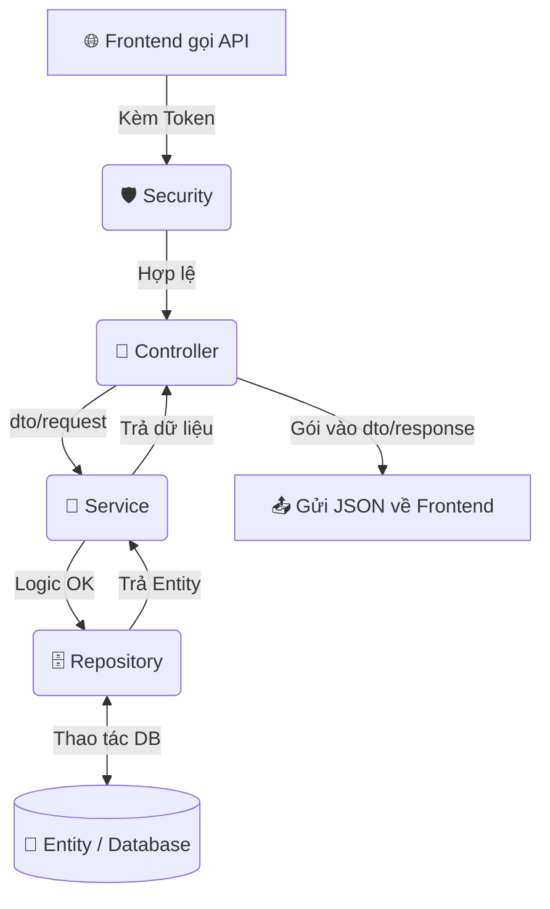

  <h1>🌟 HESTA BACKEND 🌟</h1>
  
<i>Kiến trúc các lớp (Layers) chuẩn trong dự án Spring Boot</i>

  
  
  
  

---

> [!NOTE]  
> Trong Spring Boot (Backend), chúng ta chia code thành các lớp (Layers) rõ ràng để dễ dàng quản lý, bảo trì và mở rộng.

## 📂 Tổng quan cấu trúc thư mục 
Vị trí: `src/main/java/com/hesta/backend/`

### 🚪 1. `controller` (Người Giao Tiếp - "Cửa ngõ" API)
- 🎯 **Nhiệm vụ:** Nhận các Request từ Frontend (gọi API qua Fetch/Axios), phân tích xem Frontend cần gì, gọi lớp `service` để xử lý, và trả về dữ liệu định dạng JSON cho Frontend.
- 💡 **Tương đương ở Frontend:** Giống như các hàm điều hướng (Router/Pages) nhận sự kiện click của người dùng.
- 📌 **Ví dụ:** `UserController` (Quản lý các API `/api/users`), `AuthController`.

### 📦 2. `dto` (Data Transfer Object - Người Vận Chuyển)
- 🎯 **Nhiệm vụ:** Các class đóng gói dữ liệu trao đổi giữa Frontend và Backend, giúp che giấu dữ liệu nhạy cảm của DB.
  - 📥 `dto/request`: Định dạng dữ liệu Frontend gửi lên (body của POST/PUT).
  - 📤 `dto/response`: Định dạng dữ liệu Backend trả về cho Frontend.
- 💡 **Tương đương ở Frontend:** Các Interface/Type (TypeScript) định nghĩa `Payload`.
- 📌 **Ví dụ:** `LoginRequest`, `UserResponse`, `ApiResponse`.

### 🧠 3. `service` (Người Làm Việc - Xử lý Logic)
- 🎯 **Nhiệm vụ:** Chứa "não bộ" của ứng dụng (Business Logic). Kiểm tra điều kiện (Tài khoản tồn tại chưa? Mật khẩu đúng không?) trước khi lưu xuống Database.
- 💡 **Tương đương ở Frontend:** Các file Utils hoặc logic bên trong Thunks/Sagas/Zustand.
- 📌 **Ví dụ:** `UserService`, `AuthService`.

### 🗄️ 4. `repository` (Người Giữ Cửa Database)
- 🎯 **Nhiệm vụ:** Giao tiếp trực tiếp với Database. Dùng Spring Data JPA để gọi hàm thay vì viết SQL dài dòng (VD: `findById`, `save`).
- 💡 **Tương đương ở Frontend:** Các file service dùng Axios/Fetch gọi API lấy data.
- 📌 **Ví dụ:** `UserRepository`.

### 📝 5. `entity` (Bản Vẽ Database)
- 🎯 **Nhiệm vụ:** Mỗi class đại diện cho **1 Bảng (Table)**. Thuộc tính (fields) là cột (columns) trong bảng.
- 💡 **Tương đương ở Frontend:** Các Interface Model cốt lõi.
- 📌 **Ví dụ:** `User` (Bảng users), `Product`.

### 🚨 6. `exception` (Người Bắt Lỗi)
- 🎯 **Nhiệm vụ:** Bắt mọi lỗi xảy ra (lỗi code, không tìm thấy data) và đóng gói thành chuỗi JSON chuẩn thay vì lỗi hệ thống.
- 📌 **Ví dụ:** `GlobalExceptionHandler`, `ErrorCode`, `AppException`.

### ⚙️ 7. `config` (Người Cài Đặt)
- 🎯 **Nhiệm vụ:** Cấu hình toàn hệ thống (CORS, Swagger, v.v).
- 💡 **Tương đương ở Frontend:** `vite.config.ts`, `tailwind.config.js`.
- 📌 **Ví dụ:** `CorsConfig`, `WebMvcConfig`.

### 🛡️ 8. `security` (Người Bảo Vệ)
- 🎯 **Nhiệm vụ:** Phân quyền (Authorization) & Xác thực (Authentication). Kiểm tra JWT Token.
- 💡 **Tương đương ở Frontend:** Middleware Guard (như `AuthGuard`).
- 📌 **Ví dụ:** `JwtTokenFilter`, `SecurityConfig`.

### 🛠️ 9. `util` và `enums` (Hộp Đồ Nghề)
- 🔧 **`util`**: Các hàm tiện ích dùng chung (Format ngày tháng, tạo chuỗi ngẫu nhiên).
- 🏷️ **`enums`**: Chứa các kiểu dữ liệu liệt kê (Trạng thái đơn hàng `PENDING`, `SUCCESS`, phân quyền `ROLE_ADMIN`).

---

## 🔄 Tóm tắt Luồng chạy của API (Data Flow)

> [!TIP]  
> Để dễ hình dung, khi Frontend gọi API, dữ liệu sẽ đi theo thứ tự sau:

1. **Frontend gọi API**
2. ➔ **`Security`** (Kiểm tra Header có Token hợp lệ chưa?)
3. ➔ **`Controller`** (Tiếp nhận Request Body qua `dto/request`)
4. ➔ **`Service`** (Kiểm tra logic nghiệp vụ)
5. ➔ **`Repository`** (Lấy/Lưu dữ liệu qua `Entity`)
6. ➔ Trả `Entity` ngược lại cho **`Service`**
7. ➔ **`Controller`** (Chuyển `Entity` thành `dto/response` để che dữ liệu nhạy cảm)
8. ➔ Gói vào **`ApiResponse`**
9. ➔ **Trả cục JSON về cho Frontend**.

---

## 📚 Tài liệu chức năng

- [Shared Realtime Backend](docs/REALTIME.md)
- [Notification Core Backend](docs/NOTIFICATION_CORE.md)
- [Local Demo Data](docs/LOCAL_DEMO_DATA.md)
