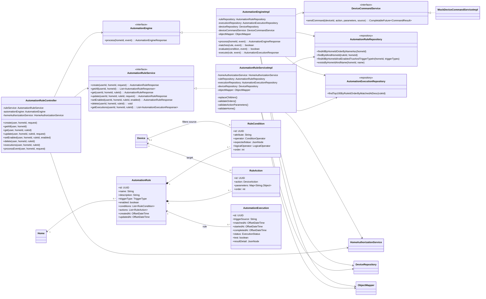
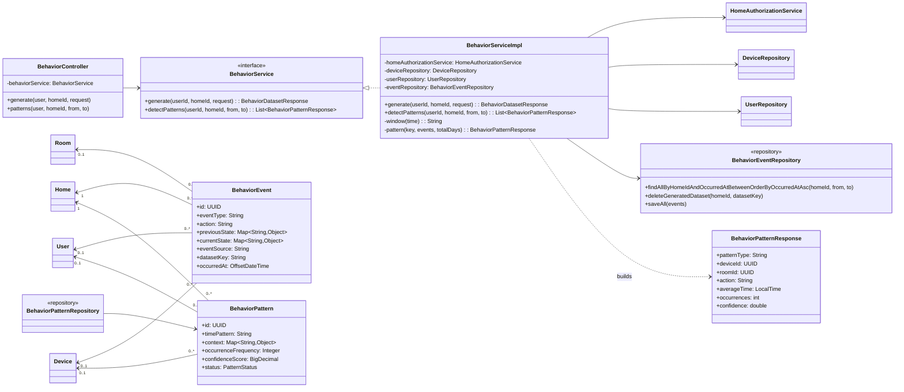
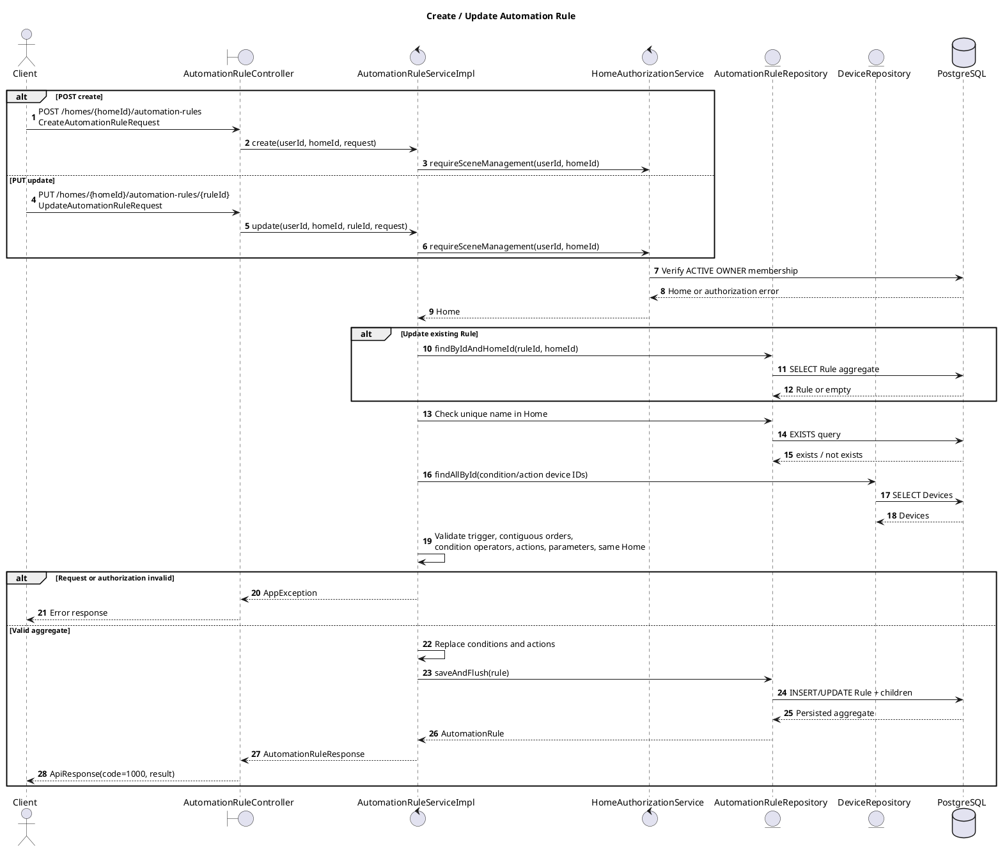
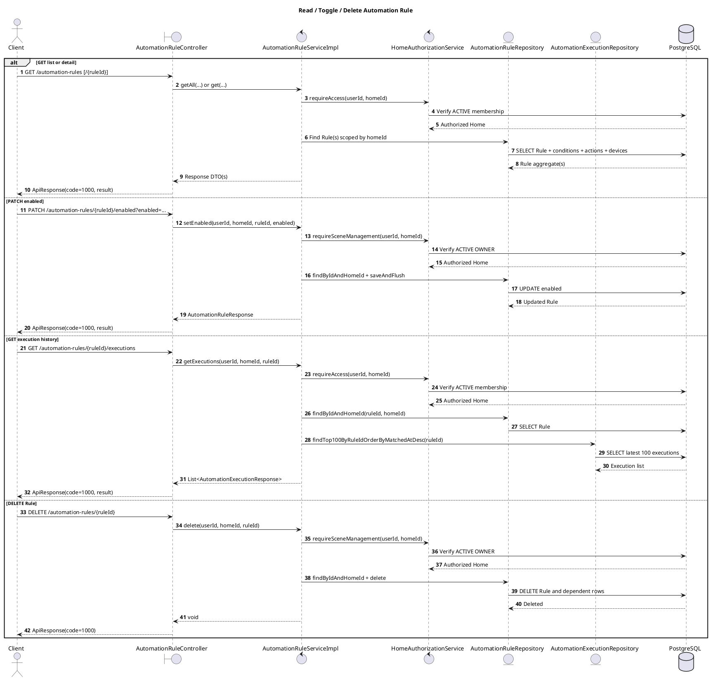
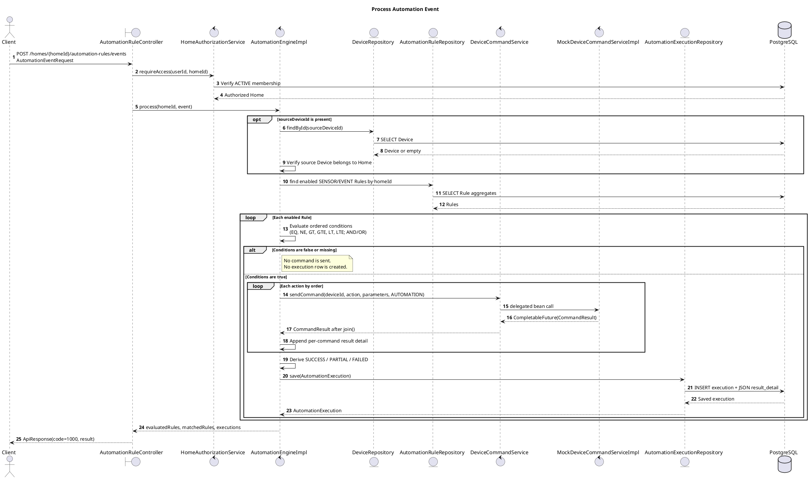
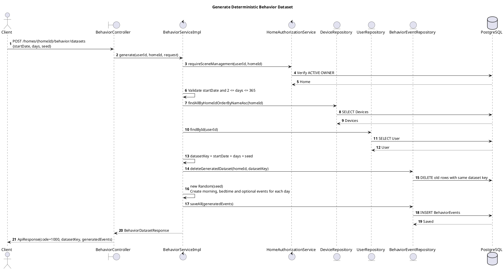
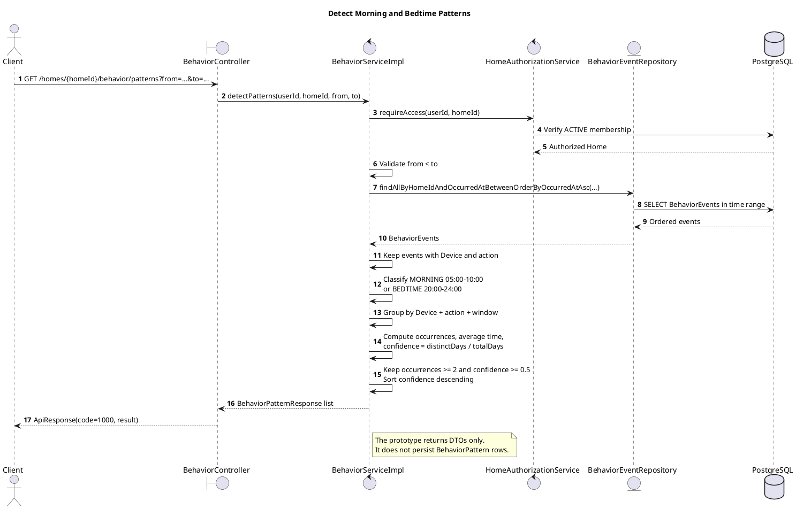

# Ghi chú triển khai Scene, Automation và Behavior prototype

Ngày cập nhật: 2026-09-20

## 1. Phần được tái sử dụng

- Giữ nguyên Scene CRUD hiện có tại `/api/v1/homes/{homeId}/scenes`.
- Giữ nguyên validation SceneAction, thứ tự action và kiểm tra Device cùng Home trong `SceneServiceImpl`.
- Giữ nguyên các migration Scene đã có.
- Automation Engine gọi `DeviceCommandService`; bean hiện tại là `MockDeviceCommandServiceImpl`, không gọi MQTT trực tiếp.
- Giữ nguyên response envelope `ApiResponse<T>` với mã thành công `1000` và lấy user từ JWT.

## 2. Phần được bổ sung

### Scene

- Thêm entity và repository `SceneSchedule`; `Scene` sở hữu danh sách schedule.
- Bảng `scene_schedules` đã có từ migration khởi tạo, nên không tạo lại bảng.
- Scene frontend có danh sách, form tạo, chọn thiết bị, thêm/xóa action và đổi thứ tự action trước khi lưu.

### Automation domain và CRUD

- Entity: `AutomationRule`, `RuleCondition`, `RuleAction`, `AutomationExecution`.
- Trigger: `SENSOR`, `EVENT`, `SCHEDULE`.
- Toán tử so sánh: `EQ`, `NE`, `GT`, `GTE`, `LT`, `LTE`.
- Toán tử nối điều kiện: `AND`, `OR`.
- Trạng thái execution: `PENDING`, `SUCCESS`, `PARTIAL`, `FAILED`, `SKIPPED`.
- Owner của Home có quyền tạo, sửa, xóa, bật/tắt Rule. Active member được xem Rule và lịch sử.
- Device trong condition/action phải tồn tại và thuộc cùng Home.
- Action phải thuộc `DeviceAction`, có parameters đúng dạng và (khi Device khai báo capabilities) phải nằm trong capabilities.
- Thứ tự condition/action phải liên tục từ `0` và không trùng.

### Automation Engine

- Nhận sensor/event qua REST, tìm Rule đang bật, đánh giá condition theo thứ tự và nối bằng `AND`/`OR`.
- Khi Rule khớp, gửi từng action theo thứ tự qua `DeviceCommandService` với source `AUTOMATION`.
- Ghi một `AutomationExecution` cùng kết quả từng command; hỗ trợ kết quả `SUCCESS`, `PARTIAL`, `FAILED`.
- Chưa nhận dữ liệu trực tiếp từ MQTT. REST endpoint là ranh giới đầu vào của prototype.

### Behavior prototype

- Entity: `BehaviorEvent`, `BehaviorPattern`.
- Bộ sinh dữ liệu tạo hành vi sáng, trước khi ngủ và một số sự kiện ngẫu nhiên theo ngày, phòng, thiết bị, action.
- `startDate + days + seed` tạo cùng nội dung thời gian/action. Chạy lại cùng bộ tham số sẽ xóa dataset cùng key rồi tạo lại, tránh nhân đôi dữ liệu.
- Bộ phân tích gom theo thiết bị, action và cửa sổ `MORNING` (05:00-10:00) hoặc `BEDTIME` (20:00-24:00).
- Pattern chỉ được trả về khi có ít nhất 2 lần xuất hiện và confidence tối thiểu `0.5`; confidence là tỷ lệ số ngày có hành vi trên tổng số ngày phân tích.

## 3. API được thêm

Base path Rule: `/api/v1/homes/{homeId}/automation-rules`

| Method | Path | Chức năng | Quyền Home |
| --- | --- | --- | --- |
| `POST` | `/` | Tạo Rule | OWNER |
| `GET` | `/` | Danh sách Rule | ACTIVE member |
| `GET` | `/{ruleId}` | Chi tiết Rule | ACTIVE member |
| `PUT` | `/{ruleId}` | Thay toàn bộ nội dung Rule | OWNER |
| `PATCH` | `/{ruleId}/enabled?enabled=true` | Bật/tắt Rule | OWNER |
| `DELETE` | `/{ruleId}` | Xóa Rule | OWNER |
| `GET` | `/{ruleId}/executions` | Tối đa 100 execution mới nhất | ACTIVE member |
| `POST` | `/events` | Đưa sensor/event vào Engine | ACTIVE member |

Behavior API:

| Method | Path | Chức năng | Quyền Home |
| --- | --- | --- | --- |
| `POST` | `/api/v1/homes/{homeId}/behavior/datasets` | Tạo lại dataset giả lập | OWNER |
| `GET` | `/api/v1/homes/{homeId}/behavior/patterns?from=...&to=...` | Phát hiện pattern | ACTIVE member |

Ví dụ tạo Rule:

```json
{
  "name": "Bật quạt khi nóng",
  "description": "Rule thử nghiệm",
  "triggerType": "SENSOR",
  "enabled": true,
  "conditions": [
    {
      "deviceId": "sensor-uuid",
      "attribute": "temperature",
      "operator": "GT",
      "expectedValue": 30,
      "logicalOperator": "AND",
      "order": 0
    }
  ],
  "actions": [
    {
      "deviceId": "fan-uuid",
      "action": "SET_SPEED",
      "parameters": { "speed": 80 },
      "order": 0
    }
  ]
}
```

Ví dụ event:

```json
{
  "sourceDeviceId": "sensor-uuid",
  "eventType": "SENSOR_READING",
  "data": { "temperature": 31.5 },
  "test": true
}
```

## 4. Migration

Migration mới: `supabase/migrations/20260917120000_automation_behavior_prototypes.sql`.

Migration này:

- thêm description và unique name theo Home cho Rule;
- chuẩn hóa condition sang `attribute`, `expected_value JSONB` và enum operator;
- thêm unique order/check/index cho conditions và actions;
- thêm `room_id`, `dataset_key` cho BehaviorEvent;
- thêm trigger database để ngăn tham chiếu Device/Room khác Home.

Migration chưa được tự động đẩy lên Supabase Cloud. Release owner cần review và áp dụng theo `DATABASE_MIGRATION_GUIDE.md`.

Lưu ý sửa lỗi JSONB (2026-09-20): `RuleCondition.expectedValue` ở entity dùng `JsonNode` thay cho `Object`. Request vẫn nhận giá trị JSON bất kỳ (ví dụ số `30`) và response vẫn trả đúng kiểu JSON đó; service chuyển `Object` từ request thành `JsonNode` trước khi lưu. Điều này tránh lỗi Hibernate PostgreSQL `Integer cannot be cast to String` ở `AbstractJsonFormatMapper.toString` khi `expected_value` là số. Đây là thay đổi ánh xạ Java, không cần migration mới. Test repository kiểm tra lưu/đọc giá trị số; test service kiểm tra chuyển đổi từ request. Cần khởi động lại backend sau khi triển khai.

## 5. Frontend

- Route Scene: `/homes/:homeId/scenes`.
- Route Automation: `/homes/:homeId/automation-rules`.
- Trang chủ có link vào hai trang theo Home đang chọn.
- Scene hỗ trợ danh sách, tạo, xóa và soạn thứ tự action.
- Automation hỗ trợ danh sách, tạo, xóa, bật/tắt, chọn device và nhập condition. Form hành động hiển thị nhãn tiếng Việt, không yêu cầu người dùng nhập mã lệnh kỹ thuật hoặc JSON parameters cho các thao tác thông thường.
- Backend vẫn là nơi quyết định quyền; frontend chỉ hiển thị thao tác và trả lỗi API.

### Cập nhật form hành động Automation (2026-09-20)

- Action trong form thay đổi theo Device đã chọn. Khi Device có `capabilities`, frontend chỉ hiện các mã `DeviceAction` được khai báo và backend vẫn xác thực lại. Nếu `capabilities` rỗng, form dùng nhóm mặc định theo `deviceType`: `LIGHT` → bật/tắt/độ sáng; `FAN` → bật/tắt/tốc độ; `AC` → bật/tắt/nhiệt độ; `SOCKET` → bật/tắt/đảo trạng thái. Loại khác chỉ có action khi Device khai báo capability tương ứng.
- Khi đổi Device hoặc action, giá trị cũ được đặt lại. Không có action phù hợp thì form hiển thị thông báo và không cho gửi rule với action đó.
- `TURN_ON`, `TURN_OFF`, `TOGGLE` không hiện ô giá trị và gửi `parameters: {}`; độ sáng gửi `{ "level": number }`; tốc độ gửi `{ "speed": number }`; nhiệt độ gửi `{ "temperature": number }`. Form kiểm tra số hợp lệ và giới hạn 0–100 cho độ sáng/tốc độ trước khi gọi API.
- `SET_MODE` (ô chế độ) và `SET_STATE` (JSON nâng cao) chỉ xuất hiện khi Device khai báo capability tương ứng; form kiểm tra chuỗi không rỗng hoặc JSON object không rỗng trước khi gửi.
- Các mã API (`TURN_ON`, `SET_BRIGHTNESS`...) và contract `RuleActionRequest` không đổi. Đây là thay đổi UI và validation phía client; kiểm tra Home, capability và parameters của backend vẫn là nguồn quyết định cuối cùng.

## 6. Kiểm thử và cấu hình test

- Thêm test Rule create/read, delete và condition không hợp lệ.
- Thêm test Engine condition đúng, sai, Mock command thành công và thất bại.
- Thêm test phát hiện Behavior Pattern buổi sáng và confidence.
- Tái sử dụng test Scene CRUD và test `MockDeviceCommandServiceImpl` hiện có.
- Test mặc định dùng H2, bỏ qua dòng `.env` sai định dạng, tắt MQTT inbound và không dùng database chung.
- `MqttSmokeTest` chỉ chạy khi đặt `RUN_MQTT_SMOKE_TEST=true`.

Kết quả tại lần cập nhật này:

- Backend targeted tests: 33 passed, 0 failed, 0 errors.
- Backend full suite: 77 tests, 76 passed, 1 MQTT smoke test skipped, 0 failed/errors.
- Frontend: `npm run build`, 13 routing test và ESLint riêng cho các file đã đổi thành công. `npm run lint` toàn dự án vẫn thất bại với 18 lỗi và 1 warning có sẵn trong auth, MemberManagement và ProfileModal (`no-explicit-any`, `set-state-in-effect`, dependency/unused variable).
- Kiểm tra bổ sung ngày 2026-09-20 cho form Automation: `node --experimental-strip-types --test tests/automation-actions.test.mjs` đạt 4/4 test chọn action/đóng gói parameters; `npm run build` và ESLint riêng hai file Automation đạt. `npm run lint` toàn frontend vẫn còn 18 lỗi và 1 warning ở các file không liên quan nêu trên. Backend không đổi nên không chạy lại backend tests trong lần cập nhật UI này.

## 7. Giới hạn prototype

- Chưa có scheduler runtime để tự kích hoạt `SceneSchedule` hoặc Rule `SCHEDULE`.
- Chưa nối Automation Engine trực tiếp với MQTT consumer.
- Behavior Pattern hiện chỉ nhận diện hai cửa sổ thời gian đơn giản; chưa dùng mô hình ML.
- Frontend là bản chức năng cơ bản; chưa có form sửa Scene/Rule chi tiết và chưa có giao diện lịch sử execution.

## 8. Class diagram

### 8.1. Automation Rule và Automation Engine



#### Bảng nối quan hệ Automation ngay cạnh class diagram

Quy ước: `-->` là bên trái **sử dụng/tham chiếu** bên phải; `<|..` là bên phải **implements** interface bên trái; `*--` là sở hữu (composition); `<--` đọc từ **phải sang trái**. Bội số nằm sát lớp nào thì thuộc lớp đó.

| Nối từ | Nối đến | Kiểu/chiều nối | Bội số hoặc ý nghĩa |
| --- | --- | --- | --- |
| `AutomationRuleController` | `AutomationRuleService` | Sử dụng `-->` | Chuyển Rule CRUD và lịch sử execution. |
| `AutomationRuleController` | `AutomationEngine` | Sử dụng `-->` | Chuyển sensor/event đầu vào. |
| `AutomationRuleController` | `HomeAuthorizationService` | Sử dụng `-->` | Kiểm tra quyền trước khi gọi engine. |
| `AutomationRuleServiceImpl` | `AutomationRuleService` | Implements `..|>` (Mermaid: `AutomationRuleService <|.. AutomationRuleServiceImpl`) | Implementation của CRUD. |
| `AutomationEngineImpl` | `AutomationEngine` | Implements `..|>` | Implementation xử lý event. |
| `MockDeviceCommandServiceImpl` | `DeviceCommandService` | Implements `..|>` | Mock là bean thực thi cổng gửi lệnh. |
| `AutomationRuleServiceImpl` | `HomeAuthorizationService` | Sử dụng `-->` | Kiểm tra quyền OWNER/ACTIVE member. |
| `AutomationRuleServiceImpl` | `AutomationRuleRepository` | Sử dụng `-->` | Đọc/ghi Rule. |
| `AutomationRuleServiceImpl` | `AutomationExecutionRepository` | Sử dụng `-->` | Đọc 100 execution gần nhất. |
| `AutomationRuleServiceImpl` | `DeviceRepository` | Sử dụng `-->` | Xác thực Device trong condition/action. |
| `AutomationRuleServiceImpl` | `ObjectMapper` | Sử dụng `-->` | Chuyển `expectedValue` từ request thành `JsonNode` trước khi ghi JSONB. |
| `AutomationEngineImpl` | `AutomationRuleRepository` | Sử dụng `-->` | Tải Rule đang bật. |
| `AutomationEngineImpl` | `AutomationExecutionRepository` | Sử dụng `-->` | Lưu lịch sử khi Rule khớp. |
| `AutomationEngineImpl` | `DeviceRepository` | Sử dụng `-->` | Xác thực source Device của event. |
| `AutomationEngineImpl` | `DeviceCommandService` | Sử dụng `-->` | Gửi action qua interface, không nối trực tiếp MQTT. |
| `AutomationEngineImpl` | `ObjectMapper` | Sử dụng `-->` | Chuyển `JsonNode` đã lưu về giá trị Java để so sánh điều kiện và tạo JSON kết quả. |
| `AutomationRule` | `Home` | Tham chiếu `<--` trên sơ đồ | Mỗi Rule thuộc 1 Home; Home có `0..*` Rule. |
| `AutomationRule` | `RuleCondition` | Composition `*--` | Mỗi Rule có `1..*` condition theo validation API; mỗi condition thuộc 1 Rule. |
| `AutomationRule` | `RuleAction` | Composition `*--` | Mỗi Rule có `1..*` action theo validation API; mỗi action thuộc 1 Rule. |
| `AutomationExecution` | `AutomationRule` | Tham chiếu `<--` trên sơ đồ | Mỗi execution thuộc 1 Rule; Rule có `0..*` execution. |
| `RuleCondition` | `Device` | Tham chiếu `<--` trên sơ đồ | Mỗi condition gắn `0..1` Device; Device có thể được `0..*` condition dùng. |
| `RuleAction` | `Device` | Tham chiếu `<--` trên sơ đồ | Mỗi action nhắm 1 Device; Device có thể được `0..*` action dùng. |

Nối nhánh runtime theo thứ tự: `AutomationRuleController` → `AutomationEngine` → `AutomationEngineImpl` → `DeviceCommandService` → `MockDeviceCommandServiceImpl`. Các mũi tên implements là quan hệ kiểu lớp, không phải một lời gọi runtime bổ sung.

Mô tả:

- `AutomationRuleController` là ranh giới REST. Controller chuyển CRUD và truy vấn lịch sử cho `AutomationRuleService`; riêng event đầu vào được kiểm tra quyền Home rồi chuyển cho `AutomationEngine`.
- `AutomationRuleServiceImpl` quản lý aggregate `AutomationRule`, thay toàn bộ conditions/actions khi cập nhật và kiểm tra tên, trigger, thứ tự, device cùng Home, action cùng parameters.
- `AutomationRule` sở hữu `RuleCondition` và `RuleAction` bằng `cascade = ALL` và `orphanRemoval = true`. Một `RuleCondition` có thể không gắn Device; `RuleAction` luôn phải có target Device.
- `AutomationEngineImpl` chỉ tải Rule đang bật có trigger `SENSOR` hoặc `EVENT`, đánh giá conditions rồi chạy actions đúng thứ tự.
- Engine chỉ phụ thuộc abstraction `DeviceCommandService`. Bean prototype là `MockDeviceCommandServiceImpl`, vì vậy engine không phụ thuộc MQTT hoặc thiết bị thật.
- Mỗi Rule khớp sinh một `AutomationExecution`. `resultDetail` lưu kết quả từng command và status tổng hợp là `SUCCESS`, `PARTIAL` hoặc `FAILED`.

### 8.2. Behavior Event và Pattern prototype



#### Bảng nối quan hệ Behavior ngay cạnh class diagram

| Nối từ | Nối đến | Kiểu/chiều nối | Bội số hoặc ý nghĩa |
| --- | --- | --- | --- |
| `BehaviorController` | `BehaviorService` | Sử dụng `-->` | Gọi tạo dataset và phát hiện pattern. |
| `BehaviorServiceImpl` | `BehaviorService` | Implements `..|>` (Mermaid: `BehaviorService <|.. BehaviorServiceImpl`) | Implementation của service. |
| `BehaviorServiceImpl` | `HomeAuthorizationService` | Sử dụng `-->` | Kiểm tra OWNER khi sinh dataset, ACTIVE member khi đọc pattern. |
| `BehaviorServiceImpl` | `DeviceRepository` | Sử dụng `-->` | Chọn Device trong Home để tạo event. |
| `BehaviorServiceImpl` | `UserRepository` | Sử dụng `-->` | Tải User hiện tại khi tạo event. |
| `BehaviorServiceImpl` | `BehaviorEventRepository` | Sử dụng `-->` | Xóa/tạo dataset và đọc lịch sử. |
| `BehaviorServiceImpl` | `BehaviorPatternResponse` | Phụ thuộc DTO `..>` | Tạo kết quả phân tích trong bộ nhớ. |
| `BehaviorPatternRepository` | `BehaviorPattern` | Repository quản lý entity `-->` | Chưa được service prototype gọi để lưu pattern. |
| `BehaviorEvent` | `Home` | Tham chiếu `<--` trên sơ đồ | Mỗi event thuộc 1 Home; Home có `0..*` event. |
| `BehaviorEvent` | `User` | Tham chiếu `<--` trên sơ đồ | Mỗi event có `0..1` User; User có thể có `0..*` event. |
| `BehaviorEvent` | `Room` | Tham chiếu `<--` trên sơ đồ | Mỗi event có `0..1` Room; Room có thể có `0..*` event. |
| `BehaviorEvent` | `Device` | Tham chiếu `<--` trên sơ đồ | Mỗi event có `0..1` Device; Device có thể có `0..*` event. |
| `BehaviorPattern` | `Home` | Tham chiếu `<--` trên sơ đồ | Mỗi pattern thuộc 1 Home; Home có `0..*` pattern. |
| `BehaviorPattern` | `User` | Tham chiếu `<--` trên sơ đồ | Mỗi pattern có `0..1` User; User có thể có `0..*` pattern. |
| `BehaviorPattern` | `Device` | Tham chiếu `<--` trên sơ đồ | Mỗi pattern có `0..1` Device; Device có thể có `0..*` pattern. |

`BehaviorEvent` và `BehaviorPattern` là hai entity độc lập; hiện **không có khóa ngoại hoặc composition nối trực tiếp giữa chúng**. Việc phát hiện pattern chỉ đọc event và trả `BehaviorPatternResponse`, chưa lưu `BehaviorPattern`.

Mô tả:

- `BehaviorServiceImpl.generate` tạo `BehaviorEvent` lặp lại được từ `startDate`, `days` và `seed`; `datasetKey` giúp xóa đúng bộ dữ liệu cũ trước khi tạo lại.
- Event mô phỏng giữ liên kết Home, User, Room và Device, đồng thời lưu action, state trước/sau, nguồn `SIMULATED` và thời điểm UTC+07:00.
- `detectPatterns` chỉ đọc lịch sử trong khoảng thời gian, gom theo Device + action + cửa sổ `MORNING`/`BEDTIME`, rồi trả `BehaviorPatternResponse` nếu có ít nhất 2 lần và confidence từ `0.5`.
- Entity/repository `BehaviorPattern` đã có cho bước lưu pattern về sau. Prototype hiện tại chưa ghi kết quả phát hiện vào bảng `behavior_patterns`.

## 9. Sequence diagrams (PlantUML)

The diagrams below begin after Spring Security has authenticated the JWT. `userId` always comes from `CustomUserDetails`, not from the request body.

### 9.1. Create or update an Automation Rule



On update, the conditions and actions lists replace the Rule's existing children. Items omitted from the request are removed through `orphanRemoval` within the same transaction.

### 9.2. Read, enable/disable, delete, and inspect Rule history



Every Rule lookup is scoped by both `ruleId` and `homeId`, so a member cannot read or modify a Rule in another Home by guessing its UUID.

### 9.3. Process a sensor/event and call the Mock Device Service



If the Mock returns a failure or throws an exception, the engine continues with the remaining actions, records safe error details, and calculates the overall execution status. This prototype does not publish to MQTT.

### 9.4. Regenerate the BehaviorEvent dataset



The same `homeId`, `startDate`, `days`, and `seed` produce the same dataset key and behavior sequence; existing rows for that key are replaced rather than duplicated.

### 9.5. Detect Behavior Patterns


