# Ghi chú triển khai Scene, Automation và Behavior prototype

> Bộ diagram đầy đủ cho Scene & Automation (inventory, UML và các nhánh lỗi): [SCENE_AUTOMATION_DIAGRAMS.md](SCENE_AUTOMATION_DIAGRAMS.md).

Ngày đồng bộ nội dung và sơ đồ với source code: **2026-10-04**.

## 1. Phần được tái sử dụng

- Giữ nguyên Scene CRUD hiện có tại `/api/v1/homes/{homeId}/scenes`.
- Giữ nguyên validation SceneAction, thứ tự action và kiểm tra Device cùng Home trong `SceneServiceImpl`.
- Giữ nguyên các migration Scene đã có.
- Automation Engine gọi `DeviceCommandService`; bean `@Primary` hiện tại là `MqttDeviceCommandServiceImpl`. `MockDeviceCommandServiceImpl` vẫn có cho kiểm thử/phát triển. Engine không gọi MQTT transport trực tiếp.
- Giữ nguyên response envelope `ApiResponse<T>` với mã thành công `1000` và lấy user từ JWT.

## 2. Phần được bổ sung

### Scene

- Scene có CRUD, `icon`, action types, thực thi qua `/execute`, lịch sử `/executions` và CRUD `/schedules`. `Scene` sở hữu actions/schedules; lịch sử dùng `SceneExecution` và repository riêng.
- Bảng `scene_schedules` đã có từ migration khởi tạo, nên không tạo lại bảng.
- Scene frontend có danh sách, form tạo/sửa, chọn thiết bị, thứ tự action, bật/tắt, thực thi, lịch sử và quản lý lịch.

### Automation domain và CRUD

- Entity: `AutomationRule`, `RuleCondition`, `RuleAction`, `AutomationExecution`, `AutomationSchedule`.
- Trigger: `SENSOR`, `EVENT`, `SCHEDULE`.
- Toán tử so sánh: `EQ`, `NE`, `GT`, `GTE`, `LT`, `LTE`.
- Toán tử nối điều kiện: `AND`, `OR`.
- Trạng thái execution: `PENDING`, `SUCCESS`, `PARTIAL`, `FAILED`, `SKIPPED`.
- Owner của Home có quyền tạo, sửa, xóa, bật/tắt Rule. Active member được xem Rule và lịch sử.
- Device trong condition/action phải tồn tại và thuộc cùng Home.
- Device command được kiểm tra action/parameters và `Device.supportsAction` theo capabilities. `EXECUTE_SCENE` dùng `sceneId`, không có `deviceId`, parameters rỗng; Scene phải cùng Home, enabled và có actions.
- Thứ tự condition/action phải liên tục từ `0` và không trùng. SENSOR/EVENT cần conditions không rỗng; SCHEDULE cần conditions rỗng; mọi Rule cần ít nhất một action.

### Automation Engine

- Nhận sensor/event qua REST và MQTT sensor telemetry, tìm Rule SENSOR/EVENT đang bật, xử lý theo Rule ID, đánh giá condition theo thứ tự và nối bằng `AND`/`OR`.
- Khi Rule khớp, gửi từng device action theo thứ tự qua `DeviceCommandService` với source `AUTOMATION`, hoặc gọi `SceneExecutionService.executeFromAutomation` cho `EXECUTE_SCENE`.
- Ghi `AutomationExecution` cùng kết quả từng command/Scene; hỗ trợ `SUCCESS`, `PARTIAL`, `FAILED`, `SKIPPED`. Conflict ghi `SKIPPED_CONFLICT`; override 30 phút ghi `SKIPPED_OVERRIDE`. Rule có outcome khác SKIPPED reserve target actions cho các Rule sau trong cùng event.
- `MqttMessageReceiver.processSensorAutomation` nhận topic sensor hợp lệ, tra Device bằng UUID hoặc nodeCode/localId, rồi gọi engine với `eventType=SENSOR`. Scheduler dùng `executeScheduled` cho Rule SCHEDULE.
- `/test` chỉ trả proposedActions, không gửi lệnh/ghi execution; `/events` với `test=true` vẫn ghi execution preview SKIPPED cho Rule khớp.
- Runtime ghi BehaviorEvent và DeviceStateHistory qua BehaviorEventRecorder; override và conflict được kiểm tra trước command. Chi tiết trigger/source được phân biệt trong các sequence bên dưới.

### Behavior prototype

- Entity: `BehaviorEvent`, `BehaviorPattern`.
- Bộ sinh dữ liệu tạo hành vi sáng, trước khi ngủ và một số sự kiện ngẫu nhiên theo ngày, phòng, thiết bị, action.
- `startDate + days + seed` tạo cùng nội dung thời gian/action. Chạy lại cùng bộ tham số sẽ xóa dataset cùng key rồi tạo lại, tránh nhân đôi dữ liệu.
- Bộ phân tích gom theo thiết bị, action và cửa sổ `MORNING` (05:00-10:00) hoặc `BEDTIME` (20:00-24:00).
- Pattern chỉ được trả về khi có ít nhất 2 lần xuất hiện và confidence tối thiểu `0.5`; confidence là tỷ lệ số ngày có hành vi trên tổng số ngày phân tích.

## 3. API được thêm

Base path Rule: `/api/v1/homes/{homeId}/automation-rules`

| Method | Path | Chức năng | Quyền Home |
| --- | --- | --- | --- |
| `POST` | `/` | Tạo Rule | OWNER |
| `GET` | `/` | Danh sách Rule | ACTIVE member |
| `GET` | `/{ruleId}` | Chi tiết Rule | ACTIVE member |
| `PUT` | `/{ruleId}` | Thay toàn bộ nội dung Rule | OWNER |
| `PATCH` | `/{ruleId}/enabled?enabled=true` | Bật/tắt Rule | OWNER |
| `DELETE` | `/{ruleId}` | Xóa Rule | OWNER |
| `GET` | `/{ruleId}/executions` | Tối đa 100 execution mới nhất | ACTIVE member |
| `POST` | `/events` | Đưa sensor/event vào Engine | ACTIVE member |
| `POST` | `/{ruleId}/test` | Dry run, không gửi lệnh/ghi execution | ACTIVE OWNER |
| `GET` | `/{ruleId}/schedules` | Danh sách lịch | ACTIVE member |
| `POST` | `/{ruleId}/schedules` | Tạo lịch cho Rule SCHEDULE | ACTIVE OWNER |
| `PUT` | `/{ruleId}/schedules/{scheduleId}` | Sửa lịch | ACTIVE OWNER |
| `DELETE` | `/{ruleId}/schedules/{scheduleId}` | Xóa lịch | ACTIVE OWNER |

Mọi quyền OWNER trong bảng đều yêu cầu membership ACTIVE. API Scene được liệt kê đầy đủ tại [SCENE_CRUD_DIAGRAMS.md](SCENE_CRUD_DIAGRAMS.md).

Behavior API:

| Method | Path | Chức năng | Quyền Home |
| --- | --- | --- | --- |
| `POST` | `/api/v1/homes/{homeId}/behavior/datasets` | Tạo lại dataset giả lập | OWNER |
| `GET` | `/api/v1/homes/{homeId}/behavior/patterns?from=...&to=...` | Phát hiện pattern | ACTIVE member |
| `GET` | `/api/v1/homes/{homeId}/behavior/predictions?from=...&to=...&at=...` | Dự đoán action gần thời điểm at | ACTIVE member |

Ví dụ tạo Rule:

```json
{
  "name": "Bật quạt khi nóng",
  "description": "Rule thử nghiệm",
  "triggerType": "SENSOR",
  "enabled": true,
  "conditions": [
    {
      "deviceId": "sensor-uuid",
      "attribute": "temperature",
      "operator": "GT",
      "expectedValue": 30,
      "logicalOperator": "AND",
      "order": 0
    }
  ],
  "actions": [
    {
      "deviceId": "fan-uuid",
      "action": "SET_SPEED",
      "parameters": { "speed": 80 },
      "order": 0
    }
  ]
}
```

Ví dụ event:

```json
{
  "sourceDeviceId": "sensor-uuid",
  "eventType": "SENSOR_READING",
  "data": { "temperature": 31.5 },
  "test": true
}
```

## 4. Migration

Migration nền tảng: `supabase/migrations/20260917120000_automation_behavior_prototypes.sql`. Các migration bổ sung execution history và chống chạy lịch trùng: `20260922160000_scene_execution_history.sql`, `20260922161000_scheduled_run_claims.sql`. Capabilities dạng JSON object được cập nhật trong `20261001235800_migrate_device_capabilities_to_json_object.sql`.

Migration này:

- thêm description và unique name theo Home cho Rule;
- chuẩn hóa condition sang `attribute`, `expected_value JSONB` và enum operator;
- thêm unique order/check/index cho conditions và actions;
- thêm `room_id`, `dataset_key` cho BehaviorEvent;
- thêm trigger database để ngăn tham chiếu Device/Room khác Home.

Tài liệu mô tả migration trong source; trạng thái áp dụng trên database đích cần kiểm tra theo `DATABASE_MIGRATION_GUIDE.md`. Lần cập nhật docs này không thực hiện migration.

Lưu ý sửa lỗi JSONB (2026-09-20): `RuleCondition.expectedValue` ở entity dùng `JsonNode` thay cho `Object`. Request vẫn nhận giá trị JSON bất kỳ (ví dụ số `30`) và response vẫn trả đúng kiểu JSON đó; service chuyển `Object` từ request thành `JsonNode` trước khi lưu. Điều này tránh lỗi Hibernate PostgreSQL `Integer cannot be cast to String` ở `AbstractJsonFormatMapper.toString` khi `expected_value` là số. Đây là thay đổi ánh xạ Java, không cần migration mới. Test repository kiểm tra lưu/đọc giá trị số; test service kiểm tra chuyển đổi từ request. Cần khởi động lại backend sau khi triển khai.

## 5. Frontend

- Route Scene: `/homes/:homeId/scenes`.
- Route Automation: `/homes/:homeId/automation-rules`.
- Trang chủ có link vào hai trang theo Home đang chọn.
- Scene hỗ trợ danh sách, tạo/sửa/xóa/bật tắt, icon, soạn thứ tự action, chạy Scene, xem lịch sử và quản lý lịch.
- Automation hỗ trợ danh sách, tạo/sửa/xóa/bật tắt, chạy thử, lịch sử, lịch chạy cho Rule SCHEDULE, chọn Device hoặc Scene và nhập condition. Form hành động hiển thị nhãn tiếng Việt, không yêu cầu người dùng nhập mã lệnh kỹ thuật hoặc JSON parameters cho các thao tác thông thường.
- Backend vẫn là nơi quyết định quyền; frontend chỉ hiển thị thao tác và trả lỗi API.

### Cập nhật form hành động Automation (2026-09-20)

- Action trong form thay đổi theo Device đã chọn. Khi Device có `capabilities`, frontend chỉ hiện các mã `DeviceAction` được khai báo và backend vẫn xác thực lại. Nếu `capabilities` rỗng, form dùng nhóm mặc định theo `deviceType`: `LIGHT` → bật/tắt/độ sáng; `FAN` → bật/tắt/tốc độ; `AC` → bật/tắt/nhiệt độ; `SOCKET` → bật/tắt/đảo trạng thái. Loại khác chỉ có action khi Device khai báo capability tương ứng.
- Khi đổi Device hoặc action, giá trị cũ được đặt lại. Không có action phù hợp thì form hiển thị thông báo và không cho gửi rule với action đó.
- `TURN_ON`, `TURN_OFF`, `TOGGLE` không hiện ô giá trị và gửi `parameters: {}`; độ sáng gửi `{ "level": number }`; tốc độ gửi `{ "speed": number }`; nhiệt độ gửi `{ "temperature": number }`. Form kiểm tra số hợp lệ và giới hạn 0–100 cho độ sáng/tốc độ trước khi gọi API.
- `SET_MODE` (ô chế độ) và `SET_STATE` (JSON nâng cao) chỉ xuất hiện khi Device khai báo capability tương ứng; form kiểm tra chuỗi không rỗng hoặc JSON object không rỗng trước khi gửi.
- Các mã device command (`TURN_ON`, `SET_BRIGHTNESS`...) được giữ; `RuleActionRequest` hiện còn có `sceneId` cho `EXECUTE_SCENE`. Đây là thay đổi UI và validation phía client; kiểm tra Home, capability và parameters của backend vẫn là nguồn quyết định cuối cùng.

## 6. Kiểm thử và cấu hình test

- Thêm test Rule create/read, delete và condition không hợp lệ.
- Thêm test Engine condition đúng, sai, Mock command thành công và thất bại.
- Thêm test phát hiện Behavior Pattern buổi sáng và confidence.
- Tái sử dụng test Scene CRUD và test `MockDeviceCommandServiceImpl` hiện có.
- Test mặc định dùng H2, bỏ qua dòng `.env` sai định dạng, tắt MQTT inbound và không dùng database chung.
- `MqttSmokeTest` chỉ chạy khi đặt `RUN_MQTT_SMOKE_TEST=true`.

Kết quả lịch sử ở lần cập nhật 2026-09-20 (không phải kết quả chạy lại ngày 2026-10-04):

- Backend targeted tests: 33 passed, 0 failed, 0 errors.
- Backend full suite: 77 tests, 76 passed, 1 MQTT smoke test skipped, 0 failed/errors.
- Frontend: `npm run build`, 13 routing test và ESLint riêng cho các file đã đổi thành công. `npm run lint` toàn dự án vẫn thất bại với 18 lỗi và 1 warning có sẵn trong auth, MemberManagement và ProfileModal (`no-explicit-any`, `set-state-in-effect`, dependency/unused variable).
- Kiểm tra bổ sung ngày 2026-09-20 cho form Automation: `node --experimental-strip-types --test tests/automation-actions.test.mjs` đạt 4/4 test chọn action/đóng gói parameters; `npm run build` và ESLint riêng hai file Automation đạt. `npm run lint` toàn frontend vẫn còn 18 lỗi và 1 warning ở các file không liên quan nêu trên. Backend không đổi nên không chạy lại backend tests trong lần cập nhật UI này.

## 7. Phạm vi và giới hạn hiện tại

- Scheduler và MQTT sensor input đã có trong source. Scheduler quét mỗi phút, dùng `scheduled_run_claims` để chống chạy trùng theo loại lịch/ID/ngày; lỗi sau claim không tự retry cùng ngày.
- Rule SCHEDULE chạy qua `executeScheduled`, không đi qua vòng conflict giữa nhiều Rule của `process`. Command vẫn có source AUTOMATION; Scene được Rule gọi dùng trigger/source AUTOMATION.
- Scene lịch trực tiếp dùng trigger/source SCHEDULE; Scene thủ công dùng MANUAL/SCENE và bỏ qua override.
- Behavior Pattern vẫn dùng hai cửa sổ MORNING/BEDTIME, chưa dùng ML và chưa lưu BehaviorPattern. Prediction cần confidence >= 0.6, TURN_ON/TURN_OFF, trong 45 phút quanh averageTime và trạng thái power chưa đúng mục tiêu.
- Thay đổi tài liệu được đối chiếu source; không xác nhận deployment/MQTT thiết bị thật hoặc chạy lại các test ứng dụng trong lần này.

## 8. Class diagrams

Các sơ đồ dùng **PlantUML** và cùng một quy ước:

- Class diagram dùng ký hiệu UML cho class/interface, thuộc tính, phương thức và bội số. Class diagram không có nút database.
- Sequence truy xuất dữ liệu dùng lifeline **Database** với ký hiệu database thông thường; controller, service và repository đều là participant hình chữ nhật. PostgreSQL là công nghệ thực tế của backend.
- Sequence có `autonumber`, mũi tên gọi/trả về và **thanh kích hoạt (activation bar)** đầy đủ cho controller, service, repository, Database và lời gọi lồng nhau. Thanh này biểu diễn thời gian xử lý trên lifeline.
- **Composition**: `*--`, hình thoi đặc tại bên sở hữu; Scene sở hữu SceneAction/SceneSchedule, AutomationRule sở hữu RuleCondition/RuleAction với cascade/orphan removal.
- **Aggregation**: `o--`, hình thoi rỗng tại bên chứa; request/response DTO gom danh sách DTO phần tử. Quan hệ này mô tả cấu trúc dữ liệu trong bộ nhớ, không đặt thêm quy tắc cascade hoặc vòng đời cho entity.
- **Dependency**: `..>`, nét đứt hướng về lớp/interface được sử dụng; áp dụng cho các collaborator được inject và DTO mà service tạo/nhận.
- **Inheritance / generalization**: `--|>`, nét liền với tam giác rỗng hướng về kiểu cha; chỉ dùng khi có quan hệ kế thừa giữa các lớp/interface được đưa vào sơ đồ.
- **Realization / implementation**: `..|>`, nét đứt với tam giác rỗng hướng về interface; các service implementation triển khai service interface.
- **Association**: `--` hoặc `-->` kèm bội số/role cho tham chiếu giữa entity. Các quan hệ UML thể hiện cấu trúc lớp, không phải các bước gọi runtime.
- Mỗi đường nối trong class diagram có nhãn ghi rõ loại quan hệ ngay trên đường nối; role như `actions`, `conditions`, `targetDevice` được ghi kèm trong ngoặc khi có.
- Các class diagram chọn lọc trường và phương thức liên quan đến từng luồng; không liệt kê mọi tiện ích nội bộ. Sequence biểu diễn luồng hợp lệ; lỗi validation/quyền được ném bằng `AppException`, trả qua `GlobalExceptionHandler` và dừng luồng. Lỗi từng command được ghi nhận để tiếp tục action còn lại.
- User được lấy từ JWT (`CustomUserDetails`); mọi API trả `ApiResponse<T>` với mã thành công `1000`.

### 8.1. Automation CRUD

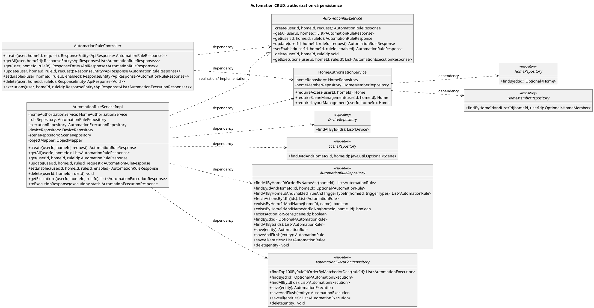
```plantuml
@startuml Automation_CRUD_Classes
title Automation CRUD, authorization và persistence
!pragma layout smetana
skinparam backgroundColor white
skinparam shadowing false
skinparam roundcorner 0
skinparam defaultFontName Arial

left to right direction
hide circle
skinparam classAttributeIconSize 0
class AutomationRuleController {
    +create(user, homeId, request): ResponseEntity<ApiResponse<AutomationRuleResponse>>
    +getAll(user, homeId): ResponseEntity<ApiResponse<List<AutomationRuleResponse>>>
    +get(user, homeId, ruleId): ResponseEntity<ApiResponse<AutomationRuleResponse>>
    +update(user, homeId, ruleId, request): ResponseEntity<ApiResponse<AutomationRuleResponse>>
    +setEnabled(user, homeId, ruleId, enabled): ResponseEntity<ApiResponse<AutomationRuleResponse>>
    +delete(user, homeId, ruleId): ResponseEntity<ApiResponse<Void>>
    +executions(user, homeId, ruleId): ResponseEntity<ApiResponse<List<AutomationExecutionResponse>>>
}
interface AutomationRuleService {
    +create(userId, homeId, request): AutomationRuleResponse
    +getAll(userId, homeId): List<AutomationRuleResponse>
    +get(userId, homeId, ruleId): AutomationRuleResponse
    +update(userId, homeId, ruleId, request): AutomationRuleResponse
    +setEnabled(userId, homeId, ruleId, enabled): AutomationRuleResponse
    +delete(userId, homeId, ruleId): void
    +getExecutions(userId, homeId, ruleId): List<AutomationExecutionResponse>
}
class AutomationRuleServiceImpl {
    -homeAuthorizationService: HomeAuthorizationService
    -ruleRepository: AutomationRuleRepository
    -executionRepository: AutomationExecutionRepository
    -deviceRepository: DeviceRepository
    -sceneRepository: SceneRepository
    -objectMapper: ObjectMapper
    +create(userId, homeId, request): AutomationRuleResponse
    +getAll(userId, homeId): List<AutomationRuleResponse>
    +get(userId, homeId, ruleId): AutomationRuleResponse
    +update(userId, homeId, ruleId, request): AutomationRuleResponse
    +setEnabled(userId, homeId, ruleId, enabled): AutomationRuleResponse
    +delete(userId, homeId, ruleId): void
    +getExecutions(userId, homeId, ruleId): List<AutomationExecutionResponse>
    +toExecutionResponse(execution): static AutomationExecutionResponse
}
class HomeAuthorizationService {
    -homeRepository: HomeRepository
    -homeMemberRepository: HomeMemberRepository
    +requireAccess(userId, homeId): Home
    +requireSceneManagement(userId, homeId): Home
    +requireLayoutManagement(userId, homeId): Home
}
interface AutomationRuleRepository <<repository>> {
    +findAllByHomeIdOrderByNameAsc(homeId): List<AutomationRule>
    +findByIdAndHomeId(id, homeId): Optional<AutomationRule>
    +findAllByHomeIdAndEnabledTrueAndTriggerTypeIn(homeId, triggerTypes): List<AutomationRule>
    +fetchActionsByIdIn(ids): List<AutomationRule>
    +existsByHomeIdAndName(homeId, name): boolean
    +existsByHomeIdAndNameAndIdNot(homeId, name, id): boolean
    +existsActionForScene(sceneId): boolean
    +findById(id): Optional<AutomationRule>
    +findAllById(ids): List<AutomationRule>
    +save(entity): AutomationRule
    +saveAndFlush(entity): AutomationRule
    +saveAll(entities): List<AutomationRule>
    +delete(entity): void
}
interface AutomationExecutionRepository <<repository>> {
    +findTop100ByRuleIdOrderByMatchedAtDesc(ruleId): List<AutomationExecution>
    +findById(id): Optional<AutomationExecution>
    +findAllById(ids): List<AutomationExecution>
    +save(entity): AutomationExecution
    +saveAndFlush(entity): AutomationExecution
    +saveAll(entities): List<AutomationExecution>
    +delete(entity): void
}
interface DeviceRepository <<repository>> {
    +findAllById(ids): List<Device>
}
interface SceneRepository <<repository>> {
    +findByIdAndHomeId(id, homeId): java.util.Optional<Scene>
}
interface HomeRepository <<repository>> {
    +findById(id): Optional<Home>
}
interface HomeMemberRepository <<repository>> {
    +findByHomeIdAndUserId(homeId, userId): Optional<HomeMember>
}
AutomationRuleController ..> AutomationRuleService : dependency
AutomationRuleController ..> HomeAuthorizationService : dependency
AutomationRuleServiceImpl ..> HomeAuthorizationService : dependency
AutomationRuleServiceImpl ..> AutomationRuleRepository : dependency
AutomationRuleServiceImpl ..> AutomationExecutionRepository : dependency
AutomationRuleServiceImpl ..> DeviceRepository : dependency
AutomationRuleServiceImpl ..> SceneRepository : dependency
AutomationRuleServiceImpl ..|> AutomationRuleService : realization / implementation
HomeAuthorizationService ..> HomeRepository : dependency
HomeAuthorizationService ..> HomeMemberRepository : dependency
@enduml
```

Khi sửa Rule, service xác thực children mới, xóa/flush children cũ rồi thêm children mới để tránh xung đột unique order. `EXECUTE_SCENE` được tải qua `SceneRepository`, yêu cầu Scene cùng Home, enabled và có actions.

### 8.2. Automation entities và DTO

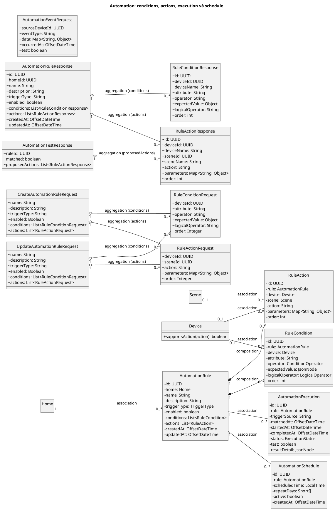
```plantuml
@startuml Automation_Domain_Classes
title Automation: conditions, actions, execution và schedule
!pragma layout smetana
skinparam backgroundColor white
skinparam shadowing false
skinparam roundcorner 0
skinparam defaultFontName Arial

left to right direction
hide circle
skinparam classAttributeIconSize 0
class Home {

}
class Device {
    +supportsAction(action): boolean
}
class Scene {

}
class AutomationRule {
    -id: UUID
    -home: Home
    -name: String
    -description: String
    -triggerType: TriggerType
    -enabled: boolean
    -conditions: List<RuleCondition>
    -actions: List<RuleAction>
    -createdAt: OffsetDateTime
    -updatedAt: OffsetDateTime
}
class RuleCondition {
    -id: UUID
    -rule: AutomationRule
    -device: Device
    -attribute: String
    -operator: ConditionOperator
    -expectedValue: JsonNode
    -logicalOperator: LogicalOperator
    -order: int
}
class RuleAction {
    -id: UUID
    -rule: AutomationRule
    -device: Device
    -scene: Scene
    -action: String
    -parameters: Map<String, Object>
    -order: int
}
class AutomationExecution {
    -id: UUID
    -rule: AutomationRule
    -triggerSource: String
    -matchedAt: OffsetDateTime
    -startedAt: OffsetDateTime
    -completedAt: OffsetDateTime
    -status: ExecutionStatus
    -test: boolean
    -resultDetail: JsonNode
}
class AutomationSchedule {
    -id: UUID
    -rule: AutomationRule
    -scheduledTime: LocalTime
    -repeatDays: Short[]
    -active: boolean
    -createdAt: OffsetDateTime
}
class CreateAutomationRuleRequest {
    ~name: String
    ~description: String
    ~triggerType: String
    ~enabled: Boolean
    ~conditions: List<RuleConditionRequest>
    ~actions: List<RuleActionRequest>
}
class UpdateAutomationRuleRequest {
    ~name: String
    ~description: String
    ~triggerType: String
    ~enabled: Boolean
    ~conditions: List<RuleConditionRequest>
    ~actions: List<RuleActionRequest>
}
class RuleConditionRequest {
    ~deviceId: UUID
    ~attribute: String
    ~operator: String
    ~expectedValue: Object
    ~logicalOperator: String
    ~order: Integer
}
class RuleActionRequest {
    ~deviceId: UUID
    ~sceneId: UUID
    ~action: String
    ~parameters: Map<String, Object>
    ~order: Integer
}
class AutomationRuleResponse {
    ~id: UUID
    ~homeId: UUID
    ~name: String
    ~description: String
    ~triggerType: String
    ~enabled: boolean
    ~conditions: List<RuleConditionResponse>
    ~actions: List<RuleActionResponse>
    ~createdAt: OffsetDateTime
    ~updatedAt: OffsetDateTime
}
class RuleActionResponse {
    ~id: UUID
    ~deviceId: UUID
    ~deviceName: String
    ~sceneId: UUID
    ~sceneName: String
    ~action: String
    ~parameters: Map<String, Object>
    ~order: int
}
class AutomationEventRequest {
    ~sourceDeviceId: UUID
    ~eventType: String
    ~data: Map<String, Object>
    ~occurredAt: OffsetDateTime
    ~test: boolean
}
class AutomationTestResponse {
    ~ruleId: UUID
    ~matched: boolean
    ~proposedActions: List<RuleActionResponse>
}
class RuleConditionResponse {
    ~id: UUID
    ~deviceId: UUID
    ~deviceName: String
    ~attribute: String
    ~operator: String
    ~expectedValue: Object
    ~logicalOperator: String
    ~order: int
}
Home "1" -- "0..*" AutomationRule : association
AutomationRule "1" *-- "0..*" RuleCondition : composition
AutomationRule "1" *-- "0..*" RuleAction : composition
AutomationRule "1" -- "0..*" AutomationExecution : association
AutomationRule "1" -- "0..*" AutomationSchedule : association
Device "0..1" -- "0..*" RuleCondition : association
Device "0..1" -- "0..*" RuleAction : association
Scene "0..1" -- "0..*" RuleAction : association
CreateAutomationRuleRequest "1" o-- "0..*" RuleConditionRequest : aggregation (conditions)
CreateAutomationRuleRequest "1" o-- "0..*" RuleActionRequest : aggregation (actions)
UpdateAutomationRuleRequest "1" o-- "0..*" RuleConditionRequest : aggregation (conditions)
UpdateAutomationRuleRequest "1" o-- "0..*" RuleActionRequest : aggregation (actions)
AutomationRuleResponse "1" o-- "0..*" RuleActionResponse : aggregation (actions)
AutomationTestResponse "1" o-- "0..*" RuleActionResponse : aggregation (proposedActions)
AutomationRuleResponse "1" o-- "0..*" RuleConditionResponse : aggregation (conditions)
@enduml
```

Bội số trên sơ đồ phản ánh mapping entity. Validation API yêu cầu ít nhất một action; SENSOR/EVENT cần ít nhất một condition, SCHEDULE cần conditions rỗng. RuleAction chọn đúng một target: Device cho command hoặc Scene cho `EXECUTE_SCENE`. AutomationRule không có collection schedules/executions; các entity này tham chiếu Rule bằng khóa ngoại.

### 8.3. Automation Engine và đầu vào MQTT

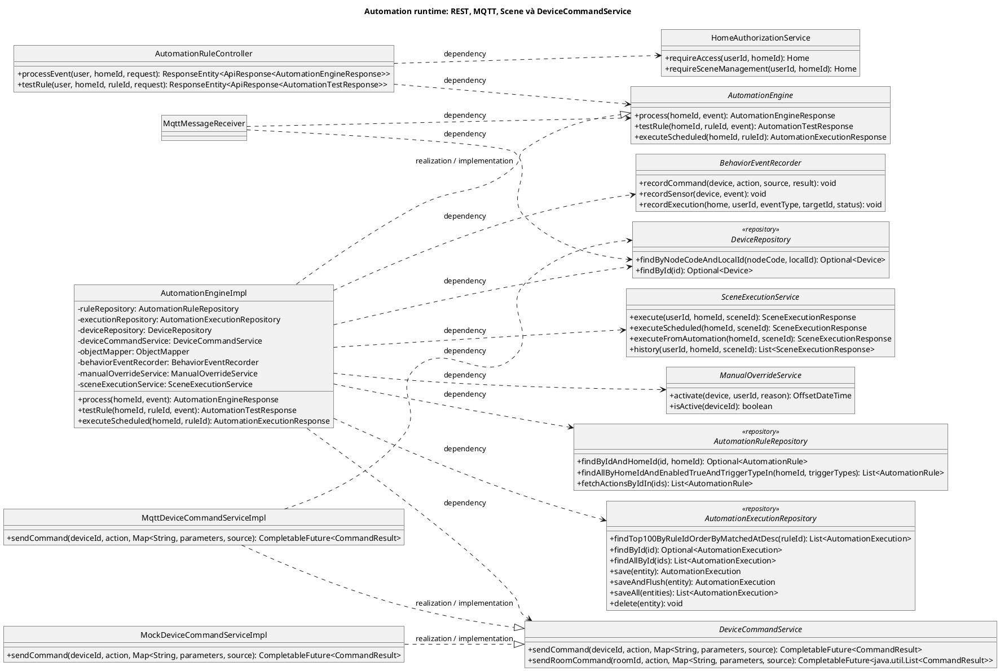
```plantuml
@startuml Automation_Engine_Classes
title Automation runtime: REST, MQTT, Scene và DeviceCommandService
!pragma layout smetana
skinparam backgroundColor white
skinparam shadowing false
skinparam roundcorner 0
skinparam defaultFontName Arial

left to right direction
hide circle
skinparam classAttributeIconSize 0
class AutomationRuleController {
    +processEvent(user, homeId, request): ResponseEntity<ApiResponse<AutomationEngineResponse>>
    +testRule(user, homeId, ruleId, request): ResponseEntity<ApiResponse<AutomationTestResponse>>
}
interface AutomationEngine {
    +process(homeId, event): AutomationEngineResponse
    +testRule(homeId, ruleId, event): AutomationTestResponse
    +executeScheduled(homeId, ruleId): AutomationExecutionResponse
}
class AutomationEngineImpl {
    -ruleRepository: AutomationRuleRepository
    -executionRepository: AutomationExecutionRepository
    -deviceRepository: DeviceRepository
    -deviceCommandService: DeviceCommandService
    -objectMapper: ObjectMapper
    -behaviorEventRecorder: BehaviorEventRecorder
    -manualOverrideService: ManualOverrideService
    -sceneExecutionService: SceneExecutionService
    +process(homeId, event): AutomationEngineResponse
    +testRule(homeId, ruleId, event): AutomationTestResponse
    +executeScheduled(homeId, ruleId): AutomationExecutionResponse
}
class MqttMessageReceiver {

}
class HomeAuthorizationService {
    +requireAccess(userId, homeId): Home
    +requireSceneManagement(userId, homeId): Home
}
interface AutomationRuleRepository <<repository>> {
    +findByIdAndHomeId(id, homeId): Optional<AutomationRule>
    +findAllByHomeIdAndEnabledTrueAndTriggerTypeIn(homeId, triggerTypes): List<AutomationRule>
    +fetchActionsByIdIn(ids): List<AutomationRule>
}
interface AutomationExecutionRepository <<repository>> {
    +findTop100ByRuleIdOrderByMatchedAtDesc(ruleId): List<AutomationExecution>
    +findById(id): Optional<AutomationExecution>
    +findAllById(ids): List<AutomationExecution>
    +save(entity): AutomationExecution
    +saveAndFlush(entity): AutomationExecution
    +saveAll(entities): List<AutomationExecution>
    +delete(entity): void
}
interface DeviceRepository <<repository>> {
    +findByNodeCodeAndLocalId(nodeCode, localId): Optional<Device>
    +findById(id): Optional<Device>
}
interface DeviceCommandService {
    +sendCommand(deviceId, action, Map<String, parameters, source): CompletableFuture<CommandResult>
    +sendRoomCommand(roomId, action, Map<String, parameters, source): CompletableFuture<java.util.List<CommandResult>>
}
class MqttDeviceCommandServiceImpl {
    +sendCommand(deviceId, action, Map<String, parameters, source): CompletableFuture<CommandResult>
}
class MockDeviceCommandServiceImpl {
    +sendCommand(deviceId, action, Map<String, parameters, source): CompletableFuture<CommandResult>
}
interface SceneExecutionService {
    +execute(userId, homeId, sceneId): SceneExecutionResponse
    +executeScheduled(homeId, sceneId): SceneExecutionResponse
    +executeFromAutomation(homeId, sceneId): SceneExecutionResponse
    +history(userId, homeId, sceneId): List<SceneExecutionResponse>
}
interface ManualOverrideService {
    +activate(device, userId, reason): OffsetDateTime
    +isActive(deviceId): boolean
}
interface BehaviorEventRecorder {
    +recordCommand(device, action, source, result): void
    +recordSensor(device, event): void
    +recordExecution(home, userId, eventType, targetId, status): void
}
AutomationRuleController ..> AutomationEngine : dependency
AutomationRuleController ..> HomeAuthorizationService : dependency
AutomationEngineImpl ..> AutomationRuleRepository : dependency
AutomationEngineImpl ..> AutomationExecutionRepository : dependency
AutomationEngineImpl ..> DeviceRepository : dependency
AutomationEngineImpl ..> DeviceCommandService : dependency
AutomationEngineImpl ..> BehaviorEventRecorder : dependency
AutomationEngineImpl ..> ManualOverrideService : dependency
AutomationEngineImpl ..> SceneExecutionService : dependency
AutomationEngineImpl ..|> AutomationEngine : realization / implementation
MqttMessageReceiver ..> DeviceRepository : dependency
MqttMessageReceiver ..> AutomationEngine : dependency
MqttDeviceCommandServiceImpl ..> DeviceRepository : dependency
MqttDeviceCommandServiceImpl ..|> DeviceCommandService : realization / implementation
MockDeviceCommandServiceImpl ..|> DeviceCommandService : realization / implementation
@enduml
```

MQTT sensor telemetry đã được `MqttMessageReceiver.processSensorAutomation` chuyển thành event của engine. Engine chạy qua `DeviceCommandService`, hiện `MqttDeviceCommandServiceImpl` là bean `@Primary`; Mock là implementation khác của cùng port. Engine sắp Rule theo ID, đánh giá conditions, kiểm tra conflict và manual override, rồi gửi command hoặc gọi SceneExecutionService. Chi tiết execution/recorder của Scene dùng cùng các lớp ở [SCENE_CRUD_DIAGRAMS.md](SCENE_CRUD_DIAGRAMS.md#23-thực-thi-scene).

### 8.4. Lập lịch dùng chung với Scene

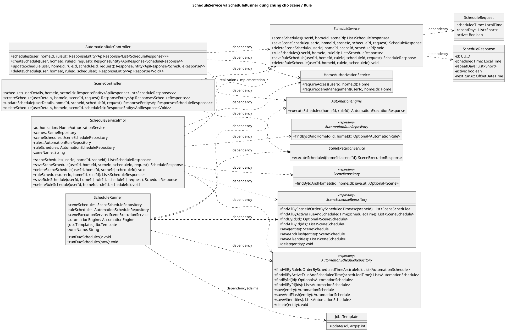
```plantuml
@startuml Shared_Scheduling_Classes
title ScheduleService và ScheduleRunner dùng chung cho Scene / Rule
!pragma layout smetana
skinparam backgroundColor white
skinparam shadowing false
skinparam roundcorner 0
skinparam defaultFontName Arial

left to right direction
hide circle
skinparam classAttributeIconSize 0
class SceneController {
    +schedules(userDetails, homeId, sceneId): ResponseEntity<ApiResponse<List<ScheduleResponse>>>
    +createSchedule(userDetails, homeId, sceneId, request): ResponseEntity<ApiResponse<ScheduleResponse>>
    +updateSchedule(userDetails, homeId, sceneId, scheduleId, request): ResponseEntity<ApiResponse<ScheduleResponse>>
    +deleteSchedule(userDetails, homeId, sceneId, scheduleId): ResponseEntity<ApiResponse<Void>>
}
class AutomationRuleController {
    +schedules(user, homeId, ruleId): ResponseEntity<ApiResponse<List<ScheduleResponse>>>
    +createSchedule(user, homeId, ruleId, request): ResponseEntity<ApiResponse<ScheduleResponse>>
    +updateSchedule(user, homeId, ruleId, scheduleId, request): ResponseEntity<ApiResponse<ScheduleResponse>>
    +deleteSchedule(user, homeId, ruleId, scheduleId): ResponseEntity<ApiResponse<Void>>
}
interface ScheduleService {
    +sceneSchedules(userId, homeId, sceneId): List<ScheduleResponse>
    +saveSceneSchedule(userId, homeId, sceneId, scheduleId, request): ScheduleResponse
    +deleteSceneSchedule(userId, homeId, sceneId, scheduleId): void
    +ruleSchedules(userId, homeId, ruleId): List<ScheduleResponse>
    +saveRuleSchedule(userId, homeId, ruleId, scheduleId, request): ScheduleResponse
    +deleteRuleSchedule(userId, homeId, ruleId, scheduleId): void
}
class ScheduleServiceImpl {
    -authorization: HomeAuthorizationService
    -scenes: SceneRepository
    -sceneSchedules: SceneScheduleRepository
    -rules: AutomationRuleRepository
    -ruleSchedules: AutomationScheduleRepository
    -zoneName: String
    +sceneSchedules(userId, homeId, sceneId): List<ScheduleResponse>
    +saveSceneSchedule(userId, homeId, sceneId, scheduleId, request): ScheduleResponse
    +deleteSceneSchedule(userId, homeId, sceneId, scheduleId): void
    +ruleSchedules(userId, homeId, ruleId): List<ScheduleResponse>
    +saveRuleSchedule(userId, homeId, ruleId, scheduleId, request): ScheduleResponse
    +deleteRuleSchedule(userId, homeId, ruleId, scheduleId): void
}
class ScheduleRunner {
    -sceneSchedules: SceneScheduleRepository
    -ruleSchedules: AutomationScheduleRepository
    -sceneExecutionService: SceneExecutionService
    -automationEngine: AutomationEngine
    -jdbcTemplate: JdbcTemplate
    -zoneName: String
    +runDueSchedules(): void
    +runDueSchedules(now): void
}
class HomeAuthorizationService {
    +requireAccess(userId, homeId): Home
    +requireSceneManagement(userId, homeId): Home
}
interface SceneRepository <<repository>> {
    +findByIdAndHomeId(id, homeId): java.util.Optional<Scene>
}
interface AutomationRuleRepository <<repository>> {
    +findByIdAndHomeId(id, homeId): Optional<AutomationRule>
}
interface SceneScheduleRepository <<repository>> {
    +findAllBySceneIdOrderByScheduledTimeAsc(sceneId): List<SceneSchedule>
    +findAllByActiveTrueAndScheduledTime(scheduledTime): List<SceneSchedule>
    +findById(id): Optional<SceneSchedule>
    +findAllById(ids): List<SceneSchedule>
    +save(entity): SceneSchedule
    +saveAndFlush(entity): SceneSchedule
    +saveAll(entities): List<SceneSchedule>
    +delete(entity): void
}
interface AutomationScheduleRepository <<repository>> {
    +findAllByRuleIdOrderByScheduledTimeAsc(ruleId): List<AutomationSchedule>
    +findAllByActiveTrueAndScheduledTime(scheduledTime): List<AutomationSchedule>
    +findById(id): Optional<AutomationSchedule>
    +findAllById(ids): List<AutomationSchedule>
    +save(entity): AutomationSchedule
    +saveAndFlush(entity): AutomationSchedule
    +saveAll(entities): List<AutomationSchedule>
    +delete(entity): void
}
interface SceneExecutionService {
    +executeScheduled(homeId, sceneId): SceneExecutionResponse
}
interface AutomationEngine {
    +executeScheduled(homeId, ruleId): AutomationExecutionResponse
}
class ScheduleRequest {
    -scheduledTime: LocalTime
    -repeatDays: List<Short>
    -active: Boolean
}
class ScheduleResponse {
    -id: UUID
    -scheduledTime: LocalTime
    -repeatDays: List<Short>
    -active: boolean
    -nextRunAt: OffsetDateTime
}
SceneController ..> SceneExecutionService : dependency
SceneController ..> ScheduleService : dependency
AutomationRuleController ..> AutomationEngine : dependency
AutomationRuleController ..> HomeAuthorizationService : dependency
AutomationRuleController ..> ScheduleService : dependency
ScheduleServiceImpl ..> HomeAuthorizationService : dependency
ScheduleServiceImpl ..> SceneRepository : dependency
ScheduleServiceImpl ..> SceneScheduleRepository : dependency
ScheduleServiceImpl ..> AutomationRuleRepository : dependency
ScheduleServiceImpl ..> AutomationScheduleRepository : dependency
ScheduleServiceImpl ..|> ScheduleService : realization / implementation
ScheduleRunner ..> SceneScheduleRepository : dependency
ScheduleRunner ..> AutomationScheduleRepository : dependency
ScheduleRunner ..> SceneExecutionService : dependency
ScheduleRunner ..> AutomationEngine : dependency
class JdbcTemplate {
    +update(sql, args): int
}
ScheduleRunner ..> JdbcTemplate : dependency (claim)
ScheduleService ..> ScheduleRequest : dependency
ScheduleService ..> ScheduleResponse : dependency
@enduml
```

### 8.5. Behavior Event và Pattern

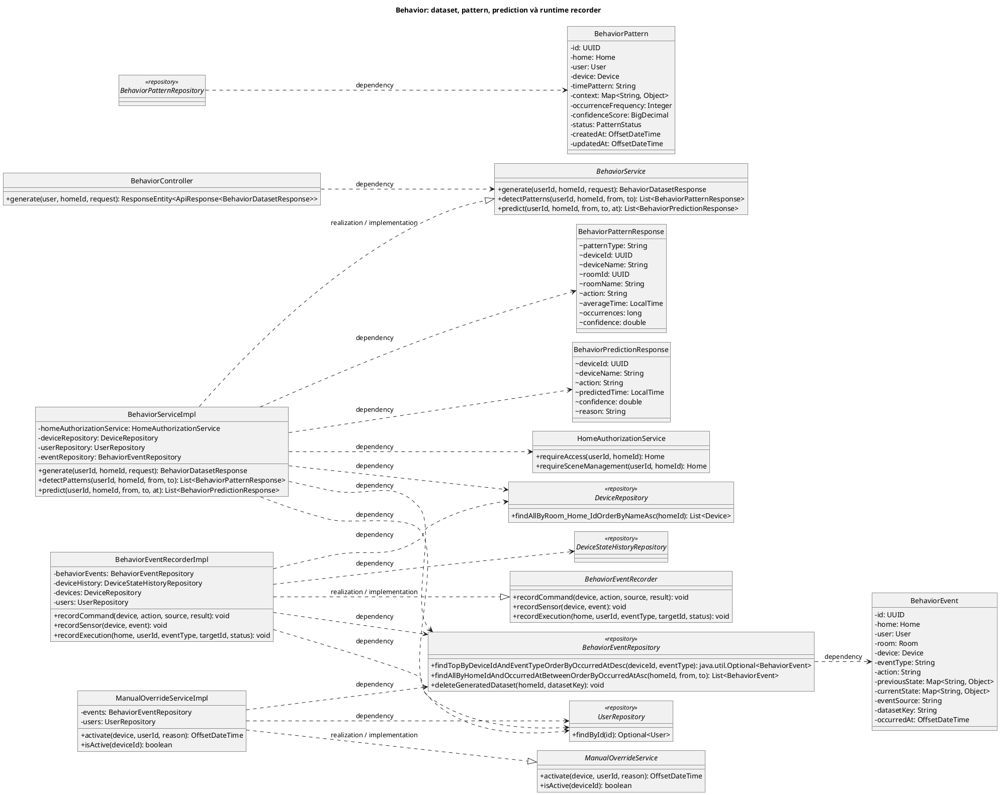
```plantuml
@startuml Behavior_Classes
title Behavior: dataset, pattern, prediction và runtime recorder
!pragma layout smetana
skinparam backgroundColor white
skinparam shadowing false
skinparam roundcorner 0
skinparam defaultFontName Arial

left to right direction
hide circle
skinparam classAttributeIconSize 0
class BehaviorController {
    +generate(user, homeId, request): ResponseEntity<ApiResponse<BehaviorDatasetResponse>>
}
interface BehaviorService {
    +generate(userId, homeId, request): BehaviorDatasetResponse
    +detectPatterns(userId, homeId, from, to): List<BehaviorPatternResponse>
    +predict(userId, homeId, from, to, at): List<BehaviorPredictionResponse>
}
class BehaviorServiceImpl {
    -homeAuthorizationService: HomeAuthorizationService
    -deviceRepository: DeviceRepository
    -userRepository: UserRepository
    -eventRepository: BehaviorEventRepository
    +generate(userId, homeId, request): BehaviorDatasetResponse
    +detectPatterns(userId, homeId, from, to): List<BehaviorPatternResponse>
    +predict(userId, homeId, from, to, at): List<BehaviorPredictionResponse>
}
interface BehaviorEventRecorder {
    +recordCommand(device, action, source, result): void
    +recordSensor(device, event): void
    +recordExecution(home, userId, eventType, targetId, status): void
}
class BehaviorEventRecorderImpl {
    -behaviorEvents: BehaviorEventRepository
    -deviceHistory: DeviceStateHistoryRepository
    -devices: DeviceRepository
    -users: UserRepository
    +recordCommand(device, action, source, result): void
    +recordSensor(device, event): void
    +recordExecution(home, userId, eventType, targetId, status): void
}
interface ManualOverrideService {
    +activate(device, userId, reason): OffsetDateTime
    +isActive(deviceId): boolean
}
class ManualOverrideServiceImpl {
    -events: BehaviorEventRepository
    -users: UserRepository
    +activate(device, userId, reason): OffsetDateTime
    +isActive(deviceId): boolean
}
class HomeAuthorizationService {
    +requireAccess(userId, homeId): Home
    +requireSceneManagement(userId, homeId): Home
}
interface BehaviorEventRepository <<repository>> {
    +findTopByDeviceIdAndEventTypeOrderByOccurredAtDesc(deviceId, eventType): java.util.Optional<BehaviorEvent>
    +findAllByHomeIdAndOccurredAtBetweenOrderByOccurredAtAsc(homeId, from, to): List<BehaviorEvent>
    +deleteGeneratedDataset(homeId, datasetKey): void
}
interface DeviceRepository <<repository>> {
    +findAllByRoom_Home_IdOrderByNameAsc(homeId): List<Device>
}
interface UserRepository <<repository>> {
    +findById(id): Optional<User>
}
interface DeviceStateHistoryRepository <<repository>> {

}
class BehaviorEvent {
    -id: UUID
    -home: Home
    -user: User
    -room: Room
    -device: Device
    -eventType: String
    -action: String
    -previousState: Map<String, Object>
    -currentState: Map<String, Object>
    -eventSource: String
    -datasetKey: String
    -occurredAt: OffsetDateTime
}
class BehaviorPattern {
    -id: UUID
    -home: Home
    -user: User
    -device: Device
    -timePattern: String
    -context: Map<String, Object>
    -occurrenceFrequency: Integer
    -confidenceScore: BigDecimal
    -status: PatternStatus
    -createdAt: OffsetDateTime
    -updatedAt: OffsetDateTime
}
interface BehaviorPatternRepository <<repository>> {

}
class BehaviorPatternResponse {
    ~patternType: String
    ~deviceId: UUID
    ~deviceName: String
    ~roomId: UUID
    ~roomName: String
    ~action: String
    ~averageTime: LocalTime
    ~occurrences: long
    ~confidence: double
}
class BehaviorPredictionResponse {
    ~deviceId: UUID
    ~deviceName: String
    ~action: String
    ~predictedTime: LocalTime
    ~confidence: double
    ~reason: String
}
BehaviorController ..> BehaviorService : dependency
BehaviorServiceImpl ..> HomeAuthorizationService : dependency
BehaviorServiceImpl ..> DeviceRepository : dependency
BehaviorServiceImpl ..> UserRepository : dependency
BehaviorServiceImpl ..> BehaviorEventRepository : dependency
BehaviorServiceImpl ..|> BehaviorService : realization / implementation
BehaviorEventRecorderImpl ..> BehaviorEventRepository : dependency
BehaviorEventRecorderImpl ..> DeviceStateHistoryRepository : dependency
BehaviorEventRecorderImpl ..> DeviceRepository : dependency
BehaviorEventRecorderImpl ..> UserRepository : dependency
BehaviorEventRecorderImpl ..|> BehaviorEventRecorder : realization / implementation
ManualOverrideServiceImpl ..> BehaviorEventRepository : dependency
ManualOverrideServiceImpl ..> UserRepository : dependency
ManualOverrideServiceImpl ..|> ManualOverrideService : realization / implementation
BehaviorEventRepository ..> BehaviorEvent : dependency
BehaviorPatternRepository ..> BehaviorPattern : dependency
BehaviorServiceImpl ..> BehaviorPatternResponse : dependency
BehaviorServiceImpl ..> BehaviorPredictionResponse : dependency
@enduml
```

BehaviorEvent lưu Home và các liên kết User/Device/Room tùy chọn. BehaviorPattern cũng có Home và User/Device tùy chọn; không có khóa ngoại nối trực tiếp Event với Pattern. Service phân tích trả DTO, không persist BehaviorPattern. Recorder lưu sensor, command, execution và state history bằng `REQUIRES_NEW`; ManualOverrideService đọc event `MANUAL_OVERRIDE` để xác định cửa sổ 30 phút.

## 9. Sequence diagrams

Các đường dẫn rút gọn đều dưới `/api/v1/homes/{homeId}`. Thanh kích hoạt được mở khi nhận lời gọi và đóng khi trả kết quả, kể cả các lời gọi repository/database và self-call.

### 9.1. Tạo / sửa Rule, gồm action gọi Scene

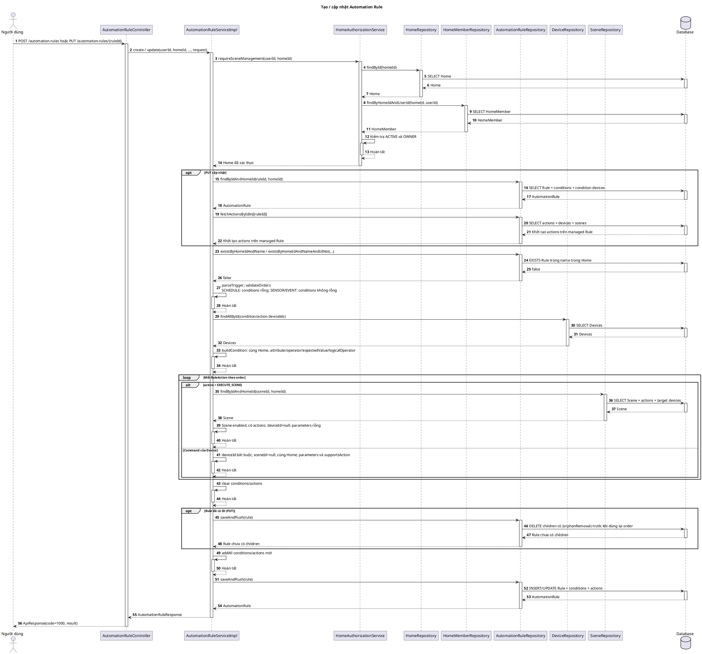
```plantuml
@startuml Automation_Rule_Write
title Tạo / cập nhật Automation Rule
skinparam backgroundColor white
skinparam shadowing false
skinparam roundcorner 0
skinparam defaultFontName Arial

autonumber
actor "Người dùng" as Client
participant "AutomationRuleController" as Controller
participant "AutomationRuleServiceImpl" as Service
participant "HomeAuthorizationService" as Auth
participant "HomeRepository" as HomeRepo
participant "HomeMemberRepository" as MemberRepo
participant "AutomationRuleRepository" as RuleRepo
participant "DeviceRepository" as DeviceRepo
participant "SceneRepository" as SceneRepo
database "Database" as DB
Client -> Controller: POST /automation-rules hoặc PUT /automation-rules/{ruleId}
activate Controller
Controller -> Service: create / update(userId, homeId, ..., request)
activate Service
Service -> Auth: requireSceneManagement(userId, homeId)
activate Auth
Auth -> HomeRepo: findById(homeId)
activate HomeRepo
HomeRepo -> DB: SELECT Home
activate DB
DB --> HomeRepo: Home
deactivate DB
HomeRepo --> Auth: Home
deactivate HomeRepo
Auth -> MemberRepo: findByHomeIdAndUserId(homeId, userId)
activate MemberRepo
MemberRepo -> DB: SELECT HomeMember
activate DB
DB --> MemberRepo: HomeMember
deactivate DB
MemberRepo --> Auth: HomeMember
deactivate MemberRepo
Auth -> Auth: Kiểm tra ACTIVE và OWNER
activate Auth
Auth --> Auth: Hoàn tất
deactivate Auth
Auth --> Service: Home đã xác thực
deactivate Auth
opt PUT cập nhật
Service -> RuleRepo: findByIdAndHomeId(ruleId, homeId)
activate RuleRepo
RuleRepo -> DB: SELECT Rule + conditions + condition devices
activate DB
DB --> RuleRepo: AutomationRule
deactivate DB
RuleRepo --> Service: AutomationRule
deactivate RuleRepo
Service -> RuleRepo: fetchActionsByIdIn([ruleId])
activate RuleRepo
RuleRepo -> DB: SELECT actions + devices + scenes
activate DB
DB --> RuleRepo: Khởi tạo actions trên managed Rule
deactivate DB
RuleRepo --> Service: Khởi tạo actions trên managed Rule
deactivate RuleRepo
end
Service -> RuleRepo: existsByHomeIdAndName / existsByHomeIdAndNameAndIdNot(...)
activate RuleRepo
RuleRepo -> DB: EXISTS Rule trùng name trong Home
activate DB
DB --> RuleRepo: false
deactivate DB
RuleRepo --> Service: false
deactivate RuleRepo
Service -> Service: parseTrigger; validateOrders\nSCHEDULE: conditions rỗng; SENSOR/EVENT: conditions không rỗng
activate Service
Service --> Service: Hoàn tất
deactivate Service
Service -> DeviceRepo: findAllById(condition/action deviceIds)
activate DeviceRepo
DeviceRepo -> DB: SELECT Devices
activate DB
DB --> DeviceRepo: Devices
deactivate DB
DeviceRepo --> Service: Devices
deactivate DeviceRepo
Service -> Service: buildCondition: cùng Home, attribute/operator/expectedValue/logicalOperator
activate Service
Service --> Service: Hoàn tất
deactivate Service
loop Mỗi RuleAction theo order
alt action = EXECUTE_SCENE
Service -> SceneRepo: findByIdAndHomeId(sceneId, homeId)
activate SceneRepo
SceneRepo -> DB: SELECT Scene + actions + target devices
activate DB
DB --> SceneRepo: Scene
deactivate DB
SceneRepo --> Service: Scene
deactivate SceneRepo
Service -> Service: Scene enabled, có actions; deviceId=null; parameters rỗng
activate Service
Service --> Service: Hoàn tất
deactivate Service
else Command của Device
Service -> Service: deviceId bắt buộc, sceneId=null; cùng Home; parameters và supportsAction
activate Service
Service --> Service: Hoàn tất
deactivate Service
end
end
Service -> Service: clear conditions/actions
activate Service
Service --> Service: Hoàn tất
deactivate Service
opt Rule đã có ID (PUT)
Service -> RuleRepo: saveAndFlush(rule)
activate RuleRepo
RuleRepo -> DB: DELETE children cũ (orphanRemoval) trước khi dùng lại order
activate DB
DB --> RuleRepo: Rule chưa có children
deactivate DB
RuleRepo --> Service: Rule chưa có children
deactivate RuleRepo
end
Service -> Service: addAll conditions/actions mới
activate Service
Service --> Service: Hoàn tất
deactivate Service
Service -> RuleRepo: saveAndFlush(rule)
activate RuleRepo
RuleRepo -> DB: INSERT/UPDATE Rule + conditions + actions
activate DB
DB --> RuleRepo: AutomationRule
deactivate DB
RuleRepo --> Service: AutomationRule
deactivate RuleRepo
Service --> Controller: AutomationRuleResponse
deactivate Service
Controller --> Client: ApiResponse(code=1000, result)
deactivate Controller
@enduml
```

### 9.2. Xem, bật/tắt, xóa và lịch sử Rule

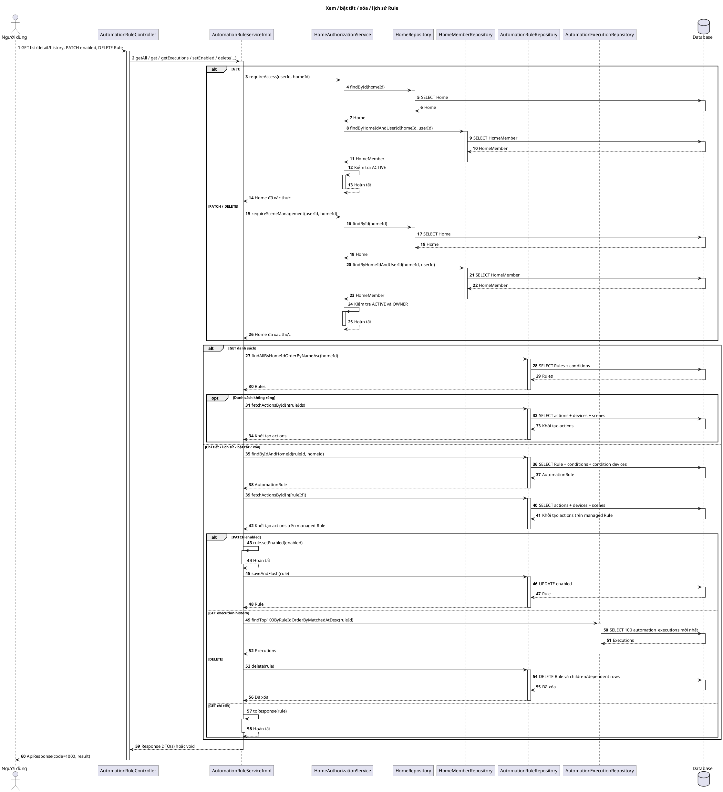
```plantuml
@startuml Automation_Rule_Read_Toggle_Delete_History
title Xem / bật tắt / xóa / lịch sử Rule
skinparam backgroundColor white
skinparam shadowing false
skinparam roundcorner 0
skinparam defaultFontName Arial

autonumber
actor "Người dùng" as Client
participant "AutomationRuleController" as Controller
participant "AutomationRuleServiceImpl" as Service
participant "HomeAuthorizationService" as Auth
participant "HomeRepository" as HomeRepo
participant "HomeMemberRepository" as MemberRepo
participant "AutomationRuleRepository" as RuleRepo
participant "AutomationExecutionRepository" as ExecutionRepo
database "Database" as DB
Client -> Controller: GET list/detail/history, PATCH enabled, DELETE Rule
activate Controller
Controller -> Service: getAll / get / getExecutions / setEnabled / delete(...)
activate Service
alt GET
Service -> Auth: requireAccess(userId, homeId)
activate Auth
Auth -> HomeRepo: findById(homeId)
activate HomeRepo
HomeRepo -> DB: SELECT Home
activate DB
DB --> HomeRepo: Home
deactivate DB
HomeRepo --> Auth: Home
deactivate HomeRepo
Auth -> MemberRepo: findByHomeIdAndUserId(homeId, userId)
activate MemberRepo
MemberRepo -> DB: SELECT HomeMember
activate DB
DB --> MemberRepo: HomeMember
deactivate DB
MemberRepo --> Auth: HomeMember
deactivate MemberRepo
Auth -> Auth: Kiểm tra ACTIVE
activate Auth
Auth --> Auth: Hoàn tất
deactivate Auth
Auth --> Service: Home đã xác thực
deactivate Auth
else PATCH / DELETE
Service -> Auth: requireSceneManagement(userId, homeId)
activate Auth
Auth -> HomeRepo: findById(homeId)
activate HomeRepo
HomeRepo -> DB: SELECT Home
activate DB
DB --> HomeRepo: Home
deactivate DB
HomeRepo --> Auth: Home
deactivate HomeRepo
Auth -> MemberRepo: findByHomeIdAndUserId(homeId, userId)
activate MemberRepo
MemberRepo -> DB: SELECT HomeMember
activate DB
DB --> MemberRepo: HomeMember
deactivate DB
MemberRepo --> Auth: HomeMember
deactivate MemberRepo
Auth -> Auth: Kiểm tra ACTIVE và OWNER
activate Auth
Auth --> Auth: Hoàn tất
deactivate Auth
Auth --> Service: Home đã xác thực
deactivate Auth
end
alt GET danh sách
Service -> RuleRepo: findAllByHomeIdOrderByNameAsc(homeId)
activate RuleRepo
RuleRepo -> DB: SELECT Rules + conditions
activate DB
DB --> RuleRepo: Rules
deactivate DB
RuleRepo --> Service: Rules
deactivate RuleRepo
opt Danh sách không rỗng
Service -> RuleRepo: fetchActionsByIdIn(ruleIds)
activate RuleRepo
RuleRepo -> DB: SELECT actions + devices + scenes
activate DB
DB --> RuleRepo: Khởi tạo actions
deactivate DB
RuleRepo --> Service: Khởi tạo actions
deactivate RuleRepo
end
else Chi tiết / lịch sử / bật tắt / xóa
Service -> RuleRepo: findByIdAndHomeId(ruleId, homeId)
activate RuleRepo
RuleRepo -> DB: SELECT Rule + conditions + condition devices
activate DB
DB --> RuleRepo: AutomationRule
deactivate DB
RuleRepo --> Service: AutomationRule
deactivate RuleRepo
Service -> RuleRepo: fetchActionsByIdIn([ruleId])
activate RuleRepo
RuleRepo -> DB: SELECT actions + devices + scenes
activate DB
DB --> RuleRepo: Khởi tạo actions trên managed Rule
deactivate DB
RuleRepo --> Service: Khởi tạo actions trên managed Rule
deactivate RuleRepo
alt PATCH enabled
Service -> Service: rule.setEnabled(enabled)
activate Service
Service --> Service: Hoàn tất
deactivate Service
Service -> RuleRepo: saveAndFlush(rule)
activate RuleRepo
RuleRepo -> DB: UPDATE enabled
activate DB
DB --> RuleRepo: Rule
deactivate DB
RuleRepo --> Service: Rule
deactivate RuleRepo
else GET execution history
Service -> ExecutionRepo: findTop100ByRuleIdOrderByMatchedAtDesc(ruleId)
activate ExecutionRepo
ExecutionRepo -> DB: SELECT 100 automation_executions mới nhất
activate DB
DB --> ExecutionRepo: Executions
deactivate DB
ExecutionRepo --> Service: Executions
deactivate ExecutionRepo
else DELETE
Service -> RuleRepo: delete(rule)
activate RuleRepo
RuleRepo -> DB: DELETE Rule và children/dependent rows
activate DB
DB --> RuleRepo: Đã xóa
deactivate DB
RuleRepo --> Service: Đã xóa
deactivate RuleRepo
else GET chi tiết
Service -> Service: toResponse(rule)
activate Service
Service --> Service: Hoàn tất
deactivate Service
end
end
Service --> Controller: Response DTO(s) hoặc void
deactivate Service
Controller --> Client: ApiResponse(code=1000, result)
deactivate Controller
@enduml
```

### 9.3. Automation Engine nhận event từ REST

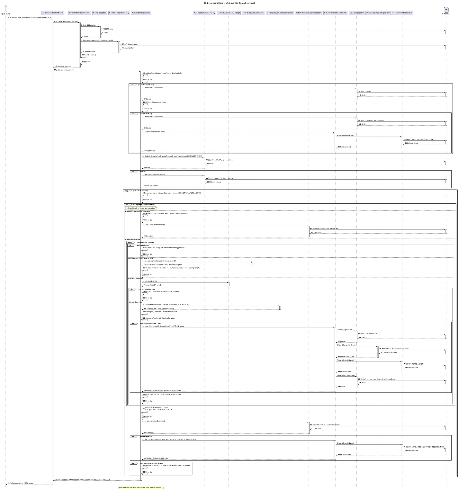
```plantuml
@startuml Automation_Event_Engine
title Xử lý event: conditions, conflict, override, Scene và command
skinparam backgroundColor white
skinparam shadowing false
skinparam roundcorner 0
skinparam defaultFontName Arial

autonumber
actor "Người dùng" as Client
participant "AutomationRuleController" as Controller
participant "HomeAuthorizationService" as Auth
participant "HomeRepository" as HomeRepo
participant "HomeMemberRepository" as MemberRepo
participant "AutomationEngineImpl" as Engine
participant "AutomationRuleRepository" as RuleRepo
participant "ManualOverrideServiceImpl" as Override
participant "SceneExecutionServiceImpl" as SceneExecution
participant "MqttDeviceCommandServiceImpl" as Command
participant "AutomationExecutionRepository" as ExecutionRepo
participant "BehaviorEventRecorderImpl" as Recorder
participant "DeviceRepository" as DeviceRepo
participant "DeviceStateHistoryRepository" as HistoryRepo
participant "BehaviorEventRepository" as EventRepo
database "Database" as DB
Client -> Controller: POST /automation-rules/events (AutomationEventRequest)
activate Controller
Controller -> Auth: requireAccess(userId, homeId)
activate Auth
Auth -> HomeRepo: findById(homeId)
activate HomeRepo
HomeRepo -> DB: SELECT Home
activate DB
DB --> HomeRepo: Home
deactivate DB
HomeRepo --> Auth: Home
deactivate HomeRepo
Auth -> MemberRepo: findByHomeIdAndUserId(homeId, userId)
activate MemberRepo
MemberRepo -> DB: SELECT HomeMember
activate DB
DB --> MemberRepo: HomeMember
deactivate DB
MemberRepo --> Auth: HomeMember
deactivate MemberRepo
Auth -> Auth: Kiểm tra ACTIVE
activate Auth
Auth --> Auth: Hoàn tất
deactivate Auth
Auth --> Controller: Home đã xác thực
deactivate Auth
Controller -> Engine: process(homeId, event)
activate Engine
Engine -> Engine: validateSourceDevice: eventType và data bắt buộc
activate Engine
Engine --> Engine: Hoàn tất
deactivate Engine
opt sourceDeviceId != null
Engine -> DeviceRepo: findById(sourceDeviceId)
activate DeviceRepo
DeviceRepo -> DB: SELECT Device
activate DB
DB --> DeviceRepo: Device
deactivate DB
DeviceRepo --> Engine: Device
deactivate DeviceRepo
Engine -> Engine: Kiểm tra Device thuộc Home
activate Engine
Engine --> Engine: Hoàn tất
deactivate Engine
opt event.test = false
Engine -> DeviceRepo: findById(sourceDeviceId)
activate DeviceRepo
DeviceRepo -> DB: SELECT Device cho recordSensor
activate DB
DB --> DeviceRepo: Device
deactivate DB
DeviceRepo --> Engine: Device
deactivate DeviceRepo
Engine -> Recorder: recordSensor(device, event)
activate Recorder
Recorder -> EventRepo: save(BehaviorEvent)
activate EventRepo
EventRepo -> DB: INSERT sensor event (REQUIRES_NEW)
activate DB
DB --> EventRepo: BehaviorEvent
deactivate DB
EventRepo --> Recorder: BehaviorEvent
deactivate EventRepo
Recorder --> Engine: Đã ghi nhận
deactivate Recorder
end
end
Engine -> RuleRepo: findAllByHomeIdAndEnabledTrueAndTriggerTypeIn(homeId, [SENSOR, EVENT])
activate RuleRepo
RuleRepo -> DB: SELECT enabled Rules + conditions
activate DB
DB --> RuleRepo: Rules
deactivate DB
RuleRepo --> Engine: Rules
deactivate RuleRepo
opt Có Rule
Engine -> RuleRepo: fetchActionsByIdIn(ruleIds)
activate RuleRepo
RuleRepo -> DB: SELECT actions + devices + scenes
activate DB
DB --> RuleRepo: Khởi tạo actions
deactivate DB
RuleRepo --> Engine: Khởi tạo actions
deactivate RuleRepo
end
loop Mỗi Rule theo rule.id
Engine -> Engine: matches(rule, event): conditions theo order; EQ/NE/GT/GTE/LT/LTE; AND/OR
activate Engine
Engine --> Engine: Hoàn tất
deactivate Engine
alt Không khớp (hoặc thiếu dữ liệu)
note over Engine
Không gửi lệnh và không tạo execution.
end note
else Khớp nhưng conflicts(rule, reserved)
Engine -> Engine: skippedConflict: status=SKIPPED, details=SKIPPED_CONFLICT
activate Engine
Engine --> Engine: Hoàn tất
deactivate Engine
Engine -> ExecutionRepo: save(AutomationExecution)
activate ExecutionRepo
ExecutionRepo -> DB: INSERT skipped conflict + event.test
activate DB
DB --> ExecutionRepo: Execution
deactivate DB
ExecutionRepo --> Engine: Execution
deactivate ExecutionRepo
else Khớp, không xung đột
loop Mỗi RuleAction theo order
alt event.test = true
Engine -> Engine: Ghi PREVIEW; không gửi command và không gọi Scene
activate Engine
Engine --> Engine: Hoàn tất
deactivate Engine
else action.scene != null (EXECUTE_SCENE)
Engine -> SceneExecution: executeFromAutomation(homeId, sceneId)
activate SceneExecution
SceneExecution --> Engine: SceneExecutionResponse hoặc RuntimeException
deactivate SceneExecution
Engine -> Engine: Ghi sceneExecutionId, status và resultDetail; lỗi Scene không dừng vòng lặp
activate Engine
Engine --> Engine: Hoàn tất
deactivate Engine
else Command của Device
Engine -> Override: isActive(deviceId)
activate Override
Override --> Engine: true / false (30 phút)
deactivate Override
alt Override đang hoạt động
Engine -> Engine: Ghi SKIPPED_OVERRIDE; không gửi command
activate Engine
Engine --> Engine: Hoàn tất
deactivate Engine
else Không có override
Engine -> Command: sendCommand(deviceId, action, parameters, AUTOMATION)
activate Command
Command --> Engine: CompletableFuture<CommandResult>
deactivate Command
Engine -> Engine: future.join() - chờ ACK / telemetry / timeout
activate Engine
Engine --> Engine: CommandResult hoặc RuntimeException
deactivate Engine
opt CommandResult.success = true
Engine -> Recorder: recordCommand(device, action, AUTOMATION, result)
activate Recorder
Recorder -> DeviceRepo: findById(deviceId)
activate DeviceRepo
DeviceRepo -> DB: SELECT Device hiện tại
activate DB
DB --> DeviceRepo: Device
deactivate DB
DeviceRepo --> Recorder: Device
deactivate DeviceRepo
Recorder -> HistoryRepo: save(DeviceStateHistory)
activate HistoryRepo
HistoryRepo -> DB: INSERT trạng thái trước/sau và source
activate DB
DB --> HistoryRepo: DeviceStateHistory
deactivate DB
HistoryRepo --> Recorder: DeviceStateHistory
deactivate HistoryRepo
Recorder -> EventRepo: save(BehaviorEvent)
activate EventRepo
EventRepo -> DB: INSERT DEVICE_ACTION
activate DB
DB --> EventRepo: BehaviorEvent
deactivate DB
EventRepo --> Recorder: BehaviorEvent
deactivate EventRepo
Recorder -> DeviceRepo: save(recordedDevice)
activate DeviceRepo
DeviceRepo -> DB: UPDATE current_state theo acknowledgedState
activate DB
DB --> DeviceRepo: Device
deactivate DB
DeviceRepo --> Recorder: Device
deactivate DeviceRepo
Recorder --> Engine: Đã ghi nhận (REQUIRES_NEW) hoặc lỗi ghi nhận
deactivate Recorder
end
Engine -> Engine: Ghi chi tiết thành công/lỗi; tiếp tục action kế tiếp
activate Engine
Engine --> Engine: Hoàn tất
deactivate Engine
end
end
end
Engine -> Engine: test hoặc attempted=0: SKIPPED\nCòn lại: SUCCESS / PARTIAL / FAILED
activate Engine
Engine --> Engine: Hoàn tất
deactivate Engine
Engine -> ExecutionRepo: save(AutomationExecution)
activate ExecutionRepo
ExecutionRepo -> DB: INSERT execution + test + result_detail
activate DB
DB --> ExecutionRepo: Execution
deactivate DB
ExecutionRepo --> Engine: Execution
deactivate ExecutionRepo
opt event.test = false
Engine -> Recorder: recordExecution(home, null, AUTOMATION_EXECUTION, ruleId, status)
activate Recorder
Recorder -> EventRepo: save(BehaviorEvent)
activate EventRepo
EventRepo -> DB: INSERT AUTOMATION_EXECUTION (REQUIRES_NEW)
activate DB
DB --> EventRepo: BehaviorEvent
deactivate DB
EventRepo --> Recorder: BehaviorEvent
deactivate EventRepo
Recorder --> Engine: Đã ghi nhận hoặc lỗi ghi nhận
deactivate Recorder
end
opt !test và outcome.status != SKIPPED
Engine -> Engine: Reserve target actions cho Rule sau (kể cả actions của Scene)
activate Engine
Engine --> Engine: Hoàn tất
deactivate Engine
end
end
end
Engine --> Controller: AutomationEngineResponse(evaluatedRules, matchedRules, executions)
deactivate Engine
Controller --> Client: ApiResponse(code=1000, result)
deactivate Controller
note over Engine
matchedRules = số execution trả về, gồm conflict/preview.
Rule có result SKIPPED không reserve target actions.
end note
@enduml
```

### 9.4. Sensor event từ MQTT

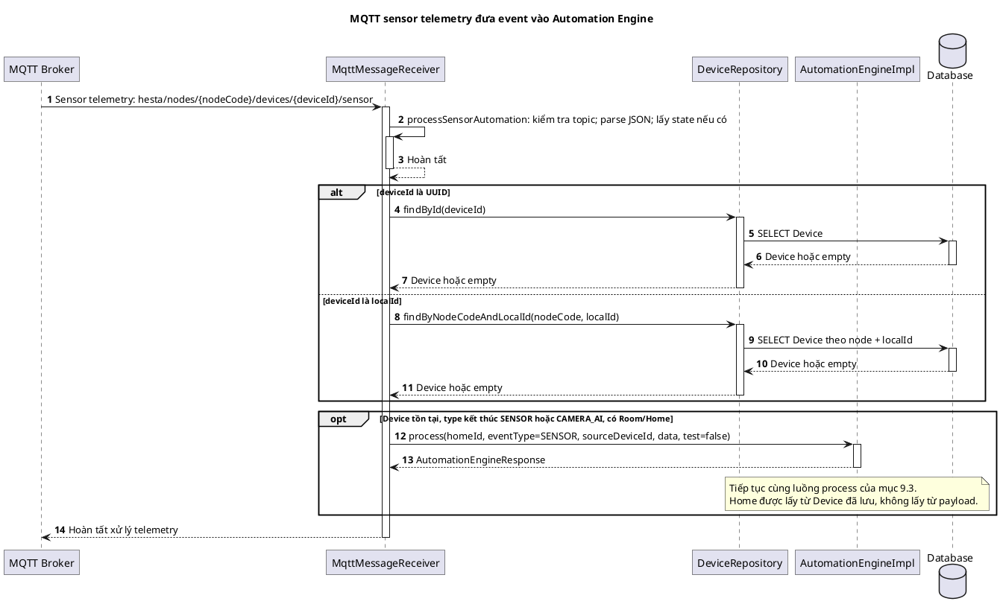
```plantuml
@startuml Automation_Mqtt_Sensor
title MQTT sensor telemetry đưa event vào Automation Engine
skinparam backgroundColor white
skinparam shadowing false
skinparam roundcorner 0
skinparam defaultFontName Arial

autonumber
participant "MQTT Broker" as Broker
participant "MqttMessageReceiver" as Receiver
participant "DeviceRepository" as DeviceRepo
participant "AutomationEngineImpl" as Engine
database "Database" as DB
Broker -> Receiver: Sensor telemetry: hesta/nodes/{nodeCode}/devices/{deviceId}/sensor
activate Receiver
Receiver -> Receiver: processSensorAutomation: kiểm tra topic; parse JSON; lấy state nếu có
activate Receiver
Receiver --> Receiver: Hoàn tất
deactivate Receiver
alt deviceId là UUID
Receiver -> DeviceRepo: findById(deviceId)
activate DeviceRepo
DeviceRepo -> DB: SELECT Device
activate DB
DB --> DeviceRepo: Device hoặc empty
deactivate DB
DeviceRepo --> Receiver: Device hoặc empty
deactivate DeviceRepo
else deviceId là localId
Receiver -> DeviceRepo: findByNodeCodeAndLocalId(nodeCode, localId)
activate DeviceRepo
DeviceRepo -> DB: SELECT Device theo node + localId
activate DB
DB --> DeviceRepo: Device hoặc empty
deactivate DB
DeviceRepo --> Receiver: Device hoặc empty
deactivate DeviceRepo
end
opt Device tồn tại, type kết thúc SENSOR hoặc CAMERA_AI, có Room/Home
Receiver -> Engine: process(homeId, eventType=SENSOR, sourceDeviceId, data, test=false)
activate Engine
Engine --> Receiver: AutomationEngineResponse
deactivate Engine
note over Engine
Tiếp tục cùng luồng process của mục 9.3.
Home được lấy từ Device đã lưu, không lấy từ payload.
end note
end
Receiver --> Broker: Hoàn tất xử lý telemetry
deactivate Receiver
@enduml
```

### 9.5. Chạy thử Rule (dry run)

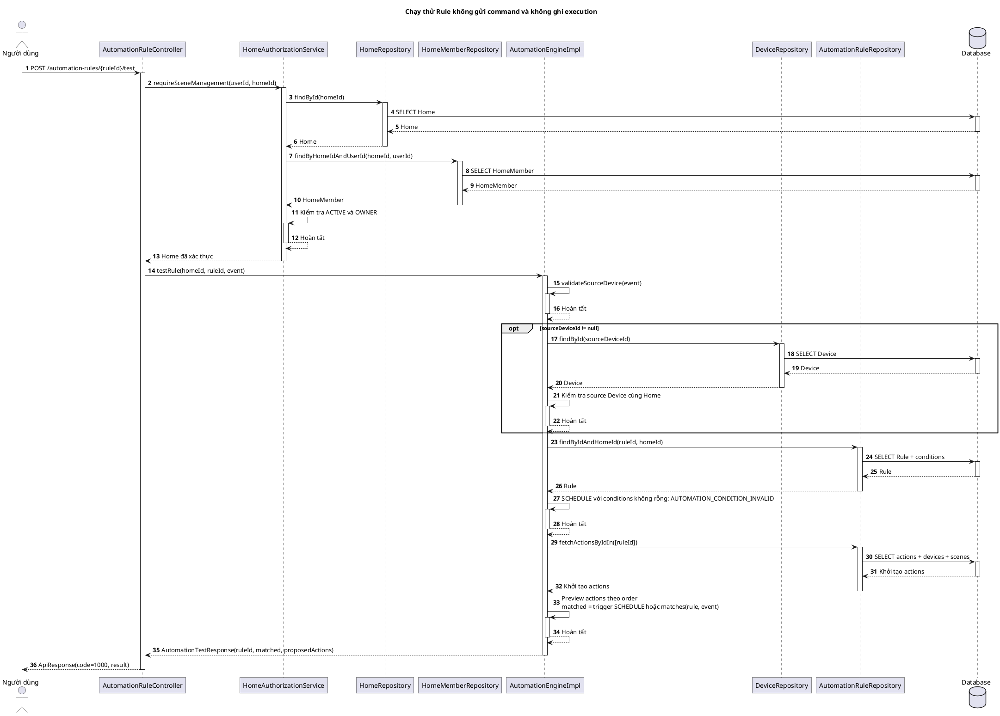
```plantuml
@startuml Automation_Test
title Chạy thử Rule không gửi command và không ghi execution
skinparam backgroundColor white
skinparam shadowing false
skinparam roundcorner 0
skinparam defaultFontName Arial

autonumber
actor "Người dùng" as Client
participant "AutomationRuleController" as Controller
participant "HomeAuthorizationService" as Auth
participant "HomeRepository" as HomeRepo
participant "HomeMemberRepository" as MemberRepo
participant "AutomationEngineImpl" as Engine
participant "DeviceRepository" as DeviceRepo
participant "AutomationRuleRepository" as RuleRepo
database "Database" as DB
Client -> Controller: POST /automation-rules/{ruleId}/test
activate Controller
Controller -> Auth: requireSceneManagement(userId, homeId)
activate Auth
Auth -> HomeRepo: findById(homeId)
activate HomeRepo
HomeRepo -> DB: SELECT Home
activate DB
DB --> HomeRepo: Home
deactivate DB
HomeRepo --> Auth: Home
deactivate HomeRepo
Auth -> MemberRepo: findByHomeIdAndUserId(homeId, userId)
activate MemberRepo
MemberRepo -> DB: SELECT HomeMember
activate DB
DB --> MemberRepo: HomeMember
deactivate DB
MemberRepo --> Auth: HomeMember
deactivate MemberRepo
Auth -> Auth: Kiểm tra ACTIVE và OWNER
activate Auth
Auth --> Auth: Hoàn tất
deactivate Auth
Auth --> Controller: Home đã xác thực
deactivate Auth
Controller -> Engine: testRule(homeId, ruleId, event)
activate Engine
Engine -> Engine: validateSourceDevice(event)
activate Engine
Engine --> Engine: Hoàn tất
deactivate Engine
opt sourceDeviceId != null
Engine -> DeviceRepo: findById(sourceDeviceId)
activate DeviceRepo
DeviceRepo -> DB: SELECT Device
activate DB
DB --> DeviceRepo: Device
deactivate DB
DeviceRepo --> Engine: Device
deactivate DeviceRepo
Engine -> Engine: Kiểm tra source Device cùng Home
activate Engine
Engine --> Engine: Hoàn tất
deactivate Engine
end
Engine -> RuleRepo: findByIdAndHomeId(ruleId, homeId)
activate RuleRepo
RuleRepo -> DB: SELECT Rule + conditions
activate DB
DB --> RuleRepo: Rule
deactivate DB
RuleRepo --> Engine: Rule
deactivate RuleRepo
Engine -> Engine: SCHEDULE với conditions không rỗng: AUTOMATION_CONDITION_INVALID
activate Engine
Engine --> Engine: Hoàn tất
deactivate Engine
Engine -> RuleRepo: fetchActionsByIdIn([ruleId])
activate RuleRepo
RuleRepo -> DB: SELECT actions + devices + scenes
activate DB
DB --> RuleRepo: Khởi tạo actions
deactivate DB
RuleRepo --> Engine: Khởi tạo actions
deactivate RuleRepo
Engine -> Engine: Preview actions theo order\nmatched = trigger SCHEDULE hoặc matches(rule, event)
activate Engine
Engine --> Engine: Hoàn tất
deactivate Engine
Engine --> Controller: AutomationTestResponse(ruleId, matched, proposedActions)
deactivate Engine
Controller --> Client: ApiResponse(code=1000, result)
deactivate Controller
@enduml
```

API `/test` không lưu `AutomationExecution`. Ngược lại, `/events` với `test=true` vẫn lưu execution `SKIPPED` có chi tiết `PREVIEW` cho Rule khớp và có thể ghi `SKIPPED_CONFLICT`.

### 9.6. Quản lý lịch Rule

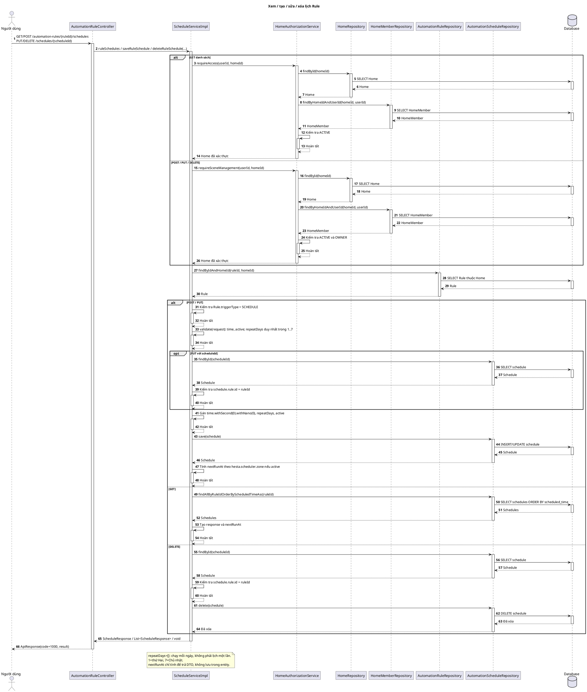
```plantuml
@startuml Rule_Schedule_Management
title Xem / tạo / sửa / xóa lịch Rule
skinparam backgroundColor white
skinparam shadowing false
skinparam roundcorner 0
skinparam defaultFontName Arial

autonumber
actor "Người dùng" as Client
participant "AutomationRuleController" as Controller
participant "ScheduleServiceImpl" as Schedule
participant "HomeAuthorizationService" as Auth
participant "HomeRepository" as HomeRepo
participant "HomeMemberRepository" as MemberRepo
participant "AutomationRuleRepository" as TargetRepo
participant "AutomationScheduleRepository" as ScheduleRepo
database "Database" as DB
Client -> Controller: GET/POST /automation-rules/{ruleId}/schedules\nPUT/DELETE /schedules/{scheduleId}
activate Controller
Controller -> Schedule: ruleSchedules / saveRuleSchedule / deleteRuleSchedule(...)
activate Schedule
alt GET danh sách
Schedule -> Auth: requireAccess(userId, homeId)
activate Auth
Auth -> HomeRepo: findById(homeId)
activate HomeRepo
HomeRepo -> DB: SELECT Home
activate DB
DB --> HomeRepo: Home
deactivate DB
HomeRepo --> Auth: Home
deactivate HomeRepo
Auth -> MemberRepo: findByHomeIdAndUserId(homeId, userId)
activate MemberRepo
MemberRepo -> DB: SELECT HomeMember
activate DB
DB --> MemberRepo: HomeMember
deactivate DB
MemberRepo --> Auth: HomeMember
deactivate MemberRepo
Auth -> Auth: Kiểm tra ACTIVE
activate Auth
Auth --> Auth: Hoàn tất
deactivate Auth
Auth --> Schedule: Home đã xác thực
deactivate Auth
else POST / PUT / DELETE
Schedule -> Auth: requireSceneManagement(userId, homeId)
activate Auth
Auth -> HomeRepo: findById(homeId)
activate HomeRepo
HomeRepo -> DB: SELECT Home
activate DB
DB --> HomeRepo: Home
deactivate DB
HomeRepo --> Auth: Home
deactivate HomeRepo
Auth -> MemberRepo: findByHomeIdAndUserId(homeId, userId)
activate MemberRepo
MemberRepo -> DB: SELECT HomeMember
activate DB
DB --> MemberRepo: HomeMember
deactivate DB
MemberRepo --> Auth: HomeMember
deactivate MemberRepo
Auth -> Auth: Kiểm tra ACTIVE và OWNER
activate Auth
Auth --> Auth: Hoàn tất
deactivate Auth
Auth --> Schedule: Home đã xác thực
deactivate Auth
end
Schedule -> TargetRepo: findByIdAndHomeId(ruleId, homeId)
activate TargetRepo
TargetRepo -> DB: SELECT Rule thuộc Home
activate DB
DB --> TargetRepo: Rule
deactivate DB
TargetRepo --> Schedule: Rule
deactivate TargetRepo
alt POST / PUT
Schedule -> Schedule: Kiểm tra Rule.triggerType = SCHEDULE
activate Schedule
Schedule --> Schedule: Hoàn tất
deactivate Schedule
Schedule -> Schedule: validate(request): time, active; repeatDays duy nhất trong 1..7
activate Schedule
Schedule --> Schedule: Hoàn tất
deactivate Schedule
opt PUT với scheduleId
Schedule -> ScheduleRepo: findById(scheduleId)
activate ScheduleRepo
ScheduleRepo -> DB: SELECT schedule
activate DB
DB --> ScheduleRepo: Schedule
deactivate DB
ScheduleRepo --> Schedule: Schedule
deactivate ScheduleRepo
Schedule -> Schedule: Kiểm tra schedule.rule.id = ruleId
activate Schedule
Schedule --> Schedule: Hoàn tất
deactivate Schedule
end
Schedule -> Schedule: Gán time.withSecond(0).withNano(0), repeatDays, active
activate Schedule
Schedule --> Schedule: Hoàn tất
deactivate Schedule
Schedule -> ScheduleRepo: save(schedule)
activate ScheduleRepo
ScheduleRepo -> DB: INSERT/UPDATE schedule
activate DB
DB --> ScheduleRepo: Schedule
deactivate DB
ScheduleRepo --> Schedule: Schedule
deactivate ScheduleRepo
Schedule -> Schedule: Tính nextRunAt theo hesta.scheduler.zone nếu active
activate Schedule
Schedule --> Schedule: Hoàn tất
deactivate Schedule
else GET
Schedule -> ScheduleRepo: findAllByRuleIdOrderByScheduledTimeAsc(ruleId)
activate ScheduleRepo
ScheduleRepo -> DB: SELECT schedules ORDER BY scheduled_time
activate DB
DB --> ScheduleRepo: Schedules
deactivate DB
ScheduleRepo --> Schedule: Schedules
deactivate ScheduleRepo
Schedule -> Schedule: Tạo response và nextRunAt
activate Schedule
Schedule --> Schedule: Hoàn tất
deactivate Schedule
else DELETE
Schedule -> ScheduleRepo: findById(scheduleId)
activate ScheduleRepo
ScheduleRepo -> DB: SELECT schedule
activate DB
DB --> ScheduleRepo: Schedule
deactivate DB
ScheduleRepo --> Schedule: Schedule
deactivate ScheduleRepo
Schedule -> Schedule: Kiểm tra schedule.rule.id = ruleId
activate Schedule
Schedule --> Schedule: Hoàn tất
deactivate Schedule
Schedule -> ScheduleRepo: delete(schedule)
activate ScheduleRepo
ScheduleRepo -> DB: DELETE schedule
activate DB
DB --> ScheduleRepo: Đã xóa
deactivate DB
ScheduleRepo --> Schedule: Đã xóa
deactivate ScheduleRepo
end
Schedule --> Controller: ScheduleResponse / List<ScheduleResponse> / void
deactivate Schedule
Controller --> Client: ApiResponse(code=1000, result)
deactivate Controller
note over Schedule
repeatDays=[]: chạy mỗi ngày, không phải lịch một lần.
1=thứ Hai, 7=Chủ nhật.
nextRunAt chỉ tính để trả DTO, không lưu trong entity.
end note
@enduml
```

### 9.7. Scheduler dispatch

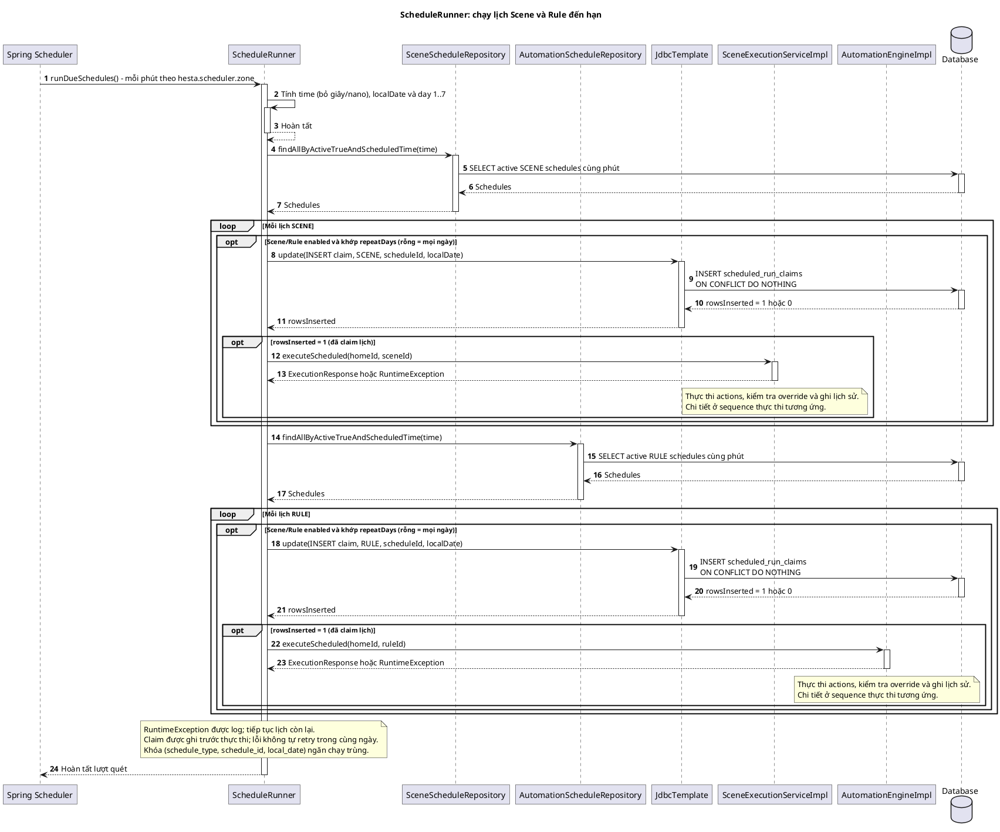
```plantuml
@startuml Shared_Schedule_Dispatch
title ScheduleRunner: chạy lịch Scene và Rule đến hạn
skinparam backgroundColor white
skinparam shadowing false
skinparam roundcorner 0
skinparam defaultFontName Arial

autonumber
participant "Spring Scheduler" as Clock
participant "ScheduleRunner" as Runner
participant "SceneScheduleRepository" as SceneScheduleRepo
participant "AutomationScheduleRepository" as RuleScheduleRepo
participant "JdbcTemplate" as Jdbc
participant "SceneExecutionServiceImpl" as Execution
participant "AutomationEngineImpl" as Engine
database "Database" as DB
Clock -> Runner: runDueSchedules() - mỗi phút theo hesta.scheduler.zone
activate Runner
Runner -> Runner: Tính time (bỏ giây/nano), localDate và day 1..7
activate Runner
Runner --> Runner: Hoàn tất
deactivate Runner
Runner -> SceneScheduleRepo: findAllByActiveTrueAndScheduledTime(time)
activate SceneScheduleRepo
SceneScheduleRepo -> DB: SELECT active SCENE schedules cùng phút
activate DB
DB --> SceneScheduleRepo: Schedules
deactivate DB
SceneScheduleRepo --> Runner: Schedules
deactivate SceneScheduleRepo
loop Mỗi lịch SCENE
opt Scene/Rule enabled và khớp repeatDays (rỗng = mọi ngày)
Runner -> Jdbc: update(INSERT claim, SCENE, scheduleId, localDate)
activate Jdbc
Jdbc -> DB: INSERT scheduled_run_claims\nON CONFLICT DO NOTHING
activate DB
DB --> Jdbc: rowsInserted = 1 hoặc 0
deactivate DB
Jdbc --> Runner: rowsInserted
deactivate Jdbc
opt rowsInserted = 1 (đã claim lịch)
Runner -> Execution: executeScheduled(homeId, sceneId)
activate Execution
Execution --> Runner: ExecutionResponse hoặc RuntimeException
deactivate Execution
note over Execution
Thực thi actions, kiểm tra override và ghi lịch sử.
Chi tiết ở sequence thực thi tương ứng.
end note
end
end
end
Runner -> RuleScheduleRepo: findAllByActiveTrueAndScheduledTime(time)
activate RuleScheduleRepo
RuleScheduleRepo -> DB: SELECT active RULE schedules cùng phút
activate DB
DB --> RuleScheduleRepo: Schedules
deactivate DB
RuleScheduleRepo --> Runner: Schedules
deactivate RuleScheduleRepo
loop Mỗi lịch RULE
opt Scene/Rule enabled và khớp repeatDays (rỗng = mọi ngày)
Runner -> Jdbc: update(INSERT claim, RULE, scheduleId, localDate)
activate Jdbc
Jdbc -> DB: INSERT scheduled_run_claims\nON CONFLICT DO NOTHING
activate DB
DB --> Jdbc: rowsInserted = 1 hoặc 0
deactivate DB
Jdbc --> Runner: rowsInserted
deactivate Jdbc
opt rowsInserted = 1 (đã claim lịch)
Runner -> Engine: executeScheduled(homeId, ruleId)
activate Engine
Engine --> Runner: ExecutionResponse hoặc RuntimeException
deactivate Engine
note over Engine
Thực thi actions, kiểm tra override và ghi lịch sử.
Chi tiết ở sequence thực thi tương ứng.
end note
end
end
end
note over Runner
RuntimeException được log; tiếp tục lịch còn lại.
Claim được ghi trước thực thi; lỗi không tự retry trong cùng ngày.
Khóa (schedule_type, schedule_id, local_date) ngăn chạy trùng.
end note
Runner --> Clock: Hoàn tất lượt quét
deactivate Runner
@enduml
```

### 9.8. Chạy Rule SCHEDULE

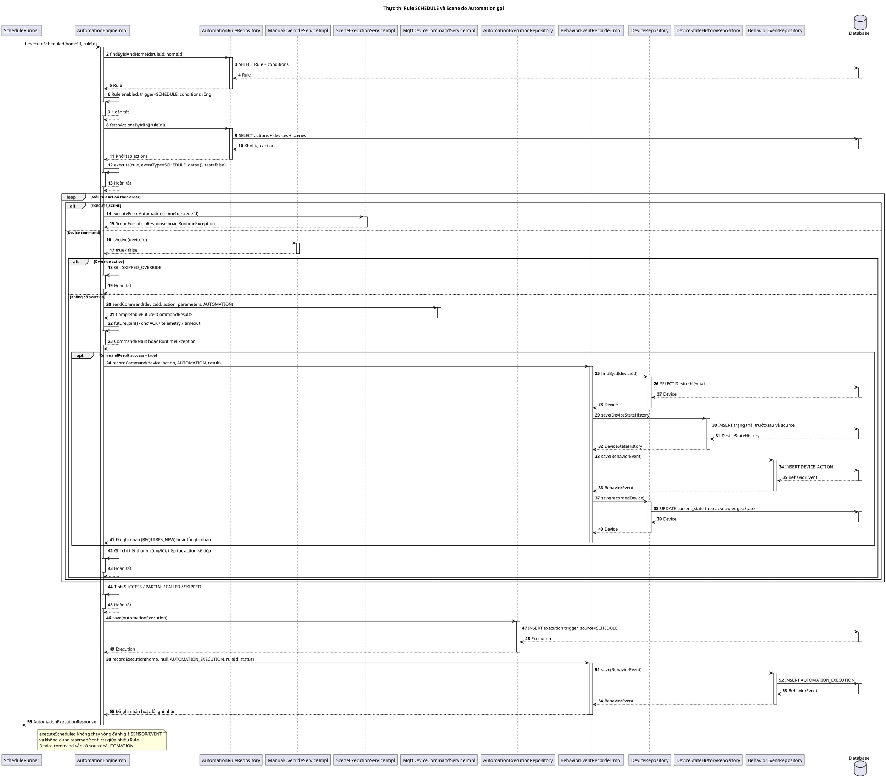
```plantuml
@startuml Automation_Scheduled_Execution
title Thực thi Rule SCHEDULE và Scene do Automation gọi
skinparam backgroundColor white
skinparam shadowing false
skinparam roundcorner 0
skinparam defaultFontName Arial

autonumber
participant "ScheduleRunner" as Runner
participant "AutomationEngineImpl" as Engine
participant "AutomationRuleRepository" as RuleRepo
participant "ManualOverrideServiceImpl" as Override
participant "SceneExecutionServiceImpl" as SceneExecution
participant "MqttDeviceCommandServiceImpl" as Command
participant "AutomationExecutionRepository" as ExecutionRepo
participant "BehaviorEventRecorderImpl" as Recorder
participant "DeviceRepository" as DeviceRepo
participant "DeviceStateHistoryRepository" as HistoryRepo
participant "BehaviorEventRepository" as EventRepo
database "Database" as DB
Runner -> Engine: executeScheduled(homeId, ruleId)
activate Engine
Engine -> RuleRepo: findByIdAndHomeId(ruleId, homeId)
activate RuleRepo
RuleRepo -> DB: SELECT Rule + conditions
activate DB
DB --> RuleRepo: Rule
deactivate DB
RuleRepo --> Engine: Rule
deactivate RuleRepo
Engine -> Engine: Rule enabled, trigger=SCHEDULE, conditions rỗng
activate Engine
Engine --> Engine: Hoàn tất
deactivate Engine
Engine -> RuleRepo: fetchActionsByIdIn([ruleId])
activate RuleRepo
RuleRepo -> DB: SELECT actions + devices + scenes
activate DB
DB --> RuleRepo: Khởi tạo actions
deactivate DB
RuleRepo --> Engine: Khởi tạo actions
deactivate RuleRepo
Engine -> Engine: execute(rule, eventType=SCHEDULE, data={}, test=false)
activate Engine
Engine --> Engine: Hoàn tất
deactivate Engine
loop Mỗi RuleAction theo order
alt EXECUTE_SCENE
Engine -> SceneExecution: executeFromAutomation(homeId, sceneId)
activate SceneExecution
SceneExecution --> Engine: SceneExecutionResponse hoặc RuntimeException
deactivate SceneExecution
else Device command
Engine -> Override: isActive(deviceId)
activate Override
Override --> Engine: true / false
deactivate Override
alt Override active
Engine -> Engine: Ghi SKIPPED_OVERRIDE
activate Engine
Engine --> Engine: Hoàn tất
deactivate Engine
else Không có override
Engine -> Command: sendCommand(deviceId, action, parameters, AUTOMATION)
activate Command
Command --> Engine: CompletableFuture<CommandResult>
deactivate Command
Engine -> Engine: future.join() - chờ ACK / telemetry / timeout
activate Engine
Engine --> Engine: CommandResult hoặc RuntimeException
deactivate Engine
opt CommandResult.success = true
Engine -> Recorder: recordCommand(device, action, AUTOMATION, result)
activate Recorder
Recorder -> DeviceRepo: findById(deviceId)
activate DeviceRepo
DeviceRepo -> DB: SELECT Device hiện tại
activate DB
DB --> DeviceRepo: Device
deactivate DB
DeviceRepo --> Recorder: Device
deactivate DeviceRepo
Recorder -> HistoryRepo: save(DeviceStateHistory)
activate HistoryRepo
HistoryRepo -> DB: INSERT trạng thái trước/sau và source
activate DB
DB --> HistoryRepo: DeviceStateHistory
deactivate DB
HistoryRepo --> Recorder: DeviceStateHistory
deactivate HistoryRepo
Recorder -> EventRepo: save(BehaviorEvent)
activate EventRepo
EventRepo -> DB: INSERT DEVICE_ACTION
activate DB
DB --> EventRepo: BehaviorEvent
deactivate DB
EventRepo --> Recorder: BehaviorEvent
deactivate EventRepo
Recorder -> DeviceRepo: save(recordedDevice)
activate DeviceRepo
DeviceRepo -> DB: UPDATE current_state theo acknowledgedState
activate DB
DB --> DeviceRepo: Device
deactivate DB
DeviceRepo --> Recorder: Device
deactivate DeviceRepo
Recorder --> Engine: Đã ghi nhận (REQUIRES_NEW) hoặc lỗi ghi nhận
deactivate Recorder
end
Engine -> Engine: Ghi chi tiết thành công/lỗi; tiếp tục action kế tiếp
activate Engine
Engine --> Engine: Hoàn tất
deactivate Engine
end
end
end
Engine -> Engine: Tính SUCCESS / PARTIAL / FAILED / SKIPPED
activate Engine
Engine --> Engine: Hoàn tất
deactivate Engine
Engine -> ExecutionRepo: save(AutomationExecution)
activate ExecutionRepo
ExecutionRepo -> DB: INSERT execution trigger_source=SCHEDULE
activate DB
DB --> ExecutionRepo: Execution
deactivate DB
ExecutionRepo --> Engine: Execution
deactivate ExecutionRepo
Engine -> Recorder: recordExecution(home, null, AUTOMATION_EXECUTION, ruleId, status)
activate Recorder
Recorder -> EventRepo: save(BehaviorEvent)
activate EventRepo
EventRepo -> DB: INSERT AUTOMATION_EXECUTION
activate DB
DB --> EventRepo: BehaviorEvent
deactivate DB
EventRepo --> Recorder: BehaviorEvent
deactivate EventRepo
Recorder --> Engine: Đã ghi nhận hoặc lỗi ghi nhận
deactivate Recorder
Engine --> Runner: AutomationExecutionResponse
deactivate Engine
note over Engine
executeScheduled không chạy vòng đánh giá SENSOR/EVENT
và không dùng reserved/conflicts giữa nhiều Rule.
Device command vẫn có source=AUTOMATION.
end note
@enduml
```

### 9.9. Chi tiết Scene thực thi từ Automation hoặc lịch

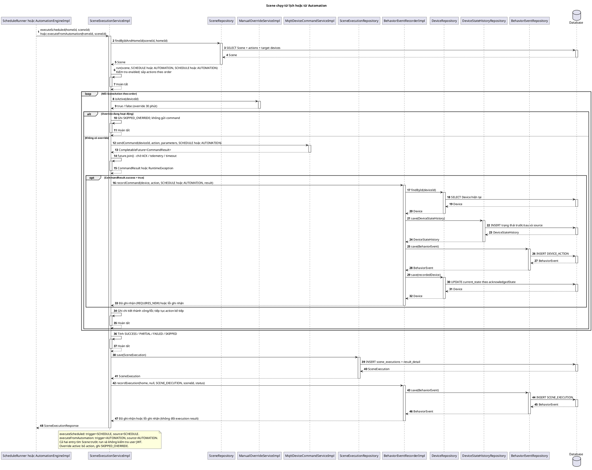
```plantuml
@startuml Scene_NonManual_Execution
title Scene chạy từ lịch hoặc từ Automation
skinparam backgroundColor white
skinparam shadowing false
skinparam roundcorner 0
skinparam defaultFontName Arial

autonumber
participant "ScheduleRunner hoặc AutomationEngineImpl" as Caller
participant "SceneExecutionServiceImpl" as Execution
participant "SceneRepository" as SceneRepo
participant "ManualOverrideServiceImpl" as Override
participant "MqttDeviceCommandServiceImpl" as Command
participant "SceneExecutionRepository" as ExecutionRepo
participant "BehaviorEventRecorderImpl" as Recorder
participant "DeviceRepository" as DeviceRepo
participant "DeviceStateHistoryRepository" as HistoryRepo
participant "BehaviorEventRepository" as EventRepo
database "Database" as DB
Caller -> Execution: executeScheduled(homeId, sceneId)\nhoặc executeFromAutomation(homeId, sceneId)
activate Execution
Execution -> SceneRepo: findByIdAndHomeId(sceneId, homeId)
activate SceneRepo
SceneRepo -> DB: SELECT Scene + actions + target devices
activate DB
DB --> SceneRepo: Scene
deactivate DB
SceneRepo --> Execution: Scene
deactivate SceneRepo
Execution -> Execution: run(scene, SCHEDULE hoặc AUTOMATION, SCHEDULE hoặc AUTOMATION)\nKiểm tra enabled; sắp actions theo order
activate Execution
Execution --> Execution: Hoàn tất
deactivate Execution
loop Mỗi SceneAction theo order
Execution -> Override: isActive(deviceId)
activate Override
Override --> Execution: true / false (override 30 phút)
deactivate Override
alt Override đang hoạt động
Execution -> Execution: Ghi SKIPPED_OVERRIDE; không gửi command
activate Execution
Execution --> Execution: Hoàn tất
deactivate Execution
else Không có override
Execution -> Command: sendCommand(deviceId, action, parameters, SCHEDULE hoặc AUTOMATION)
activate Command
Command --> Execution: CompletableFuture<CommandResult>
deactivate Command
Execution -> Execution: future.join() - chờ ACK / telemetry / timeout
activate Execution
Execution --> Execution: CommandResult hoặc RuntimeException
deactivate Execution
opt CommandResult.success = true
Execution -> Recorder: recordCommand(device, action, SCHEDULE hoặc AUTOMATION, result)
activate Recorder
Recorder -> DeviceRepo: findById(deviceId)
activate DeviceRepo
DeviceRepo -> DB: SELECT Device hiện tại
activate DB
DB --> DeviceRepo: Device
deactivate DB
DeviceRepo --> Recorder: Device
deactivate DeviceRepo
Recorder -> HistoryRepo: save(DeviceStateHistory)
activate HistoryRepo
HistoryRepo -> DB: INSERT trạng thái trước/sau và source
activate DB
DB --> HistoryRepo: DeviceStateHistory
deactivate DB
HistoryRepo --> Recorder: DeviceStateHistory
deactivate HistoryRepo
Recorder -> EventRepo: save(BehaviorEvent)
activate EventRepo
EventRepo -> DB: INSERT DEVICE_ACTION
activate DB
DB --> EventRepo: BehaviorEvent
deactivate DB
EventRepo --> Recorder: BehaviorEvent
deactivate EventRepo
Recorder -> DeviceRepo: save(recordedDevice)
activate DeviceRepo
DeviceRepo -> DB: UPDATE current_state theo acknowledgedState
activate DB
DB --> DeviceRepo: Device
deactivate DB
DeviceRepo --> Recorder: Device
deactivate DeviceRepo
Recorder --> Execution: Đã ghi nhận (REQUIRES_NEW) hoặc lỗi ghi nhận
deactivate Recorder
end
Execution -> Execution: Ghi chi tiết thành công/lỗi; tiếp tục action kế tiếp
activate Execution
Execution --> Execution: Hoàn tất
deactivate Execution
end
end
Execution -> Execution: Tính SUCCESS / PARTIAL / FAILED / SKIPPED
activate Execution
Execution --> Execution: Hoàn tất
deactivate Execution
Execution -> ExecutionRepo: save(SceneExecution)
activate ExecutionRepo
ExecutionRepo -> DB: INSERT scene_executions + result_detail
activate DB
DB --> ExecutionRepo: SceneExecution
deactivate DB
ExecutionRepo --> Execution: SceneExecution
deactivate ExecutionRepo
Execution -> Recorder: recordExecution(home, null, SCENE_EXECUTION, sceneId, status)
activate Recorder
Recorder -> EventRepo: save(BehaviorEvent)
activate EventRepo
EventRepo -> DB: INSERT SCENE_EXECUTION
activate DB
DB --> EventRepo: BehaviorEvent
deactivate DB
EventRepo --> Recorder: BehaviorEvent
deactivate EventRepo
Recorder --> Execution: Đã ghi nhận hoặc lỗi ghi nhận (không đổi execution result)
deactivate Recorder
Execution --> Caller: SceneExecutionResponse
deactivate Execution
note over Execution
executeScheduled: trigger=SCHEDULE, source=SCHEDULE.
executeFromAutomation: trigger=AUTOMATION, source=AUTOMATION.
Cả hai entry tìm Scene trước run và không kiểm tra user JWT.
Override active: bỏ action, ghi SKIPPED_OVERRIDE.
end note
@enduml
```

### 9.10. Sinh dataset Behavior

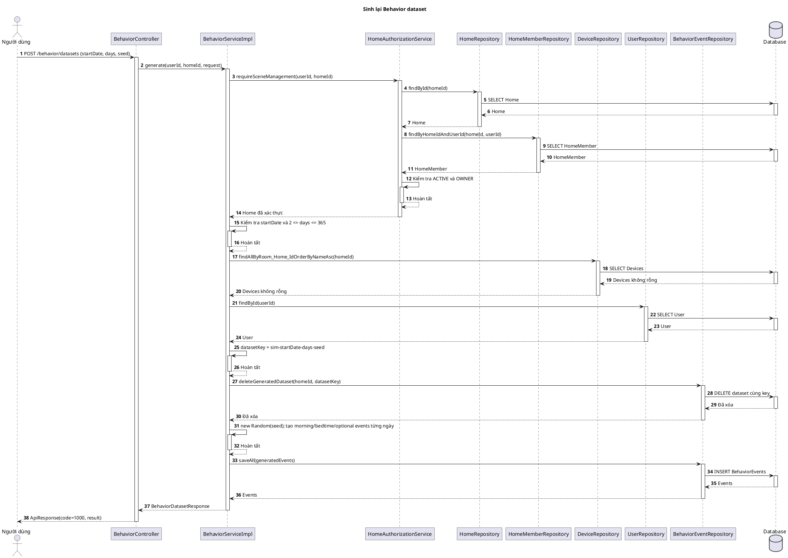
```plantuml
@startuml Behavior_Dataset_Generation
title Sinh lại Behavior dataset
skinparam backgroundColor white
skinparam shadowing false
skinparam roundcorner 0
skinparam defaultFontName Arial

autonumber
actor "Người dùng" as Client
participant "BehaviorController" as Controller
participant "BehaviorServiceImpl" as Service
participant "HomeAuthorizationService" as Auth
participant "HomeRepository" as HomeRepo
participant "HomeMemberRepository" as MemberRepo
participant "DeviceRepository" as DeviceRepo
participant "UserRepository" as UserRepo
participant "BehaviorEventRepository" as EventRepo
database "Database" as DB
Client -> Controller: POST /behavior/datasets {startDate, days, seed}
activate Controller
Controller -> Service: generate(userId, homeId, request)
activate Service
Service -> Auth: requireSceneManagement(userId, homeId)
activate Auth
Auth -> HomeRepo: findById(homeId)
activate HomeRepo
HomeRepo -> DB: SELECT Home
activate DB
DB --> HomeRepo: Home
deactivate DB
HomeRepo --> Auth: Home
deactivate HomeRepo
Auth -> MemberRepo: findByHomeIdAndUserId(homeId, userId)
activate MemberRepo
MemberRepo -> DB: SELECT HomeMember
activate DB
DB --> MemberRepo: HomeMember
deactivate DB
MemberRepo --> Auth: HomeMember
deactivate MemberRepo
Auth -> Auth: Kiểm tra ACTIVE và OWNER
activate Auth
Auth --> Auth: Hoàn tất
deactivate Auth
Auth --> Service: Home đã xác thực
deactivate Auth
Service -> Service: Kiểm tra startDate và 2 <= days <= 365
activate Service
Service --> Service: Hoàn tất
deactivate Service
Service -> DeviceRepo: findAllByRoom_Home_IdOrderByNameAsc(homeId)
activate DeviceRepo
DeviceRepo -> DB: SELECT Devices
activate DB
DB --> DeviceRepo: Devices không rỗng
deactivate DB
DeviceRepo --> Service: Devices không rỗng
deactivate DeviceRepo
Service -> UserRepo: findById(userId)
activate UserRepo
UserRepo -> DB: SELECT User
activate DB
DB --> UserRepo: User
deactivate DB
UserRepo --> Service: User
deactivate UserRepo
Service -> Service: datasetKey = sim-startDate-days-seed
activate Service
Service --> Service: Hoàn tất
deactivate Service
Service -> EventRepo: deleteGeneratedDataset(homeId, datasetKey)
activate EventRepo
EventRepo -> DB: DELETE dataset cùng key
activate DB
DB --> EventRepo: Đã xóa
deactivate DB
EventRepo --> Service: Đã xóa
deactivate EventRepo
Service -> Service: new Random(seed); tạo morning/bedtime/optional events từng ngày
activate Service
Service --> Service: Hoàn tất
deactivate Service
Service -> EventRepo: saveAll(generatedEvents)
activate EventRepo
EventRepo -> DB: INSERT BehaviorEvents
activate DB
DB --> EventRepo: Events
deactivate DB
EventRepo --> Service: Events
deactivate EventRepo
Service --> Controller: BehaviorDatasetResponse
deactivate Service
Controller --> Client: ApiResponse(code=1000, result)
deactivate Controller
@enduml
```

### 9.11. Phát hiện Pattern

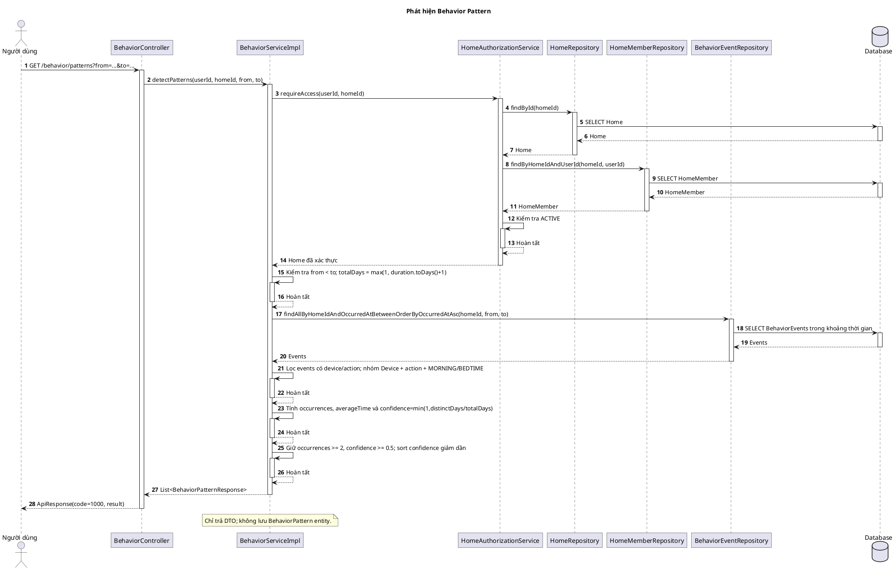
```plantuml
@startuml Behavior_Pattern_Detection
title Phát hiện Behavior Pattern
skinparam backgroundColor white
skinparam shadowing false
skinparam roundcorner 0
skinparam defaultFontName Arial

autonumber
actor "Người dùng" as Client
participant "BehaviorController" as Controller
participant "BehaviorServiceImpl" as Service
participant "HomeAuthorizationService" as Auth
participant "HomeRepository" as HomeRepo
participant "HomeMemberRepository" as MemberRepo
participant "BehaviorEventRepository" as EventRepo
database "Database" as DB
Client -> Controller: GET /behavior/patterns?from=...&to=...
activate Controller
Controller -> Service: detectPatterns(userId, homeId, from, to)
activate Service
Service -> Auth: requireAccess(userId, homeId)
activate Auth
Auth -> HomeRepo: findById(homeId)
activate HomeRepo
HomeRepo -> DB: SELECT Home
activate DB
DB --> HomeRepo: Home
deactivate DB
HomeRepo --> Auth: Home
deactivate HomeRepo
Auth -> MemberRepo: findByHomeIdAndUserId(homeId, userId)
activate MemberRepo
MemberRepo -> DB: SELECT HomeMember
activate DB
DB --> MemberRepo: HomeMember
deactivate DB
MemberRepo --> Auth: HomeMember
deactivate MemberRepo
Auth -> Auth: Kiểm tra ACTIVE
activate Auth
Auth --> Auth: Hoàn tất
deactivate Auth
Auth --> Service: Home đã xác thực
deactivate Auth
Service -> Service: Kiểm tra from < to; totalDays = max(1, duration.toDays()+1)
activate Service
Service --> Service: Hoàn tất
deactivate Service
Service -> EventRepo: findAllByHomeIdAndOccurredAtBetweenOrderByOccurredAtAsc(homeId, from, to)
activate EventRepo
EventRepo -> DB: SELECT BehaviorEvents trong khoảng thời gian
activate DB
DB --> EventRepo: Events
deactivate DB
EventRepo --> Service: Events
deactivate EventRepo
Service -> Service: Lọc events có device/action; nhóm Device + action + MORNING/BEDTIME
activate Service
Service --> Service: Hoàn tất
deactivate Service
Service -> Service: Tính occurrences, averageTime và confidence=min(1,distinctDays/totalDays)
activate Service
Service --> Service: Hoàn tất
deactivate Service
Service -> Service: Giữ occurrences >= 2, confidence >= 0.5; sort confidence giảm dần
activate Service
Service --> Service: Hoàn tất
deactivate Service
Service --> Controller: List<BehaviorPatternResponse>
deactivate Service
Controller --> Client: ApiResponse(code=1000, result)
deactivate Controller
note over Service
Chỉ trả DTO; không lưu BehaviorPattern entity.
end note
@enduml
```
