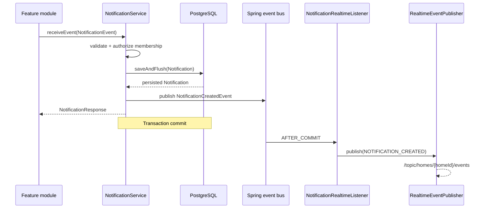

# Notification Core Backend

## 1. Mục tiêu

Notification Core là điểm dùng chung để các module Backend của HESTA tạo và quản lý thông báo.
Các module như Sensor, Device, Automation, Security, Maintenance hoặc AI chỉ gửi
`NotificationEvent` vào `NotificationService`; chúng không được tự lưu bảng `notifications` hoặc
tự publish WebSocket.

```mermaid
flowchart LR
    A[Feature module] --> B[NotificationService]
    B --> C[(notifications)]
    B --> D[NotificationCreatedEvent]
    D -->|AFTER_COMMIT| E[RealtimeEventPublisher]
    E --> F[/topic/homes/{homeId}/events]
```

Phạm vi hiện tại gồm:

- Tạo thông báo từ contract nội bộ.
- Lưu thông báo vào PostgreSQL.
- Danh sách có phân trang và bộ lọc.
- Xem chi tiết, đánh dấu một hoặc tất cả thông báo là đã đọc.
- Phân quyền theo người nhận và thành viên nhà.
- Publish `NOTIFICATION_CREATED` sau khi transaction commit.
- Baseline preference trên bảng `user_preferences`.

Không thuộc phạm vi: email, SMS, mobile push, lịch gửi, hàng đợi message hoặc WebSocket riêng cho
Notification.

## 2. Thành phần chính

| Thành phần | Vai trò |
|---|---|
| `Notification` | JPA entity ánh xạ bảng `notifications`. |
| `NotificationPreference` | Value object được nhúng trong `UserPreference`. |
| `NotificationEvent` | Input contract dành cho các module Backend. |
| `NotificationService` | Entry point dùng chung cho create/list/get/read/read-all. |
| `NotificationRepository` | Truy vấn persistence và cập nhật read-all có scope. |
| `NotificationController` | REST API dành cho người dùng đã xác thực. |
| `NotificationCreatedEvent` | Internal event được phát trong transaction sau khi lưu. |
| `NotificationRealtimeListener` | Chuyển internal event thành realtime event sau commit. |
| `NotificationRealtimePayload` | Payload an toàn trên home topic dùng chung. |

Các file quan trọng:

```text
src/main/java/com/hesta/backend/
├── controller/NotificationController.java
├── dto/command/
│   ├── NotificationEvent.java
│   └── NotificationCreatedEvent.java
├── dto/response/
│   ├── NotificationResponse.java
│   ├── NotificationRealtimePayload.java
│   ├── NotificationReadAllResponse.java
│   └── PageResponse.java
├── entity/
│   ├── Notification.java
│   └── NotificationPreference.java
├── repository/NotificationRepository.java
├── service/NotificationService.java
├── service/impl/NotificationServiceImpl.java
└── realtime/publisher/NotificationRealtimeListener.java
```

## 3. Mô hình dữ liệu

### 3.1 Notification

Entity sử dụng bảng `notifications` đã tồn tại trong thiết kế database của HESTA.

| Java | Database | Quy tắc |
|---|---|---|
| `id` | `id` | UUID primary key. |
| `recipient` | `recipient_id` | Bắt buộc, foreign key đến `users`. |
| `home` | `home_id` | Có thể null theo schema gốc. |
| `type` | `type` | `NotificationType`, lưu bằng chuỗi. |
| `title` | `title` | Bắt buộc, tối đa 150 ký tự. |
| `message` | `message` | Bắt buộc. |
| `priority` | `priority_level` | `NotificationPriority`, mặc định database là `MEDIUM`. |
| `read` | `is_read` | Thông báo mới luôn là `false`. |
| `createdAt` | `created_at` | Thời điểm tạo. |

Thiết kế database hiện tại dùng `priority_level`, không dùng cột `severity` cho Notification. Vì
vậy Notification Core tiếp tục sử dụng `NotificationPriority` để không tạo schema hoặc API contract
mâu thuẫn với HESTA DB Design.

Các loại hiện có:

```text
SECURITY, AUTOMATION, ANOMALY, SYSTEM, DEVICE
```

Các mức ưu tiên hiện có:

```text
HIGH, MEDIUM, LOW
```

Khi thêm type hoặc priority mới, phải cập nhật đồng thời Java enum và tạo một migration Supabase
forward-only để mở rộng check constraint. Không sửa migration đã được áp dụng.

### 3.2 NotificationPreference

Preference không tạo bảng mới. `NotificationPreference` được nhúng vào `UserPreference` và ánh xạ
ba cột đã có trong `user_preferences`:

| Trường | Cột | Mặc định |
|---|---|---|
| `securityEnabled` | `notify_security` | `true` |
| `automationEnabled` | `notify_automation` | `true` |
| `systemEnabled` | `notify_system` | `true` |

Theo BR-NOT-03, security notification luôn bật. Migration bổ sung database constraint
`notify_security = true`. Preference baseline hiện chỉ chuẩn bị persistence cho việc lọc trong tương
lai; Notification Core chưa bỏ qua notification dựa trên `notify_automation` hoặc `notify_system`.

## 4. Contract dành cho module Backend

Các module khác inject `NotificationService`, không inject `NotificationRepository`.

Ví dụ tạo thông báo:

```java
notificationService.receiveEvent(new NotificationEvent(
        recipientUserId,
        homeId,
        NotificationType.SECURITY,
        "Cảnh báo an ninh",
        "Phát hiện chuyển động tại cửa chính",
        NotificationPriority.HIGH
));
```

`NotificationEvent` gồm:

```java
UUID userId;
UUID homeId;
NotificationType type;
String title;
String message;
NotificationPriority priority;
```

Contract tạo thông báo hiện yêu cầu cả `userId` và `homeId` vì realtime infrastructure đang route
theo home. Service kiểm tra:

1. Event và toàn bộ trường bắt buộc hợp lệ.
2. `title` không rỗng và không dài hơn 150 ký tự.
3. User tồn tại.
4. Home tồn tại.
5. User là `ACTIVE` member của home.

`create(event)` và `receiveEvent(event)` cùng sử dụng một luồng nghiệp vụ. `receiveEvent` là tên nên
dùng khi một feature module phản ứng với sự kiện nghiệp vụ; `create` phù hợp khi module chủ động tạo
notification trực tiếp.

## 5. Luồng tạo và realtime sau commit



`NotificationRealtimeListener` dùng:

```java
@TransactionalEventListener(phase = TransactionPhase.AFTER_COMMIT)
```

Vì vậy:

- Transaction commit thành công: realtime event được publish.
- Lưu hoặc commit thất bại: realtime event không được publish.
- Lỗi realtime sau commit không làm rollback notification đã được lưu.

Notification Core chỉ gọi `RealtimeEventPublisher`. `SimpMessagingTemplate` vẫn chỉ nằm trong shared
WebSocket transport hiện có.

## 6. Realtime payload và bảo mật

Destination hiện tại là home-scoped:

```text
/topic/homes/{homeId}/events
```

Mọi thành viên active trong home có thể subscribe topic này, trong khi một Notification thuộc về một
recipient cụ thể. Vì vậy payload `NOTIFICATION_CREATED` không broadcast `title` hoặc `message`.

Payload gồm:

```json
{
  "notificationId": "667111e8-e00d-4d75-894d-dd02db1ae2a3",
  "recipientId": "ef1257d5-d920-434c-9c60-b61367169de7",
  "homeId": "6a5edcf2-13ad-4e17-bf41-028434cbdc31",
  "isRead": false,
  "createdAt": "2026-09-16T20:00:00+07:00"
}
```

Client nên xử lý theo thứ tự:

1. Nhận `RealtimeEvent` có `type = NOTIFICATION_CREATED`.
2. Bỏ qua nếu `recipientId` không phải user hiện tại.
3. Nếu khớp, gọi API lấy notification hoặc refresh danh sách.

Kiểm tra `recipientId` ở client chỉ là tối ưu UI, không phải authorization. REST API vẫn kiểm tra
recipient bằng identity từ JWT.

## 7. REST API

Tất cả endpoint đều yêu cầu Bearer JWT. Response giữ contract chung:

```json
{
  "code": 1000,
  "message": "optional message",
  "result": {}
}
```

### 7.1 Danh sách notification

```http
GET /api/v1/notifications
```

Query parameters:

| Tên | Bắt buộc | Mô tả |
|---|---|---|
| `homeId` | Không | Chỉ lấy notification của một home. |
| `isRead` | Không | `true` hoặc `false`. |
| `type` | Không | Giá trị `NotificationType`. |
| `priority` | Không | Giá trị `NotificationPriority`. |
| `page` | Không | Mặc định `0`, số âm được đưa về `0`. |
| `size` | Không | Mặc định `20`, giới hạn tối đa `100`. |

Thứ tự cố định là `createdAt DESC, id DESC`.

Ví dụ:

```http
GET /api/v1/notifications?homeId=6a5edcf2-13ad-4e17-bf41-028434cbdc31&isRead=false&page=0&size=20
Authorization: Bearer <access-token>
```

Response:

```json
{
  "code": 1000,
  "result": {
    "content": [
      {
        "id": "667111e8-e00d-4d75-894d-dd02db1ae2a3",
        "userId": "ef1257d5-d920-434c-9c60-b61367169de7",
        "homeId": "6a5edcf2-13ad-4e17-bf41-028434cbdc31",
        "type": "SECURITY",
        "title": "Cảnh báo an ninh",
        "message": "Phát hiện chuyển động tại cửa chính",
        "priority": "HIGH",
        "isRead": false,
        "createdAt": "2026-09-16T20:00:00+07:00"
      }
    ],
    "page": 0,
    "size": 20,
    "totalElements": 1,
    "totalPages": 1,
    "last": true
  }
}
```

### 7.2 Xem chi tiết

```http
GET /api/v1/notifications/{notificationId}
```

Chỉ recipient của notification có thể truy cập. ID không tồn tại hoặc thuộc user khác đều trả về
`NOTIFICATION_NOT_FOUND`, tránh lộ sự tồn tại của dữ liệu người khác.

### 7.3 Đánh dấu một notification đã đọc

```http
PATCH /api/v1/notifications/{notificationId}/read
```

Thao tác idempotent:

```text
false -> true
true  -> true
```

### 7.4 Đánh dấu tất cả đã đọc

```http
PATCH /api/v1/notifications/read-all
PATCH /api/v1/notifications/read-all?homeId={homeId}
```

- Không có `homeId`: cập nhật notification chưa đọc của current user trên tất cả home.
- Có `homeId`: chỉ cập nhật notification của current user trong home đó.
- Không bao giờ cập nhật notification của user khác.

Response:

```json
{
  "code": 1000,
  "message": "Đã đánh dấu tất cả thông báo là đã đọc",
  "result": {
    "updatedCount": 4
  }
}
```

Không có REST endpoint public để tạo notification. Việc tạo thuộc về Backend module thông qua
`NotificationService`.

## 8. Error contract

Notification Core sử dụng `AppException`, `ErrorCode` và `GlobalExceptionHandler` hiện có.

| ErrorCode | HTTP | Khi xảy ra |
|---|---:|---|
| `NOTIFICATION_NOT_FOUND` | 404 | Notification không tồn tại hoặc không thuộc current user. |
| `NOTIFICATION_EVENT_INVALID` | 400 | Internal event thiếu hoặc sai dữ liệu bắt buộc. |
| `USER_NOT_FOUND` | 404 | Recipient của internal event không tồn tại. |
| `UNAUTHORIZED` | 403 | Recipient không phải active member của home. |

## 9. Migration

Migration của Notification Core:

```text
supabase/migrations/20260916120000_harden_notification_core.sql
```

Migration này:

- Thêm check constraint cho `notifications.type`.
- Thêm check constraint cho `notifications.priority_level`.
- Thêm partial index cho inbox chưa đọc theo recipient và thời gian.
- Thêm index cho truy vấn recipient + home + thời gian.
- Khóa `user_preferences.notify_security` ở `true` theo BR-NOT-03.

Không dùng Flyway và không chỉnh sửa migration lịch sử. Kiểm tra migration trên local stack:

```powershell
npx supabase status
npx supabase db reset
```

Không chạy `supabase db push` lên Cloud nếu không phải release owner.

## 10. Kiểm thử

Các nhóm test:

| Test | Phạm vi |
|---|---|
| `NotificationServiceTest` | Validation, persistence call, list/get, read/read-all, ownership và active membership. |
| `NotificationControllerTest` | REST contract, authenticated identity và error envelope. |
| `NotificationPreferenceTest` | Giá trị mặc định của preference baseline. |
| `NotificationRealtimeListenerTest` | Event type, home routing, payload và annotation `AFTER_COMMIT`. |
| `NotificationRealtimeTransactionTest` | Commit có publish; rollback không publish. |

Chạy test Notification Core:

```powershell
mvn "-Dtest=NotificationServiceTest,NotificationControllerTest,NotificationPreferenceTest,NotificationRealtimeListenerTest,NotificationRealtimeTransactionTest" test
```

Chạy toàn bộ test không phụ thuộc MQTT broker:

```powershell
mvn "-Dtest=!MqttSmokeTest" test
```

`MqttSmokeTest` yêu cầu một MQTT broker đang lắng nghe tại cấu hình `MQTT_BROKER_URL`.

## 11. Quy tắc mở rộng

Khi một module mới cần gửi notification:

1. Inject `NotificationService`.
2. Tạo `NotificationEvent` bằng ID từ business context đáng tin cậy.
3. Không nhận `userId` tùy ý từ public request rồi chuyển thẳng vào event.
4. Không gọi `NotificationRepository` từ feature module.
5. Không dùng `SimpMessagingTemplate` hoặc tạo destination mới.
6. Nếu thêm enum value, cập nhật Java enum, migration constraint và test.
7. Nếu notification chứa nội dung riêng tư, giữ nội dung trong REST response; không mở rộng home-topic
   payload để broadcast nội dung đó.

## 12. Giới hạn hiện tại

- Preference đã có persistence baseline nhưng chưa tham gia filtering khi tạo notification.
- Internal creation hiện tạo một notification cho một recipient; chưa có helper broadcast một lần cho
  toàn bộ thành viên của home.
- Realtime chỉ gửi tín hiệu metadata; client phải gọi REST để lấy nội dung đầy đủ.
- Không có email, SMS, mobile push, scheduling hoặc retention job trong Notification Core.
- Shared STOMP broker vẫn là in-memory và phù hợp với một backend instance; xem thêm
  [REALTIME.md](REALTIME.md).
