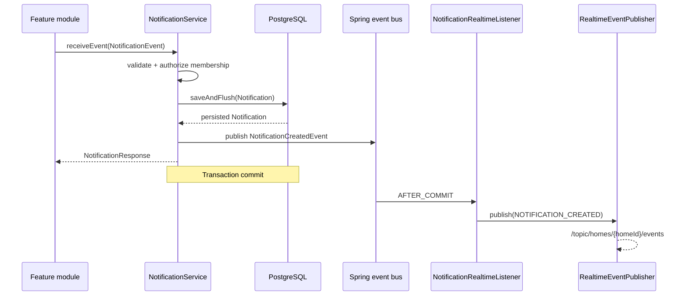

# Lõi thông báo phía backend

## 1. Mục tiêu

Lõi thông báo (Notification Core) là thành phần dùng chung để các mô-đun
backend của HESTA tạo và quản lý thông báo. Các mô-đun như cảm biến, thiết
bị, tự động hóa, bảo mật, bảo trì hoặc AI chỉ gửi `NotificationEvent` vào
`NotificationService`; chúng không được tự lưu vào bảng `notifications`
hoặc tự phát sự kiện WebSocket.

```mermaid
flowchart LR
    A[Feature module] --> B[NotificationService]
    B --> C[(notifications)]
    B --> D[NotificationCreatedEvent]
    D -->|AFTER_COMMIT| E[RealtimeEventPublisher]
    E --> F[/topic/homes/{homeId}/events]
```

Phạm vi hiện tại gồm:

- Tạo thông báo từ đặc tả nội bộ.
- Lưu thông báo vào PostgreSQL.
- Danh sách có phân trang và bộ lọc.
- Xem chi tiết, đánh dấu một hoặc tất cả thông báo là đã đọc.
- Phân quyền theo người nhận và thành viên nhà.
- Phát `NOTIFICATION_CREATED` sau khi giao dịch được xác nhận.
- Thiết lập tùy chọn cơ bản trên bảng `user_preferences`.

Không thuộc phạm vi: email, SMS, thông báo đẩy di động, lịch gửi, hàng đợi
thông điệp hoặc WebSocket riêng cho thông báo.

## 2. Thành phần chính

| Thành phần | Vai trò |
|---|---|
| `Notification` | Thực thể JPA ánh xạ bảng `notifications`. |
| `NotificationPreference` | Đối tượng giá trị được nhúng trong `UserPreference`. |
| `NotificationEvent` | Đặc tả đầu vào dành cho các mô-đun backend. |
| `NotificationService` | Điểm tiếp nhận dùng chung cho tạo/liệt kê/xem/đánh dấu đã đọc/đánh dấu tất cả đã đọc. |
| `NotificationRepository` | Truy vấn dữ liệu và cập nhật tất cả thành đã đọc trong phạm vi xác định. |
| `NotificationController` | REST API dành cho người dùng đã xác thực. |
| `NotificationCreatedEvent` | Sự kiện nội bộ được phát trong giao dịch sau khi lưu. |
| `NotificationRealtimeListener` | Chuyển sự kiện nội bộ thành sự kiện thời gian thực sau khi xác nhận giao dịch. |
| `NotificationRealtimePayload` | Dữ liệu an toàn trên topic dùng chung của nhà. |

Các tệp quan trọng:

```text
src/main/java/com/hesta/backend/
├── controller/NotificationController.java
├── dto/command/
│   ├── NotificationEvent.java
│   └── NotificationCreatedEvent.java
├── dto/response/
│   ├── NotificationResponse.java
│   ├── NotificationRealtimePayload.java
│   ├── NotificationReadAllResponse.java
│   └── PageResponse.java
├── entity/
│   ├── Notification.java
│   └── NotificationPreference.java
├── repository/NotificationRepository.java
├── service/NotificationService.java
├── service/impl/NotificationServiceImpl.java
└── realtime/publisher/NotificationRealtimeListener.java
```

## 3. Mô hình dữ liệu

### 3.1 Notification

Thực thể sử dụng bảng `notifications` đã tồn tại trong thiết kế cơ sở dữ
liệu của HESTA.

| Java | Cơ sở dữ liệu | Quy tắc |
|---|---|---|
| `id` | `id` | Khóa chính UUID. |
| `recipient` | `recipient_id` | Bắt buộc, khóa ngoại đến `users`. |
| `home` | `home_id` | Có thể null theo lược đồ gốc. |
| `type` | `type` | `NotificationType`, lưu bằng chuỗi. |
| `title` | `title` | Bắt buộc, tối đa 150 ký tự. |
| `message` | `message` | Bắt buộc. |
| `priority` | `priority_level` | `NotificationPriority`, mặc định trong cơ sở dữ liệu là `MEDIUM`. |
| `read` | `is_read` | Thông báo mới luôn là `false`. |
| `createdAt` | `created_at` | Thời điểm tạo. |

Thiết kế cơ sở dữ liệu hiện tại dùng `priority_level`, không dùng cột
`severity` cho thông báo. Vì vậy lõi thông báo tiếp tục sử dụng
`NotificationPriority` để không tạo lược đồ hoặc đặc tả API mâu thuẫn với
tài liệu thiết kế cơ sở dữ liệu HESTA.

Các loại hiện có:

```text
SECURITY, AUTOMATION, ANOMALY, SYSTEM, DEVICE
```

Các mức ưu tiên hiện có:

```text
HIGH, MEDIUM, LOW
```

Khi thêm loại hoặc mức ưu tiên mới, phải cập nhật đồng thời enum Java và
tạo một migration Supabase mới theo hướng tiến để mở rộng ràng buộc kiểm
tra. Không sửa migration đã được áp dụng.

### 3.2 NotificationPreference

Tùy chọn thông báo không tạo bảng mới. `NotificationPreference` được
nhúng vào `UserPreference` và ánh xạ ba cột đã có trong `user_preferences`:

| Trường | Cột | Mặc định |
|---|---|---|
| `securityEnabled` | `notify_security` | `true` |
| `automationEnabled` | `notify_automation` | `true` |
| `systemEnabled` | `notify_system` | `true` |

Theo BR-NOT-03, thông báo bảo mật luôn bật. Migration bổ sung ràng buộc cơ
sở dữ liệu `notify_security = true`. Phần tùy chọn cơ bản hiện chỉ chuẩn
bị lưu trữ cho việc lọc sau này; lõi thông báo chưa bỏ qua thông báo dựa
trên `notify_automation` hoặc `notify_system`.

## 4. Đặc tả dành cho mô-đun backend

Các mô-đun khác tiêm `NotificationService`, không tiêm `NotificationRepository`.

Ví dụ tạo thông báo:

```java
notificationService.receiveEvent(new NotificationEvent(
        recipientUserId,
        homeId,
        NotificationType.SECURITY,
        "Cảnh báo an ninh",
        "Phát hiện chuyển động tại cửa chính",
        NotificationPriority.HIGH
));
```

`NotificationEvent` gồm:

```java
UUID userId;
UUID homeId;
NotificationType type;
String title;
String message;
NotificationPriority priority;
```

Đặc tả tạo thông báo hiện yêu cầu cả `userId` và `homeId` vì hạ tầng thời
gian thực đang định tuyến theo nhà. Dịch vụ kiểm tra:

1. Sự kiện và toàn bộ trường bắt buộc hợp lệ.
2. `title` không rỗng và không dài hơn 150 ký tự.
3. Người dùng tồn tại.
4. Nhà tồn tại.
5. Người dùng là thành viên ở trạng thái `ACTIVE` của nhà.

`create(event)` và `receiveEvent(event)` cùng sử dụng một luồng nghiệp vụ.
Nên dùng `receiveEvent` khi mô-đun chức năng phản ứng với sự kiện nghiệp
vụ; `create` phù hợp khi mô-đun chủ động tạo thông báo trực tiếp.

## 5. Luồng tạo và phát sự kiện thời gian thực sau khi xác nhận giao dịch



`NotificationRealtimeListener` dùng:

```java
@TransactionalEventListener(phase = TransactionPhase.AFTER_COMMIT)
```

Vì vậy:

- Giao dịch được xác nhận thành công: sự kiện thời gian thực được phát.
- Lưu hoặc xác nhận giao dịch thất bại: không phát sự kiện thời gian thực.
- Lỗi thời gian thực sau khi xác nhận giao dịch không hoàn tác thông báo đã lưu.

Lõi thông báo chỉ gọi `RealtimeEventPublisher`. `SimpMessagingTemplate`
vẫn chỉ nằm trong kênh truyền WebSocket dùng chung hiện có.

## 6. Dữ liệu thời gian thực và bảo mật

Đích nhận hiện tại được giới hạn theo nhà:

```text
/topic/homes/{homeId}/events
```

Mọi thành viên đang hoạt động trong nhà có thể đăng ký topic này, trong
khi một thông báo thuộc về một người nhận cụ thể. Vì vậy dữ liệu
`NOTIFICATION_CREATED` không phát rộng rãi `title` hoặc `message`.

Phần dữ liệu gồm:

```json
{
  "notificationId": "667111e8-e00d-4d75-894d-dd02db1ae2a3",
  "recipientId": "ef1257d5-d920-434c-9c60-b61367169de7",
  "homeId": "6a5edcf2-13ad-4e17-bf41-028434cbdc31",
  "isRead": false,
  "createdAt": "2026-09-16T20:00:00+07:00"
}
```

Ứng dụng khách nên xử lý theo thứ tự:

1. Nhận `RealtimeEvent` có `type = NOTIFICATION_CREATED`.
2. Bỏ qua nếu `recipientId` không phải người dùng hiện tại.
3. Nếu khớp, gọi API lấy thông báo hoặc tải lại danh sách.

Kiểm tra `recipientId` ở ứng dụng khách chỉ là tối ưu giao diện, không
phải phân quyền. REST API vẫn kiểm tra người nhận bằng danh tính từ JWT.

## 7. REST API

Tất cả điểm cuối đều yêu cầu Bearer JWT. Phản hồi giữ đặc tả chung:

```json
{
  "code": 1000,
  "message": "optional message",
  "result": {}
}
```

### 7.1 Danh sách thông báo

```http
GET /api/v1/notifications
```

Tham số truy vấn:

| Tên | Bắt buộc | Mô tả |
|---|---|---|
| `homeId` | Không | Chỉ lấy thông báo của một nhà. |
| `isRead` | Không | `true` hoặc `false`. |
| `type` | Không | Giá trị `NotificationType`. |
| `priority` | Không | Giá trị `NotificationPriority`. |
| `page` | Không | Mặc định `0`, số âm được đưa về `0`. |
| `size` | Không | Mặc định `20`, giới hạn tối đa `100`. |

Thứ tự cố định là `createdAt DESC, id DESC`.

Ví dụ:

```http
GET /api/v1/notifications?homeId=6a5edcf2-13ad-4e17-bf41-028434cbdc31&isRead=false&page=0&size=20
Authorization: Bearer <access-token>
```

Phản hồi:

```json
{
  "code": 1000,
  "result": {
    "content": [
      {
        "id": "667111e8-e00d-4d75-894d-dd02db1ae2a3",
        "userId": "ef1257d5-d920-434c-9c60-b61367169de7",
        "homeId": "6a5edcf2-13ad-4e17-bf41-028434cbdc31",
        "type": "SECURITY",
        "title": "Cảnh báo an ninh",
        "message": "Phát hiện chuyển động tại cửa chính",
        "priority": "HIGH",
        "isRead": false,
        "createdAt": "2026-09-16T20:00:00+07:00"
      }
    ],
    "page": 0,
    "size": 20,
    "totalElements": 1,
    "totalPages": 1,
    "last": true
  }
}
```

### 7.2 Xem chi tiết

```http
GET /api/v1/notifications/{notificationId}
```

Chỉ người nhận thông báo mới có thể truy cập. ID không tồn tại hoặc thuộc
người dùng khác đều trả về `NOTIFICATION_NOT_FOUND`, tránh lộ sự tồn tại
của dữ liệu người khác.

### 7.3 Đánh dấu một thông báo đã đọc

```http
PATCH /api/v1/notifications/{notificationId}/read
```

Thao tác có tính lũy đẳng: lặp lại không làm thay đổi kết quả cuối cùng.

```text
false -> true
true  -> true
```

### 7.4 Đánh dấu tất cả đã đọc

```http
PATCH /api/v1/notifications/read-all
PATCH /api/v1/notifications/read-all?homeId={homeId}
```

- Không có `homeId`: cập nhật thông báo chưa đọc của người dùng hiện tại
  trên tất cả nhà.
- Có `homeId`: chỉ cập nhật thông báo của người dùng hiện tại trong nhà đó.
- Không bao giờ cập nhật thông báo của người dùng khác.

Phản hồi:

```json
{
  "code": 1000,
  "message": "Đã đánh dấu tất cả thông báo là đã đọc",
  "result": {
    "updatedCount": 4
  }
}
```

Không có điểm cuối REST công khai để tạo thông báo. Việc tạo thuộc về
mô-đun backend thông qua `NotificationService`.

## 8. Đặc tả lỗi

Lõi thông báo sử dụng `AppException`, `ErrorCode` và
`GlobalExceptionHandler` hiện có.

| ErrorCode | HTTP | Khi xảy ra |
|---|---:|---|
| `NOTIFICATION_NOT_FOUND` | 404 | Thông báo không tồn tại hoặc không thuộc người dùng hiện tại. |
| `NOTIFICATION_EVENT_INVALID` | 400 | Sự kiện nội bộ thiếu hoặc sai dữ liệu bắt buộc. |
| `USER_NOT_FOUND` | 404 | Người nhận của sự kiện nội bộ không tồn tại. |
| `UNAUTHORIZED` | 403 | Người nhận không phải thành viên đang hoạt động của nhà. |

## 9. Migration cơ sở dữ liệu

Migration của lõi thông báo:

```text
supabase/migrations/20260916120000_harden_notification_core.sql
```

Migration này:

- Thêm ràng buộc kiểm tra cho `notifications.type`.
- Thêm ràng buộc kiểm tra cho `notifications.priority_level`.
- Thêm chỉ mục có điều kiện cho hộp thông báo chưa đọc theo người nhận và
  thời gian.
- Thêm chỉ mục cho truy vấn theo người nhận + nhà + thời gian.
- Khóa `user_preferences.notify_security` ở `true` theo BR-NOT-03.

Không dùng Flyway và không chỉnh sửa migration lịch sử. Kiểm tra migration
trên hệ thống cục bộ:

```powershell
npx supabase status
npx supabase db reset
```

Không chạy `supabase db push` lên Cloud nếu không phải người phụ trách
phát hành cơ sở dữ liệu.

## 10. Kiểm thử

Các nhóm kiểm thử:

| Kiểm thử | Phạm vi |
|---|---|
| `NotificationServiceTest` | Kiểm tra hợp lệ, gọi lưu trữ, liệt kê/xem, đánh dấu một/tất cả đã đọc, quyền sở hữu và tư cách thành viên đang hoạt động. |
| `NotificationControllerTest` | Đặc tả REST, danh tính đã xác thực và cấu trúc bao lỗi. |
| `NotificationPreferenceTest` | Giá trị mặc định của tùy chọn cơ bản. |
| `NotificationRealtimeListenerTest` | Loại sự kiện, định tuyến theo nhà, dữ liệu và annotation `AFTER_COMMIT`. |
| `NotificationRealtimeTransactionTest` | Xác nhận giao dịch có phát sự kiện; hoàn tác không phát. |

Chạy kiểm thử lõi thông báo:

```powershell
mvn "-Dtest=NotificationServiceTest,NotificationControllerTest,NotificationPreferenceTest,NotificationRealtimeListenerTest,NotificationRealtimeTransactionTest" test
```

Chạy toàn bộ kiểm thử không phụ thuộc MQTT broker:

```powershell
mvn "-Dtest=!MqttSmokeTest" test
```

`MqttSmokeTest` yêu cầu một MQTT broker đang lắng nghe tại cấu hình
`MQTT_BROKER_URL`.

## 11. Quy tắc mở rộng

Khi mô-đun mới cần gửi thông báo:

1. Tiêm `NotificationService`.
2. Tạo `NotificationEvent` bằng ID từ ngữ cảnh nghiệp vụ đáng tin cậy.
3. Không nhận `userId` tùy ý từ yêu cầu công khai rồi chuyển thẳng vào sự kiện.
4. Không gọi `NotificationRepository` từ mô-đun chức năng.
5. Không dùng `SimpMessagingTemplate` hoặc tạo đích nhận mới.
6. Nếu thêm giá trị enum, cập nhật enum Java, ràng buộc migration và kiểm thử.
7. Nếu thông báo chứa nội dung riêng tư, giữ nội dung trong phản hồi REST;
   không mở rộng dữ liệu topic của nhà để phát rộng rãi nội dung đó.

## 12. Giới hạn hiện tại

- Tùy chọn thông báo đã có nền tảng lưu trữ nhưng chưa tham gia lọc khi
  tạo thông báo.
- Việc tạo nội bộ hiện tạo một thông báo cho một người nhận; chưa có hàm
  hỗ trợ gửi một lần đến toàn bộ thành viên của nhà.
- Cập nhật thời gian thực chỉ gửi tín hiệu siêu dữ liệu; ứng dụng khách
  phải gọi REST để lấy nội dung đầy đủ.
- Lõi thông báo chưa có email, SMS, thông báo đẩy di động, lập lịch hay
  tác vụ dọn dữ liệu theo thời hạn lưu giữ.
- Broker STOMP dùng chung vẫn chạy trong bộ nhớ và phù hợp với một bản
  chạy backend; xem thêm [REALTIME.md](REALTIME.md).
