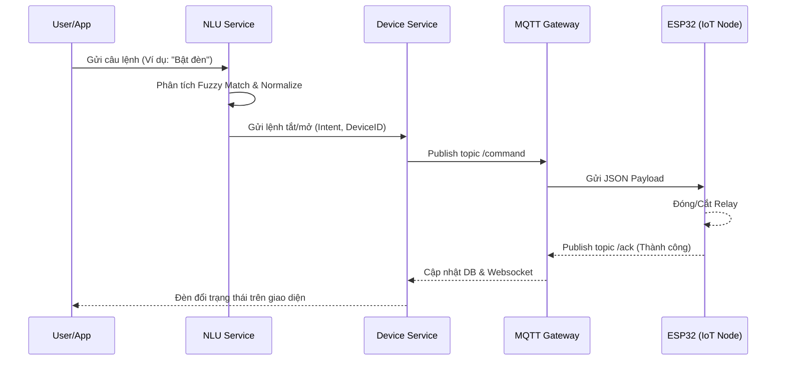

# Tài liệu Tích hợp Hệ thống: Device - MQTT - NLU (Edge AI)

## 1. Tổng quan Kiến trúc (Architecture)
Hệ thống Hesta được thiết kế chuẩn theo mô hình **Edge Computing** dành cho nhà thông minh. Toàn bộ tính toán được thực hiện tại Local Hub (Orange Pi 5) để đảm bảo độ trễ thấp (low latency) và bảo vệ quyền riêng tư.

## 2. NLU Engine (Xử lý ngôn ngữ tự nhiên)
* **Tính năng:** NLU sử dụng thuật toán **Fuzzy Matching** (Khoảng cách Levenshtein) kết hợp với chuẩn hóa tiếng Việt.
* **Đặc điểm:** Không cần dùng Internet, không gọi ChatGPT. Xử lý offline siêu tốc (~5ms).
* **Khả năng chịu lỗi:**
  * Hỗ trợ sai chính tả: `bật đnè`, `mở quạt`, `btậ điề hòa`.
  * Hiểu tham số phức tạp: `bật đèn 80%`, `chỉnh điều hòa 24 độ`, `bật quạt số 3`.
  * **Ambiguity Detection:** Nếu phát hiện 2 thiết bị trùng tên (VD: 2 cái đèn phòng khách), NLU sẽ không gửi lệnh sai mà sẽ trả về message yêu cầu người dùng chỉ định rõ thiết bị.

## 3. MQTT Payload & Contract
Các team Frontend và IoT cần nắm rõ định dạng gửi/nhận MQTT:

* **Command Topic (Từ Backend -> ESP32):** `hesta/nodes/{nodeId}/devices/{deviceId}/command`
* **ACK Topic (Từ ESP32 -> Backend):** `hesta/nodes/{nodeId}/devices/{deviceId}/ack`
* **State Topic (Heartbeat / Sensor):** `hesta/nodes/{nodeId}/devices/{deviceId}/state`

*Cơ chế tự động dọn rác (Memory Leak Protection):*
Lệnh được gắn Timeout. Nếu ESP32 rớt mạng và gửi ACK trễ, hệ thống sẽ log cảnh báo thay vì ngắt kết nối. Đồng thời tự động cập nhật State Reconciliation (Trạng thái bù) giúp UI App luôn đồng bộ với đèn ngoài đời thật.

## 4. Quản trị Dữ liệu (Database Throttling)
Để bảo vệ thẻ nhớ của Orange Pi 5 không bị mòn/cháy do ghi liên tục:
1. **Lọc Spam Điều hòa/Đèn:** Nếu Heartbeat ESP32 gửi lên trùng 100% trạng thái cũ, hệ thống từ chối lưu lịch sử (chỉ update `lastSeen`).
2. **Throttling Cảm biến (Sensor):** Mặc định các cảm biến (Nhiệt độ, Độ ẩm) dù đổi thông số cũng chỉ được ghi xuống Database Lịch sử tối đa **5 phút 1 lần**. App vẫn nhảy số liên tục, nhưng DB Lịch sử sẽ không bị quá tải.
3. **Auto-Cleanup Job:** Chạy định kỳ vào **2:00 sáng mỗi ngày**, tự động xóa vĩnh viễn dữ liệu lịch sử cũ hơn **30 ngày**.

## 5. Báo cáo Hiệu năng (Metrics)
Trong quá trình chạy, các bạn có thể mở log server để xem tốc độ xử lý:
* `[METRICS] NLU Processing (Success) completed in X ms` (Thường < 5ms).
* `[METRICS] MQTT Roundtrip (Success) completed in X ms` (Thường < 50ms, phụ thuộc vào tốc độ WiFi của ESP32).
