# Scene & Automation — Class và Sequence Diagrams

Đối chiếu implementation hiện tại ngày **2026-10-04**. Backend Java, React frontend, Flutter client và đường tích hợp MQTT được rà soát; chỉ mô hình hóa chức năng/class/method tồn tại trong source.

## 1. Chức năng đã implement và diagram tương ứng

### Scene

- Tạo, sửa metadata/icon/actions và bật/tắt qua PUT — **S01–S02**.
- Danh sách theo tên, chi tiết, tổng hợp action types từ device capabilities — **S03**.
- Xóa, chặn Scene được Rule tham chiếu — **S04**.
- Thêm action tại order, xóa và dồn order, reorder toàn bộ IDs — **S05**.
- Lịch sử tối đa 100 executions theo startedAt giảm dần — **S06**.
- Chạy thủ công, theo lịch và từ `EXECUTE_SCENE`; command errors, override, trạng thái tổng hợp — **S07**, **S09**.
- Xem/tạo/sửa/bật/tắt/xóa lịch, tính nextRunAt — **S08**, **I04**.
- React: tìm kiếm/lọc, preset metadata, chọn icon, chỉnh draft, quản lý action tức thì, execute/history — **U01**, **U03**.
- Flutter: list/detail/create/toggle/delete và thêm/xóa TURN_ON/OFF action — **U05**.

### Automation

- Tạo/sửa Rule; validation trigger, điều kiện AND/OR, operators, orders, Device/Scene actions — **A01–A02**.
- Danh sách/chi tiết, bật/tắt, xóa, lịch sử tối đa 100 theo matchedAt giảm dần — **A03**.
- REST events và MQTT sensor/state trigger — **A04–A05**, **A11**.
- Evaluation từng condition; conflict giữa rules và mở rộng Scene targets — **A06–A07**.
- Thực thi tuần tự device/Scene actions, manual override, preview qua events.test, execution history — **A09**.
- Test riêng từng Rule, trả matched/proposedActions — **A10**.
- Quản lý lịch SCHEDULE và scheduled execution — **A08**, **A12**, **I04**.
- Manual command bật/tắt, hủy Automation tạm 30 phút, lịch sử overrides — **A13**, **I02**.
- Sinh, xem, approve/reject AutomationRecommendation; approve tạo Rule và lịch — **A14–A16**.
- React Rule editor, chọn Scene, chạy thử, lịch sử, toggle/delete và recommendations — **U02**, **U04**.
- Tích hợp DeviceCommandService MQTT/mock, ACK/state/timeout và Behavior recording — **I01**, **I03**, **I05**.

## 2. Quy ước

Actor là stick figure; các participant khác dùng `participant` (rectangle); PostgreSQL dùng `database` (cylinder). Lifeline, activation, call/return và guard được thể hiện trong từng sequence. `break` kết thúc interaction khi lỗi; exception REST được chuyển qua **Q02**. Các `ref` trỏ tới diagram chi tiết có trong cùng tài liệu, không thêm method mới.

Class model được chia thành các view **C01–C14**: `*--` composition chỉ khi JPA cascade/orphanRemoval; `o--` aggregation danh sách DTO; `-->` association với multiplicity; `..>` dependency; `--|>` inheritance; `..|>` realization. Bội số mô tả model/payload thực tế; runtime validation có thể chặt hơn model. Getter/setter/builder Lombok không liệt kê lặp lại. React function components/module functions chỉ xuất hiện như lifeline, không biến thành class.

Mỗi diagram có source `.puml`, ảnh `.svg` và source code liên quan. Class/Sequence bên dưới là bộ diagram chính; các tài liệu triển khai cũ được giữ để bảo toàn nội dung.

## 3. Scene & Automation Class Diagram

### C01. Scene & Automation — persistent domain

[PlantUML](diagrams/scene-automation/C01_domain.puml) · [SVG](diagrams/scene-automation/C01_domain.svg)

Source: [Scene.java](../src/main/java/com/hesta/backend/entity/Scene.java), [SceneAction.java](../src/main/java/com/hesta/backend/entity/SceneAction.java), [SceneSchedule.java](../src/main/java/com/hesta/backend/entity/SceneSchedule.java), [SceneExecution.java](../src/main/java/com/hesta/backend/entity/SceneExecution.java), [AutomationRule.java](../src/main/java/com/hesta/backend/entity/AutomationRule.java), [RuleCondition.java](../src/main/java/com/hesta/backend/entity/RuleCondition.java), [RuleAction.java](../src/main/java/com/hesta/backend/entity/RuleAction.java), [AutomationSchedule.java](../src/main/java/com/hesta/backend/entity/AutomationSchedule.java), [AutomationExecution.java](../src/main/java/com/hesta/backend/entity/AutomationExecution.java), [AutomationRecommendation.java](../src/main/java/com/hesta/backend/entity/AutomationRecommendation.java), [Home.java](../src/main/java/com/hesta/backend/entity/Home.java), [Device.java](../src/main/java/com/hesta/backend/entity/Device.java), [Room.java](../src/main/java/com/hesta/backend/entity/Room.java), [EdgeNode.java](../src/main/java/com/hesta/backend/entity/EdgeNode.java), [User.java](../src/main/java/com/hesta/backend/entity/User.java).


<details>
<summary>PlantUML source</summary>

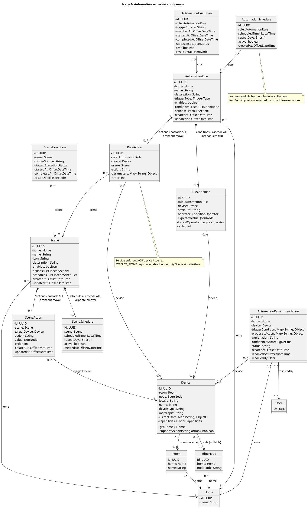

</details>

### C02. Scene — controllers and services

[PlantUML](diagrams/scene-automation/C02_services.puml) · [SVG](diagrams/scene-automation/C02_services.svg)

Source: [SceneController.java](../src/main/java/com/hesta/backend/controller/SceneController.java), [SceneService.java](../src/main/java/com/hesta/backend/service/SceneService.java), [SceneServiceImpl.java](../src/main/java/com/hesta/backend/service/impl/SceneServiceImpl.java), [SceneExecutionService.java](../src/main/java/com/hesta/backend/service/SceneExecutionService.java), [SceneExecutionServiceImpl.java](../src/main/java/com/hesta/backend/service/impl/SceneExecutionServiceImpl.java), [HomeAuthorizationService.java](../src/main/java/com/hesta/backend/service/HomeAuthorizationService.java), [ScheduleService.java](../src/main/java/com/hesta/backend/service/ScheduleService.java), [DeviceCommandService.java](../src/main/java/com/hesta/backend/service/DeviceCommandService.java), [ManualOverrideService.java](../src/main/java/com/hesta/backend/service/ManualOverrideService.java), [BehaviorEventRecorder.java](../src/main/java/com/hesta/backend/service/BehaviorEventRecorder.java), [SceneRepository.java](../src/main/java/com/hesta/backend/repository/SceneRepository.java), [SceneActionRepository.java](../src/main/java/com/hesta/backend/repository/SceneActionRepository.java), [SceneExecutionRepository.java](../src/main/java/com/hesta/backend/repository/SceneExecutionRepository.java), [DeviceRepository.java](../src/main/java/com/hesta/backend/repository/DeviceRepository.java), [AutomationRuleRepository.java](../src/main/java/com/hesta/backend/repository/AutomationRuleRepository.java).


<details>
<summary>PlantUML source</summary>

```plantuml
@startuml C02_services
title Scene — controllers and services
skinparam backgroundColor white
skinparam shadowing false
skinparam roundcorner 0
skinparam defaultFontName Arial
skinparam sequenceMessageAlign left
skinparam maxMessageSize 190
hide footbox
hide circle
skinparam classAttributeIconSize 0
class SceneController {
  - sceneService: SceneService
  - sceneExecutionService: SceneExecutionService
  - scheduleService: ScheduleService
  + actionTypes(CustomUserDetails userDetails, UUID homeId): ResponseEntity<ApiResponse<List<String>>>
  + schedules(CustomUserDetails userDetails, UUID homeId, UUID sceneId): ResponseEntity<ApiResponse<List<ScheduleResponse>>>
  + createSchedule(CustomUserDetails userDetails, UUID homeId, UUID sceneId, ScheduleRequest request): ResponseEntity<ApiResponse<ScheduleResponse>>
  + updateSchedule(CustomUserDetails userDetails, UUID homeId, UUID sceneId, UUID scheduleId, ScheduleRequest request): ResponseEntity<ApiResponse<ScheduleResponse>>
  + deleteSchedule(CustomUserDetails userDetails, UUID homeId, UUID sceneId, UUID scheduleId): ResponseEntity<ApiResponse<Void>>
  + executeScene(CustomUserDetails userDetails, UUID homeId, UUID sceneId): ResponseEntity<ApiResponse<SceneExecutionResponse>>
  + sceneExecutions(CustomUserDetails userDetails, UUID homeId, UUID sceneId): ResponseEntity<ApiResponse<List<SceneExecutionResponse>>>
  + createScene(CustomUserDetails userDetails, UUID homeId, CreateSceneRequest request): ResponseEntity<ApiResponse<SceneResponse>>
  + getScenes(CustomUserDetails userDetails, UUID homeId): ResponseEntity<ApiResponse<List<SceneResponse>>>
  + getScene(CustomUserDetails userDetails, UUID homeId, UUID sceneId): ResponseEntity<ApiResponse<SceneResponse>>
  + updateScene(CustomUserDetails userDetails, UUID homeId, UUID sceneId, UpdateSceneRequest request): ResponseEntity<ApiResponse<SceneResponse>>
  + deleteScene(CustomUserDetails userDetails, UUID homeId, UUID sceneId): ResponseEntity<ApiResponse<Void>>
  + addAction(CustomUserDetails userDetails, UUID homeId, UUID sceneId, SceneActionRequest request): ResponseEntity<ApiResponse<SceneActionResponse>>
  + removeAction(CustomUserDetails userDetails, UUID homeId, UUID sceneId, UUID actionId): ResponseEntity<ApiResponse<Void>>
  + reorderActions(CustomUserDetails userDetails, UUID homeId, UUID sceneId, ReorderSceneActionsRequest request): ResponseEntity<ApiResponse<SceneResponse>>
}
interface SceneService {
  + getActionTypes(UUID authenticatedUserId, UUID homeId): List<String>
  + createScene(UUID authenticatedUserId, UUID homeId, CreateSceneRequest request): SceneResponse
  + getScenesForHome(UUID authenticatedUserId, UUID homeId): List<SceneResponse>
  + getScene(UUID authenticatedUserId, UUID homeId, UUID sceneId): SceneResponse
  + updateScene(UUID authenticatedUserId, UUID homeId, UUID sceneId, UpdateSceneRequest request): SceneResponse
  + deleteScene(UUID authenticatedUserId, UUID homeId, UUID sceneId): void
  + addAction(UUID authenticatedUserId, UUID homeId, UUID sceneId, SceneActionRequest request): SceneActionResponse
  + removeAction(UUID authenticatedUserId, UUID homeId, UUID sceneId, UUID sceneActionId): void
  + reorderActions(UUID authenticatedUserId, UUID homeId, UUID sceneId, ReorderSceneActionsRequest request): SceneResponse
}
class SceneServiceImpl {
  - MAX_SCENE_NAME_LENGTH: int
  - MAX_DESCRIPTION_LENGTH: int
  - MAX_ACTION_ORDER: int
  - homeAuthorizationService: HomeAuthorizationService
  - sceneRepository: SceneRepository
  - sceneActionRepository: SceneActionRepository
  - deviceRepository: DeviceRepository
  - automationRuleRepository: AutomationRuleRepository
  + getActionTypes(UUID authenticatedUserId, UUID homeId): List<String>
  + createScene(UUID authenticatedUserId, UUID homeId, CreateSceneRequest request): SceneResponse
  + getScenesForHome(UUID authenticatedUserId, UUID homeId): List<SceneResponse>
  + getScene(UUID authenticatedUserId, UUID homeId, UUID sceneId): SceneResponse
  + updateScene(UUID authenticatedUserId, UUID homeId, UUID sceneId, UpdateSceneRequest request): SceneResponse
  + deleteScene(UUID authenticatedUserId, UUID homeId, UUID sceneId): void
  + addAction(UUID authenticatedUserId, UUID homeId, UUID sceneId, SceneActionRequest request): SceneActionResponse
  + removeAction(UUID authenticatedUserId, UUID homeId, UUID sceneId, UUID sceneActionId): void
  + reorderActions(UUID authenticatedUserId, UUID homeId, UUID sceneId, ReorderSceneActionsRequest request): SceneResponse
}
interface SceneExecutionService {
  + execute(UUID userId, UUID homeId, UUID sceneId): SceneExecutionResponse
  + executeScheduled(UUID homeId, UUID sceneId): SceneExecutionResponse
  + executeFromAutomation(UUID homeId, UUID sceneId): SceneExecutionResponse
  + history(UUID userId, UUID homeId, UUID sceneId): List<SceneExecutionResponse>
}
class SceneExecutionServiceImpl {
  - homeAuthorizationService: HomeAuthorizationService
  - sceneRepository: SceneRepository
  - executionRepository: SceneExecutionRepository
  - deviceCommandService: DeviceCommandService
  - objectMapper: ObjectMapper
  - behaviorEventRecorder: BehaviorEventRecorder
  - manualOverrideService: ManualOverrideService
  + execute(UUID userId, UUID homeId, UUID sceneId): SceneExecutionResponse
  + executeScheduled(UUID homeId, UUID sceneId): SceneExecutionResponse
  + executeFromAutomation(UUID homeId, UUID sceneId): SceneExecutionResponse
  + history(UUID userId, UUID homeId, UUID sceneId): List<SceneExecutionResponse>
  - run(Scene scene, String trigger, StateChangeSource source): SceneExecutionResponse
  - parameters(SceneAction action): Map<String, Object>
}
class HomeAuthorizationService {
  - homeRepository: HomeRepository
  - homeMemberRepository: HomeMemberRepository
  + requireAccess(UUID userId, UUID homeId): Home
  + requireSceneManagement(UUID userId, UUID homeId): Home
}
interface ScheduleService {
  + sceneSchedules(UUID userId, UUID homeId, UUID sceneId): List<ScheduleResponse>
  + saveSceneSchedule(UUID userId, UUID homeId, UUID sceneId, UUID scheduleId, ScheduleRequest request): ScheduleResponse
  + deleteSceneSchedule(UUID userId, UUID homeId, UUID sceneId, UUID scheduleId): void
  + ruleSchedules(UUID userId, UUID homeId, UUID ruleId): List<ScheduleResponse>
  + saveRuleSchedule(UUID userId, UUID homeId, UUID ruleId, UUID scheduleId, ScheduleRequest request): ScheduleResponse
  + deleteRuleSchedule(UUID userId, UUID homeId, UUID ruleId, UUID scheduleId): void
}
interface DeviceCommandService {
  + sendCommand(UUID deviceId, String action, Map<String, Object> parameters, StateChangeSource source): CompletableFuture<CommandResult>
}
interface ManualOverrideService {
  + activate(Device device, UUID userId, String reason): OffsetDateTime
  + isActive(UUID deviceId): boolean
}
interface BehaviorEventRecorder {
  + recordCommand(Device device, String action, StateChangeSource source, CommandResult result): void
  + recordSensor(Device device, AutomationEventRequest event): void
  + recordExecution(Home home, UUID userId, String eventType, UUID targetId, String status): void
}
interface SceneRepository {
}
interface SceneActionRepository {
}
interface SceneExecutionRepository {
}
interface DeviceRepository {
}
interface AutomationRuleRepository {
}
SceneServiceImpl ..|> SceneService
SceneExecutionServiceImpl ..|> SceneExecutionService
SceneController "1" --> "1" SceneService : sceneService (injected)
SceneController "1" --> "1" SceneExecutionService : sceneExecutionService (injected)
SceneController "1" --> "1" ScheduleService : scheduleService (injected)
SceneServiceImpl "1" --> "1" HomeAuthorizationService : homeAuthorizationService (injected)
SceneServiceImpl "1" --> "1" SceneRepository : sceneRepository (injected)
SceneServiceImpl "1" --> "1" SceneActionRepository : sceneActionRepository (injected)
SceneServiceImpl "1" --> "1" DeviceRepository : deviceRepository (injected)
SceneServiceImpl "1" --> "1" AutomationRuleRepository : automationRuleRepository (injected)
SceneExecutionServiceImpl "1" --> "1" HomeAuthorizationService : homeAuthorizationService (injected)
SceneExecutionServiceImpl "1" --> "1" SceneRepository : sceneRepository (injected)
SceneExecutionServiceImpl "1" --> "1" SceneExecutionRepository : executionRepository (injected)
SceneExecutionServiceImpl "1" --> "1" DeviceCommandService : deviceCommandService (injected)
SceneExecutionServiceImpl "1" --> "1" BehaviorEventRecorder : behaviorEventRecorder (injected)
SceneExecutionServiceImpl "1" --> "1" ManualOverrideService : manualOverrideService (injected)
@enduml
```

</details>

### C03. Automation — controllers and services

[PlantUML](diagrams/scene-automation/C03_services.puml) · [SVG](diagrams/scene-automation/C03_services.svg)

Source: [AutomationRuleController.java](../src/main/java/com/hesta/backend/controller/AutomationRuleController.java), [AutomationRuleService.java](../src/main/java/com/hesta/backend/service/AutomationRuleService.java), [AutomationRuleServiceImpl.java](../src/main/java/com/hesta/backend/service/impl/AutomationRuleServiceImpl.java), [AutomationEngine.java](../src/main/java/com/hesta/backend/service/AutomationEngine.java), [AutomationEngineImpl.java](../src/main/java/com/hesta/backend/service/impl/AutomationEngineImpl.java), [HomeAuthorizationService.java](../src/main/java/com/hesta/backend/service/HomeAuthorizationService.java), [ScheduleService.java](../src/main/java/com/hesta/backend/service/ScheduleService.java), [DeviceCommandService.java](../src/main/java/com/hesta/backend/service/DeviceCommandService.java), [ManualOverrideService.java](../src/main/java/com/hesta/backend/service/ManualOverrideService.java), [BehaviorEventRecorder.java](../src/main/java/com/hesta/backend/service/BehaviorEventRecorder.java), [AutomationRuleRepository.java](../src/main/java/com/hesta/backend/repository/AutomationRuleRepository.java), [AutomationExecutionRepository.java](../src/main/java/com/hesta/backend/repository/AutomationExecutionRepository.java), [DeviceRepository.java](../src/main/java/com/hesta/backend/repository/DeviceRepository.java), [SceneRepository.java](../src/main/java/com/hesta/backend/repository/SceneRepository.java).


<details>
<summary>PlantUML source</summary>

```plantuml
@startuml C03_services
title Automation — controllers and services
skinparam backgroundColor white
skinparam shadowing false
skinparam roundcorner 0
skinparam defaultFontName Arial
skinparam sequenceMessageAlign left
skinparam maxMessageSize 190
hide footbox
hide circle
skinparam classAttributeIconSize 0
class AutomationRuleController {
  - ruleService: AutomationRuleService
  - automationEngine: AutomationEngine
  - homeAuthorizationService: HomeAuthorizationService
  - scheduleService: ScheduleService
  + schedules(CustomUserDetails user, UUID homeId, UUID ruleId): ResponseEntity<ApiResponse<List<ScheduleResponse>>>
  + createSchedule(CustomUserDetails user, UUID homeId, UUID ruleId, ScheduleRequest request): ResponseEntity<ApiResponse<ScheduleResponse>>
  + updateSchedule(CustomUserDetails user, UUID homeId, UUID ruleId, UUID scheduleId, ScheduleRequest request): ResponseEntity<ApiResponse<ScheduleResponse>>
  + deleteSchedule(CustomUserDetails user, UUID homeId, UUID ruleId, UUID scheduleId): ResponseEntity<ApiResponse<Void>>
  + create(CustomUserDetails user, UUID homeId, CreateAutomationRuleRequest request): ResponseEntity<ApiResponse<AutomationRuleResponse>>
  + getAll(CustomUserDetails user, UUID homeId): ResponseEntity<ApiResponse<List<AutomationRuleResponse>>>
  + get(CustomUserDetails user, UUID homeId, UUID ruleId): ResponseEntity<ApiResponse<AutomationRuleResponse>>
  + update(CustomUserDetails user, UUID homeId, UUID ruleId, UpdateAutomationRuleRequest request): ResponseEntity<ApiResponse<AutomationRuleResponse>>
  + setEnabled(CustomUserDetails user, UUID homeId, UUID ruleId, boolean enabled): ResponseEntity<ApiResponse<AutomationRuleResponse>>
  + delete(CustomUserDetails user, UUID homeId, UUID ruleId): ResponseEntity<ApiResponse<Void>>
  + executions(CustomUserDetails user, UUID homeId, UUID ruleId): ResponseEntity<ApiResponse<List<AutomationExecutionResponse>>>
  + processEvent(CustomUserDetails user, UUID homeId, AutomationEventRequest request): ResponseEntity<ApiResponse<AutomationEngineResponse>>
  + testRule(CustomUserDetails user, UUID homeId, UUID ruleId, AutomationEventRequest request): ResponseEntity<ApiResponse<AutomationTestResponse>>
}
interface AutomationRuleService {
  + create(UUID userId, UUID homeId, CreateAutomationRuleRequest request): AutomationRuleResponse
  + getAll(UUID userId, UUID homeId): List<AutomationRuleResponse>
  + get(UUID userId, UUID homeId, UUID ruleId): AutomationRuleResponse
  + update(UUID userId, UUID homeId, UUID ruleId, UpdateAutomationRuleRequest request): AutomationRuleResponse
  + setEnabled(UUID userId, UUID homeId, UUID ruleId, boolean enabled): AutomationRuleResponse
  + delete(UUID userId, UUID homeId, UUID ruleId): void
  + getExecutions(UUID userId, UUID homeId, UUID ruleId): List<AutomationExecutionResponse>
}
class AutomationRuleServiceImpl {
  - homeAuthorizationService: HomeAuthorizationService
  - ruleRepository: AutomationRuleRepository
  - executionRepository: AutomationExecutionRepository
  - deviceRepository: DeviceRepository
  - sceneRepository: SceneRepository
  - objectMapper: ObjectMapper
  + create(UUID userId, UUID homeId, CreateAutomationRuleRequest request): AutomationRuleResponse
  + getAll(UUID userId, UUID homeId): List<AutomationRuleResponse>
  + get(UUID userId, UUID homeId, UUID ruleId): AutomationRuleResponse
  + update(UUID userId, UUID homeId, UUID ruleId, UpdateAutomationRuleRequest request): AutomationRuleResponse
  + setEnabled(UUID userId, UUID homeId, UUID ruleId, boolean enabled): AutomationRuleResponse
  + delete(UUID userId, UUID homeId, UUID ruleId): void
  + getExecutions(UUID userId, UUID homeId, UUID ruleId): List<AutomationExecutionResponse>
  - replaceChildren(AutomationRule rule, List<RuleConditionRequest> conditionRequests, List<RuleActionRequest> actionRequests, Home home): void
}
interface AutomationEngine {
  + process(UUID homeId, AutomationEventRequest event): AutomationEngineResponse
  + testRule(UUID homeId, UUID ruleId, AutomationEventRequest event): AutomationTestResponse
  + executeScheduled(UUID homeId, UUID ruleId): AutomationExecutionResponse
}
class AutomationEngineImpl {
  - ruleRepository: AutomationRuleRepository
  - executionRepository: AutomationExecutionRepository
  - deviceRepository: DeviceRepository
  - deviceCommandService: DeviceCommandService
  - objectMapper: ObjectMapper
  - behaviorEventRecorder: BehaviorEventRecorder
  - manualOverrideService: ManualOverrideService
  - sceneExecutionService: SceneExecutionService
  + process(UUID homeId, AutomationEventRequest event): AutomationEngineResponse
  - conflicts(AutomationRule rule, Map<UUID, List<RuleAction>> reserved): boolean
  - targetActions(RuleAction action): List<RuleAction>
  - conflicts(RuleAction left, RuleAction right): boolean
  + testRule(UUID homeId, UUID ruleId, AutomationEventRequest event): AutomationTestResponse
  + executeScheduled(UUID homeId, UUID ruleId): AutomationExecutionResponse
  - matches(AutomationRule rule, AutomationEventRequest event): boolean
  - evaluate(RuleCondition condition, AutomationEventRequest event): boolean
  - execute(AutomationRule rule, AutomationEventRequest event): AutomationExecutionResponse
}
class HomeAuthorizationService {
  - homeRepository: HomeRepository
  - homeMemberRepository: HomeMemberRepository
  + requireAccess(UUID userId, UUID homeId): Home
  + requireSceneManagement(UUID userId, UUID homeId): Home
}
interface ScheduleService {
  + sceneSchedules(UUID userId, UUID homeId, UUID sceneId): List<ScheduleResponse>
  + saveSceneSchedule(UUID userId, UUID homeId, UUID sceneId, UUID scheduleId, ScheduleRequest request): ScheduleResponse
  + deleteSceneSchedule(UUID userId, UUID homeId, UUID sceneId, UUID scheduleId): void
  + ruleSchedules(UUID userId, UUID homeId, UUID ruleId): List<ScheduleResponse>
  + saveRuleSchedule(UUID userId, UUID homeId, UUID ruleId, UUID scheduleId, ScheduleRequest request): ScheduleResponse
  + deleteRuleSchedule(UUID userId, UUID homeId, UUID ruleId, UUID scheduleId): void
}
interface DeviceCommandService {
  + sendCommand(UUID deviceId, String action, Map<String, Object> parameters, StateChangeSource source): CompletableFuture<CommandResult>
}
interface ManualOverrideService {
  + activate(Device device, UUID userId, String reason): OffsetDateTime
  + isActive(UUID deviceId): boolean
}
interface BehaviorEventRecorder {
  + recordCommand(Device device, String action, StateChangeSource source, CommandResult result): void
  + recordSensor(Device device, AutomationEventRequest event): void
  + recordExecution(Home home, UUID userId, String eventType, UUID targetId, String status): void
}
interface AutomationRuleRepository {
}
interface AutomationExecutionRepository {
}
interface DeviceRepository {
}
interface SceneRepository {
}
AutomationRuleServiceImpl ..|> AutomationRuleService
AutomationEngineImpl ..|> AutomationEngine
AutomationRuleController "1" --> "1" AutomationRuleService : ruleService (injected)
AutomationRuleController "1" --> "1" AutomationEngine : automationEngine (injected)
AutomationRuleController "1" --> "1" HomeAuthorizationService : homeAuthorizationService (injected)
AutomationRuleController "1" --> "1" ScheduleService : scheduleService (injected)
AutomationRuleServiceImpl "1" --> "1" HomeAuthorizationService : homeAuthorizationService (injected)
AutomationRuleServiceImpl "1" --> "1" AutomationRuleRepository : ruleRepository (injected)
AutomationRuleServiceImpl "1" --> "1" AutomationExecutionRepository : executionRepository (injected)
AutomationRuleServiceImpl "1" --> "1" DeviceRepository : deviceRepository (injected)
AutomationRuleServiceImpl "1" --> "1" SceneRepository : sceneRepository (injected)
AutomationEngineImpl "1" --> "1" AutomationRuleRepository : ruleRepository (injected)
AutomationEngineImpl "1" --> "1" AutomationExecutionRepository : executionRepository (injected)
AutomationEngineImpl "1" --> "1" DeviceRepository : deviceRepository (injected)
AutomationEngineImpl "1" --> "1" DeviceCommandService : deviceCommandService (injected)
AutomationEngineImpl "1" --> "1" BehaviorEventRecorder : behaviorEventRecorder (injected)
AutomationEngineImpl "1" --> "1" ManualOverrideService : manualOverrideService (injected)
@enduml
```

</details>

### C04. Scene & Automation — repositories and interface inheritance

[PlantUML](diagrams/scene-automation/C04_persistence.puml) · [SVG](diagrams/scene-automation/C04_persistence.svg)

Source: [SceneRepository.java](../src/main/java/com/hesta/backend/repository/SceneRepository.java), [SceneActionRepository.java](../src/main/java/com/hesta/backend/repository/SceneActionRepository.java), [SceneExecutionRepository.java](../src/main/java/com/hesta/backend/repository/SceneExecutionRepository.java), [SceneScheduleRepository.java](../src/main/java/com/hesta/backend/repository/SceneScheduleRepository.java), [AutomationRuleRepository.java](../src/main/java/com/hesta/backend/repository/AutomationRuleRepository.java), [AutomationExecutionRepository.java](../src/main/java/com/hesta/backend/repository/AutomationExecutionRepository.java), [AutomationScheduleRepository.java](../src/main/java/com/hesta/backend/repository/AutomationScheduleRepository.java), [AutomationRecommendationRepository.java](../src/main/java/com/hesta/backend/repository/AutomationRecommendationRepository.java), [Scene.java](../src/main/java/com/hesta/backend/entity/Scene.java), [SceneAction.java](../src/main/java/com/hesta/backend/entity/SceneAction.java), [SceneExecution.java](../src/main/java/com/hesta/backend/entity/SceneExecution.java), [SceneSchedule.java](../src/main/java/com/hesta/backend/entity/SceneSchedule.java), [AutomationRule.java](../src/main/java/com/hesta/backend/entity/AutomationRule.java), [AutomationExecution.java](../src/main/java/com/hesta/backend/entity/AutomationExecution.java), [AutomationSchedule.java](../src/main/java/com/hesta/backend/entity/AutomationSchedule.java), [AutomationRecommendation.java](../src/main/java/com/hesta/backend/entity/AutomationRecommendation.java).


<details>
<summary>PlantUML source</summary>

```plantuml
@startuml C04_persistence
title Scene & Automation — repositories and interface inheritance
skinparam backgroundColor white
skinparam shadowing false
skinparam roundcorner 0
skinparam defaultFontName Arial
skinparam sequenceMessageAlign left
skinparam maxMessageSize 190
hide footbox
hide circle
skinparam classAttributeIconSize 0
interface SceneRepository {
  + findAllByHomeIdOrderByNameAsc(UUID homeId): List<Scene>
  + findByIdAndHomeId(UUID id, UUID homeId): java.util.Optional<Scene>
  + existsByHomeIdAndName(UUID homeId, String name): boolean
  + existsByHomeIdAndNameAndIdNot(UUID homeId, String name, UUID id): boolean
}
interface SceneActionRepository {
  + findAllBySceneIdOrderByOrderAsc(UUID sceneId): List<SceneAction>
  + existsBySceneIdAndOrder(UUID sceneId, int order): boolean
  + existsBySceneIdAndOrderAndIdNot(UUID sceneId, int order, UUID id): boolean
  + countBySceneId(UUID sceneId): long
  + deferOrderConstraint(): void
}
interface SceneExecutionRepository {
  + findTop100BySceneIdOrderByStartedAtDesc(UUID sceneId): List<SceneExecution>
}
interface SceneScheduleRepository {
  + findAllBySceneIdOrderByScheduledTimeAsc(UUID sceneId): List<SceneSchedule>
  + findAllByActiveTrueAndScheduledTime(LocalTime scheduledTime): List<SceneSchedule>
}
interface AutomationRuleRepository {
  + findAllByHomeIdOrderByNameAsc(UUID homeId): List<AutomationRule>
  + findByIdAndHomeId(UUID id, UUID homeId): Optional<AutomationRule>
  + findAllByHomeIdAndEnabledTrueAndTriggerTypeIn(UUID homeId, List<TriggerType> triggerTypes): List<AutomationRule>
  + fetchActionsByIdIn(List<UUID> ids): List<AutomationRule>
  + existsByHomeIdAndName(UUID homeId, String name): boolean
  + existsByHomeIdAndNameAndIdNot(UUID homeId, String name, UUID id): boolean
  + existsActionForScene(UUID sceneId): boolean
}
interface AutomationExecutionRepository {
  + findTop100ByRuleIdOrderByMatchedAtDesc(UUID ruleId): List<AutomationExecution>
}
interface AutomationScheduleRepository {
  + findAllByRuleIdOrderByScheduledTimeAsc(UUID ruleId): List<AutomationSchedule>
  + findAllByActiveTrueAndScheduledTime(LocalTime scheduledTime): List<AutomationSchedule>
}
interface AutomationRecommendationRepository {
  + findAllByHomeIdOrderByCreatedAtDesc(UUID homeId): List<AutomationRecommendation>
  + findByIdAndHomeId(UUID id, UUID homeId): Optional<AutomationRecommendation>
  + existsByHomeIdAndDeviceIdAndStatus(UUID homeId, UUID deviceId, String status): boolean
}
class Scene {
  - id: UUID
}
class SceneAction {
  - id: UUID
}
class SceneExecution {
  - id: UUID
}
class SceneSchedule {
  - id: UUID
}
class AutomationRule {
  - id: UUID
}
class AutomationExecution {
  - id: UUID
}
class AutomationSchedule {
  - id: UUID
}
class AutomationRecommendation {
  - id: UUID
}
interface "JpaRepository<T, ID>" as JpaRepository <<Spring Data>> {
 +save(entity): T
 +saveAndFlush(entity): T
 +findById(id): Optional<T>
 +delete(entity): void
}
SceneRepository --|> JpaRepository : extends
SceneRepository ..> Scene : JPA entity type
SceneActionRepository --|> JpaRepository : extends
SceneActionRepository ..> SceneAction : JPA entity type
SceneExecutionRepository --|> JpaRepository : extends
SceneExecutionRepository ..> SceneExecution : JPA entity type
SceneScheduleRepository --|> JpaRepository : extends
SceneScheduleRepository ..> SceneSchedule : JPA entity type
AutomationRuleRepository --|> JpaRepository : extends
AutomationRuleRepository ..> AutomationRule : JPA entity type
AutomationExecutionRepository --|> JpaRepository : extends
AutomationExecutionRepository ..> AutomationExecution : JPA entity type
AutomationScheduleRepository --|> JpaRepository : extends
AutomationScheduleRepository ..> AutomationSchedule : JPA entity type
AutomationRecommendationRepository --|> JpaRepository : extends
AutomationRecommendationRepository ..> AutomationRecommendation : JPA entity type
@enduml
```

</details>

### C05. Scene — request / response contracts

[PlantUML](diagrams/scene-automation/C05_contracts.puml) · [SVG](diagrams/scene-automation/C05_contracts.svg)

Source: [CreateSceneRequest.java](../src/main/java/com/hesta/backend/dto/request/CreateSceneRequest.java), [UpdateSceneRequest.java](../src/main/java/com/hesta/backend/dto/request/UpdateSceneRequest.java), [SceneActionRequest.java](../src/main/java/com/hesta/backend/dto/request/SceneActionRequest.java), [ReorderSceneActionsRequest.java](../src/main/java/com/hesta/backend/dto/request/ReorderSceneActionsRequest.java), [SceneResponse.java](../src/main/java/com/hesta/backend/dto/response/SceneResponse.java), [SceneActionResponse.java](../src/main/java/com/hesta/backend/dto/response/SceneActionResponse.java), [SceneExecutionResponse.java](../src/main/java/com/hesta/backend/dto/response/SceneExecutionResponse.java), [SceneService.java](../src/main/java/com/hesta/backend/service/SceneService.java), [SceneExecutionService.java](../src/main/java/com/hesta/backend/service/SceneExecutionService.java).


<details>
<summary>PlantUML source</summary>

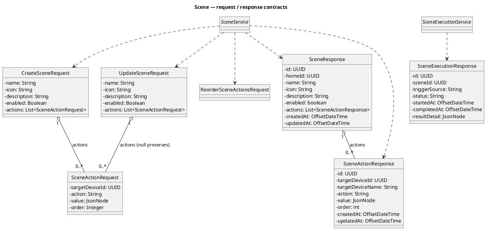

</details>

### C06. Automation — request / response contracts

[PlantUML](diagrams/scene-automation/C06_contracts.puml) · [SVG](diagrams/scene-automation/C06_contracts.svg)

Source: [CreateAutomationRuleRequest.java](../src/main/java/com/hesta/backend/dto/request/CreateAutomationRuleRequest.java), [UpdateAutomationRuleRequest.java](../src/main/java/com/hesta/backend/dto/request/UpdateAutomationRuleRequest.java), [RuleConditionRequest.java](../src/main/java/com/hesta/backend/dto/request/RuleConditionRequest.java), [RuleActionRequest.java](../src/main/java/com/hesta/backend/dto/request/RuleActionRequest.java), [AutomationRuleResponse.java](../src/main/java/com/hesta/backend/dto/response/AutomationRuleResponse.java), [RuleConditionResponse.java](../src/main/java/com/hesta/backend/dto/response/RuleConditionResponse.java), [RuleActionResponse.java](../src/main/java/com/hesta/backend/dto/response/RuleActionResponse.java), [AutomationEventRequest.java](../src/main/java/com/hesta/backend/dto/request/AutomationEventRequest.java), [AutomationTestResponse.java](../src/main/java/com/hesta/backend/dto/response/AutomationTestResponse.java), [AutomationExecutionResponse.java](../src/main/java/com/hesta/backend/dto/response/AutomationExecutionResponse.java), [AutomationEngineResponse.java](../src/main/java/com/hesta/backend/dto/response/AutomationEngineResponse.java), [AutomationRuleService.java](../src/main/java/com/hesta/backend/service/AutomationRuleService.java), [AutomationEngine.java](../src/main/java/com/hesta/backend/service/AutomationEngine.java).


<details>
<summary>PlantUML source</summary>

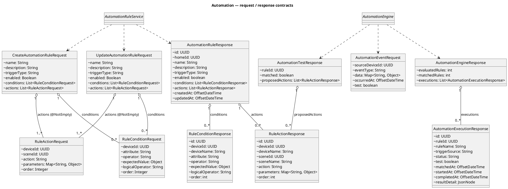

</details>

### C07. Scene & Automation — shared scheduling

[PlantUML](diagrams/scene-automation/C07_scheduling.puml) · [SVG](diagrams/scene-automation/C07_scheduling.svg)

Source: [ScheduleService.java](../src/main/java/com/hesta/backend/service/ScheduleService.java), [ScheduleServiceImpl.java](../src/main/java/com/hesta/backend/service/impl/ScheduleServiceImpl.java), [ScheduleRunner.java](../src/main/java/com/hesta/backend/service/impl/ScheduleRunner.java), [SceneScheduleRepository.java](../src/main/java/com/hesta/backend/repository/SceneScheduleRepository.java), [AutomationScheduleRepository.java](../src/main/java/com/hesta/backend/repository/AutomationScheduleRepository.java), [SceneRepository.java](../src/main/java/com/hesta/backend/repository/SceneRepository.java), [AutomationRuleRepository.java](../src/main/java/com/hesta/backend/repository/AutomationRuleRepository.java), [HomeAuthorizationService.java](../src/main/java/com/hesta/backend/service/HomeAuthorizationService.java), [SceneExecutionService.java](../src/main/java/com/hesta/backend/service/SceneExecutionService.java), [AutomationEngine.java](../src/main/java/com/hesta/backend/service/AutomationEngine.java), [ScheduleRequest.java](../src/main/java/com/hesta/backend/dto/request/ScheduleRequest.java), [ScheduleResponse.java](../src/main/java/com/hesta/backend/dto/response/ScheduleResponse.java).


<details>
<summary>PlantUML source</summary>

```plantuml
@startuml C07_scheduling
title Scene & Automation — shared scheduling
skinparam backgroundColor white
skinparam shadowing false
skinparam roundcorner 0
skinparam defaultFontName Arial
skinparam sequenceMessageAlign left
skinparam maxMessageSize 190
hide footbox
hide circle
skinparam classAttributeIconSize 0
interface ScheduleService {
  + sceneSchedules(UUID userId, UUID homeId, UUID sceneId): List<ScheduleResponse>
  + saveSceneSchedule(UUID userId, UUID homeId, UUID sceneId, UUID scheduleId, ScheduleRequest request): ScheduleResponse
  + deleteSceneSchedule(UUID userId, UUID homeId, UUID sceneId, UUID scheduleId): void
  + ruleSchedules(UUID userId, UUID homeId, UUID ruleId): List<ScheduleResponse>
  + saveRuleSchedule(UUID userId, UUID homeId, UUID ruleId, UUID scheduleId, ScheduleRequest request): ScheduleResponse
  + deleteRuleSchedule(UUID userId, UUID homeId, UUID ruleId, UUID scheduleId): void
}
class ScheduleServiceImpl {
  - authorization: HomeAuthorizationService
  - scenes: SceneRepository
  - sceneSchedules: SceneScheduleRepository
  - rules: AutomationRuleRepository
  - ruleSchedules: AutomationScheduleRepository
  - zoneName: String
  + sceneSchedules(UUID userId, UUID homeId, UUID sceneId): List<ScheduleResponse>
  + saveSceneSchedule(UUID userId, UUID homeId, UUID sceneId, UUID scheduleId, ScheduleRequest request): ScheduleResponse
  + deleteSceneSchedule(UUID userId, UUID homeId, UUID sceneId, UUID scheduleId): void
  + ruleSchedules(UUID userId, UUID homeId, UUID ruleId): List<ScheduleResponse>
  + saveRuleSchedule(UUID userId, UUID homeId, UUID ruleId, UUID scheduleId, ScheduleRequest request): ScheduleResponse
  + deleteRuleSchedule(UUID userId, UUID homeId, UUID ruleId, UUID scheduleId): void
}
class ScheduleRunner {
  - sceneSchedules: SceneScheduleRepository
  - ruleSchedules: AutomationScheduleRepository
  - sceneExecutionService: SceneExecutionService
  - automationEngine: AutomationEngine
  - jdbcTemplate: JdbcTemplate
  - zoneName: String
  + runDueSchedules(): void
}
interface SceneScheduleRepository {
}
interface AutomationScheduleRepository {
}
interface SceneRepository {
}
interface AutomationRuleRepository {
}
class HomeAuthorizationService {
  - homeRepository: HomeRepository
  - homeMemberRepository: HomeMemberRepository
  + requireAccess(UUID userId, UUID homeId): Home
  + requireSceneManagement(UUID userId, UUID homeId): Home
}
interface SceneExecutionService {
  + execute(UUID userId, UUID homeId, UUID sceneId): SceneExecutionResponse
  + executeScheduled(UUID homeId, UUID sceneId): SceneExecutionResponse
  + executeFromAutomation(UUID homeId, UUID sceneId): SceneExecutionResponse
  + history(UUID userId, UUID homeId, UUID sceneId): List<SceneExecutionResponse>
}
interface AutomationEngine {
  + process(UUID homeId, AutomationEventRequest event): AutomationEngineResponse
  + testRule(UUID homeId, UUID ruleId, AutomationEventRequest event): AutomationTestResponse
  + executeScheduled(UUID homeId, UUID ruleId): AutomationExecutionResponse
}
class ScheduleRequest {
  - scheduledTime: LocalTime
  - repeatDays: List<Short>
  - active: Boolean
}
class ScheduleResponse {
  - id: UUID
  - scheduledTime: LocalTime
  - repeatDays: List<Short>
  - active: boolean
  - nextRunAt: OffsetDateTime
}
ScheduleServiceImpl ..|> ScheduleService
class JdbcTemplate <<Spring>>
ScheduleServiceImpl "1" --> "1" HomeAuthorizationService : authorization
ScheduleServiceImpl "1" --> "1" SceneRepository : scenes
ScheduleServiceImpl "1" --> "1" SceneScheduleRepository : sceneSchedules
ScheduleServiceImpl "1" --> "1" AutomationRuleRepository : rules
ScheduleServiceImpl "1" --> "1" AutomationScheduleRepository : ruleSchedules
ScheduleRunner "1" --> "1" SceneScheduleRepository : sceneSchedules
ScheduleRunner "1" --> "1" AutomationScheduleRepository : ruleSchedules
ScheduleRunner "1" --> "1" SceneExecutionService : sceneExecutionService
ScheduleRunner "1" --> "1" AutomationEngine : automationEngine
ScheduleRunner "1" --> "1" JdbcTemplate : jdbcTemplate
ScheduleService ..> ScheduleRequest
ScheduleService ..> ScheduleResponse
@enduml
```

</details>

### C08. Automation — recommendations and direct Behavior integration

[PlantUML](diagrams/scene-automation/C08_recommendations.puml) · [SVG](diagrams/scene-automation/C08_recommendations.svg)

Source: [RecommendationController.java](../src/main/java/com/hesta/backend/controller/RecommendationController.java), [RecommendationService.java](../src/main/java/com/hesta/backend/service/RecommendationService.java), [RecommendationServiceImpl.java](../src/main/java/com/hesta/backend/service/impl/RecommendationServiceImpl.java), [AutomationRecommendation.java](../src/main/java/com/hesta/backend/entity/AutomationRecommendation.java), [AutomationRecommendationRepository.java](../src/main/java/com/hesta/backend/repository/AutomationRecommendationRepository.java), [BehaviorService.java](../src/main/java/com/hesta/backend/service/BehaviorService.java), [AutomationRuleService.java](../src/main/java/com/hesta/backend/service/AutomationRuleService.java), [ScheduleService.java](../src/main/java/com/hesta/backend/service/ScheduleService.java), [HomeAuthorizationService.java](../src/main/java/com/hesta/backend/service/HomeAuthorizationService.java), [DeviceRepository.java](../src/main/java/com/hesta/backend/repository/DeviceRepository.java), [UserRepository.java](../src/main/java/com/hesta/backend/repository/UserRepository.java), [RecommendationResponse.java](../src/main/java/com/hesta/backend/dto/response/RecommendationResponse.java), [BehaviorPatternResponse.java](../src/main/java/com/hesta/backend/dto/response/BehaviorPatternResponse.java), [BehaviorPredictionResponse.java](../src/main/java/com/hesta/backend/dto/response/BehaviorPredictionResponse.java).


<details>
<summary>PlantUML source</summary>

```plantuml
@startuml C08_recommendations
title Automation — recommendations and direct Behavior integration
skinparam backgroundColor white
skinparam shadowing false
skinparam roundcorner 0
skinparam defaultFontName Arial
skinparam sequenceMessageAlign left
skinparam maxMessageSize 190
hide footbox
hide circle
skinparam classAttributeIconSize 0
class RecommendationController {
  - recommendations: RecommendationService
  + list(CustomUserDetails user, UUID homeId): ResponseEntity<ApiResponse<List<RecommendationResponse>>>
  + generate(CustomUserDetails user, UUID homeId, OffsetDateTime from, OffsetDateTime to): ResponseEntity<ApiResponse<List<RecommendationResponse>>>
  + approve(CustomUserDetails user, UUID homeId, UUID recommendationId): ResponseEntity<ApiResponse<RecommendationResponse>>
  + reject(CustomUserDetails user, UUID homeId, UUID recommendationId): ResponseEntity<ApiResponse<RecommendationResponse>>
}
interface RecommendationService {
  + generate(UUID userId, UUID homeId, OffsetDateTime from, OffsetDateTime to): List<RecommendationResponse>
  + list(UUID userId, UUID homeId): List<RecommendationResponse>
  + approve(UUID userId, UUID homeId, UUID recommendationId): RecommendationResponse
  + reject(UUID userId, UUID homeId, UUID recommendationId): RecommendationResponse
}
class RecommendationServiceImpl {
  - authorization: HomeAuthorizationService
  - behavior: BehaviorService
  - recommendations: AutomationRecommendationRepository
  - devices: DeviceRepository
  - users: UserRepository
  - rules: AutomationRuleService
  - schedules: ScheduleService
  + generate(UUID userId, UUID homeId, OffsetDateTime from, OffsetDateTime to): List<RecommendationResponse>
  + list(UUID userId, UUID homeId): List<RecommendationResponse>
  + approve(UUID userId, UUID homeId, UUID recommendationId): RecommendationResponse
  + reject(UUID userId, UUID homeId, UUID recommendationId): RecommendationResponse
}
class AutomationRecommendation {
  - id: UUID
  - home: Home
  - device: Device
  - triggerCondition: Map<String, Object>
  - proposedAction: Map<String, Object>
  - explanation: String
  - confidenceScore: BigDecimal
  - status: String
  - createdAt: OffsetDateTime
  - resolvedAt: OffsetDateTime
  - resolvedBy: User
}
interface AutomationRecommendationRepository {
  + findAllByHomeIdOrderByCreatedAtDesc(UUID homeId): List<AutomationRecommendation>
  + findByIdAndHomeId(UUID id, UUID homeId): Optional<AutomationRecommendation>
  + existsByHomeIdAndDeviceIdAndStatus(UUID homeId, UUID deviceId, String status): boolean
}
interface BehaviorService {
  + generate(UUID userId, UUID homeId, GenerateBehaviorDataRequest request): BehaviorDatasetResponse
  + detectPatterns(UUID userId, UUID homeId, OffsetDateTime from, OffsetDateTime to): List<BehaviorPatternResponse>
  + predict(UUID userId, UUID homeId, OffsetDateTime from, OffsetDateTime to, OffsetDateTime at): List<BehaviorPredictionResponse>
}
interface AutomationRuleService {
  + create(UUID userId, UUID homeId, CreateAutomationRuleRequest request): AutomationRuleResponse
  + getAll(UUID userId, UUID homeId): List<AutomationRuleResponse>
  + get(UUID userId, UUID homeId, UUID ruleId): AutomationRuleResponse
  + update(UUID userId, UUID homeId, UUID ruleId, UpdateAutomationRuleRequest request): AutomationRuleResponse
  + setEnabled(UUID userId, UUID homeId, UUID ruleId, boolean enabled): AutomationRuleResponse
  + delete(UUID userId, UUID homeId, UUID ruleId): void
  + getExecutions(UUID userId, UUID homeId, UUID ruleId): List<AutomationExecutionResponse>
}
interface ScheduleService {
  + sceneSchedules(UUID userId, UUID homeId, UUID sceneId): List<ScheduleResponse>
  + saveSceneSchedule(UUID userId, UUID homeId, UUID sceneId, UUID scheduleId, ScheduleRequest request): ScheduleResponse
  + deleteSceneSchedule(UUID userId, UUID homeId, UUID sceneId, UUID scheduleId): void
  + ruleSchedules(UUID userId, UUID homeId, UUID ruleId): List<ScheduleResponse>
  + saveRuleSchedule(UUID userId, UUID homeId, UUID ruleId, UUID scheduleId, ScheduleRequest request): ScheduleResponse
  + deleteRuleSchedule(UUID userId, UUID homeId, UUID ruleId, UUID scheduleId): void
}
class HomeAuthorizationService {
  - homeRepository: HomeRepository
  - homeMemberRepository: HomeMemberRepository
  + requireAccess(UUID userId, UUID homeId): Home
  + requireSceneManagement(UUID userId, UUID homeId): Home
}
interface DeviceRepository {
}
interface UserRepository {
}
class RecommendationResponse {
  ~ id: UUID
  ~ homeId: UUID
  ~ deviceId: UUID
  ~ deviceName: String
  ~ triggerCondition: Map<String, Object>
  ~ proposedAction: Map<String, Object>
  ~ explanation: String
  ~ confidence: double
  ~ status: String
  ~ createdAt: OffsetDateTime
  ~ resolvedAt: OffsetDateTime
}
class BehaviorPatternResponse {
  ~ patternType: String
  ~ deviceId: UUID
  ~ deviceName: String
  ~ roomId: UUID
  ~ roomName: String
  ~ action: String
  ~ averageTime: LocalTime
  ~ occurrences: long
  ~ confidence: double
}
class BehaviorPredictionResponse {
  ~ deviceId: UUID
  ~ deviceName: String
  ~ action: String
  ~ predictedTime: LocalTime
  ~ confidence: double
  ~ reason: String
}
RecommendationServiceImpl ..|> RecommendationService
RecommendationController "1" --> "1" RecommendationService : recommendations
RecommendationServiceImpl "1" --> "1" HomeAuthorizationService : authorization
RecommendationServiceImpl "1" --> "1" BehaviorService : behavior
RecommendationServiceImpl "1" --> "1" AutomationRecommendationRepository : recommendations
RecommendationServiceImpl "1" --> "1" DeviceRepository : devices
RecommendationServiceImpl "1" --> "1" UserRepository : users
RecommendationServiceImpl "1" --> "1" AutomationRuleService : rules
RecommendationServiceImpl "1" --> "1" ScheduleService : schedules
RecommendationService ..> RecommendationResponse
BehaviorService ..> BehaviorPatternResponse
BehaviorService ..> BehaviorPredictionResponse
AutomationRecommendationRepository ..> AutomationRecommendation
@enduml
```

</details>

### C09. Scene & Automation — command, MQTT, override and recording integration

[PlantUML](diagrams/scene-automation/C09_integration.puml) · [SVG](diagrams/scene-automation/C09_integration.svg)

Source: [DeviceCommandService.java](../src/main/java/com/hesta/backend/service/DeviceCommandService.java), [MqttDeviceCommandServiceImpl.java](../src/main/java/com/hesta/backend/service/impl/MqttDeviceCommandServiceImpl.java), [MockDeviceCommandServiceImpl.java](../src/main/java/com/hesta/backend/service/impl/MockDeviceCommandServiceImpl.java), [MqttGateway.java](../src/main/java/com/hesta/backend/config/mqtt/MqttGateway.java), [MqttMessageReceiver.java](../src/main/java/com/hesta/backend/config/mqtt/MqttMessageReceiver.java), [CommandResult.java](../src/main/java/com/hesta/backend/dto/command/CommandResult.java), [AutomationEngine.java](../src/main/java/com/hesta/backend/service/AutomationEngine.java), [ManualOverrideService.java](../src/main/java/com/hesta/backend/service/ManualOverrideService.java), [ManualOverrideServiceImpl.java](../src/main/java/com/hesta/backend/service/impl/ManualOverrideServiceImpl.java), [ManualControlService.java](../src/main/java/com/hesta/backend/service/ManualControlService.java), [ManualControlServiceImpl.java](../src/main/java/com/hesta/backend/service/impl/ManualControlServiceImpl.java), [BehaviorEventRecorder.java](../src/main/java/com/hesta/backend/service/BehaviorEventRecorder.java), [BehaviorEventRecorderImpl.java](../src/main/java/com/hesta/backend/service/impl/BehaviorEventRecorderImpl.java), [BehaviorEventRepository.java](../src/main/java/com/hesta/backend/repository/BehaviorEventRepository.java), [DeviceStateHistoryRepository.java](../src/main/java/com/hesta/backend/repository/DeviceStateHistoryRepository.java), [DeviceRepository.java](../src/main/java/com/hesta/backend/repository/DeviceRepository.java), [UserRepository.java](../src/main/java/com/hesta/backend/repository/UserRepository.java), [DeviceController.java](../src/main/java/com/hesta/backend/controller/DeviceController.java), [TelemetryService.java](../src/main/java/com/hesta/backend/service/TelemetryService.java), [DeviceService.java](../src/main/java/com/hesta/backend/service/DeviceService.java).


<details>
<summary>PlantUML source</summary>

```plantuml
@startuml C09_integration
title Scene & Automation — command, MQTT, override and recording integration
skinparam backgroundColor white
skinparam shadowing false
skinparam roundcorner 0
skinparam defaultFontName Arial
skinparam sequenceMessageAlign left
skinparam maxMessageSize 190
hide footbox
hide circle
skinparam classAttributeIconSize 0
interface DeviceCommandService {
  + sendCommand(UUID deviceId, String action, Map<String, Object> parameters, StateChangeSource source): CompletableFuture<CommandResult>
}
class MqttDeviceCommandServiceImpl {
  - mqttGateway: MqttGateway
  - deviceRepository: DeviceRepository
  - commandTimeoutMs: long
  + pendingCommands: ConcurrentHashMap<String, CompletableFuture<CommandResult>>
  - activeDeviceCommands: ConcurrentHashMap<UUID, CompletableFuture<CommandResult>>
  + sendCommand(UUID deviceId, String action, Map<String, Object> parameters, StateChangeSource source): CompletableFuture<CommandResult>
  {static} + completeDeviceCommand(UUID deviceId, Map<String, Object> state): void
}
class MockDeviceCommandServiceImpl {
  + sendCommand(UUID deviceId, String action, Map<String, Object> parameters, StateChangeSource source): CompletableFuture<CommandResult>
}
interface MqttGateway {
  + sendToMqtt(String payload): void
  + sendToMqtt(String topic, String payload): void
  + sendToMqtt(String topic, int qos, String payload): void
}
class MqttMessageReceiver {
  - devices: DeviceRepository
  - automationEngine: AutomationEngine
  - objectMapper: ObjectMapper
  - telemetryService: TelemetryService
  - edgeNodeRepository: EdgeNodeRepository
  - deviceService: DeviceService
  + handleMessage(Message<?> message): void
}
class CommandResult {
  - commandId: String
  - success: boolean
  - status: String
  - message: String
  - errorCode: String
  - acknowledgedState: Map<String, Object>
  - latencyMs: Long
}
interface AutomationEngine {
  + process(UUID homeId, AutomationEventRequest event): AutomationEngineResponse
  + testRule(UUID homeId, UUID ruleId, AutomationEventRequest event): AutomationTestResponse
  + executeScheduled(UUID homeId, UUID ruleId): AutomationExecutionResponse
}
interface ManualOverrideService {
  + activate(Device device, UUID userId, String reason): OffsetDateTime
  + isActive(UUID deviceId): boolean
}
class ManualOverrideServiceImpl {
  - OVERRIDE_DURATION: Duration
  - events: BehaviorEventRepository
  - users: UserRepository
  + activate(Device device, UUID userId, String reason): OffsetDateTime
  + isActive(UUID deviceId): boolean
}
interface ManualControlService {
  + command(UUID userId, UUID deviceId, String action): ManualCommandResponse
  + cancelAutomation(UUID userId, UUID deviceId): OffsetDateTime
  + history(UUID userId, UUID deviceId): List<ManualOverrideResponse>
}
class ManualControlServiceImpl {
  - authorization: HomeAuthorizationService
  - devices: DeviceRepository
  - commands: DeviceCommandService
  - overrides: ManualOverrideService
  - recorder: BehaviorEventRecorder
  - behaviorEvents: BehaviorEventRepository
  + command(UUID userId, UUID deviceId, String rawAction): ManualCommandResponse
  + cancelAutomation(UUID userId, UUID deviceId): OffsetDateTime
  + history(UUID userId, UUID deviceId): List<ManualOverrideResponse>
}
interface BehaviorEventRecorder {
  + recordCommand(Device device, String action, StateChangeSource source, CommandResult result): void
  + recordSensor(Device device, AutomationEventRequest event): void
  + recordExecution(Home home, UUID userId, String eventType, UUID targetId, String status): void
}
class BehaviorEventRecorderImpl {
  - behaviorEvents: BehaviorEventRepository
  - deviceHistory: DeviceStateHistoryRepository
  - devices: DeviceRepository
  - users: UserRepository
  + recordCommand(Device device, String action, StateChangeSource source, CommandResult result): void
  + recordSensor(Device device, AutomationEventRequest event): void
  + recordExecution(Home home, UUID userId, String eventType, UUID targetId, String status): void
}
interface BehaviorEventRepository {
}
interface DeviceStateHistoryRepository {
}
interface DeviceRepository {
}
interface UserRepository {
}
class DeviceController {
  - manualControlService: ManualControlService
  + command(CustomUserDetails userDetails, UUID deviceId, ManualDeviceCommandRequest request): ResponseEntity<ApiResponse<ManualCommandResponse>>
  + cancelAutomation(CustomUserDetails userDetails, UUID deviceId): ResponseEntity<ApiResponse<OffsetDateTime>>
  + overrideHistory(CustomUserDetails userDetails, UUID deviceId): ResponseEntity<ApiResponse<List<ManualOverrideResponse>>>
}
interface TelemetryService {
  + processTelemetry(String topic, TelemetryPayload payload): void
}
interface DeviceService {
  + updateDeviceStateFromMqtt(String nodeCode, String deviceIdStr, java.util.Map<String, Object> payload): void
}
MqttDeviceCommandServiceImpl ..|> DeviceCommandService : @Primary
MockDeviceCommandServiceImpl ..|> DeviceCommandService
ManualOverrideServiceImpl ..|> ManualOverrideService
ManualControlServiceImpl ..|> ManualControlService
BehaviorEventRecorderImpl ..|> BehaviorEventRecorder
DeviceCommandService ..> CommandResult : future result
DeviceController "1" --> "1" ManualControlService : manualControlService (@Autowired)
MqttDeviceCommandServiceImpl "1" --> "1" MqttGateway : mqttGateway
MqttDeviceCommandServiceImpl "1" --> "1" DeviceRepository : deviceRepository
MqttMessageReceiver "1" --> "1" DeviceRepository : devices
MqttMessageReceiver "1" --> "1" AutomationEngine : automationEngine
MqttMessageReceiver "1" --> "1" TelemetryService : telemetryService
MqttMessageReceiver "1" --> "1" DeviceService : deviceService
ManualOverrideServiceImpl "1" --> "1" BehaviorEventRepository : events
ManualOverrideServiceImpl "1" --> "1" UserRepository : users
ManualControlServiceImpl "1" --> "1" DeviceRepository : devices
ManualControlServiceImpl "1" --> "1" DeviceCommandService : commands
ManualControlServiceImpl "1" --> "1" ManualOverrideService : overrides
ManualControlServiceImpl "1" --> "1" BehaviorEventRecorder : recorder
ManualControlServiceImpl "1" --> "1" BehaviorEventRepository : behaviorEvents
BehaviorEventRecorderImpl "1" --> "1" BehaviorEventRepository : behaviorEvents
BehaviorEventRecorderImpl "1" --> "1" DeviceStateHistoryRepository : deviceHistory
BehaviorEventRecorderImpl "1" --> "1" DeviceRepository : devices
BehaviorEventRecorderImpl "1" --> "1" UserRepository : users
@enduml
```

</details>

### C10. Scene & Automation — các interface thực sự trong React client

[PlantUML](diagrams/scene-automation/C10_frontend_contracts.puml) · [SVG](diagrams/scene-automation/C10_frontend_contracts.svg)

Source: [scene.ts](../../frontend_hesta/src/types/scene.ts), [automation.ts](../../frontend_hesta/src/types/automation.ts), [schedule.ts](../../frontend_hesta/src/types/schedule.ts), [recommendation.ts](../../frontend_hesta/src/types/recommendation.ts), [sceneActions.ts](../../frontend_hesta/src/components/scene/sceneActions.ts), [automationActions.ts](../../frontend_hesta/src/components/automation/automationActions.ts).


<details>
<summary>PlantUML source</summary>

```plantuml
@startuml C10_frontend_contracts
title Scene & Automation — các interface thực sự trong React client
skinparam backgroundColor white
skinparam shadowing false
skinparam roundcorner 0
skinparam defaultFontName Arial
skinparam sequenceMessageAlign left
skinparam maxMessageSize 190
hide footbox
hide circle
skinparam classAttributeIconSize 0
interface SceneActionRequest <<TypeScript>> {
  + targetDeviceId: string
  + action: SceneActionType
  + value: unknown | null
  + order: number
}
interface CreateSceneRequest <<TypeScript>> {
  + name: string
  + icon?: string | null
  + description?: string | null
  + enabled: boolean
  + actions: SceneActionRequest[]
}
interface UpdateSceneRequest <<TypeScript>> {
  + name: string
  + icon?: string | null
  + description?: string | null
  + enabled: boolean
  + actions?: SceneActionRequest[]
}
interface SceneActionResponse <<TypeScript>> {
  + id: string
  + targetDeviceId: string
  + targetDeviceName: string
  + action: SceneActionType
  + value: unknown | null
  + order: number
  + createdAt: string
  + updatedAt: string
}
interface SceneResponse <<TypeScript>> {
  + id: string
  + homeId: string
  + name: string
  + icon?: string | null
  + description: string | null
  + enabled: boolean
  + actions: SceneActionResponse[]
  + createdAt: string
  + updatedAt: string
}
interface RuleConditionInput <<TypeScript>> {
  + deviceId?: string
  + attribute: string
  + operator: 'EQ' | 'NE' | 'GT' | 'GTE' | 'LT' | 'LTE'
  + expectedValue: unknown
  + logicalOperator: 'AND' | 'OR'
  + order: number
}
interface RuleActionInput <<TypeScript>> {
  + deviceId?: string
  + sceneId?: string
  + action: string
  + parameters: Record<string, unknown>
  + order: number
}
interface AutomationRule <<TypeScript>> {
  + id: string
  + homeId: string
  + name: string
  + description?: string
  + triggerType: 'SENSOR' | 'EVENT' | 'SCHEDULE'
  + enabled: boolean
  + conditions: Array<RuleConditionInput & { id: string; deviceName?: string }>
  + actions: Array<RuleActionInput & { id: string; deviceName?: string; sceneName?: string }>
}
interface AutomationRuleInput <<TypeScript>> {
  + name: string
  + description?: string
  + triggerType: 'SENSOR' | 'EVENT' | 'SCHEDULE'
  + enabled: boolean
  + conditions: RuleConditionInput[]
  + actions: RuleActionInput[]
}
interface AutomationTestResult <<TypeScript>> {
  + ruleId: string
  + matched: boolean
  + proposedActions: RuleActionInput[]
}
interface Schedule <<TypeScript>> {
  + id: string
  + scheduledTime: string
  + repeatDays: number[]
  + active: boolean
  + nextRunAt?: string | null
}
interface Recommendation <<TypeScript>> {
  + id: string
  + homeId: string
  + deviceId: string | null
  + deviceName: string | null
  + triggerCondition: { type: string; time: string; repeatDays: number[] }
  + proposedAction: { deviceId: string; action: string; parameters: Record<string, unknown> }
  + explanation: string
  + confidence: number
  + status: 'PENDING' | 'APPROVED' | 'REJECTED'
  + createdAt: string
  + resolvedAt: string | null
}
interface DraftSceneAction <<TypeScript>> {
  + deviceId: string
  + action: string
  + value: string
}
interface DraftAction <<TypeScript>> {
  + deviceId: string
  + sceneId?: string
  + action: string
  + value: string
}
CreateSceneRequest "1" o-- "0..*" SceneActionRequest : actions
UpdateSceneRequest "1" o-- "0..*" SceneActionRequest : optional actions
SceneResponse "1" o-- "0..*" SceneActionResponse : actions
AutomationRuleInput "1" o-- "0..*" RuleConditionInput : conditions
AutomationRuleInput "1" o-- "0..*" RuleActionInput : actions
AutomationRule "1" o-- "0..*" RuleConditionInput : conditions with id/deviceName
AutomationRule "1" o-- "0..*" RuleActionInput : actions with id/deviceName/sceneName
AutomationTestResult "1" o-- "0..*" RuleActionInput : proposedActions
note as TS_NOTE
React pages, sceneApi/automationApi và action builders là functions/modules.
Không mô hình hóa chúng thành class/service không tồn tại.
end note
@enduml
```

</details>

### C11. Scene — các class hiện có trong Flutter client

[PlantUML](diagrams/scene-automation/C11_flutter.puml) · [SVG](diagrams/scene-automation/C11_flutter.svg)

Source: [scenes_screen.dart](../../app_hesta/lib/screens/scenes_screen.dart), [api.dart](../../app_hesta/lib/core/api.dart), [models.dart](../../app_hesta/lib/core/models.dart).


<details>
<summary>PlantUML source</summary>

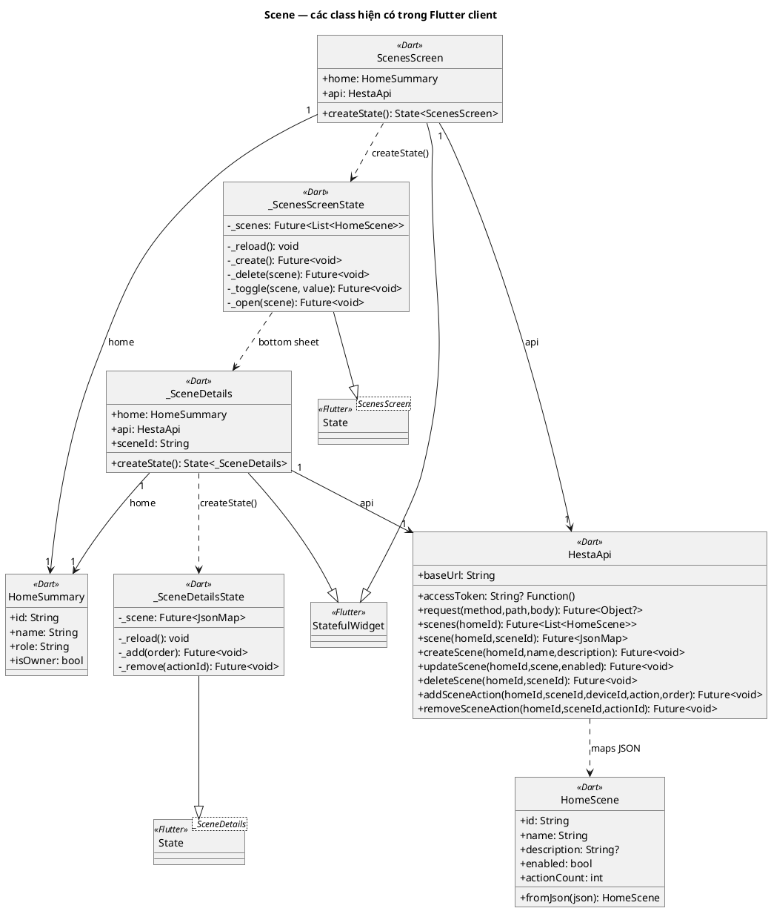

</details>

### C12. Scene & Automation — authorization, capability inheritance và enums thực tế

[PlantUML](diagrams/scene-automation/C12_direct_support.puml) · [SVG](diagrams/scene-automation/C12_direct_support.svg)

Source: [Device.java](../src/main/java/com/hesta/backend/entity/Device.java), [DeviceCapabilities.java](../src/main/java/com/hesta/backend/entity/DeviceCapabilities.java), [HomeAuthorizationService.java](../src/main/java/com/hesta/backend/service/HomeAuthorizationService.java), [HomeMember.java](../src/main/java/com/hesta/backend/entity/HomeMember.java), [Home.java](../src/main/java/com/hesta/backend/entity/Home.java), [User.java](../src/main/java/com/hesta/backend/entity/User.java), [HomeRepository.java](../src/main/java/com/hesta/backend/repository/HomeRepository.java), [HomeMemberRepository.java](../src/main/java/com/hesta/backend/repository/HomeMemberRepository.java).


<details>
<summary>PlantUML source</summary>

```plantuml
@startuml C12_direct_support
title Scene & Automation — authorization, capability inheritance và enums thực tế
skinparam backgroundColor white
skinparam shadowing false
skinparam roundcorner 0
skinparam defaultFontName Arial
skinparam sequenceMessageAlign left
skinparam maxMessageSize 190
hide footbox
hide circle
skinparam classAttributeIconSize 0
class Device {
  - id: UUID
  - room: Room
  - node: EdgeNode
  - capabilities: DeviceCapabilities
  + getHome(): Home
  + supportsAction(String action): boolean
}
class DeviceCapabilities {
}
class HomeAuthorizationService {
  - homeRepository: HomeRepository
  - homeMemberRepository: HomeMemberRepository
  + requireAccess(UUID userId, UUID homeId): Home
  + requireSceneManagement(UUID userId, UUID homeId): Home
}
class HomeMember {
  - id: UUID
  - home: Home
  - user: User
  - role: HomeRole
  - status: MemberStatus
}
class Home {
  - id: UUID
}
class User {
  - id: UUID
}
interface HomeRepository {
}
interface HomeMemberRepository {
  + findByHomeIdAndUserId(UUID homeId, UUID userId): Optional<HomeMember>
}
class "HashMap<String,List<String>>" as HashMap <<Java>>
DeviceCapabilities --|> HashMap
Device "1" --> "0..1" DeviceCapabilities : capabilities
HomeAuthorizationService "1" --> "1" HomeRepository : homeRepository
HomeAuthorizationService "1" --> "1" HomeMemberRepository : homeMemberRepository
HomeMember "0..*" --> "1" Home : home
HomeMember "0..*" --> "1" User : user
enum TriggerType {
  SENSOR
  EVENT
  SCHEDULE
}
enum ConditionOperator {
  EQ
  NE
  GT
  GTE
  LT
  LTE
}
enum LogicalOperator {
  AND
  OR
}
enum ExecutionStatus {
  PENDING
  SUCCESS
  PARTIAL
  FAILED
  SKIPPED
}
enum StateChangeSource {
  MANUAL
  VOICE
  GESTURE
  SCENE
  AUTOMATION
  SCHEDULE
  TEST
}
class AutomationRule
class RuleCondition
class SceneExecution
class AutomationExecution
interface DeviceCommandService
AutomationRule ..> TriggerType : triggerType
RuleCondition ..> ConditionOperator : operator
RuleCondition ..> LogicalOperator : logicalOperator
SceneExecution ..> ExecutionStatus : status
AutomationExecution ..> ExecutionStatus : status
DeviceCommandService ..> StateChangeSource : source parameter
note bottom of Device
supportsAction(action): capabilities null/empty -> true;
otherwise flatten values and any equalsIgnoreCase(action).
end note
@enduml
```

</details>

### C13. Scene & Automation — HTTP envelope, principal và exception handling

[PlantUML](diagrams/scene-automation/C13_http_support.puml) · [SVG](diagrams/scene-automation/C13_http_support.svg)

Source: [CustomUserDetails.java](../src/main/java/com/hesta/backend/security/CustomUserDetails.java), [ApiResponse.java](../src/main/java/com/hesta/backend/dto/response/ApiResponse.java), [AppException.java](../src/main/java/com/hesta/backend/exception/AppException.java), [GlobalExceptionHandler.java](../src/main/java/com/hesta/backend/exception/GlobalExceptionHandler.java), [ErrorCode.java](../src/main/java/com/hesta/backend/exception/ErrorCode.java).


<details>
<summary>PlantUML source</summary>

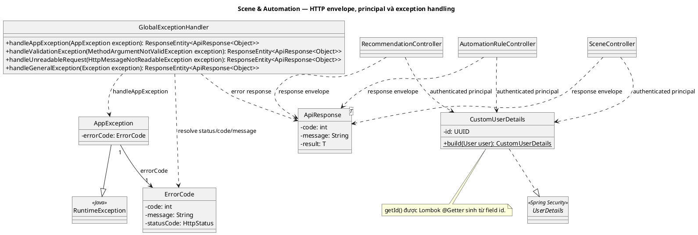

</details>

### C14. Scene & Automation — dữ liệu Behavior trực tiếp tham gia recording, override và recommendation

[PlantUML](diagrams/scene-automation/C14_behavior_data.puml) · [SVG](diagrams/scene-automation/C14_behavior_data.svg)

Source: [BehaviorService.java](../src/main/java/com/hesta/backend/service/BehaviorService.java), [BehaviorServiceImpl.java](../src/main/java/com/hesta/backend/service/impl/BehaviorServiceImpl.java), [BehaviorEvent.java](../src/main/java/com/hesta/backend/entity/BehaviorEvent.java), [DeviceStateHistory.java](../src/main/java/com/hesta/backend/entity/DeviceStateHistory.java), [BehaviorEventRepository.java](../src/main/java/com/hesta/backend/repository/BehaviorEventRepository.java), [DeviceStateHistoryRepository.java](../src/main/java/com/hesta/backend/repository/DeviceStateHistoryRepository.java), [DeviceRepository.java](../src/main/java/com/hesta/backend/repository/DeviceRepository.java), [HomeAuthorizationService.java](../src/main/java/com/hesta/backend/service/HomeAuthorizationService.java), [Device.java](../src/main/java/com/hesta/backend/entity/Device.java), [Home.java](../src/main/java/com/hesta/backend/entity/Home.java), [Room.java](../src/main/java/com/hesta/backend/entity/Room.java), [User.java](../src/main/java/com/hesta/backend/entity/User.java).


<details>
<summary>PlantUML source</summary>

```plantuml
@startuml C14_behavior_data
title Scene & Automation — dữ liệu Behavior trực tiếp tham gia recording, override và recommendation
skinparam backgroundColor white
skinparam shadowing false
skinparam roundcorner 0
skinparam defaultFontName Arial
skinparam sequenceMessageAlign left
skinparam maxMessageSize 190
hide footbox
hide circle
skinparam classAttributeIconSize 0
interface BehaviorService {
  + detectPatterns(UUID userId, UUID homeId, OffsetDateTime from, OffsetDateTime to): List<BehaviorPatternResponse>
  + predict(UUID userId, UUID homeId, OffsetDateTime from, OffsetDateTime to, OffsetDateTime at): List<BehaviorPredictionResponse>
}
class BehaviorServiceImpl {
  - homeAuthorizationService: HomeAuthorizationService
  - deviceRepository: DeviceRepository
  - eventRepository: BehaviorEventRepository
  + detectPatterns(UUID userId, UUID homeId, OffsetDateTime from, OffsetDateTime to): List<BehaviorPatternResponse>
  + predict(UUID userId, UUID homeId, OffsetDateTime from, OffsetDateTime to, OffsetDateTime at): List<BehaviorPredictionResponse>
  - window(LocalTime time): String
  - pattern(PatternKey key, List<BehaviorEvent> events, long totalDays): BehaviorPatternResponse
}
class BehaviorEvent {
  - id: UUID
  - home: Home
  - user: User
  - room: Room
  - device: Device
  - eventType: String
  - action: String
  - previousState: Map<String, Object>
  - currentState: Map<String, Object>
  - eventSource: String
  - datasetKey: String
  - occurredAt: OffsetDateTime
}
class DeviceStateHistory {
  - id: UUID
  - device: Device
  - previousState: Map<String, Object>
  - newState: Map<String, Object>
  - source: StateChangeSource
  - changedBy: User
  - isTest: Boolean
  - changedAt: OffsetDateTime
}
interface BehaviorEventRepository {
  + findTopByDeviceIdAndEventTypeOrderByOccurredAtDesc(UUID deviceId, String eventType): java.util.Optional<BehaviorEvent>
  + findTop100ByDeviceIdAndEventTypeOrderByOccurredAtDesc(UUID deviceId, String eventType): List<BehaviorEvent>
  + findAllByHomeIdAndOccurredAtBetweenOrderByOccurredAtAsc(UUID homeId, OffsetDateTime from, OffsetDateTime to): List<BehaviorEvent>
}
interface DeviceStateHistoryRepository {
}
interface DeviceRepository {
}
class HomeAuthorizationService {
  + requireAccess(UUID userId, UUID homeId): Home
}
class Device {
  - id: UUID
}
class Home {
  - id: UUID
}
class Room {
  - id: UUID
}
class User {
  - id: UUID
}

BehaviorServiceImpl ..|> BehaviorService
BehaviorServiceImpl "1" --> "1" HomeAuthorizationService : homeAuthorizationService
BehaviorServiceImpl "1" --> "1" BehaviorEventRepository : eventRepository
BehaviorServiceImpl "1" --> "1" DeviceRepository : deviceRepository
BehaviorEventRepository ..> BehaviorEvent : persistence / override queries
DeviceStateHistoryRepository ..> DeviceStateHistory : persistence
BehaviorEvent "0..*" --> "1" Home : home
BehaviorEvent "0..*" --> "0..1" Device : device
BehaviorEvent "0..*" --> "0..1" Room : room
BehaviorEvent "0..*" --> "0..1" User : user
DeviceStateHistory "0..*" --> "1" Device : device
DeviceStateHistory "0..*" --> "0..1" User : changedBy
note bottom of BehaviorServiceImpl
Chỉ predict()/detectPatterns() là integration trực tiếp với RecommendationService.
BehaviorPattern entity không được persist bởi các method này.
end note
@enduml
```

</details>

## 4. Sequence dùng chung: quyền và lỗi HTTP

### Q01. Quyền truy cập dùng chung; break dừng API

[PlantUML](diagrams/scene-automation/Q01_authorization.puml) · [SVG](diagrams/scene-automation/Q01_authorization.svg)

Source: [HomeAuthorizationService.java](../src/main/java/com/hesta/backend/service/HomeAuthorizationService.java), [HomeRepository.java](../src/main/java/com/hesta/backend/repository/HomeRepository.java), [HomeMemberRepository.java](../src/main/java/com/hesta/backend/repository/HomeMemberRepository.java).


<details>
<summary>PlantUML source</summary>

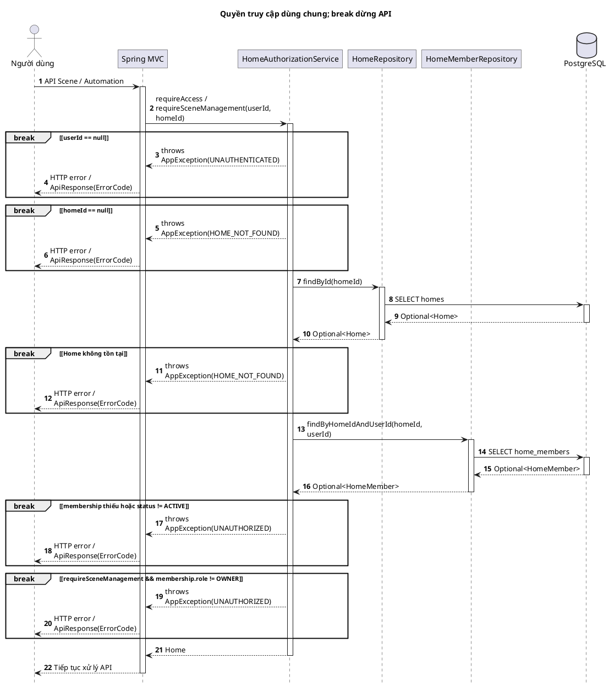

</details>

### Q02. HTTP validation và chuyển exception thành ApiResponse

[PlantUML](diagrams/scene-automation/Q02_http_errors.puml) · [SVG](diagrams/scene-automation/Q02_http_errors.svg)

Source: [GlobalExceptionHandler.java](../src/main/java/com/hesta/backend/exception/GlobalExceptionHandler.java), [SceneController.java](../src/main/java/com/hesta/backend/controller/SceneController.java), [AutomationRuleController.java](../src/main/java/com/hesta/backend/controller/AutomationRuleController.java).


<details>
<summary>PlantUML source</summary>

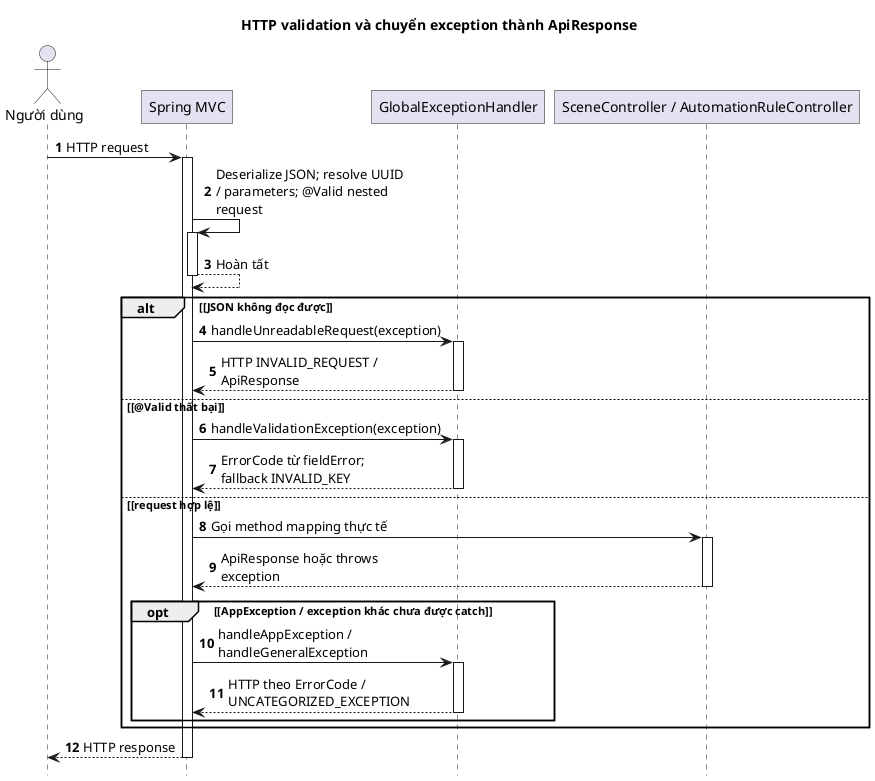

</details>

## 5. Sequence Diagrams — Scene

### S01. Scene — tạo, sửa và bật/tắt qua PUT

[PlantUML](diagrams/scene-automation/S01_write.puml) · [SVG](diagrams/scene-automation/S01_write.svg)

Source: [SceneController.java](../src/main/java/com/hesta/backend/controller/SceneController.java), [SceneServiceImpl.java](../src/main/java/com/hesta/backend/service/impl/SceneServiceImpl.java).


<details>
<summary>PlantUML source</summary>

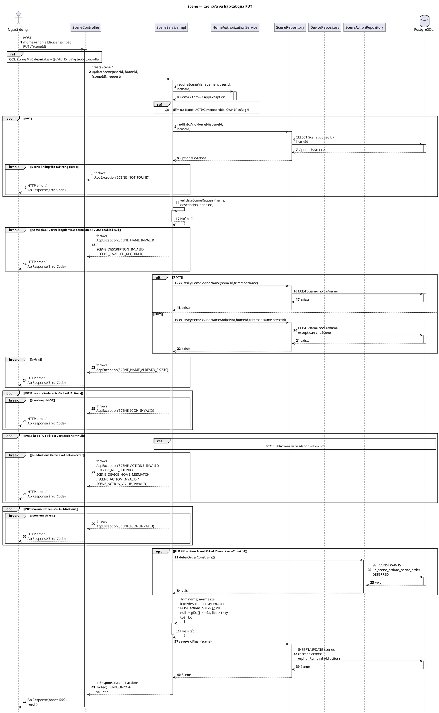

</details>

### S02. Scene — buildActions và kiểm tra capability/value

[PlantUML](diagrams/scene-automation/S02_action_validation.puml) · [SVG](diagrams/scene-automation/S02_action_validation.svg)

Source: [SceneServiceImpl.java](../src/main/java/com/hesta/backend/service/impl/SceneServiceImpl.java), [Device.java](../src/main/java/com/hesta/backend/entity/Device.java).


<details>
<summary>PlantUML source</summary>

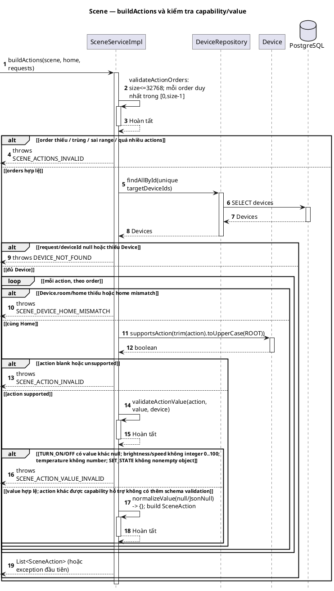

</details>

### S03. Scene — danh sách, chi tiết và action types

[PlantUML](diagrams/scene-automation/S03_read.puml) · [SVG](diagrams/scene-automation/S03_read.svg)

Source: [SceneController.java](../src/main/java/com/hesta/backend/controller/SceneController.java), [SceneServiceImpl.java](../src/main/java/com/hesta/backend/service/impl/SceneServiceImpl.java).


<details>
<summary>PlantUML source</summary>

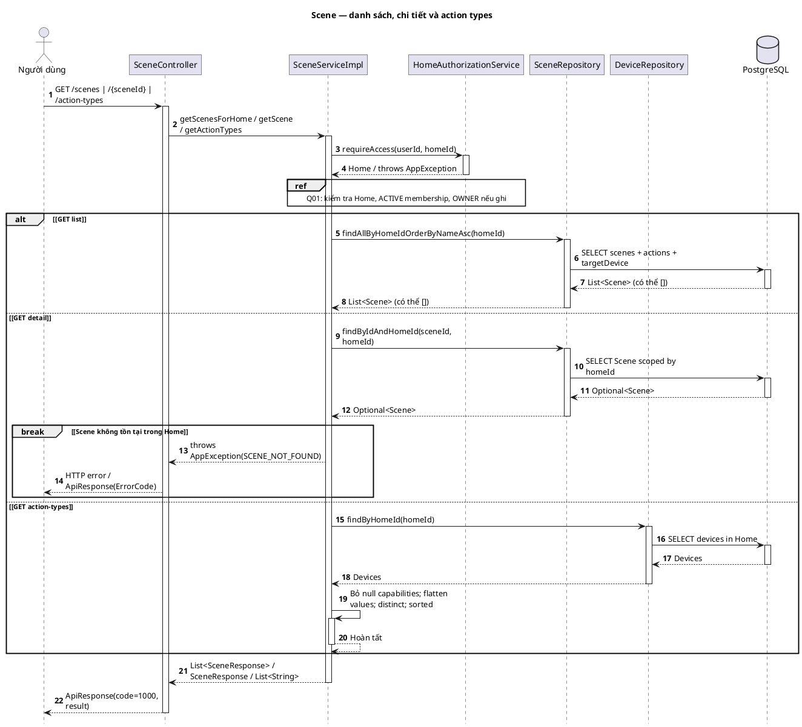

</details>

### S04. Scene — xóa và chặn Scene đang được Rule tham chiếu

[PlantUML](diagrams/scene-automation/S04_delete.puml) · [SVG](diagrams/scene-automation/S04_delete.svg)

Source: [SceneServiceImpl.java](../src/main/java/com/hesta/backend/service/impl/SceneServiceImpl.java), [Scene.java](../src/main/java/com/hesta/backend/entity/Scene.java), [SceneExecution.java](../src/main/java/com/hesta/backend/entity/SceneExecution.java).


<details>
<summary>PlantUML source</summary>

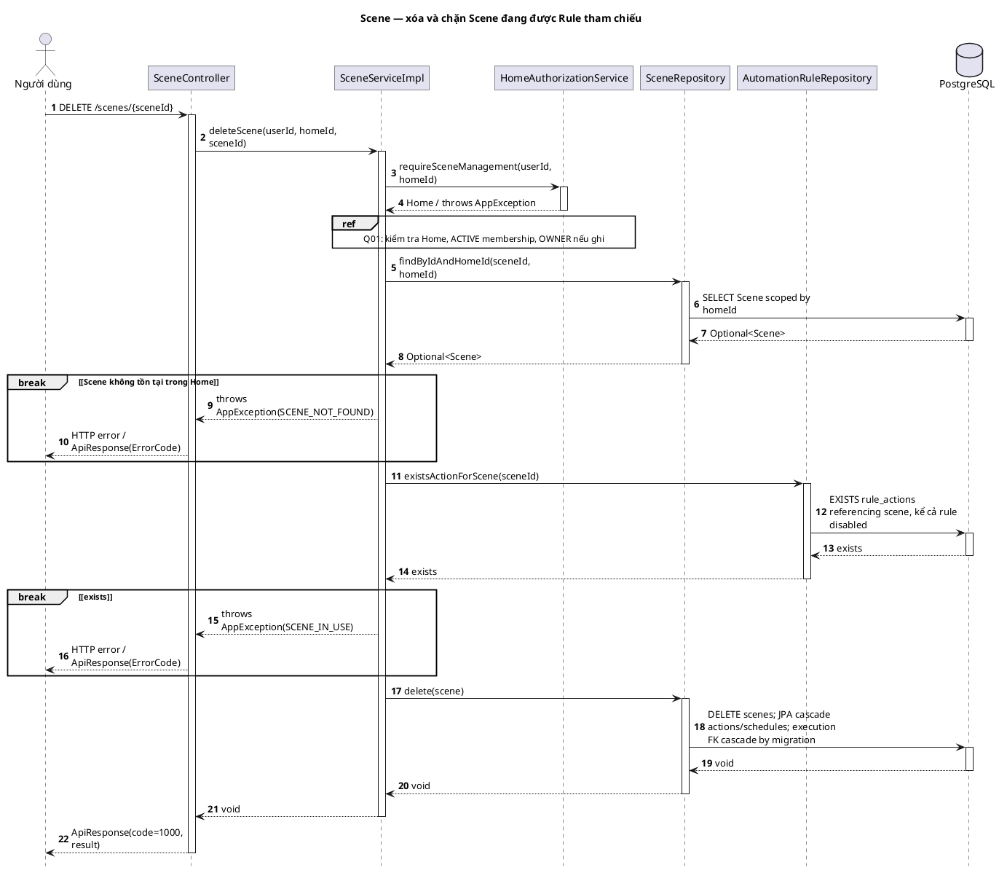

</details>

### S05. Scene — chèn, xóa và sắp thứ tự actions

[PlantUML](diagrams/scene-automation/S05_actions.puml) · [SVG](diagrams/scene-automation/S05_actions.svg)

Source: [SceneServiceImpl.java](../src/main/java/com/hesta/backend/service/impl/SceneServiceImpl.java), [SceneActionRepository.java](../src/main/java/com/hesta/backend/repository/SceneActionRepository.java).


<details>
<summary>PlantUML source</summary>

```plantuml
@startuml S05_actions
title Scene — chèn, xóa và sắp thứ tự actions
skinparam backgroundColor white
skinparam shadowing false
skinparam roundcorner 0
skinparam defaultFontName Arial
skinparam sequenceMessageAlign left
skinparam maxMessageSize 190
hide footbox
autonumber
actor "Người dùng" as U
participant "SceneController" as C
participant "SceneServiceImpl" as S
participant "HomeAuthorizationService" as Auth
participant "SceneRepository" as SR
participant "DeviceRepository" as DR
participant "SceneActionRepository" as AR
database "PostgreSQL" as DB
U -> C: POST actions / DELETE actions/{actionId} / PUT actions/reorder
activate C
ref over U, C
Q02: Spring MVC deserialize + @Valid; lỗi dừng trước controller
end ref
C -> S: addAction / removeAction / reorderActions
activate S
S -> Auth: requireSceneManagement(userId, homeId)
activate Auth
Auth --> S: Home / throws AppException
deactivate Auth
ref over S, Auth
Q01: kiểm tra Home, ACTIVE membership, OWNER nếu ghi
end ref
S -> SR: findByIdAndHomeId(sceneId, homeId)
activate SR
SR -> DB: SELECT Scene scoped by homeId
activate DB
DB --> SR: Optional<Scene>
deactivate DB
SR --> S: Optional<Scene>
deactivate SR
break ~[Scene không tồn tại trong Home~]
S --> C: throws AppException(SCENE_NOT_FOUND)
C --> U: HTTP error / ApiResponse(ErrorCode)
end
alt ~[addAction~]
break ~[order null/<0/>actionCount; actionCount>32767~]
S --> C: throws AppException(SCENE_ACTION_ORDER_INVALID)
C --> U: HTTP error / ApiResponse(ErrorCode)
end
S -> DR: findById(request.targetDeviceId)
activate DR
DR -> DB: SELECT device
activate DB
DB --> DR: Optional<Device>
deactivate DB
DR --> S: Optional<Device>
deactivate DR
break ~[targetDeviceId null hoặc Device thiếu~]
S --> C: throws AppException(DEVICE_NOT_FOUND)
C --> U: HTTP error / ApiResponse(ErrorCode)
end
ref over S, DR
S02: buildAction same-home, capability/value (single device lookup)
end ref
opt ~[existingCount + 1 >1~]
S -> AR: deferOrderConstraint()
activate AR
AR -> DB: SET CONSTRAINTS ... DEFERRED
activate DB
DB --> AR: void
deactivate DB
AR --> S: void
deactivate AR
end
S -> S: Shift orders >= insertion order lên 1; add newAction
activate S
S --> S: Hoàn tất
deactivate S
else ~[removeAction~]
S -> S: Tìm actionId trong scene.actions
activate S
S --> S: Hoàn tất
deactivate S
break ~[action không thuộc Scene~]
S --> C: throws AppException(SCENE_ACTION_NOT_FOUND)
C --> U: HTTP error / ApiResponse(ErrorCode)
end
opt ~[existingCount >1~]
S -> AR: deferOrderConstraint()
activate AR
AR -> DB: SET CONSTRAINTS ... DEFERRED
activate DB
DB --> AR: void
deactivate DB
AR --> S: void
deactivate AR
end
S -> S: Remove child; shift orders > removedOrder xuống 1
activate S
S --> S: Hoàn tất
deactivate S
else ~[reorderActions~]
S -> S: validateReorderPayload(actions, actionIds)
activate S
S --> S: Hoàn tất
deactivate S
break ~[list null; size mismatch; duplicate; set IDs != existing IDs~]
S --> C: throws AppException(SCENE_REORDER_INVALID)
C --> U: HTTP error / ApiResponse(ErrorCode)
end
opt ~[existingCount >1~]
S -> AR: deferOrderConstraint()
activate AR
AR -> DB: SET CONSTRAINTS ... DEFERRED
activate DB
DB --> AR: void
deactivate DB
AR --> S: void
deactivate AR
end
S -> S: Assign order 0..n-1 theo requested IDs; sort actions
activate S
S --> S: Hoàn tất
deactivate S
end
S -> SR: saveAndFlush(scene)
activate SR
SR -> DB: Flush Scene/action insert, update or orphan delete
activate DB
DB --> SR: Scene
deactivate DB
SR --> S: Scene
deactivate SR
S --> C: SceneActionResponse / void / SceneResponse
deactivate S
C --> U: ApiResponse(code=1000, result)
deactivate C
@enduml
```

</details>

### S06. Scene — lịch sử thực thi

[PlantUML](diagrams/scene-automation/S06_history.puml) · [SVG](diagrams/scene-automation/S06_history.svg)

Source: [SceneExecutionServiceImpl.java](../src/main/java/com/hesta/backend/service/impl/SceneExecutionServiceImpl.java), [SceneExecutionRepository.java](../src/main/java/com/hesta/backend/repository/SceneExecutionRepository.java).


<details>
<summary>PlantUML source</summary>

```plantuml
@startuml S06_history
title Scene — lịch sử thực thi
skinparam backgroundColor white
skinparam shadowing false
skinparam roundcorner 0
skinparam defaultFontName Arial
skinparam sequenceMessageAlign left
skinparam maxMessageSize 190
hide footbox
autonumber
actor "Người dùng" as U
participant "SceneController" as C
participant "SceneExecutionServiceImpl" as S
participant "HomeAuthorizationService" as Auth
participant "SceneRepository" as SR
participant "SceneExecutionRepository" as ER
database "PostgreSQL" as DB
U -> C: GET /scenes/{sceneId}/executions
activate C
C -> S: history(userId, homeId, sceneId)
activate S
S -> Auth: requireAccess(userId, homeId)
activate Auth
Auth --> S: Home / throws AppException
deactivate Auth
ref over S, Auth
Q01: kiểm tra Home, ACTIVE membership, OWNER nếu ghi
end ref
S -> SR: findByIdAndHomeId(sceneId, homeId)
activate SR
SR -> DB: SELECT Scene scoped by homeId
activate DB
DB --> SR: Optional<Scene>
deactivate DB
SR --> S: Optional<Scene>
deactivate SR
break ~[Scene không tồn tại trong Home~]
S --> C: throws AppException(SCENE_NOT_FOUND)
C --> U: HTTP error / ApiResponse(ErrorCode)
end
S -> ER: findTop100BySceneIdOrderByStartedAtDesc(sceneId)
activate ER
ER -> DB: SELECT latest 100 scene_executions
activate DB
DB --> ER: List<SceneExecution>
deactivate DB
ER --> S: List<SceneExecution>
deactivate ER
S --> C: List<SceneExecutionResponse> (có thể [])
deactivate S
C --> U: ApiResponse(code=1000, result)
deactivate C
@enduml
```

</details>

### S07. Scene — run: actions, override, command errors và execution history

[PlantUML](diagrams/scene-automation/S07_execution.puml) · [SVG](diagrams/scene-automation/S07_execution.svg)

Source: [SceneExecutionServiceImpl.java](../src/main/java/com/hesta/backend/service/impl/SceneExecutionServiceImpl.java).


<details>
<summary>PlantUML source</summary>

```plantuml
@startuml S07_execution
title Scene — run: actions, override, command errors và execution history
skinparam backgroundColor white
skinparam shadowing false
skinparam roundcorner 0
skinparam defaultFontName Arial
skinparam sequenceMessageAlign left
skinparam maxMessageSize 190
hide footbox
autonumber
participant "SceneExecutionServiceImpl" as S
participant "ManualOverrideService" as O
participant "DeviceCommandService" as CMD
participant "CompletableFuture<CommandResult>" as F
participant "BehaviorEventRecorder" as B
participant "SceneExecutionRepository" as ER
database "PostgreSQL" as DB
[-> S: run(scene,trigger,source)
activate S
alt ~[!scene.enabled~]
S -->[: throws SCENE_DISABLED; không execution row
else ~[enabled~]
S -> S: started=now; details=[]; attempted=0; successes=0; actions sorted order
activate S
S --> S: Hoàn tất
deactivate S
loop ~[mỗi SceneAction~]
opt ~[trigger != MANUAL~]
S -> O: isActive(targetDeviceId)
activate O
O --> S: boolean
deactivate O
ref over S, O, DB
I02: manual override 30 minutes
end ref
end
alt ~[nonmanual && override active~]
S -> S: detail SKIPPED_OVERRIDE; continue
activate S
S --> S: Hoàn tất
deactivate S
else ~[manual hoặc không override~]
S -> S: attempted++; parameters: brightness→level, speed→speed,\ntemperature→temperature, SET_STATE→map, null/other→{}
activate S
S --> S: Hoàn tất
deactivate S
S -> CMD: sendCommand(deviceId,action,parameters,source)
activate CMD
CMD --> S: future
deactivate CMD
ref over CMD, F
I01 hoặc I05: DeviceCommandService integration
end ref
S -> F: join()
activate F
F --> S: CommandResult / RuntimeException
deactivate F
alt ~[parameters/send/join RuntimeException~]
S -> S: detail FAILED / Device command failed; continue
activate S
S --> S: Hoàn tất
deactivate S
else ~[result.success == false~]
S -> S: Copy result.status/errorCode/message/commandId; continue
activate S
S --> S: Hoàn tất
deactivate S
else ~[result.success~]
S -> S: successes++; detail success/status/commandId
activate S
S --> S: Hoàn tất
deactivate S
S -> B: recordCommand(device,action,source,result)
activate B
B --> S: void / RuntimeException (caught; log)
deactivate B
ref over S, B, DB
I03: REQUIRES_NEW command recording
end ref
end
end
S -> S: Append detail
activate S
S --> S: Hoàn tất
deactivate S
end
S -> S: attempted==0→SKIPPED; successes==actions.size→SUCCESS;\nsuccesses==0→FAILED; otherwise PARTIAL
activate S
S --> S: Hoàn tất
deactivate S
S -> ER: save(SceneExecution)
activate ER
ER -> DB: INSERT scene,trigger,status,started/completed,resultDetail
activate DB
DB --> ER: SceneExecution
deactivate DB
ER --> S: SceneExecution
deactivate ER
S -->[: SceneExecutionResponse
end
deactivate S
@enduml
```

</details>

### S08. Scene — xem, tạo, sửa, bật/tắt và xóa lịch

[PlantUML](diagrams/scene-automation/S08_schedules.puml) · [SVG](diagrams/scene-automation/S08_schedules.svg)

Source: [ScheduleServiceImpl.java](../src/main/java/com/hesta/backend/service/impl/ScheduleServiceImpl.java), [SceneController.java](../src/main/java/com/hesta/backend/controller/SceneController.java).


<details>
<summary>PlantUML source</summary>

```plantuml
@startuml S08_schedules
title Scene — xem, tạo, sửa, bật/tắt và xóa lịch
skinparam backgroundColor white
skinparam shadowing false
skinparam roundcorner 0
skinparam defaultFontName Arial
skinparam sequenceMessageAlign left
skinparam maxMessageSize 190
hide footbox
autonumber
actor "Người dùng" as U
participant "SceneController" as C
participant "ScheduleServiceImpl" as S
participant "HomeAuthorizationService" as Auth
participant "SceneRepository" as P
participant "SceneScheduleRepository" as SR
database "PostgreSQL" as DB
U -> C: GET / POST / PUT / DELETE Scene schedules
activate C
ref over U, C
Q02: Spring MVC deserialize + @Valid; lỗi dừng trước controller
end ref
C -> S: sceneSchedules / saveSceneSchedule / deleteSceneSchedule
activate S
alt ~[GET~]
S -> Auth: requireAccess(userId, homeId)
activate Auth
Auth --> S: Home / throws AppException
deactivate Auth
ref over S, Auth
Q01: kiểm tra Home, ACTIVE membership, OWNER nếu ghi
end ref
else ~[POST/PUT/DELETE~]
S -> Auth: requireSceneManagement(userId, homeId)
activate Auth
Auth --> S: Home / throws AppException
deactivate Auth
ref over S, Auth
Q01: kiểm tra Home, ACTIVE membership, OWNER nếu ghi
end ref
end
S -> P: findByIdAndHomeId(sceneId, homeId)
activate P
P -> DB: SELECT Scene scoped by homeId
activate DB
DB --> P: Optional<Scene>
deactivate DB
P --> S: Optional<Scene>
deactivate P
break ~[Scene không tồn tại trong Home~]
S --> C: throws AppException(SCENE_NOT_FOUND)
C --> U: HTTP error / ApiResponse(ErrorCode)
end
alt ~[GET~]
S -> SR: findAllBySceneIdOrderByScheduledTimeAsc(sceneId)
activate SR
SR -> DB: SELECT schedules sorted by time
activate DB
DB --> SR: List<Schedule>
deactivate DB
SR --> S: List<Schedule>
deactivate SR
else ~[POST/PUT~]
S -> S: validate(request): time/days/active nonnull; <=7 unique days, range 1..7
activate S
S --> S: Hoàn tất
deactivate S
break ~[schedule payload invalid~]
S --> C: throws AppException(SCENE_SCHEDULE_INVALID)
C --> U: HTTP error / ApiResponse(ErrorCode)
end
alt ~[scheduleId == null: POST~]
S -> S: Build new Scene schedule with parent
activate S
S --> S: Hoàn tất
deactivate S
else ~[PUT~]
S -> SR: findById(scheduleId)
activate SR
SR -> DB: SELECT schedule
activate DB
DB --> SR: Optional<Schedule>
deactivate DB
SR --> S: Optional<Schedule>
deactivate SR
break ~[missing schedule hoặc parentId mismatch~]
S --> C: throws AppException(SCENE_SCHEDULE_NOT_FOUND)
C --> U: HTTP error / ApiResponse(ErrorCode)
end
end
S -> S: Normalize scheduledTime.withSecond(0).withNano(0); set repeatDays, active
activate S
S --> S: Hoàn tất
deactivate S
S -> SR: save(schedule)
activate SR
SR -> DB: INSERT/UPDATE schedule
activate DB
DB --> SR: Schedule
deactivate DB
SR --> S: Schedule
deactivate SR
else ~[DELETE~]
S -> SR: findById(scheduleId)
activate SR
SR -> DB: SELECT schedule
activate DB
DB --> SR: Optional<Schedule>
deactivate DB
SR --> S: Optional<Schedule>
deactivate SR
break ~[missing schedule hoặc parentId mismatch~]
S --> C: throws AppException(SCENE_SCHEDULE_NOT_FOUND)
C --> U: HTTP error / ApiResponse(ErrorCode)
end
S -> SR: delete(schedule)
activate SR
SR -> DB: DELETE schedule
activate DB
DB --> SR: void
deactivate DB
SR --> S: void
deactivate SR
end
opt ~[GET/POST/PUT response~]
S -> S: build response: inactive -> nextRunAt=null; active -> nextRun(time, days)
activate S
S --> S: Hoàn tất
deactivate S
loop ~[offset 0..7, dừng ở candidate đầu tiên hợp lệ~]
S -> S: ZoneId(zoneName); candidate > now && (days=[] hoặc day thuộc days)
activate S
S --> S: nextRunAt hoặc null
deactivate S
end
end
S --> C: ScheduleResponse / List<ScheduleResponse> / void
deactivate S
C --> U: ApiResponse(code=1000, result)
deactivate C
@enduml
```

</details>

### U01. Scene — React workflow và tính năng chỉ ở client

[PlantUML](diagrams/scene-automation/U01_scene_web.puml) · [SVG](diagrams/scene-automation/U01_scene_web.svg)

Source: [ScenePage.tsx](../../frontend_hesta/src/components/scene/ScenePage.tsx), [SceneManagement.tsx](../../frontend_hesta/src/components/home/SceneManagement.tsx), [SceneEditorModal.tsx](../../frontend_hesta/src/components/scene/SceneEditorModal.tsx), [sceneActions.ts](../../frontend_hesta/src/components/scene/sceneActions.ts).


<details>
<summary>PlantUML source</summary>

```plantuml
@startuml U01_scene_web
title Scene — React workflow và tính năng chỉ ở client
skinparam backgroundColor white
skinparam shadowing false
skinparam roundcorner 0
skinparam defaultFontName Arial
skinparam sequenceMessageAlign left
skinparam maxMessageSize 190
hide footbox
autonumber
actor "Người dùng" as U
participant "SceneWorkspace / SceneManagement / SceneEditorModal" as UI
participant "sceneActions.ts" as B
participant "sceneApi.ts" as API
participant "apiClient / featureRequest" as HTTP
participant "SceneController" as C
U -> UI: mở workspace/modal hoặc thao tác Scene
activate UI
alt ~[load list/options/detail~]
UI -> API: getScenes/listScenes, getDevices, getSceneActionTypes; opt getScene
activate API
API --> UI: Scene/options
deactivate API
ref over API, C
S03: backend reads; API calls Promise.all cho options
end ref
else ~[search/filter/preset/icon/draft edit~]
UI -> UI: Search name/description case-insensitive; filter all/enabled/disabled;\npreset chỉ set name/icon/description; icon picker; add/update/remove/reorder local draft
activate UI
UI --> UI: Hoàn tất
deactivate UI
else ~[submit create/update~]
loop ~[draft actions, index -> order~]
UI -> B: buildSceneActionInput(item,order,devices,allowedTypes)
activate B
B --> UI: SceneActionRequest / Error
deactivate B
end
alt ~[blank name ở modal hoặc builder validation lỗi~]
UI -> UI: Set error; return; không HTTP
activate UI
UI --> UI: Hoàn tất
deactivate UI
else ~[valid input~]
UI -> API: createScene / updateScene(homeId,sceneId,input)
activate API
API --> UI: SceneResponse / Error
deactivate API
ref over API, C
S01: create/update; actions=[] hoặc full replacement
end ref
UI -> UI: Update local scene; modal onClose; workspace reload options
activate UI
UI --> UI: Hoàn tất
deactivate UI
end
else ~[toggle enabled~]
UI -> B: sceneToggleInput(scene)
activate B
B --> UI: name/icon/description, !enabled; omit actions
deactivate B
UI -> API: updateScene(homeId,scene.id,input)
activate API
API --> UI: SceneResponse / Error
deactivate API
else ~[delete / immediate action modification~]
alt ~[delete confirmation cancelled hoặc reorder target out of bounds~]
UI -> UI: return
activate UI
UI --> UI: Hoàn tất
deactivate UI
else ~[confirmed/valid~]
UI -> API: deleteScene / addSceneAction / removeSceneAction / reorderSceneActions
activate API
API --> UI: void / SceneActionResponse / SceneResponse / Error
deactivate API
ref over API, C
S04/S05; add/remove -> refreshScene(getScene); reorder -> update local
end ref
end
else ~[execute/history/schedules~]
UI -> API: executeScene / getSceneExecutions
activate API
API --> UI: Execution / List<Execution> / Error
deactivate API
ref over API, C
S06/S07; schedule opens SchedulePanel, U03
end ref
UI -> UI: Display status/count; run refreshes open history; history toggle can close locally
activate UI
UI --> UI: Hoàn tất
deactivate UI
end
ref over API, HTTP, C
U06: HTTP transport nằm bên trong mỗi API call ở trên
end ref
opt ~[Error~]
UI -> UI: Set error; preserve form; reset saving/running/toggling in finally
activate UI
UI --> UI: Hoàn tất
deactivate UI
end
UI --> U: Render result/error/local state
deactivate UI
@enduml
```

</details>

### U05. Scene — Flutter implementation hiện tại

[PlantUML](diagrams/scene-automation/U05_scene_flutter.puml) · [SVG](diagrams/scene-automation/U05_scene_flutter.svg)

Source: [scenes_screen.dart](../../app_hesta/lib/screens/scenes_screen.dart), [api.dart](../../app_hesta/lib/core/api.dart).


<details>
<summary>PlantUML source</summary>

```plantuml
@startuml U05_scene_flutter
title Scene — Flutter implementation hiện tại
skinparam backgroundColor white
skinparam shadowing false
skinparam roundcorner 0
skinparam defaultFontName Arial
skinparam sequenceMessageAlign left
skinparam maxMessageSize 190
hide footbox
autonumber
actor "Người dùng" as U
participant "_ScenesScreenState / _SceneDetailsState" as UI
participant "HestaApi" as API
participant "SceneController" as C
U -> UI: mở/refresh Scene, create, toggle, delete, add/remove action
activate UI
alt ~[list/detail~]
UI -> API: scenes(home.id) / scene(home.id,sceneId)
activate API
API --> UI: HomeScene list / JsonMap
deactivate API
else ~[create~]
UI -> UI: Dialog name/description; trim; cancelled/blank -> return
activate UI
UI --> UI: Hoàn tất
deactivate UI
UI -> API: createScene(homeId,name,description)
activate API
API --> UI: void / ApiException
deactivate API
else ~[toggle~]
UI -> API: updateScene(homeId,scene,enabled)
activate API
API --> UI: void / ApiException
deactivate API
else ~[delete Scene / remove action~]
alt ~[confirmation cancelled~]
UI -> UI: return
activate UI
UI --> UI: Hoàn tất
deactivate UI
else ~[confirmed~]
UI -> API: deleteScene / removeSceneAction
activate API
API --> UI: void / ApiException
deactivate API
end
else ~[add action~]
UI -> API: devices(homeId)
activate API
API --> UI: Devices / ApiException
deactivate API
alt ~[Devices empty hoặc unmounted/dialog cancelled~]
UI -> UI: Show message or return
activate UI
UI --> UI: Hoàn tất
deactivate UI
else ~[selection~]
UI -> API: addSceneAction(homeId,sceneId,deviceId,TURN_ON|TURN_OFF,order=actions.length)
activate API
API --> UI: void / ApiException
deactivate API
end
end
ref over API, C
S01/S03/S04/S05: same backend contracts
end ref
opt ~[success && mounted~]
UI -> UI: _reload(); snackbar where implemented
activate UI
UI --> UI: Hoàn tất
deactivate UI
end
opt ~[ApiException/error~]
UI -> UI: FutureBuilder error or snackbar if mounted
activate UI
UI --> UI: Hoàn tất
deactivate UI
end
UI --> U: Scene/list/dialog result
deactivate UI
note over UI
Flutter Scene UI có read/create/toggle/delete/add/remove action.
Không có execute, history, schedule hoặc Automation screen/API trong app_hesta hiện tại.
end note
@enduml
```

</details>

### S09. Scene — điểm vào manual, scheduled và Automation

[PlantUML](diagrams/scene-automation/S09_execution_entry.puml) · [SVG](diagrams/scene-automation/S09_execution_entry.svg)

Source: [SceneExecutionServiceImpl.java](../src/main/java/com/hesta/backend/service/impl/SceneExecutionServiceImpl.java), [SceneController.java](../src/main/java/com/hesta/backend/controller/SceneController.java).


<details>
<summary>PlantUML source</summary>

```plantuml
@startuml S09_execution_entry
title Scene — điểm vào manual, scheduled và Automation
skinparam backgroundColor white
skinparam shadowing false
skinparam roundcorner 0
skinparam defaultFontName Arial
skinparam sequenceMessageAlign left
skinparam maxMessageSize 190
hide footbox
autonumber
actor "Người dùng" as U
participant "SceneController" as C
participant "ScheduleRunner" as R
participant "AutomationEngineImpl" as E
participant "SceneExecutionServiceImpl" as S
participant "HomeAuthorizationService" as Auth
participant "SceneRepository" as SR
participant "BehaviorEventRecorder" as B
database "PostgreSQL" as DB
alt ~[MANUAL~]
U -> C: POST /scenes/{sceneId}/execute
activate C
C -> S: execute(userId,homeId,sceneId)
else ~[SCHEDULE~]
R -> S: executeScheduled(homeId,sceneId)
else ~[AUTOMATION~]
E -> S: executeFromAutomation(homeId,sceneId)
end
activate S
opt ~[MANUAL~]
S -> Auth: requireAccess(userId, homeId)
activate Auth
Auth --> S: Home / throws AppException
deactivate Auth
ref over S, Auth
Q01: kiểm tra Home, ACTIVE membership, OWNER nếu ghi
end ref
end
S -> SR: findByIdAndHomeId(sceneId,homeId)
activate SR
SR -> DB: SELECT Scene + actions + target devices
activate DB
DB --> SR: Optional<Scene>
deactivate DB
SR --> S: Optional<Scene>
deactivate SR
alt ~[Scene thiếu~]
alt ~[MANUAL~]
S --> C: throws SCENE_NOT_FOUND
C --> U: HTTP error qua Q02
else ~[SCHEDULE~]
S --> R: throws SCENE_NOT_FOUND (Runner catch)
else ~[AUTOMATION~]
S --> E: throws SCENE_NOT_FOUND (Engine catch)
end
else ~[Scene found~]
S -> S: run(scene,MANUAL|SCHEDULE|AUTOMATION,SCENE|SCHEDULE|AUTOMATION)
activate S
ref over S, DB
S07: Scene run — xử lý từng action và persist execution
end ref
S --> S: SceneExecutionResponse hoặc throws SCENE_DISABLED
deactivate S
alt ~[run throws SCENE_DISABLED hoặc lỗi persist~]
alt ~[MANUAL~]
S --> C: Exception
C --> U: HTTP error qua Q02
else ~[SCHEDULE~]
S --> R: Exception (Runner catch)
else ~[AUTOMATION~]
S --> E: Exception (Engine catch)
end
else ~[run returned~]
S -> B: recordExecution(home,userId|null,SCENE_EXECUTION,sceneId,status)
activate B
B --> S: void / RuntimeException (caught; log)
deactivate B
ref over S, B, DB
I03: recording integration
end ref
alt ~[MANUAL~]
S --> C: SceneExecutionResponse
C --> U: ApiResponse(code=1000,result)
else ~[SCHEDULE~]
S --> R: SceneExecutionResponse
else ~[AUTOMATION~]
S --> E: SceneExecutionResponse
end
end
end
deactivate S
opt ~[MANUAL~]
deactivate C
end
@enduml
```

</details>

## 6. Sequence Diagrams — Automation

### A08. Automation — xem, tạo, sửa, bật/tắt và xóa lịch

[PlantUML](diagrams/scene-automation/A08_schedules.puml) · [SVG](diagrams/scene-automation/A08_schedules.svg)

Source: [ScheduleServiceImpl.java](../src/main/java/com/hesta/backend/service/impl/ScheduleServiceImpl.java), [AutomationRuleController.java](../src/main/java/com/hesta/backend/controller/AutomationRuleController.java).


<details>
<summary>PlantUML source</summary>

```plantuml
@startuml A08_schedules
title Automation — xem, tạo, sửa, bật/tắt và xóa lịch
skinparam backgroundColor white
skinparam shadowing false
skinparam roundcorner 0
skinparam defaultFontName Arial
skinparam sequenceMessageAlign left
skinparam maxMessageSize 190
hide footbox
autonumber
actor "Người dùng" as U
participant "AutomationRuleController" as C
participant "ScheduleServiceImpl" as S
participant "HomeAuthorizationService" as Auth
participant "AutomationRuleRepository" as P
participant "AutomationScheduleRepository" as SR
database "PostgreSQL" as DB
U -> C: GET / POST / PUT / DELETE Automation schedules
activate C
ref over U, C
Q02: Spring MVC deserialize + @Valid; lỗi dừng trước controller
end ref
C -> S: ruleSchedules / saveRuleSchedule / deleteRuleSchedule
activate S
alt ~[GET~]
S -> Auth: requireAccess(userId, homeId)
activate Auth
Auth --> S: Home / throws AppException
deactivate Auth
ref over S, Auth
Q01: kiểm tra Home, ACTIVE membership, OWNER nếu ghi
end ref
else ~[POST/PUT/DELETE~]
S -> Auth: requireSceneManagement(userId, homeId)
activate Auth
Auth --> S: Home / throws AppException
deactivate Auth
ref over S, Auth
Q01: kiểm tra Home, ACTIVE membership, OWNER nếu ghi
end ref
end
S -> P: findByIdAndHomeId(ruleId, homeId)
activate P
P -> DB: SELECT AutomationRule scoped by homeId
activate DB
DB --> P: Optional<AutomationRule>
deactivate DB
P --> S: Optional<AutomationRule>
deactivate P
break ~[AutomationRule không tồn tại trong Home~]
S --> C: throws AppException(AUTOMATION_RULE_NOT_FOUND)
C --> U: HTTP error / ApiResponse(ErrorCode)
end
alt ~[GET~]
S -> SR: findAllByRuleIdOrderByScheduledTimeAsc(ruleId)
activate SR
SR -> DB: SELECT schedules sorted by time
activate DB
DB --> SR: List<Schedule>
deactivate DB
SR --> S: List<Schedule>
deactivate SR
else ~[POST/PUT~]
break ~[rule.triggerType != SCHEDULE~]
S --> C: throws AppException(AUTOMATION_TRIGGER_INVALID)
C --> U: HTTP error / ApiResponse(ErrorCode)
end
S -> S: validate(request): time/days/active nonnull; <=7 unique days, range 1..7
activate S
S --> S: Hoàn tất
deactivate S
break ~[schedule payload invalid~]
S --> C: throws AppException(SCENE_SCHEDULE_INVALID)
C --> U: HTTP error / ApiResponse(ErrorCode)
end
alt ~[scheduleId == null: POST~]
S -> S: Build new Automation schedule with parent
activate S
S --> S: Hoàn tất
deactivate S
else ~[PUT~]
S -> SR: findById(scheduleId)
activate SR
SR -> DB: SELECT schedule
activate DB
DB --> SR: Optional<Schedule>
deactivate DB
SR --> S: Optional<Schedule>
deactivate SR
break ~[missing schedule hoặc parentId mismatch~]
S --> C: throws AppException(SCENE_SCHEDULE_NOT_FOUND)
C --> U: HTTP error / ApiResponse(ErrorCode)
end
end
S -> S: Normalize scheduledTime.withSecond(0).withNano(0); set repeatDays, active
activate S
S --> S: Hoàn tất
deactivate S
S -> SR: save(schedule)
activate SR
SR -> DB: INSERT/UPDATE schedule
activate DB
DB --> SR: Schedule
deactivate DB
SR --> S: Schedule
deactivate SR
else ~[DELETE~]
S -> SR: findById(scheduleId)
activate SR
SR -> DB: SELECT schedule
activate DB
DB --> SR: Optional<Schedule>
deactivate DB
SR --> S: Optional<Schedule>
deactivate SR
break ~[missing schedule hoặc parentId mismatch~]
S --> C: throws AppException(SCENE_SCHEDULE_NOT_FOUND)
C --> U: HTTP error / ApiResponse(ErrorCode)
end
S -> SR: delete(schedule)
activate SR
SR -> DB: DELETE schedule
activate DB
DB --> SR: void
deactivate DB
SR --> S: void
deactivate SR
end
opt ~[GET/POST/PUT response~]
S -> S: build response: inactive -> nextRunAt=null; active -> nextRun(time, days)
activate S
S --> S: Hoàn tất
deactivate S
loop ~[offset 0..7, dừng ở candidate đầu tiên hợp lệ~]
S -> S: ZoneId(zoneName); candidate > now && (days=[] hoặc day thuộc days)
activate S
S --> S: nextRunAt hoặc null
deactivate S
end
end
S --> C: ScheduleResponse / List<ScheduleResponse> / void
deactivate S
C --> U: ApiResponse(code=1000, result)
deactivate C
@enduml
```

</details>

### A01. Automation — tạo và sửa Rule

[PlantUML](diagrams/scene-automation/A01_write.puml) · [SVG](diagrams/scene-automation/A01_write.svg)

Source: [AutomationRuleServiceImpl.java](../src/main/java/com/hesta/backend/service/impl/AutomationRuleServiceImpl.java), [AutomationRuleController.java](../src/main/java/com/hesta/backend/controller/AutomationRuleController.java).


<details>
<summary>PlantUML source</summary>

```plantuml
@startuml A01_write
title Automation — tạo và sửa Rule
skinparam backgroundColor white
skinparam shadowing false
skinparam roundcorner 0
skinparam defaultFontName Arial
skinparam sequenceMessageAlign left
skinparam maxMessageSize 190
hide footbox
autonumber
actor "Người dùng" as U
participant "AutomationRuleController" as C
participant "AutomationRuleServiceImpl" as S
participant "HomeAuthorizationService" as Auth
participant "AutomationRuleRepository" as RR
participant "DeviceRepository" as DR
participant "SceneRepository" as SR
database "PostgreSQL" as DB
U -> C: POST /automation-rules hoặc PUT /{ruleId}
activate C
ref over U, C
Q02: Spring MVC deserialize + @Valid; lỗi dừng trước controller
end ref
C -> S: create / update(userId, homeId, [ruleId], request)
activate S
S -> Auth: requireSceneManagement(userId, homeId)
activate Auth
Auth --> S: Home / throws AppException
deactivate Auth
ref over S, Auth
Q01: kiểm tra Home, ACTIVE membership, OWNER nếu ghi
end ref
opt ~[PUT~]
S -> RR: findByIdAndHomeId(ruleId, homeId)
activate RR
RR -> DB: SELECT AutomationRule scoped by homeId
activate DB
DB --> RR: Optional<AutomationRule>
deactivate DB
RR --> S: Optional<AutomationRule>
deactivate RR
break ~[AutomationRule không tồn tại trong Home~]
S --> C: throws AppException(AUTOMATION_RULE_NOT_FOUND)
C --> U: HTTP error / ApiResponse(ErrorCode)
end
S -> RR: fetchActionsByIdIn([ruleId])
activate RR
RR -> DB: Initialize actions + Device + Scene
activate DB
DB --> RR: Rule actions
deactivate DB
RR --> S: Rule actions
deactivate RR
end
S -> S: validateName(name, homeId, excludedId)
activate S
S --> S: Hoàn tất
deactivate S
break ~[name blank hoặc trimmed length>150~]
S --> C: throws AppException(AUTOMATION_NAME_INVALID)
C --> U: HTTP error / ApiResponse(ErrorCode)
end
alt ~[create~]
S -> RR: existsByHomeIdAndName(homeId,name.trim())
activate RR
RR -> DB: EXISTS same Home/name
activate DB
DB --> RR: exists
deactivate DB
RR --> S: exists
deactivate RR
else ~[update~]
S -> RR: existsByHomeIdAndNameAndIdNot(homeId,name.trim(),ruleId)
activate RR
RR -> DB: EXISTS same Home/name except current rule
activate DB
DB --> RR: exists
deactivate DB
RR --> S: exists
deactivate RR
end
break ~[exists~]
S --> C: throws AppException(AUTOMATION_NAME_ALREADY_EXISTS)
C --> U: HTTP error / ApiResponse(ErrorCode)
end
S -> S: parseTrigger(trim upper): SENSOR / EVENT / SCHEDULE
activate S
S --> S: Hoàn tất
deactivate S
break ~[trigger parse invalid~]
S --> C: throws AppException(AUTOMATION_TRIGGER_INVALID)
C --> U: HTTP error / ApiResponse(ErrorCode)
end
ref over S, DR, SR, DB
A02: replaceChildren validation, device actions và EXECUTE_SCENE
end ref
S -> S: Set Home/name/description/trigger/enabled; replace conditions/actions
activate S
S --> S: Hoàn tất
deactivate S
S -> RR: saveAndFlush(rule)
activate RR
RR -> DB: INSERT/UPDATE rule + cascade children
activate DB
DB --> RR: AutomationRule
deactivate DB
RR --> S: AutomationRule
deactivate RR
S --> C: AutomationRuleResponse (children sorted by order)
deactivate S
C --> U: ApiResponse(code=1000, result)
deactivate C
@enduml
```

</details>

### A02. Automation — điều kiện, action và thay children

[PlantUML](diagrams/scene-automation/A02_children_validation.puml) · [SVG](diagrams/scene-automation/A02_children_validation.svg)

Source: [AutomationRuleServiceImpl.java](../src/main/java/com/hesta/backend/service/impl/AutomationRuleServiceImpl.java), [RuleActionRequest.java](../src/main/java/com/hesta/backend/dto/request/RuleActionRequest.java), [RuleConditionRequest.java](../src/main/java/com/hesta/backend/dto/request/RuleConditionRequest.java).


<details>
<summary>PlantUML source</summary>

```plantuml
@startuml A02_children_validation
title Automation — điều kiện, action và thay children
skinparam backgroundColor white
skinparam shadowing false
skinparam roundcorner 0
skinparam defaultFontName Arial
skinparam sequenceMessageAlign left
skinparam maxMessageSize 190
hide footbox
autonumber
participant "AutomationRuleServiceImpl" as S
participant "DeviceRepository" as DR
participant "SceneRepository" as SR
participant "AutomationRuleRepository" as RR
participant "Device" as D
database "PostgreSQL" as DB
[-> S: replaceChildren(rule, conditionRequests, actionRequests, home)
activate S
S -> S: SCHEDULE: conditions=[]; SENSOR/EVENT: conditions nonempty;\nconditions không null; actions nonempty; orders duy nhất, đủ 0..n-1
activate S
S --> S: Hoàn tất
deactivate S
break ~[condition/action list hoặc orders sai~]
S -->[: throws AUTOMATION_CONDITION_INVALID / AUTOMATION_ACTION_INVALID
end
S -> DR: findAllById(unique condition/action deviceIds)
activate DR
DR -> DB: SELECT devices
activate DB
DB --> DR: Map<UUID,Device>
deactivate DB
DR --> S: Map<UUID,Device>
deactivate DR
break ~[thiếu device trong IDs yêu cầu~]
S -->[: throws DEVICE_NOT_FOUND
end
loop ~[conditionRequests sorted by order~]
S -> S: buildCondition: attribute nonblank; expectedValue nonnull;\nparse operator EQ/NE/GT/GTE/LT/LTE; logicalOperator AND/OR; optional device same Home
activate S
S --> S: Hoàn tất
deactivate S
break ~[condition invalid hoặc device Room/Home thiếu/mismatch~]
S -->[: throws AUTOMATION_CONDITION_INVALID / AUTOMATION_DEVICE_HOME_MISMATCH
end
end
loop ~[actionRequests sorted by order~]
alt ~[upper action == EXECUTE_SCENE~]
break ~[sceneId null; deviceId != null; parameters nonempty~]
S -->[: throws AUTOMATION_ACTION_INVALID
end
S -> SR: findByIdAndHomeId(sceneId, homeId)
activate SR
SR -> DB: SELECT scene + actions
activate DB
DB --> SR: Optional<Scene>
deactivate DB
SR --> S: Optional<Scene>
deactivate SR
break ~[Scene thiếu, disabled hoặc actions rỗng~]
S -->[: SCENE_NOT_FOUND nếu thiếu; còn lại AUTOMATION_ACTION_INVALID
end
S -> S: Build RuleAction(scene=scene, device=null, action=EXECUTE_SCENE)
activate S
S --> S: Hoàn tất
deactivate S
else ~[device action~]
S -> S: Require deviceId != null, sceneId == null; device same Home; validateActionParameters
activate S
S --> S: Hoàn tất
deactivate S
note over S
TURN_ON/OFF/TOGGLE: parameters tùy ý.
SET_BRIGHTNESS(level)/SET_SPEED(speed): Number 0..100.
SET_TEMPERATURE: Number; SET_MODE: nonblank String.
SET_STATE: nonempty map; action khác bị reject.
end note
S -> D: supportsAction(action)
activate D
D --> S: boolean
deactivate D
break ~[invalid target/parameters/action/capability hoặc device home mismatch~]
S -->[: AUTOMATION_ACTION_INVALID / AUTOMATION_DEVICE_HOME_MISMATCH
end
S -> S: Build RuleAction(device, action, defensive parameters copy)
activate S
S --> S: Hoàn tất
deactivate S
end
end
S -> S: Clear conditions/actions
activate S
S --> S: Hoàn tất
deactivate S
opt ~[rule.id != null: update~]
S -> RR: saveAndFlush(rule)
activate RR
RR -> DB: Delete old children first to avoid duplicate order indexes
activate DB
DB --> RR: AutomationRule
deactivate DB
RR --> S: AutomationRule
deactivate RR
end
S -> S: Add built conditions/actions; caller performs final saveAndFlush
activate S
S --> S: Hoàn tất
deactivate S
S -->[: void
deactivate S
@enduml
```

</details>

### A03. Automation — xem, bật/tắt, xóa và lịch sử Rule

[PlantUML](diagrams/scene-automation/A03_read_toggle_delete_history.puml) · [SVG](diagrams/scene-automation/A03_read_toggle_delete_history.svg)

Source: [AutomationRuleServiceImpl.java](../src/main/java/com/hesta/backend/service/impl/AutomationRuleServiceImpl.java).


<details>
<summary>PlantUML source</summary>

```plantuml
@startuml A03_read_toggle_delete_history
title Automation — xem, bật/tắt, xóa và lịch sử Rule
skinparam backgroundColor white
skinparam shadowing false
skinparam roundcorner 0
skinparam defaultFontName Arial
skinparam sequenceMessageAlign left
skinparam maxMessageSize 190
hide footbox
autonumber
actor "Người dùng" as U
participant "AutomationRuleController" as C
participant "AutomationRuleServiceImpl" as S
participant "HomeAuthorizationService" as Auth
participant "AutomationRuleRepository" as RR
participant "AutomationExecutionRepository" as ER
database "PostgreSQL" as DB
U -> C: GET list / detail / executions; PATCH enabled; DELETE rule
activate C
C -> S: getAll / get / getExecutions / setEnabled / delete
activate S
alt ~[GET~]
S -> Auth: requireAccess(userId, homeId)
activate Auth
Auth --> S: Home / throws AppException
deactivate Auth
ref over S, Auth
Q01: kiểm tra Home, ACTIVE membership, OWNER nếu ghi
end ref
else ~[PATCH/DELETE~]
S -> Auth: requireSceneManagement(userId, homeId)
activate Auth
Auth --> S: Home / throws AppException
deactivate Auth
ref over S, Auth
Q01: kiểm tra Home, ACTIVE membership, OWNER nếu ghi
end ref
end
alt ~[getAll~]
S -> RR: findAllByHomeIdOrderByNameAsc(homeId)
activate RR
RR -> DB: SELECT rules + conditions + devices
activate DB
DB --> RR: Rules
deactivate DB
RR --> S: Rules
deactivate RR
opt ~[rules nonempty~]
S -> RR: fetchActionsByIdIn(ruleIds)
activate RR
RR -> DB: Initialize actions + Device + Scene
activate DB
DB --> RR: Rules
deactivate DB
RR --> S: Rules
deactivate RR
end
else ~[single rule operation~]
S -> RR: findByIdAndHomeId(ruleId, homeId)
activate RR
RR -> DB: SELECT AutomationRule scoped by homeId
activate DB
DB --> RR: Optional<AutomationRule>
deactivate DB
RR --> S: Optional<AutomationRule>
deactivate RR
break ~[AutomationRule không tồn tại trong Home~]
S --> C: throws AppException(AUTOMATION_RULE_NOT_FOUND)
C --> U: HTTP error / ApiResponse(ErrorCode)
end
S -> RR: fetchActionsByIdIn([ruleId])
activate RR
RR -> DB: Initialize actions + Device + Scene
activate DB
DB --> RR: Rule actions
deactivate DB
RR --> S: Rule actions
deactivate RR
alt ~[get~]
S -> S: toResponse(rule)
activate S
S --> S: Hoàn tất
deactivate S
else ~[setEnabled~]
S -> S: rule.setEnabled(enabled)
activate S
S --> S: Hoàn tất
deactivate S
S -> RR: saveAndFlush(rule)
activate RR
RR -> DB: UPDATE enabled
activate DB
DB --> RR: AutomationRule
deactivate DB
RR --> S: AutomationRule
deactivate RR
else ~[delete~]
S -> RR: delete(rule)
activate RR
RR -> DB: DELETE rule + JPA condition/action cascade; DB schedules/executions FK cascade
activate DB
DB --> RR: void
deactivate DB
RR --> S: void
deactivate RR
else ~[getExecutions~]
S -> ER: findTop100ByRuleIdOrderByMatchedAtDesc(ruleId)
activate ER
ER -> DB: SELECT latest 100 automation_executions
activate DB
DB --> ER: Executions
deactivate DB
ER --> S: Executions
deactivate ER
end
end
S --> C: RuleResponse / List<RuleResponse> / List<ExecutionResponse> / void
deactivate S
C --> U: ApiResponse(code=1000, result)
deactivate C
@enduml
```

</details>

### A04. Automation — REST trigger, validation, evaluation và conflict dispatch

[PlantUML](diagrams/scene-automation/A04_event_pipeline.puml) · [SVG](diagrams/scene-automation/A04_event_pipeline.svg)

Source: [AutomationEngineImpl.java](../src/main/java/com/hesta/backend/service/impl/AutomationEngineImpl.java), [AutomationRuleController.java](../src/main/java/com/hesta/backend/controller/AutomationRuleController.java).


<details>
<summary>PlantUML source</summary>

```plantuml
@startuml A04_event_pipeline
title Automation — REST trigger, validation, evaluation và conflict dispatch
skinparam backgroundColor white
skinparam shadowing false
skinparam roundcorner 0
skinparam defaultFontName Arial
skinparam sequenceMessageAlign left
skinparam maxMessageSize 190
hide footbox
autonumber
actor "Người dùng" as U
participant "AutomationRuleController" as C
participant "AutomationEngineImpl" as S
participant "HomeAuthorizationService" as Auth
participant "DeviceRepository" as DR
participant "AutomationRuleRepository" as RR
participant "AutomationExecutionRepository" as ER
participant "BehaviorEventRecorder" as B
database "PostgreSQL" as DB
U -> C: POST /automation-rules/events
activate C
ref over U, C
Q02: Spring MVC deserialize + @Valid; lỗi dừng trước controller
end ref
C -> Auth: requireAccess(userId, homeId)
activate Auth
Auth --> C: Home / throws AppException
deactivate Auth
ref over C, Auth
Q01: membership access
end ref
C -> S: process(homeId, event)
activate S
ref over S, DR, DB
A05: validateSourceDevice; eventType/data và Device trong Home
end ref
opt ~[sourceDeviceId != null && !event.test~]
S -> DR: findById(sourceDeviceId)
activate DR
DR -> DB: SELECT device for recordSensor
activate DB
DB --> DR: Optional<Device>
deactivate DB
DR --> S: Optional<Device>
deactivate DR
opt ~[Device present~]
S -> B: recordSensor(device, event)
activate B
B --> S: void / RuntimeException
deactivate B
break ~[recordSensor throws RuntimeException~]
S --> C: Exception propagates (không catch trong process)
C --> U: HTTP error qua Q02
end
end
end
S -> RR: findAllByHomeIdAndEnabledTrueAndTriggerTypeIn(homeId, [SENSOR,EVENT])
activate RR
RR -> DB: SELECT enabled rules + conditions
activate DB
DB --> RR: Rules
deactivate DB
RR --> S: Rules
deactivate RR
opt ~[rules nonempty~]
S -> RR: fetchActionsByIdIn(ruleIds)
activate RR
RR -> DB: Initialize actions/device/scene
activate DB
DB --> RR: Actions
deactivate DB
RR --> S: Actions
deactivate RR
end
S -> S: executions=[]; reserved={}; sort rules by UUID
activate S
S --> S: Hoàn tất
deactivate S
loop ~[mỗi Rule theo UUID~]
ref over S
A06: matches(rule,event); sorted conditions, left fold AND/OR
end ref
alt ~[!matches~]
S -> S: continue; không execution row
activate S
S --> S: Hoàn tất
deactivate S
else ~[matches && conflicts(rule,reserved)~]
ref over S
A07: targetActions, conflict comparison đúng implementation
end ref
S -> ER: save(skippedConflict(rule,event))
activate ER
ER -> DB: INSERT SKIPPED, details SKIPPED_CONFLICT, test=event.test
activate DB
DB --> ER: ExecutionResponse
deactivate DB
ER --> S: ExecutionResponse
deactivate ER
else ~[matches && !conflicts~]
ref over S, DB
A09: execute(rule,event) — preview/override/Scene/command/history
end ref
S -> S: Add execution outcome
activate S
S --> S: Hoàn tất
deactivate S
opt ~[!event.test && outcome.status != SKIPPED~]
S -> S: Reserve tất cả targetActions (kể cả action failed và Scene children)
activate S
S --> S: Hoàn tất
deactivate S
end
end
end
S --> C: AutomationEngineResponse(evaluatedRules=rules.size, matchedRules=executions.size, executions)
deactivate S
C --> U: ApiResponse(code=1000, result)
deactivate C
note over S
process() không filter rule.triggerType theo event.eventType.
Cả SENSOR và EVENT rules được xét cho mọi event hợp lệ.
matchedRules gồm conflict/preview; không có rule khớp -> executions=[].
end note
@enduml
```

</details>

### A05. Automation — validation event dùng chung process và testRule

[PlantUML](diagrams/scene-automation/A05_event_validation.puml) · [SVG](diagrams/scene-automation/A05_event_validation.svg)

Source: [AutomationEngineImpl.java](../src/main/java/com/hesta/backend/service/impl/AutomationEngineImpl.java).


<details>
<summary>PlantUML source</summary>

```plantuml
@startuml A05_event_validation
title Automation — validation event dùng chung process và testRule
skinparam backgroundColor white
skinparam shadowing false
skinparam roundcorner 0
skinparam defaultFontName Arial
skinparam sequenceMessageAlign left
skinparam maxMessageSize 190
hide footbox
autonumber
participant "AutomationEngineImpl" as S
participant "DeviceRepository" as DR
database "PostgreSQL" as DB
[-> S: validateSourceDevice(homeId, event)
activate S
alt ~[event null / eventType null, blank / data null~]
S -->[: throws AUTOMATION_EVENT_INVALID
else ~[event hợp lệ~]
opt ~[sourceDeviceId != null~]
S -> DR: findById(sourceDeviceId)
activate DR
DR -> DB: SELECT device
activate DB
DB --> DR: Optional<Device>
deactivate DB
DR --> S: Optional<Device>
deactivate DR
alt ~[Device thiếu~]
S -->[: throws DEVICE_NOT_FOUND
else ~[Room/Home thiếu hoặc home mismatch~]
S -->[: throws AUTOMATION_DEVICE_HOME_MISMATCH
else ~[Device thuộc Home~]
S -> S: Accept sourceDevice
activate S
S --> S: Hoàn tất
deactivate S
end
end
S -->[: void
end
deactivate S
@enduml
```

</details>

### A06. Automation — evaluation và kết hợp điều kiện

[PlantUML](diagrams/scene-automation/A06_evaluation.puml) · [SVG](diagrams/scene-automation/A06_evaluation.svg)

Source: [AutomationEngineImpl.java](../src/main/java/com/hesta/backend/service/impl/AutomationEngineImpl.java).


<details>
<summary>PlantUML source</summary>

```plantuml
@startuml A06_evaluation
title Automation — evaluation và kết hợp điều kiện
skinparam backgroundColor white
skinparam shadowing false
skinparam roundcorner 0
skinparam defaultFontName Arial
skinparam sequenceMessageAlign left
skinparam maxMessageSize 190
hide footbox
autonumber
participant "AutomationEngineImpl" as S
[-> S: matches(rule,event)
activate S
S -> S: conditions sorted by order
activate S
S --> S: Hoàn tất
deactivate S
alt ~[conditions empty~]
S -->[: false
else ~[conditions nonempty~]
loop ~[mỗi condition, evaluate cả khi AND/OR đã có kết quả~]
S -> S: evaluate(condition,event)
activate S
alt ~[condition.device != null && device.id != sourceDeviceId~]
S --> S: false
else ~[actual null / attribute không có trong data~]
S --> S: false
else ~[actual có dữ liệu~]
S -> S: actual = attribute==eventType ? event.eventType : data[attribute];\nnormalize JsonNode via ObjectMapper; compare(actual,expected)
activate S
S --> S: Hoàn tất
deactivate S
note over S
Number/Number: BigDecimal comparison.
Boolean/Boolean: Boolean.compareTo.
Các kiểu khác: String.valueOf.compareToIgnoreCase.
EQ,NE,GT,GTE,LT,LTE dựa trên comparison.
end note
S --> S: boolean theo operator
end
deactivate S
S -> S: first condition -> result; từ condition thứ 2:\nOR -> result || current; AND -> result && current
activate S
S --> S: Hoàn tất
deactivate S
end
S -->[: result
end
deactivate S
@enduml
```

</details>

### A07. Automation — conflict và Scene target expansion

[PlantUML](diagrams/scene-automation/A07_conflicts.puml) · [SVG](diagrams/scene-automation/A07_conflicts.svg)

Source: [AutomationEngineImpl.java](../src/main/java/com/hesta/backend/service/impl/AutomationEngineImpl.java).


<details>
<summary>PlantUML source</summary>

```plantuml
@startuml A07_conflicts
title Automation — conflict và Scene target expansion
skinparam backgroundColor white
skinparam shadowing false
skinparam roundcorner 0
skinparam defaultFontName Arial
skinparam sequenceMessageAlign left
skinparam maxMessageSize 190
hide footbox
autonumber
participant "AutomationEngineImpl" as S
[-> S: conflicts(rule,reserved)
activate S
loop ~[mỗi RuleAction~]
S -> S: targetActions(action)
activate S
alt ~[action.scene == null~]
S --> S: [action]
else ~[Scene action~]
S -> S: Map Scene children: TURN_ON/OFF giữ action; action khác -> SET_STATE;\ncopy target Device; không copy parameters
activate S
S --> S: Hoàn tất
deactivate S
S --> S: List<RuleAction> synthetic target projection
end
deactivate S
loop ~[target action; earlier reserved actions cùng deviceId~]
alt ~[left.action hoặc right.action bằng SET_STATE~]
S -->[: true
else ~[cả hai thuộc TURN_ON/TURN_OFF/TOGGLE~]
S -> S: conflict = left.action != right.action (Java reference identity)\nOR "TOGGLE".equals(left.action)
activate S
S --> S: Hoàn tất
deactivate S
else ~[các action khác~]
S -> S: conflict = left.action == right.action (Java reference identity)\nAND !Objects.equals(left.parameters,right.parameters)
activate S
S --> S: Hoàn tất
deactivate S
end
opt ~[conflict~]
S -->[: true; caller stops conflict scan
end
end
end
S -->[: false nếu không conflict
deactivate S
note over S
Biểu diễn đúng code hiện tại: == / != cho String ở hai nhánh.
Không thay bằng equals() trong diagram.
Reservation chỉ trong một lần process; rule UUID nhỏ chạy trước.
Không kiểm tra conflict trong executeScheduled() / testRule().
end note
@enduml
```

</details>

### A09. Automation — execution actions và ghi lịch sử

[PlantUML](diagrams/scene-automation/A09_execution.puml) · [SVG](diagrams/scene-automation/A09_execution.svg)

Source: [AutomationEngineImpl.java](../src/main/java/com/hesta/backend/service/impl/AutomationEngineImpl.java).


<details>
<summary>PlantUML source</summary>

```plantuml
@startuml A09_execution
title Automation — execution actions và ghi lịch sử
skinparam backgroundColor white
skinparam shadowing false
skinparam roundcorner 0
skinparam defaultFontName Arial
skinparam sequenceMessageAlign left
skinparam maxMessageSize 190
hide footbox
autonumber
participant "AutomationEngineImpl" as S
participant "SceneExecutionService" as SE
participant "ManualOverrideService" as O
participant "DeviceCommandService" as CMD
participant "CompletableFuture<CommandResult>" as F
participant "AutomationExecutionRepository" as ER
participant "BehaviorEventRecorder" as B
database "PostgreSQL" as DB
[-> S: execute(rule,event) từ process / executeScheduled
activate S
S -> S: now; details=[]; attempted=0; successes=0; total=rule.actions.size
activate S
S --> S: Hoàn tất
deactivate S
loop ~[RuleActions sorted by order~]
alt ~[event.test~]
S -> S: detail.success=false; status=PREVIEW; continue
activate S
S --> S: Hoàn tất
deactivate S
else ~[action.scene != null~]
S -> SE: executeFromAutomation(homeId, sceneId)
activate SE
SE --> S: SceneExecutionResponse / RuntimeException
deactivate SE
ref over S, SE
S07: Scene execution
end ref
alt ~[Scene throws RuntimeException~]
S -> S: attempted++; detail FAILED / Scene execution failed
activate S
S --> S: Hoàn tất
deactivate S
else ~[Scene returns~]
S -> S: attempted++ khi scene.status != SKIPPED;\nsuccesses++ chỉ khi SUCCESS; attach sceneExecutionId/status/resultDetail
activate S
S --> S: Hoàn tất
deactivate S
end
else ~[device action~]
S -> O: isActive(deviceId)
activate O
O --> S: boolean
deactivate O
ref over S, O
I02: manual override check
end ref
alt ~[override active~]
S -> S: detail SKIPPED_OVERRIDE; continue
activate S
S --> S: Hoàn tất
deactivate S
else ~[no override~]
S -> S: attempted++
activate S
S --> S: Hoàn tất
deactivate S
S -> CMD: sendCommand(deviceId, action, parameters, AUTOMATION)
activate CMD
CMD --> S: future
deactivate CMD
ref over CMD, F
I01: command integration
end ref
S -> F: join()
activate F
F --> S: CommandResult / RuntimeException
deactivate F
alt ~[RuntimeException send/join~]
S -> S: detail FAILED / Device command failed
activate S
S --> S: Hoàn tất
deactivate S
else ~[result unsuccessful~]
S -> S: detail result.status/errorCode/message/commandId
activate S
S --> S: Hoàn tất
deactivate S
else ~[result successful~]
S -> S: successes++; detail success/status/commandId
activate S
S --> S: Hoàn tất
deactivate S
S -> B: recordCommand(device, action, AUTOMATION, result)
activate B
B --> S: void / RuntimeException
deactivate B
ref over S, B, DB
I03: recordCommand; RuntimeException caught, log warning
end ref
end
end
end
S -> S: Append action detail; continue next action
activate S
S --> S: Hoàn tất
deactivate S
end
S -> S: status: event.test OR attempted==0 -> SKIPPED;\nsuccesses==total -> SUCCESS; successes==0 -> FAILED; else PARTIAL
activate S
S --> S: Hoàn tất
deactivate S
S -> ER: save(AutomationExecution)
activate ER
ER -> DB: INSERT triggerSource, matchedAt=occurredAt||now, timestamps, test, details
activate DB
DB --> ER: AutomationExecution
deactivate DB
ER --> S: AutomationExecution
deactivate ER
opt ~[!event.test~]
S -> B: recordExecution(home,null,AUTOMATION_EXECUTION,ruleId,status)
activate B
B --> S: void / RuntimeException
deactivate B
ref over S, B, DB
I03: recordExecution; RuntimeException caught, log warning
end ref
end
S -->[: AutomationExecutionResponse
deactivate S
@enduml
```

</details>

### A10. Automation — testRule preview và nhánh SCHEDULE

[PlantUML](diagrams/scene-automation/A10_test.puml) · [SVG](diagrams/scene-automation/A10_test.svg)

Source: [AutomationEngineImpl.java](../src/main/java/com/hesta/backend/service/impl/AutomationEngineImpl.java).


<details>
<summary>PlantUML source</summary>

```plantuml
@startuml A10_test
title Automation — testRule preview và nhánh SCHEDULE
skinparam backgroundColor white
skinparam shadowing false
skinparam roundcorner 0
skinparam defaultFontName Arial
skinparam sequenceMessageAlign left
skinparam maxMessageSize 190
hide footbox
autonumber
actor "Người dùng" as U
participant "AutomationRuleController" as C
participant "AutomationEngineImpl" as S
participant "HomeAuthorizationService" as Auth
participant "DeviceRepository" as DR
participant "AutomationRuleRepository" as RR
database "PostgreSQL" as DB
U -> C: POST /automation-rules/{ruleId}/test
activate C
ref over U, C
Q02: Spring MVC deserialize + @Valid; lỗi dừng trước controller
end ref
C -> Auth: requireSceneManagement(userId, homeId)
activate Auth
Auth --> C: Home / throws AppException
deactivate Auth
ref over C, Auth
Q01: owner required
end ref
C -> S: testRule(homeId, ruleId, event)
activate S
ref over S, DR, DB
A05: validateSourceDevice
end ref
S -> RR: findByIdAndHomeId(ruleId, homeId)
activate RR
RR -> DB: SELECT AutomationRule scoped by homeId
activate DB
DB --> RR: Optional<AutomationRule>
deactivate DB
RR --> S: Optional<AutomationRule>
deactivate RR
break ~[AutomationRule không tồn tại trong Home~]
S --> C: throws AppException(AUTOMATION_RULE_NOT_FOUND)
C --> U: HTTP error / ApiResponse(ErrorCode)
end
break ~[triggerType==SCHEDULE && conditions nonempty~]
S --> C: throws AppException(AUTOMATION_CONDITION_INVALID)
C --> U: HTTP error / ApiResponse(ErrorCode)
end
S -> RR: fetchActionsByIdIn([ruleId])
activate RR
RR -> DB: Initialize actions/device/scene
activate DB
DB --> RR: Actions
deactivate DB
RR --> S: Actions
deactivate RR
S -> S: Sort actions; build proposedActions (kể cả khi không matched)
activate S
S --> S: Hoàn tất
deactivate S
alt ~[triggerType==SCHEDULE~]
S -> S: matched=true
activate S
S --> S: Hoàn tất
deactivate S
else ~[SENSOR/EVENT~]
ref over S
A06: matched=matches(rule,event)
end ref
end
S --> C: AutomationTestResponse(ruleId, matched, proposedActions)
deactivate S
C --> U: ApiResponse(code=1000, result)
deactivate C
note over S
Không cần rule.enabled=true. Không command, Scene execution,
manual override/conflict check, Behavior write hay execution row.
/events với test=true khác: vẫn tạo SKIPPED execution + PREVIEW details (A04/A09).
end note
@enduml
```

</details>

### A12. Automation — kiểm tra Rule khi lịch được dispatch

[PlantUML](diagrams/scene-automation/A12_scheduled.puml) · [SVG](diagrams/scene-automation/A12_scheduled.svg)

Source: [AutomationEngineImpl.java](../src/main/java/com/hesta/backend/service/impl/AutomationEngineImpl.java).


<details>
<summary>PlantUML source</summary>

```plantuml
@startuml A12_scheduled
title Automation — kiểm tra Rule khi lịch được dispatch
skinparam backgroundColor white
skinparam shadowing false
skinparam roundcorner 0
skinparam defaultFontName Arial
skinparam sequenceMessageAlign left
skinparam maxMessageSize 190
hide footbox
autonumber
participant "ScheduleRunner" as R
participant "AutomationEngineImpl" as S
participant "AutomationRuleRepository" as RR
database "PostgreSQL" as DB
R -> S: executeScheduled(homeId,ruleId)
activate S
S -> RR: findByIdAndHomeId(ruleId,homeId)
activate RR
RR -> DB: SELECT rule + conditions
activate DB
DB --> RR: Optional<AutomationRule>
deactivate DB
RR --> S: Optional<AutomationRule>
deactivate RR
break ~[rule thiếu; disabled/non-SCHEDULE; conditions nonempty~]
S --> R: throws AUTOMATION_RULE_NOT_FOUND / AUTOMATION_TRIGGER_INVALID / AUTOMATION_CONDITION_INVALID
end
S -> RR: fetchActionsByIdIn([ruleId])
activate RR
RR -> DB: Initialize actions
activate DB
DB --> RR: Rule actions
deactivate DB
RR --> S: Rule actions
deactivate RR
S -> S: Build eventType=SCHEDULE, data={}, test=false
activate S
S --> S: Hoàn tất
deactivate S
ref over S, DB
A09: execute(rule,event); không matches(), conflict hay validateSourceDevice()
end ref
S --> R: AutomationExecutionResponse
deactivate S
@enduml
```

</details>

### A11. Automation — MQTT sensor/state integration và các nhánh bỏ qua/lỗi

[PlantUML](diagrams/scene-automation/A11_mqtt_trigger.puml) · [SVG](diagrams/scene-automation/A11_mqtt_trigger.svg)

Source: [MqttMessageReceiver.java](../src/main/java/com/hesta/backend/config/mqtt/MqttMessageReceiver.java), [SensorReadingIngestionServiceImpl.java](../src/main/java/com/hesta/backend/service/impl/SensorReadingIngestionServiceImpl.java).


<details>
<summary>PlantUML source</summary>

```plantuml
@startuml A11_mqtt_trigger
title Automation — MQTT sensor/state integration và các nhánh bỏ qua/lỗi
skinparam backgroundColor white
skinparam shadowing false
skinparam roundcorner 0
skinparam defaultFontName Arial
skinparam sequenceMessageAlign left
skinparam maxMessageSize 190
hide footbox
autonumber
participant "MQTT Broker" as Broker
participant "MqttMessageReceiver" as R
participant "TelemetryService" as TS
participant "DeviceService" as DS
participant "DeviceRepository" as DR
participant "AutomationEngine" as S
database "PostgreSQL" as DB
Broker ->> R: handleMessage(topic,payload) từ mqttInputChannel
activate R
break ~[topic blank~]
R -> R: Log warning; return
activate R
R --> R: Hoàn tất
deactivate R
end
alt ~[topic ends /sensor hoặc /telemetry~]
R -> R: handleTelemetry: thử parse TelemetryPayload
activate R
R --> R: Hoàn tất
deactivate R
alt ~[metricType && value nonnull~]
R -> TS: processTelemetry(topic,telemetryPayload)
activate TS
TS --> R: void / Exception
deactivate TS
else ~[full device state payload~]
R -> DS: updateDeviceStateFromMqtt(nodeCode,deviceId,state)
activate DS
DS --> R: void / Exception
deactivate DS
ref over R, DS
I01_command: completeDeviceCommand via state telemetry
end ref
end
else ~[topic ends /state~]
R -> DS: updateDeviceStateFromMqtt(nodeCode,deviceId,stateMap)
activate DS
DS --> R: void / Exception
deactivate DS
ref over R, DS
I01_command: completeDeviceCommand(deviceId,resolvedState)
end ref
else ~[topic khác~]
R -> R: ACK/status/catalog route riêng hoặc ignore unsupported topic
activate R
R --> R: Hoàn tất
deactivate R
end
opt ~[ends /sensor hoặc /state và xử lý trước đó không throw~]
R -> R: processSensorAutomation(topic,payload)
activate R
R --> R: Hoàn tất
deactivate R
alt ~[topic không đúng 6 segments hesta/nodes/{node}/devices/{id}/{suffix}~]
R -> R: return; không trigger
activate R
R --> R: Hoàn tất
deactivate R
else ~[topic đúng format~]
R -> R: Parse map JSON; nếu state là map -> dùng map state
activate R
R --> R: Hoàn tất
deactivate R
alt ~[deviceId token parse UUID thành công~]
R -> DR: findById(UUID)
activate DR
DR -> DB: SELECT device
activate DB
DB --> DR: Optional<Device>
deactivate DB
DR --> R: Optional<Device>
deactivate DR
else ~[UUID.fromString throws IllegalArgumentException~]
R -> DR: findByNodeCodeAndLocalId(nodeCode,localId)
activate DR
DR -> DB: SELECT device by node/localId
activate DB
DB --> DR: Optional<Device>
deactivate DB
DR --> R: Optional<Device>
deactivate DR
end
alt ~[Device present && type ends SENSOR hoặc == CAMERA_AI && Room/Home present~]
R -> S: process(device.room.home.id, eventType=SENSOR, sourceDeviceId, data)
activate S
S --> R: AutomationEngineResponse / RuntimeException
deactivate S
ref over R, S
A04 từ process(): bỏ REST auth, phần Engine xử lý giống nhau
end ref
else ~[thiếu Device/type phù hợp/Room/Home~]
R -> R: No trigger; UUID lookup empty không fallback localId
activate R
R --> R: Hoàn tất
deactivate R
end
end
end
opt ~[Exception parse/update/Engine~]
R -> R: handleMessage catch Exception: log error; không propagate
activate R
R --> R: Hoàn tất
deactivate R
end
deactivate R
note over R
/sensor và /state có thể trigger; /telemetry không gọi processSensorAutomation.
MockSensorController → SensorReadingIngestionServiceImpl hiện không gọi AutomationEngine.
Mũi tên MQTT là delivery async, không có response ACK giả cho message inbound.
end note
@enduml
```

</details>

### A13. Automation integration — điều khiển tay, hủy tạm và lịch sử override

[PlantUML](diagrams/scene-automation/A13_manual_override.puml) · [SVG](diagrams/scene-automation/A13_manual_override.svg)

Source: [ManualControlServiceImpl.java](../src/main/java/com/hesta/backend/service/impl/ManualControlServiceImpl.java), [ManualOverrideServiceImpl.java](../src/main/java/com/hesta/backend/service/impl/ManualOverrideServiceImpl.java), [DeviceController.java](../src/main/java/com/hesta/backend/controller/DeviceController.java).


<details>
<summary>PlantUML source</summary>

```plantuml
@startuml A13_manual_override
title Automation integration — điều khiển tay, hủy tạm và lịch sử override
skinparam backgroundColor white
skinparam shadowing false
skinparam roundcorner 0
skinparam defaultFontName Arial
skinparam sequenceMessageAlign left
skinparam maxMessageSize 190
hide footbox
autonumber
actor "Người dùng" as U
participant "DeviceController" as C
participant "ManualControlServiceImpl" as S
participant "HomeAuthorizationService" as Auth
participant "DeviceRepository" as DR
participant "ManualOverrideServiceImpl" as O
participant "UserRepository" as UR
participant "BehaviorEventRepository" as ER
participant "DeviceCommandService" as CMD
participant "CompletableFuture<CommandResult>" as F
participant "BehaviorEventRecorder" as B
database "PostgreSQL" as DB
U -> C: POST /devices/{deviceId}/commands hoặc /automation/cancel; GET /automation/overrides
activate C
C -> S: command / cancelAutomation / history(userId,deviceId)
activate S
S -> DR: findById(deviceId)
activate DR
DR -> DB: SELECT device
activate DB
DB --> DR: Optional<Device>
deactivate DB
DR --> S: Optional<Device>
deactivate DR
break ~[Device thiếu~]
S --> C: throws AppException(DEVICE_NOT_FOUND)
C --> U: HTTP error / ApiResponse(ErrorCode)
end
S -> Auth: requireAccess(userId, device.getHome().id)
activate Auth
Auth --> S: Home / AppException
deactivate Auth
ref over S, Auth
Q01: ACTIVE membership
end ref
alt ~[history~]
S -> ER: findTop100ByDeviceIdAndEventTypeOrderByOccurredAtDesc(deviceId,MANUAL_OVERRIDE)
activate ER
ER -> DB: SELECT latest 100 override events
activate DB
DB --> ER: Events
deactivate DB
ER --> S: Events
deactivate ER
S -> S: Map expiresAt=occurredAt+30m
activate S
S --> S: Hoàn tất
deactivate S
else ~[command hoặc cancelAutomation~]
opt ~[command~]
S -> S: Uppercase action; require TURN_ON/OFF và supportsAction
activate S
S --> S: Hoàn tất
deactivate S
break ~[action invalid / unsupported~]
S --> C: throws AppException(AUTOMATION_ACTION_INVALID)
C --> U: HTTP error / ApiResponse(ErrorCode)
end
end
S -> O: activate(device,userId,reason=OVERRIDE hoặc CANCEL)
activate O
O -> UR: findById(userId)
activate UR
UR -> DB: SELECT user
activate DB
DB --> UR: Optional<User>
deactivate DB
UR --> O: Optional<User>
deactivate UR
break ~[User thiếu~]
O --> S: throws USER_NOT_FOUND
S --> C: exception
C --> U: HTTP error qua Q02
end
O -> ER: save(MANUAL_OVERRIDE)
activate ER
ER -> DB: INSERT event currentState.expiresAt=now+30m (REQUIRES_NEW)
activate DB
DB --> ER: Event
deactivate DB
ER --> O: Event
deactivate ER
O --> S: overrideUntil=now+30m
deactivate O
opt ~[command~]
S -> CMD: sendCommand(deviceId,action,{},MANUAL)
activate CMD
CMD --> S: future
deactivate CMD
ref over CMD, F
I01: command integration
end ref
S -> F: join()
activate F
F --> S: CommandResult / RuntimeException
deactivate F
opt ~[result.success~]
S -> B: recordCommand(device,action,MANUAL,result)
activate B
B --> S: void / RuntimeException (không catch ở ManualControlServiceImpl)
deactivate B
end
end
end
S --> C: ManualCommandResponse(command,overrideUntil) / OffsetDateTime / List<ManualOverrideResponse>
deactivate S
C --> U: ApiResponse(code=1000, result)
deactivate C
note over S
CANCEL cũng là override 30 phút, không delete rule/schedule.
Override được commit trước command; command thất bại vẫn giữ override.
Chạy Scene MANUAL không tự activate override.
end note
@enduml
```

</details>

### A14. Automation — sinh gợi ý từ prediction và pattern

[PlantUML](diagrams/scene-automation/A14_recommendations_generate.puml) · [SVG](diagrams/scene-automation/A14_recommendations_generate.svg)

Source: [RecommendationServiceImpl.java](../src/main/java/com/hesta/backend/service/impl/RecommendationServiceImpl.java).


<details>
<summary>PlantUML source</summary>

```plantuml
@startuml A14_recommendations_generate
title Automation — sinh gợi ý từ prediction và pattern
skinparam backgroundColor white
skinparam shadowing false
skinparam roundcorner 0
skinparam defaultFontName Arial
skinparam sequenceMessageAlign left
skinparam maxMessageSize 190
hide footbox
autonumber
actor "Người dùng" as U
participant "RecommendationController" as C
participant "RecommendationServiceImpl" as S
participant "HomeAuthorizationService" as Auth
participant "AutomationRecommendationRepository" as RR
participant "BehaviorService" as B
participant "DeviceRepository" as DR
database "PostgreSQL" as DB
U -> C: POST /homes/{homeId}/recommendations/generate?from&to
activate C
C -> S: generate(userId,homeId,from,to)
activate S
S -> Auth: requireSceneManagement(userId, homeId)
activate Auth
Auth --> S: Home / throws AppException
deactivate Auth
ref over S, Auth
Q01: kiểm tra Home, ACTIVE membership, OWNER nếu ghi
end ref
S -> RR: findAllByHomeIdOrderByCreatedAtDesc(homeId)
activate RR
RR -> DB: SELECT existing recommendations (all statuses)
activate DB
DB --> RR: existing
deactivate DB
RR --> S: existing
deactivate RR
S -> B: predict(userId,homeId,from,to,OffsetDateTime.now())
activate B
B --> S: Predictions / BEHAVIOR_DATASET_INVALID
deactivate B
ref over S, B, DB
A16: Behavior prediction/pattern integration
end ref
loop ~[mỗi prediction~]
S -> DR: findById(prediction.deviceId)
activate DR
DR -> DB: SELECT device
activate DB
DB --> DR: Optional<Device>
deactivate DB
DR --> S: Optional<Device>
deactivate DR
alt ~[missing Device; device.room.home.id != homeId; !supportsAction;\nexisting same device/action/time~]
S -> S: continue
activate S
S --> S: Hoàn tất
deactivate S
else ~[eligible prediction~]
S -> RR: save(AutomationRecommendation)
activate RR
RR -> DB: INSERT PENDING SCHEDULE recommendation, time truncated seconds, repeatDays=[], patternType=PREDICTION
activate DB
DB --> RR: Saved
deactivate DB
RR --> S: Saved
deactivate RR
S -> S: Append saved to existing and created
activate S
S --> S: Hoàn tất
deactivate S
end
end
S -> B: detectPatterns(userId,homeId,from,to)
activate B
B --> S: Patterns / BEHAVIOR_DATASET_INVALID
deactivate B
loop ~[mỗi pattern~]
alt ~[confidence<0.5 hoặc action không TURN_ON/OFF~]
S -> S: continue
activate S
S --> S: Hoàn tất
deactivate S
else ~[power pattern eligible~]
S -> DR: findById(pattern.deviceId)
activate DR
DR -> DB: SELECT device
activate DB
DB --> DR: Optional<Device>
deactivate DB
DR --> S: Optional<Device>
deactivate DR
alt ~[missing Device; device.node.home.id != homeId; !supportsAction; duplicate~]
S -> S: continue
activate S
S --> S: Hoàn tất
deactivate S
else ~[valid pattern~]
S -> RR: save(AutomationRecommendation)
activate RR
RR -> DB: INSERT PENDING SCHEDULE recommendation, averageTime minute, repeatDays=[], patternType
activate DB
DB --> RR: Saved
deactivate DB
RR --> S: Saved
deactivate RR
S -> S: Append saved to existing and created
activate S
S --> S: Hoàn tất
deactivate S
end
end
end
break ~[Behavior validation throws hoặc null Room/Node gây RuntimeException trong generate~]
S --> C: Exception; outer transaction rollback
C --> U: HTTP ErrorCode / fallback qua Q02
end
S --> C: List<RecommendationResponse> created (có thể [])
deactivate S
C --> U: ApiResponse(code=1000, result)
deactivate C
note over S
Dedupe không phân biệt status; APPROVED/REJECTED cũng chặn cùng device/action/time.
Prediction nhánh kiểm tra room.home; pattern nhánh kiểm tra node.home.
Không thêm null guards không tồn tại trong implementation.
end note
@enduml
```

</details>

### A15. Automation — xem, chấp nhận và từ chối gợi ý

[PlantUML](diagrams/scene-automation/A15_recommendations_resolve.puml) · [SVG](diagrams/scene-automation/A15_recommendations_resolve.svg)

Source: [RecommendationServiceImpl.java](../src/main/java/com/hesta/backend/service/impl/RecommendationServiceImpl.java), [RecommendationController.java](../src/main/java/com/hesta/backend/controller/RecommendationController.java).


<details>
<summary>PlantUML source</summary>

```plantuml
@startuml A15_recommendations_resolve
title Automation — xem, chấp nhận và từ chối gợi ý
skinparam backgroundColor white
skinparam shadowing false
skinparam roundcorner 0
skinparam defaultFontName Arial
skinparam sequenceMessageAlign left
skinparam maxMessageSize 190
hide footbox
autonumber
actor "Người dùng" as U
participant "RecommendationController" as C
participant "RecommendationServiceImpl" as S
participant "HomeAuthorizationService" as Auth
participant "AutomationRecommendationRepository" as RR
participant "AutomationRuleService" as AR
participant "ScheduleService" as SC
participant "UserRepository" as UR
database "PostgreSQL" as DB
U -> C: GET /recommendations hoặc POST /{id}/approve|reject
activate C
C -> S: list / approve / reject(userId,homeId,[id])
activate S
alt ~[list~]
S -> Auth: requireAccess(userId, homeId)
activate Auth
Auth --> S: Home / throws AppException
deactivate Auth
ref over S, Auth
Q01: kiểm tra Home, ACTIVE membership, OWNER nếu ghi
end ref
S -> RR: findAllByHomeIdOrderByCreatedAtDesc(homeId)
activate RR
RR -> DB: SELECT recommendations by createdAt desc
activate DB
DB --> RR: Recommendations
deactivate DB
RR --> S: Recommendations
deactivate RR
S -> S: Stable sort PENDING first; map response
activate S
S --> S: Hoàn tất
deactivate S
else ~[approve/reject~]
S -> Auth: requireSceneManagement(userId, homeId)
activate Auth
Auth --> S: Home / throws AppException
deactivate Auth
ref over S, Auth
Q01: kiểm tra Home, ACTIVE membership, OWNER nếu ghi
end ref
S -> RR: findByIdAndHomeId(id,homeId)
activate RR
RR -> DB: SELECT recommendation scoped by Home
activate DB
DB --> RR: Optional<Recommendation>
deactivate DB
RR --> S: Optional<Recommendation>
deactivate RR
break ~[recommendation thiếu~]
S --> C: throws AppException(RECOMMENDATION_NOT_FOUND)
C --> U: HTTP error / ApiResponse(ErrorCode)
end
break ~[status != PENDING~]
S --> C: throws AppException(RECOMMENDATION_ALREADY_RESOLVED)
C --> U: HTTP error / ApiResponse(ErrorCode)
end
opt ~[approve~]
S -> AR: create(userId,homeId,SCHEDULE enabled,conditions=[],\nactions=[deviceId,action,parameters={},order=0])
activate AR
AR --> S: AutomationRuleResponse / RuntimeException
deactivate AR
ref over S, AR
A01/A02: validate và persist Rule
end ref
S -> S: LocalTime.parse(triggerCondition.time); ScheduleRequest repeatDays=[], active=true
activate S
S --> S: Hoàn tất
deactivate S
S -> SC: saveRuleSchedule(userId,homeId,rule.id,null,request)
activate SC
SC --> S: ScheduleResponse / RuntimeException
deactivate SC
ref over S, SC
A08: validate SCHEDULE và persist lịch
end ref
end
S -> UR: findById(userId)
activate UR
UR -> DB: SELECT resolving user
activate DB
DB --> UR: Optional<User>
deactivate DB
UR --> S: Optional<User>
deactivate UR
break ~[User thiếu~]
S --> C: throws AppException(USER_NOT_FOUND)
C --> U: HTTP error / ApiResponse(ErrorCode)
end
S -> S: Set APPROVED / REJECTED; resolvedAt=now; resolvedBy=user
activate S
S --> S: Hoàn tất
deactivate S
S -> RR: save(recommendation)
activate RR
RR -> DB: UPDATE recommendation status/resolution
activate DB
DB --> RR: Recommendation
deactivate DB
RR --> S: Recommendation
deactivate RR
break ~[create Rule / parse time / save Schedule thất bại~]
S --> C: RuntimeException; toàn bộ approve transaction rollback
C --> U: HTTP error qua Q02
end
end
S --> C: List<RecommendationResponse> / RecommendationResponse
deactivate S
C --> U: ApiResponse(code=1000, result)
deactivate C
note over S
approve tạo Rule + schedule, không execute ngay.
Rule name = "Gợi ý " + recommendation UUID 8 ký tự đầu.
reject chỉ resolve recommendation. Không có FK recommendation→createdRule trong entity.
end note
@enduml
```

</details>

### A16. Automation — phần Behavior trực tiếp dùng để sinh gợi ý

[PlantUML](diagrams/scene-automation/A16_behavior_integration.puml) · [SVG](diagrams/scene-automation/A16_behavior_integration.svg)

Source: [BehaviorServiceImpl.java](../src/main/java/com/hesta/backend/service/impl/BehaviorServiceImpl.java).


<details>
<summary>PlantUML source</summary>

```plantuml
@startuml A16_behavior_integration
title Automation — phần Behavior trực tiếp dùng để sinh gợi ý
skinparam backgroundColor white
skinparam shadowing false
skinparam roundcorner 0
skinparam defaultFontName Arial
skinparam sequenceMessageAlign left
skinparam maxMessageSize 190
hide footbox
autonumber
participant "RecommendationServiceImpl" as S
participant "BehaviorServiceImpl" as B
participant "HomeAuthorizationService" as Auth
participant "DeviceRepository" as DR
participant "BehaviorEventRepository" as ER
database "PostgreSQL" as DB
S -> B: predict(userId,homeId,from,to,at) hoặc detectPatterns(...)
activate B
opt ~[predict~]
B -> DR: findAllByRoom_Home_IdOrderByNameAsc(homeId)
activate DR
DR -> DB: SELECT Home devices
activate DB
DB --> DR: Devices
deactivate DB
DR --> B: Devices
deactivate DR
end
B -> Auth: requireAccess(userId,homeId)
activate Auth
Auth --> B: Home / AppException
deactivate Auth
break ~[from/to null, !(from<to), hoặc predict at null~]
B --> S: throws BEHAVIOR_DATASET_INVALID
end
B -> ER: findAllByHomeIdAndOccurredAtBetweenOrderByOccurredAtAsc(homeId,from,to)
activate ER
ER -> DB: SELECT behavior_events in interval
activate DB
DB --> ER: Events
deactivate DB
ER --> B: Events
deactivate ER
B -> B: Group device/action/window; MORNING 05:00..10:00, BEDTIME >=20:00;\noccurrences>=2, confidence=distinctDays/(durationDays+1) capped 1, >=0.5; mean time
activate B
B --> B: Hoàn tất
deactivate B
opt ~[predict~]
B -> B: Further confidence>=0.6; TURN_ON/OFF; Device present;\nwithin 45 minutes of at; currentState power differs from predicted target
activate B
B --> B: Hoàn tất
deactivate B
end
B --> S: List<BehaviorPatternResponse> / List<BehaviorPredictionResponse>
deactivate B
@enduml
```

</details>

### U02. Automation — React editor, test, toggle và history

[PlantUML](diagrams/scene-automation/U02_automation_web.puml) · [SVG](diagrams/scene-automation/U02_automation_web.svg)

Source: [AutomationRulePage.tsx](../../frontend_hesta/src/components/automation/AutomationRulePage.tsx), [automationActions.ts](../../frontend_hesta/src/components/automation/automationActions.ts).


<details>
<summary>PlantUML source</summary>

```plantuml
@startuml U02_automation_web
title Automation — React editor, test, toggle và history
skinparam backgroundColor white
skinparam shadowing false
skinparam roundcorner 0
skinparam defaultFontName Arial
skinparam sequenceMessageAlign left
skinparam maxMessageSize 190
hide footbox
autonumber
actor "Người dùng" as U
participant "AutomationRulePage" as UI
participant "automationActions.ts" as B
participant "automationApi.ts / sceneApi.ts" as API
participant "AutomationRuleController" as C
U -> UI: mở trang / edit / save / toggle / delete / test / history
activate UI
alt ~[load~]
UI -> API: Promise.all(getAutomationRules,getDevices,getScenes)
activate API
API --> UI: Rules + devices + scenes / Error
deactivate API
else ~[edit draft~]
UI -> UI: edit(rule) populates conditions/actions; add/update/remove rows;\nchange trigger SCHEDULE -> clear conditions; availableScenes enabled && actions nonempty
activate UI
UI --> UI: Hoàn tất
deactivate UI
else ~[submit~]
UI -> UI: conditions.map(parseValue(expected),order); actions.map(buildActionInput)
activate UI
UI --> UI: Hoàn tất
deactivate UI
loop ~[draft action~]
UI -> B: buildActionInput(item,order,devices)
activate B
B --> UI: RuleActionInput / Error
deactivate B
end
alt ~[invalid action/value/scene selection~]
UI -> UI: Set error; no HTTP
activate UI
UI --> UI: Hoàn tất
deactivate UI
else ~[valid local payload~]
UI -> API: createAutomationRule / updateAutomationRule
activate API
API --> UI: AutomationRule / Error
deactivate API
ref over API, C
A01/A02: backend authoritative validation
end ref
UI -> UI: clearEditor(); await load(); set success
activate UI
UI --> UI: Hoàn tất
deactivate UI
end
else ~[toggle/delete/history~]
alt ~[delete confirmation cancelled hoặc history already open~]
UI -> UI: Return / close local history
activate UI
UI --> UI: Hoàn tất
deactivate UI
else ~[proceed~]
UI -> API: toggleAutomationRule / deleteAutomationRule / getAutomationExecutions
activate API
API --> UI: Rule / void / executions / Error
deactivate API
ref over API, C
A03: backend flow; reload after mutations
end ref
end
else ~[test~]
UI -> UI: openTest builds JSON data from conditions excluding eventType; runTest JSON.parse
activate UI
UI --> UI: Hoàn tất
deactivate UI
alt ~[invalid JSON / null / array / non-object~]
UI -> UI: Set error; no HTTP
activate UI
UI --> UI: Hoàn tất
deactivate UI
else ~[object~]
UI -> API: testAutomationRule(rule.id,{sourceDeviceId:firstCondition.deviceId,\neventType:SENSOR_READING for SENSOR else EVENT,data})
activate API
API --> UI: AutomationTestResult / Error
deactivate API
ref over API, C
A10: testRule; proposed actions even if unmatched
end ref
end
else ~[schedule panel~]
ref over UI
U03: SchedulePanel, kind=automation-rules
end ref
end
opt ~[caught Error~]
UI -> UI: setError(caught.message)
activate UI
UI --> UI: Hoàn tất
deactivate UI
end
UI --> U: Render rules/history/preview/error
deactivate UI
@enduml
```

</details>

### U04. Automation — RecommendationsPage client workflow

[PlantUML](diagrams/scene-automation/U04_recommendations_web.puml) · [SVG](diagrams/scene-automation/U04_recommendations_web.svg)

Source: [RecommendationsPage.tsx](../../frontend_hesta/src/components/automation/RecommendationsPage.tsx).


<details>
<summary>PlantUML source</summary>

```plantuml
@startuml U04_recommendations_web
title Automation — RecommendationsPage client workflow
skinparam backgroundColor white
skinparam shadowing false
skinparam roundcorner 0
skinparam defaultFontName Arial
skinparam sequenceMessageAlign left
skinparam maxMessageSize 190
hide footbox
autonumber
actor "Người dùng" as U
participant "RecommendationsPage" as UI
participant "recommendationApi.ts" as API
participant "RecommendationController" as C
U -> UI: load / generate / approve / reject
activate UI
alt ~[load~]
UI -> API: getRecommendations(homeId)
activate API
API --> UI: Recommendations / Error
deactivate API
else ~[generate~]
UI -> UI: to=now; from=now-30 days; set workingId=generate
activate UI
UI --> UI: Hoàn tất
deactivate UI
UI -> API: generateRecommendations(homeId,fromISO,toISO)
activate API
API --> UI: Created recommendations / Error
deactivate API
ref over API, C
A14/A16: generation + Behavior integration
end ref
else ~[approve/reject PENDING item~]
alt ~[approve && confirmation cancelled~]
UI -> UI: return; no request
activate UI
UI --> UI: Hoàn tất
deactivate UI
else ~[confirmed approve hoặc reject~]
UI -> API: resolveRecommendation(homeId,item.id,approve|reject)
activate API
API --> UI: Recommendation / Error
deactivate API
ref over API, C
A15: resolution; approve creates Rule and schedule
end ref
end
end
opt ~[mutation successful~]
UI -> API: getRecommendations via refresh()
activate API
API --> UI: Recommendations
deactivate API
end
opt ~[Error~]
UI -> UI: Display message
activate UI
UI --> UI: Hoàn tất
deactivate UI
end
UI -> UI: finally set workingId=null
activate UI
UI --> UI: Hoàn tất
deactivate UI
UI --> U: Render recommendations / message
deactivate UI
@enduml
```

</details>

## 7. Sequence Diagrams — integration dùng chung

### I04. Scene & Automation — scheduler dispatch và claim chống chạy trùng

[PlantUML](diagrams/scene-automation/I04_scheduler.puml) · [SVG](diagrams/scene-automation/I04_scheduler.svg)

Source: [ScheduleRunner.java](../src/main/java/com/hesta/backend/service/impl/ScheduleRunner.java).


<details>
<summary>PlantUML source</summary>

```plantuml
@startuml I04_scheduler
title Scene & Automation — scheduler dispatch và claim chống chạy trùng
skinparam backgroundColor white
skinparam shadowing false
skinparam roundcorner 0
skinparam defaultFontName Arial
skinparam sequenceMessageAlign left
skinparam maxMessageSize 190
hide footbox
autonumber
participant "Spring Scheduler" as T
participant "ScheduleRunner" as R
participant "SceneScheduleRepository" as SS
participant "AutomationScheduleRepository" as AS
participant "JdbcTemplate" as J
participant "SceneExecutionService" as S
participant "AutomationEngine" as E
database "PostgreSQL" as DB
T -> R: runDueSchedules() — cron 0 * * * * *
activate R
R -> R: ZonedDateTime(zoneName); current time truncated to minute; localDate; day=1..7
activate R
R --> R: Hoàn tất
deactivate R
R -> SS: findAllByActiveTrueAndScheduledTime(time)
activate SS
SS -> DB: SELECT active Scene schedules at exact current minute
activate DB
DB --> SS: Schedules
deactivate DB
SS --> R: Schedules
deactivate SS
loop ~[mỗi schedule~]
alt ~[parent disabled hoặc repeatDays không match~]
R -> R: continue; repeatDays=[] match mỗi ngày
activate R
R --> R: Hoàn tất
deactivate R
else ~[parent enabled && day matches~]
R -> J: update INSERT claim("SCENE",scheduleId,localDate)
activate J
J -> DB: INSERT scheduled_run_claims ON CONFLICT DO NOTHING
activate DB
DB --> J: rowCount
deactivate DB
J --> R: rowCount
deactivate J
alt ~[rowCount !=1: already claimed~]
R -> R: continue
activate R
R --> R: Hoàn tất
deactivate R
else ~[rowCount==1: claim obtained~]
R -> S: executeScheduled(homeId,sceneId)
activate S
S --> R: ExecutionResponse / RuntimeException
deactivate S
ref over R, S
S07: Scene scheduled execution
end ref
opt ~[executeScheduled throws RuntimeException~]
R -> R: Log error; continue next schedule; claim không được xóa
activate R
R --> R: Hoàn tất
deactivate R
end
end
end
end
R -> AS: findAllByActiveTrueAndScheduledTime(time)
activate AS
AS -> DB: SELECT active Rule schedules at exact current minute
activate DB
DB --> AS: Schedules
deactivate DB
AS --> R: Schedules
deactivate AS
loop ~[mỗi schedule~]
alt ~[parent disabled hoặc repeatDays không match~]
R -> R: continue; repeatDays=[] match mỗi ngày
activate R
R --> R: Hoàn tất
deactivate R
else ~[parent enabled && day matches~]
R -> J: update INSERT claim("RULE",scheduleId,localDate)
activate J
J -> DB: INSERT scheduled_run_claims ON CONFLICT DO NOTHING
activate DB
DB --> J: rowCount
deactivate DB
J --> R: rowCount
deactivate J
alt ~[rowCount !=1: already claimed~]
R -> R: continue
activate R
R --> R: Hoàn tất
deactivate R
else ~[rowCount==1: claim obtained~]
R -> E: executeScheduled(homeId,ruleId)
activate E
E --> R: ExecutionResponse / RuntimeException
deactivate E
ref over R, E
A12: Rule scheduled validation → A09 execute
end ref
opt ~[executeScheduled throws RuntimeException~]
R -> R: Log error; continue next schedule; claim không được xóa
activate R
R --> R: Hoàn tất
deactivate R
end
end
end
end
R --> T: void
deactivate R
note over R
Component enabled mặc định, trừ hesta.scheduler.enabled=false.
Mỗi schedule tối đa một claim/localDate. Không catch lỗi query/claim;
không catch-up missed minute hoặc retry execution đã claim thất bại.
end note
@enduml
```

</details>

### I01. Scene & Automation — MQTT command dispatch, future, ACK, state và timeout

[PlantUML](diagrams/scene-automation/I01_command.puml) · [SVG](diagrams/scene-automation/I01_command.svg)

Source: [MqttDeviceCommandServiceImpl.java](../src/main/java/com/hesta/backend/service/impl/MqttDeviceCommandServiceImpl.java), [MqttMessageReceiver.java](../src/main/java/com/hesta/backend/config/mqtt/MqttMessageReceiver.java), [MqttGateway.java](../src/main/java/com/hesta/backend/config/mqtt/MqttGateway.java).


<details>
<summary>PlantUML source</summary>

```plantuml
@startuml I01_command
title Scene & Automation — MQTT command dispatch, future, ACK, state và timeout
skinparam backgroundColor white
skinparam shadowing false
skinparam roundcorner 0
skinparam defaultFontName Arial
skinparam sequenceMessageAlign left
skinparam maxMessageSize 190
hide footbox
autonumber
participant "SceneExecutionServiceImpl / AutomationEngineImpl" as S
participant "MqttDeviceCommandServiceImpl (@Primary)" as CMD
participant "DeviceRepository" as DR
participant "MqttGateway" as G
participant "MQTT Broker" as Broker
participant "MqttMessageReceiver" as R
participant "CompletableFuture<CommandResult>" as F
database "PostgreSQL" as DB
[-> S: xử lý command trong workflow caller
activate S
S -> CMD: sendCommand(deviceId,action,parameters,source)
activate CMD
alt ~[activeDeviceCommands[deviceId] exists && !isDone~]
CMD --> S: existing future (không publish thêm)
else ~[no pending future~]
CMD -> CMD: Create commandId/future; activeDeviceCommands.put(deviceId,future)
activate CMD
CMD --> CMD: Hoàn tất
deactivate CMD
CMD -> DR: findByIdWithNode(deviceId)
activate DR
DR -> DB: SELECT Device + EdgeNode
activate DB
DB --> DR: Optional<Device>
deactivate DB
DR --> CMD: Optional<Device>
deactivate DR
CMD -> CMD: Resolve nodeCode/node UUID; localId hoặc mqttTopic device segment;\nmissing routing có thể fallback parameters.nodeId/nodeCode
activate CMD
CMD --> CMD: Hoàn tất
deactivate CMD
alt ~[device thiếu và không có routing parameters; serialize/publish throws~]
CMD -> CMD: catch Exception; remove activeDeviceCommands; complete FAILED/INTERNAL_ERROR
activate CMD
CMD --> CMD: Hoàn tất
deactivate CMD
CMD --> S: completed future
else ~[routing/payload build thành công~]
CMD -> CMD: Build distinct targetTopics using nodeCode/nodeId/localId/UUID/mqttTopic;\nnormalizeAction; gate/door compact payload; others nested+flattened params
activate CMD
CMD --> CMD: Hoàn tất
deactivate CMD
opt ~[device != null~]
CMD -> DR: save(device) inside updateDeviceState
activate DR
DR -> DB: UPDATE optimistic currentState BEFORE publish
activate DB
DB --> DR: Device / caught Exception (log, continue)
deactivate DB
DR --> CMD: Device / caught Exception (log, continue)
deactivate DR
end
CMD -> CMD: Serialize payload; pendingCommands.put(commandId,future)
activate CMD
CMD --> CMD: Hoàn tất
deactivate CMD
loop ~[mỗi targetTopic; có thể 0 topic~]
CMD -> G: sendToMqtt(topic,qos=1,payload)
activate G
G ->> Broker: MQTT publish command
G --> CMD: void hoặc Exception
deactivate G
end
CMD -> CMD: Attach future.orTimeout(commandTimeoutMs); whenComplete removes active;\nexceptionally removes pending, maps failure to TIMEOUT/TIMEOUT_NO_ACK
activate CMD
CMD --> CMD: Hoàn tất
deactivate CMD
CMD --> S: decorated future
end
end
deactivate CMD
S -> F: join() trên future được trả
activate F
alt ~[ACK arrives with commandId && pendingCommands containsKey~]
Broker ->> R: /ack payload
activate R
R -> R: handleCommandAck: remove pending; result.success iff status=SUCCESS (ignore case)
activate R
R --> R: Hoàn tất
deactivate R
R -> F: complete(CommandResult(status,errorCode,message=Received ACK))
activate F
F --> R: boolean
deactivate F
opt ~[ACK success && payload has state~]
R -> R: handleLateAckStateReconciliation(data)
activate R
R --> R: Hoàn tất
deactivate R
end
deactivate R
else ~[state / full-state telemetry resolves active command~]
Broker ->> R: /state hoặc full-state /telemetry, /sensor
activate R
R -> CMD: completeDeviceCommand(deviceUuid,resolvedState)
activate CMD
CMD -> CMD: Remove active; nếu future chưa done, remove matching pending future
activate CMD
CMD --> CMD: Hoàn tất
deactivate CMD
CMD -> F: complete(SUCCESS,acknowledgedState=state,random commandId)
activate F
F --> CMD: boolean
deactivate F
CMD --> R: void
deactivate CMD
deactivate R
else ~[timeout / decorated future exceptional completion~]
F -> F: orTimeout callback; cleanup; TIMEOUT/TIMEOUT_NO_ACK
activate F
F --> F: Hoàn tất
deactivate F
else ~[initial send failure hoặc reused future already resolved~]
F -> F: Dùng CommandResult của returned future
activate F
F --> F: Hoàn tất
deactivate F
end
F --> S: CommandResult; caller activation vẫn giữ trong thời gian join
deactivate F
opt ~[ACK thiếu commandId hoặc late/duplicate~]
Broker ->> R: /ack
activate R
alt ~[commandId missing~]
R -> R: Log warning; return
activate R
R --> R: Hoàn tất
deactivate R
else ~[late/duplicate~]
R -> R: Log warning; handleLateAckStateReconciliation(data); không sửa execution cũ
activate R
R --> R: Hoàn tất
deactivate R
end
deactivate R
end
@enduml
```

</details>

### I02. Scene & Automation — kiểm tra manual override

[PlantUML](diagrams/scene-automation/I02_override_check.puml) · [SVG](diagrams/scene-automation/I02_override_check.svg)

Source: [ManualOverrideServiceImpl.java](../src/main/java/com/hesta/backend/service/impl/ManualOverrideServiceImpl.java).


<details>
<summary>PlantUML source</summary>

```plantuml
@startuml I02_override_check
title Scene & Automation — kiểm tra manual override
skinparam backgroundColor white
skinparam shadowing false
skinparam roundcorner 0
skinparam defaultFontName Arial
skinparam sequenceMessageAlign left
skinparam maxMessageSize 190
hide footbox
autonumber
participant "SceneExecutionServiceImpl / AutomationEngineImpl" as S
participant "ManualOverrideServiceImpl" as O
participant "BehaviorEventRepository" as ER
database "PostgreSQL" as DB
[-> S: xử lý command trong workflow caller
activate S
S -> O: isActive(deviceId)
activate O
O -> ER: findTopByDeviceIdAndEventTypeOrderByOccurredAtDesc(deviceId,MANUAL_OVERRIDE)
activate ER
ER -> DB: SELECT latest MANUAL_OVERRIDE
activate DB
DB --> ER: Optional<BehaviorEvent>
deactivate DB
ER --> O: Optional<BehaviorEvent>
deactivate ER
alt ~[event exists~]
O -> O: event.occurredAt + 30 minutes > OffsetDateTime.now()
activate O
O --> O: boolean
deactivate O
else ~[no event~]
O -> O: Return false
activate O
O --> O: Hoàn tất
deactivate O
end
O --> S: active
deactivate O
S -->[: integration result
deactivate S
@enduml
```

</details>

### I03. Scene & Automation — Behavior/history integration

[PlantUML](diagrams/scene-automation/I03_recording.puml) · [SVG](diagrams/scene-automation/I03_recording.svg)

Source: [BehaviorEventRecorderImpl.java](../src/main/java/com/hesta/backend/service/impl/BehaviorEventRecorderImpl.java).


<details>
<summary>PlantUML source</summary>

```plantuml
@startuml I03_recording
title Scene & Automation — Behavior/history integration
skinparam backgroundColor white
skinparam shadowing false
skinparam roundcorner 0
skinparam defaultFontName Arial
skinparam sequenceMessageAlign left
skinparam maxMessageSize 190
hide footbox
autonumber
participant "SceneExecutionServiceImpl / AutomationEngineImpl" as S
participant "BehaviorEventRecorderImpl" as B
participant "DeviceRepository" as DR
participant "DeviceStateHistoryRepository" as HR
participant "BehaviorEventRepository" as ER
participant "UserRepository" as UR
database "PostgreSQL" as DB
[-> S: xử lý command trong workflow caller
activate S
S -> B: recordCommand / recordSensor / recordExecution
activate B
note over B
Mỗi method: @Transactional(REQUIRES_NEW), transaction riêng.
end note
alt ~[recordCommand && result.success~]
B -> DR: findById(device.id)
activate DR
DR -> DB: SELECT current persisted Device
activate DB
DB --> DR: Device or original fallback
deactivate DB
DR --> B: Device or original fallback
deactivate DR
B -> B: previous=currentState copy; current=previous + acknowledgedState if any
activate B
B --> B: Hoàn tất
deactivate B
B -> HR: save(DeviceStateHistory)
activate HR
HR -> DB: INSERT previous/new/source/isTest=false
activate DB
DB --> HR: History
deactivate DB
HR --> B: History
deactivate HR
B -> ER: save(BehaviorEvent)
activate ER
ER -> DB: INSERT DEVICE_ACTION eventSource=source.name
activate DB
DB --> ER: Event
deactivate DB
ER --> B: Event
deactivate ER
B -> DR: save(recordedDevice)
activate DR
DR -> DB: UPDATE currentState=current
activate DB
DB --> DR: Device
deactivate DB
DR --> B: Device
deactivate DR
else ~[recordSensor && !event.test~]
B -> ER: save(BehaviorEvent)
activate ER
ER -> DB: INSERT eventType from event, source=SENSOR, data, occurredAt||now
activate DB
DB --> ER: Event
deactivate DB
ER --> B: Event
deactivate ER
else ~[recordExecution~]
opt ~[userId != null~]
B -> UR: findById(userId)
activate UR
UR -> DB: SELECT user
activate DB
DB --> UR: Optional<User>
deactivate DB
UR --> B: Optional<User>
deactivate UR
end
B -> ER: save(BehaviorEvent)
activate ER
ER -> DB: INSERT eventType, action=status, targetId/status; source=MANUAL if user present else SCHEDULE
activate DB
DB --> ER: Event
deactivate DB
ER --> B: Event
deactivate ER
opt ~[user present~]
B -> ER: save(BehaviorEvent)
activate ER
ER -> DB: INSERT USER_INTERACTION / EXECUTE_SCENE / WEB
activate DB
DB --> ER: Event
deactivate DB
ER --> B: Event
deactivate ER
end
else ~[recordCommand unsuccessful/null result hoặc recordSensor test~]
B -> B: return without write
activate B
B --> B: Hoàn tất
deactivate B
end
B --> S: void / RuntimeException
deactivate B
note over S
Scene/Automation execution catch lỗi recordCommand/recordExecution.
process() không catch recordSensor. MANUAL recordExecution còn tạo USER_INTERACTION.
AUTOMATION_EXECUTION với user=null cũng được ghi eventSource=SCHEDULE trong code.
end note
S -->[: integration result
deactivate S
@enduml
```

</details>

### I05. Scene & Automation — mock DeviceCommandService implementation

[PlantUML](diagrams/scene-automation/I05_mock_command.puml) · [SVG](diagrams/scene-automation/I05_mock_command.svg)

Source: [MockDeviceCommandServiceImpl.java](../src/main/java/com/hesta/backend/service/impl/MockDeviceCommandServiceImpl.java).


<details>
<summary>PlantUML source</summary>

```plantuml
@startuml I05_mock_command
title Scene & Automation — mock DeviceCommandService implementation
skinparam backgroundColor white
skinparam shadowing false
skinparam roundcorner 0
skinparam defaultFontName Arial
skinparam sequenceMessageAlign left
skinparam maxMessageSize 190
hide footbox
autonumber
participant "SceneExecutionServiceImpl / AutomationEngineImpl" as S
participant "MockDeviceCommandServiceImpl" as M
participant "CompletableFuture<CommandResult>" as F
[-> S: xử lý command trong workflow caller
activate S
S -> M: sendCommand(deviceId,action,parameters,source)
activate M
alt ~[action == null~]
M -> M: Build FAILED / INVALID_ACTION
activate M
M --> M: Hoàn tất
deactivate M
else ~[action==SET_MODE && thiếu parameters.mode~]
M -> M: Build FAILED / MISSING_PARAMETERS
activate M
M --> M: Hoàn tất
deactivate M
else ~[valid~]
M -> M: acknowledgedState=copy params; TURN_ON/OFF -> power; SET_COLOR -> color;\nBuild success=true,status=ACKNOWLEDGED,latencyMs=45
activate M
M --> M: Hoàn tất
deactivate M
end
M --> S: CompletableFuture.completedFuture(result)
deactivate M
S -> F: join()
activate F
F --> S: CommandResult (đã complete)
deactivate F
note over M
Implementation tồn tại cho test/local. Runtime mặc định chọn MQTT @Primary.
Không tự suy ra profile switch không có trong source.
end note
S -->[: integration result
deactivate S
@enduml
```

</details>

### U03. Scene & Automation — SchedulePanel client workflow

[PlantUML](diagrams/scene-automation/U03_schedule_web.puml) · [SVG](diagrams/scene-automation/U03_schedule_web.svg)

Source: [SchedulePanel.tsx](../../frontend_hesta/src/components/ui/SchedulePanel.tsx), [scheduleApi.ts](../../frontend_hesta/src/services/scheduleApi.ts).


<details>
<summary>PlantUML source</summary>

```plantuml
@startuml U03_schedule_web
title Scene & Automation — SchedulePanel client workflow
skinparam backgroundColor white
skinparam shadowing false
skinparam roundcorner 0
skinparam defaultFontName Arial
skinparam sequenceMessageAlign left
skinparam maxMessageSize 190
hide footbox
autonumber
actor "Người dùng" as U
participant "SchedulePanel" as UI
participant "scheduleApi.ts" as API
participant "SceneController / AutomationRuleController" as C
U -> UI: open / submit / toggle / remove schedule
activate UI
alt ~[open~]
UI -> API: getSchedules(homeId,kind,targetId)
activate API
API --> UI: List<Schedule> / Error
deactivate API
else ~[submit~]
UI -> API: saveSchedule(time,repeatDays,active=true,editingId?)
activate API
API --> UI: Schedule / Error
deactivate API
else ~[toggle~]
UI -> API: saveSchedule(existing.time,days,active=!existing.active,id)
activate API
API --> UI: Schedule / Error
deactivate API
else ~[remove~]
alt ~[confirmation cancelled~]
UI -> UI: return
activate UI
UI --> UI: Hoàn tất
deactivate UI
else ~[confirmed~]
UI -> API: deleteSchedule(homeId,kind,targetId,id)
activate API
API --> UI: void / Error
deactivate API
end
end
ref over API, C
S08 / A08: routes chosen by kind=scenes|automation-rules
end ref
opt ~[mutation successful~]
UI -> API: getSchedules(...) via refresh()
activate API
API --> UI: Schedules
deactivate API
UI -> UI: Refresh list; reset form after submit
activate UI
UI --> UI: Hoàn tất
deactivate UI
end
opt ~[error~]
UI -> UI: setError; finally clear saving/loading
activate UI
UI --> UI: Hoàn tất
deactivate UI
end
UI --> U: Schedule list, nextRunAt hoặc error
deactivate UI
@enduml
```

</details>

### U06. Scene & Automation — transport và lỗi HTTP trong các API functions

[PlantUML](diagrams/scene-automation/U06_web_transport.puml) · [SVG](diagrams/scene-automation/U06_web_transport.svg)

Source: [featureApi.ts](../../frontend_hesta/src/services/featureApi.ts), [apiClient.ts](../../frontend_hesta/src/services/apiClient.ts), [sceneApi.ts](../../frontend_hesta/src/services/sceneApi.ts).


<details>
<summary>PlantUML source</summary>

```plantuml
@startuml U06_web_transport
title Scene & Automation — transport và lỗi HTTP trong các API functions
skinparam backgroundColor white
skinparam shadowing false
skinparam roundcorner 0
skinparam defaultFontName Arial
skinparam sequenceMessageAlign left
skinparam maxMessageSize 190
hide footbox
autonumber
participant "sceneApi.ts / automationApi.ts / scheduleApi.ts / recommendationApi.ts" as API
participant "featureRequest" as F
participant "apiClient (Axios)" as AX
participant "SceneController / AutomationRuleController / RecommendationController" as C
[-> API: API function được gọi từ React page
activate API
alt ~[featureRequest API~]
API -> F: featureRequest(path,init)
activate F
F -> C: fetch(API_BASE_URL+path, Bearer token, JSON)
activate C
C --> F: HTTP response
deactivate C
opt ~[response.status==401~]
F -> F: notifySessionExpired()
activate F
F --> F: Hoàn tất
deactivate F
end
F -> F: await response.json()
activate F
F --> F: Hoàn tất
deactivate F
alt ~[!response.ok / network / JSON parse error~]
F --> API: throw Error
else ~[response.ok~]
F --> API: payload.result
end
deactivate F
else ~[apiClient API~]
API -> AX: get/post/put/delete(path,request)
activate AX
AX -> AX: Request interceptor attaches Bearer accessToken if present
activate AX
AX --> AX: Hoàn tất
deactivate AX
AX -> C: HTTP request
activate C
C --> AX: HTTP response
deactivate C
alt ~[HTTP401~]
AX -> AX: notifySessionExpired(); throw session-expired Error
activate AX
AX --> AX: Hoàn tất
deactivate AX
else ~[other HTTP/network error~]
AX -> AX: throw Error(response.data.message || error.message || fallback)
activate AX
AX --> AX: Hoàn tất
deactivate AX
else ~[success~]
AX -> AX: return response
activate AX
AX --> AX: Hoàn tất
deactivate AX
end
AX --> API: Axios response / Error
deactivate AX
API -> API: Extract response.data.result (delete returns void)
activate API
API --> API: Hoàn tất
deactivate API
end
API -->[: result / Error
deactivate API
@enduml
```

</details>
