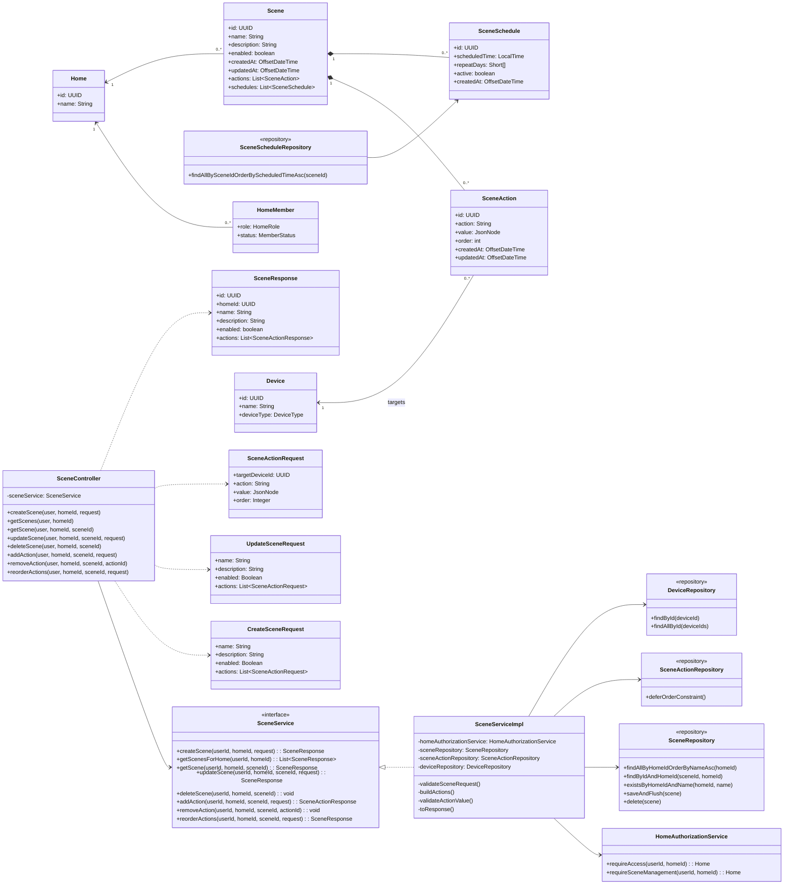
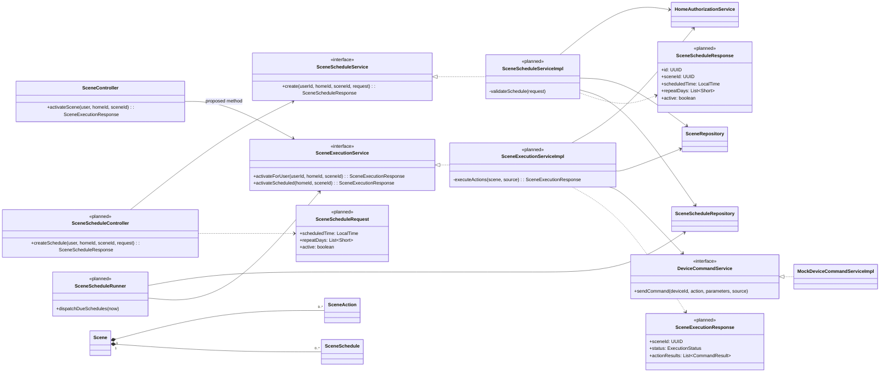
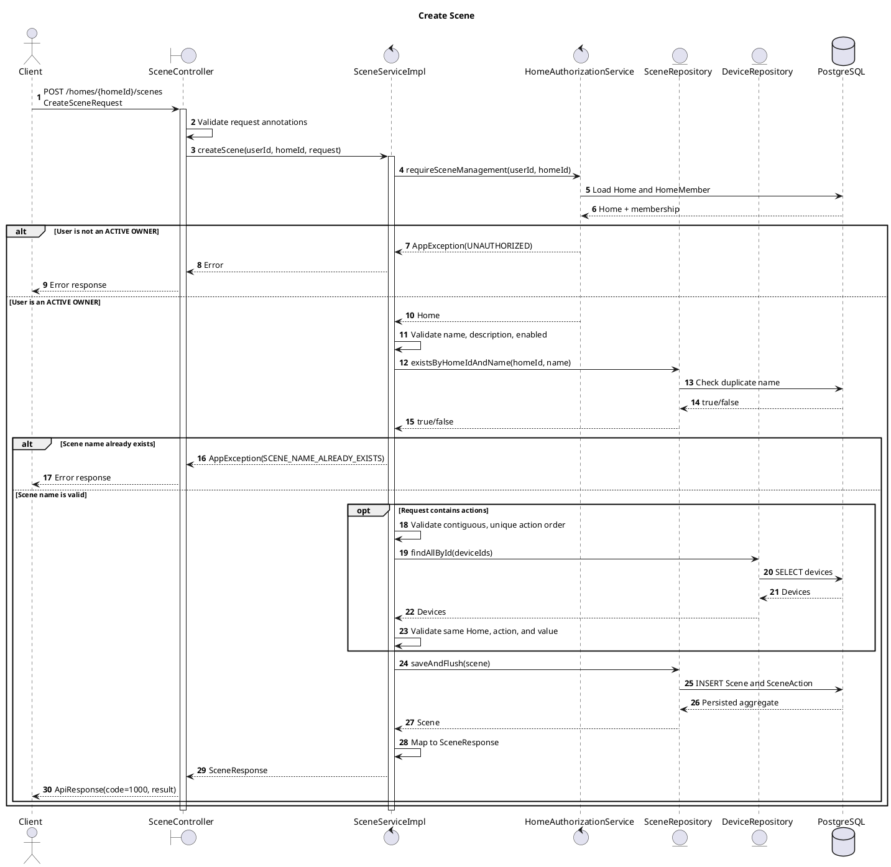
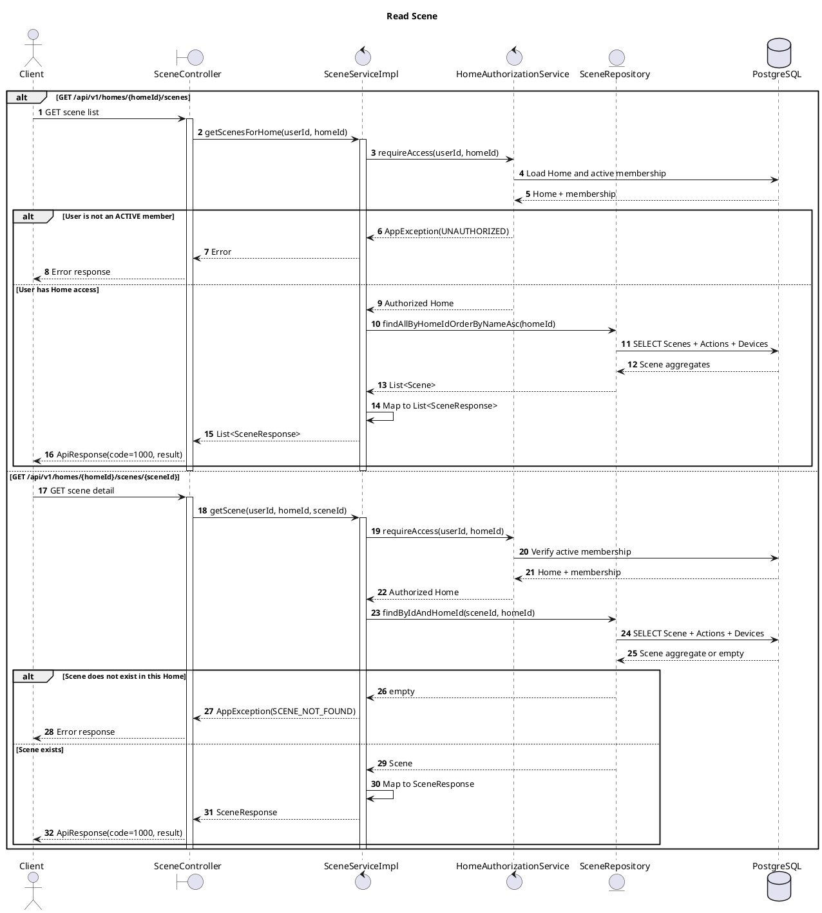
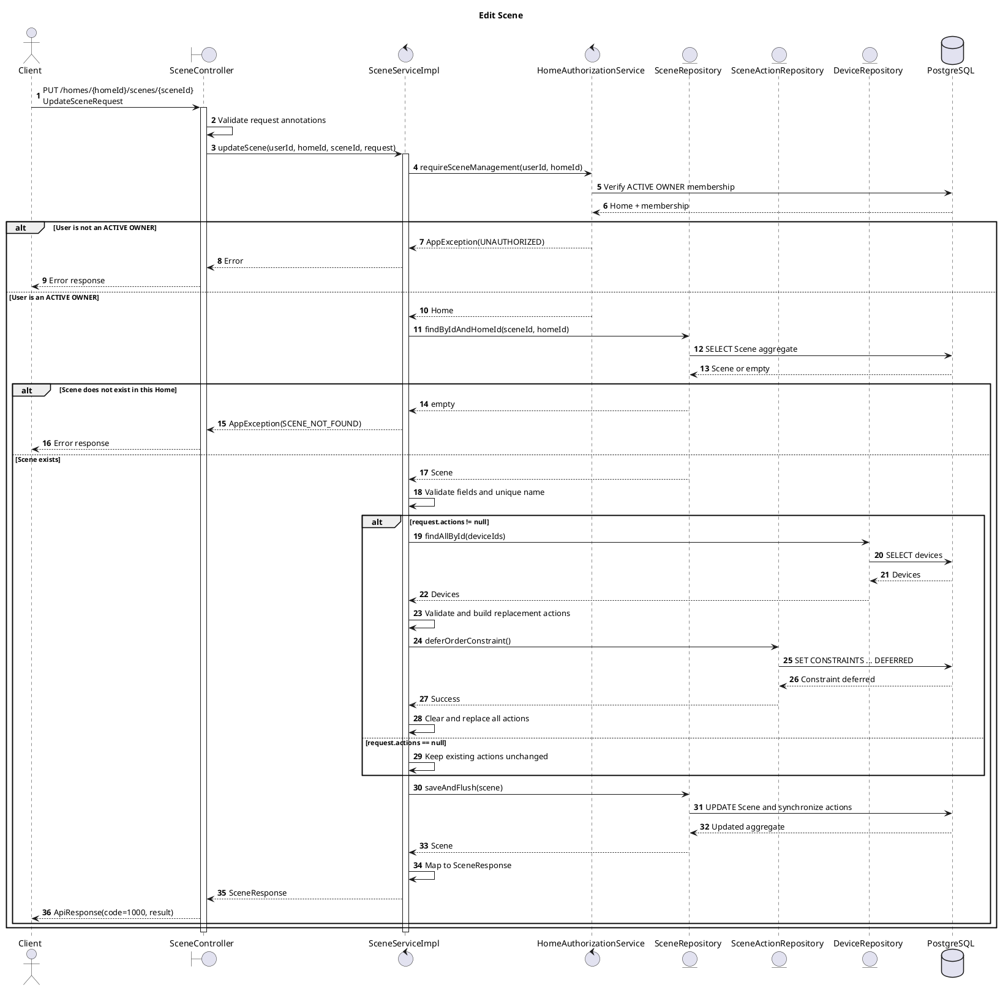
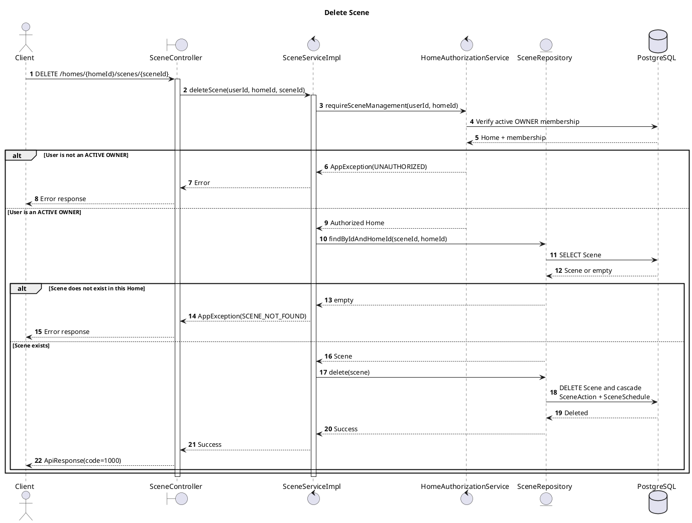
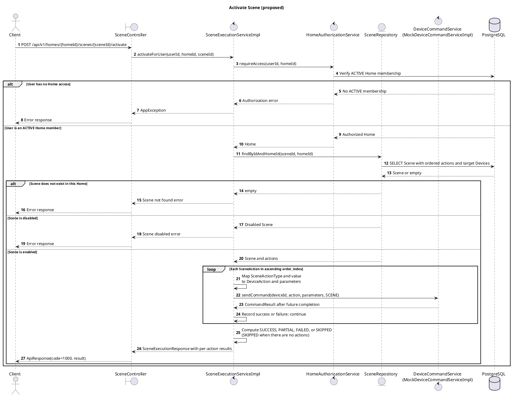
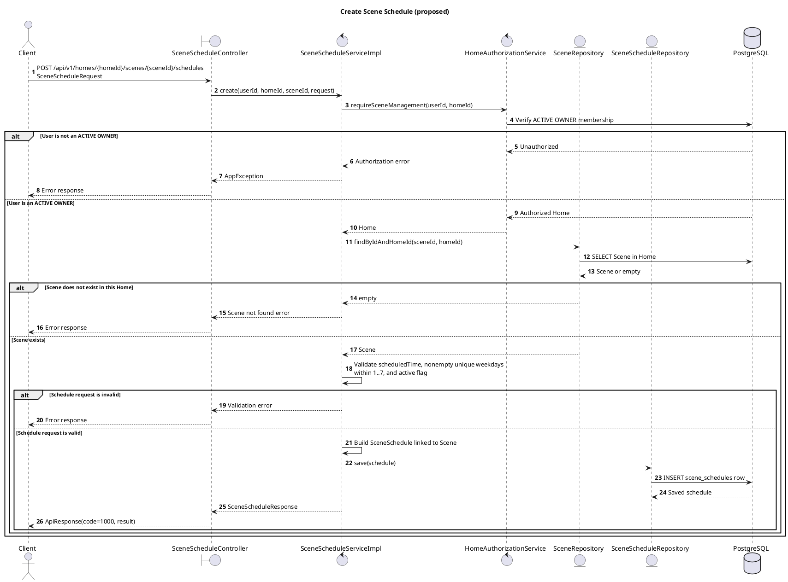
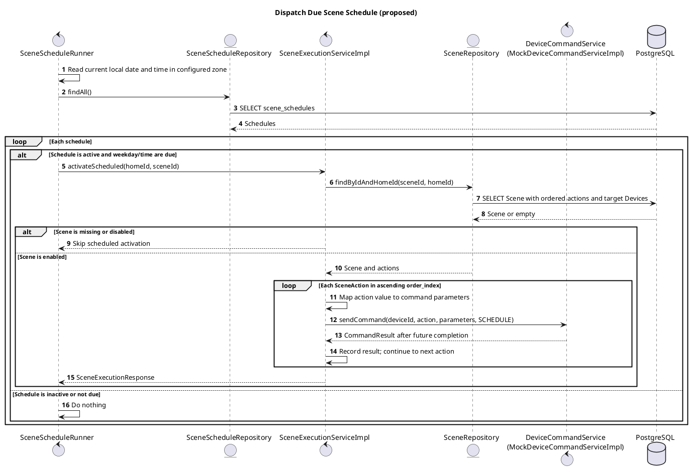

# Scene CRUD và SceneSchedule – Class and Sequence Diagrams

Tài liệu này mô tả cấu trúc lớp và luồng xử lý CRUD của chức năng **Scene**, đồng thời phản ánh quan hệ persistence mới với **SceneSchedule** trong HESTA Backend.

> Backend cung cấp đầy đủ Scene CRUD và quản lý thứ tự SceneAction. Frontend có danh sách, form tạo/sửa, xóa và công tắc bật/tắt Scene; `SceneSchedule` mới dừng ở entity/repository, chưa có REST API hoặc scheduler runtime.

Các luồng **Activate Scene** và **Schedule Scene** ở mục 3.5–3.6 là thiết kế đề xuất, chưa phải API đang hoạt động.

## 1. Tổng quan API

Base path: `/api/v1/homes/{homeId}/scenes`

| Method   | Endpoint                        | Chức năng                      | Quyền truy cập                         |
| -------- | ------------------------------- | ------------------------------ | -------------------------------------- |
| `POST`   | `/`                             | Tạo Scene                      | Thành viên `ACTIVE` có vai trò `OWNER` |
| `GET`    | `/`                             | Lấy danh sách Scene trong Home | Mọi thành viên `ACTIVE`                |
| `GET`    | `/{sceneId}`                    | Lấy chi tiết một Scene         | Mọi thành viên `ACTIVE`                |
| `PUT`    | `/{sceneId}`                    | Cập nhật Scene                 | Thành viên `ACTIVE` có vai trò `OWNER` |
| `DELETE` | `/{sceneId}`                    | Xóa Scene                      | Thành viên `ACTIVE` có vai trò `OWNER` |
| `POST`   | `/{sceneId}/actions`            | Thêm SceneAction               | Thành viên `ACTIVE` có vai trò `OWNER` |
| `DELETE` | `/{sceneId}/actions/{actionId}` | Xóa SceneAction                | Thành viên `ACTIVE` có vai trò `OWNER` |
| `PUT`    | `/{sceneId}/actions/reorder`    | Sắp xếp lại SceneAction        | Thành viên `ACTIVE` có vai trò `OWNER` |

The proposed `POST /{sceneId}/activate` and `POST /{sceneId}/schedules` endpoints are documented in sections 3.5–3.6, but are **not** part of the current API.

## 2. Class diagram

### Bảng nối quan hệ ngay cạnh class diagram

Quy ước: `-->` là lớp bên trái **sử dụng/tham chiếu** lớp bên phải; `..>` là phụ thuộc DTO; `<|..` là lớp bên phải **implements** interface bên trái; `*--` là quan hệ sở hữu (composition). Với `<--`, đọc theo chiều từ **phải sang trái**. Bội số ghi sát lớp nào thì là số đối tượng của lớp đó; ví dụ `Home "1" <-- "0..*" Scene` nghĩa là một Scene thuộc đúng một Home, còn một Home có thể có nhiều Scene.

| Nối từ | Nối đến | Kiểu/chiều nối | Bội số hoặc ý nghĩa |
| --- | --- | --- | --- |
| `SceneController` | `SceneService` | Sử dụng `-->` | Controller gọi service interface. |
| `SceneServiceImpl` | `SceneService` | Implements `..|>` (trong Mermaid: `SceneService <|.. SceneServiceImpl`) | Implementation của service. |
| `SceneServiceImpl` | `HomeAuthorizationService` | Sử dụng `-->` | Kiểm tra quyền Home. |
| `SceneServiceImpl` | `SceneRepository` | Sử dụng `-->` | Đọc/ghi Scene. |
| `SceneServiceImpl` | `SceneActionRepository` | Sử dụng `-->` | Defer unique order constraint khi đổi thứ tự. |
| `SceneServiceImpl` | `DeviceRepository` | Sử dụng `-->` | Tải và xác thực Device. |
| `SceneScheduleRepository` | `SceneSchedule` | Repository quản lý entity `-->` | Chưa được `SceneServiceImpl` gọi. |
| `HomeMember` | `Home` | Tham chiếu `<--` trên sơ đồ | Mỗi member thuộc 1 Home; Home có `0..*` member. |
| `Scene` | `Home` | Tham chiếu `<--` trên sơ đồ | Mỗi Scene thuộc 1 Home; Home có `0..*` Scene. |
| `Scene` | `SceneAction` | Composition `*--` | 1 Scene sở hữu `0..*` action; mỗi action thuộc 1 Scene. |
| `Scene` | `SceneSchedule` | Composition `*--` | 1 Scene sở hữu `0..*` schedule; mỗi schedule thuộc 1 Scene. |
| `SceneAction` | `Device` | Tham chiếu `<--` trên sơ đồ | Mỗi action nhắm 1 Device; Device có thể được nhiều action dùng. |
| `SceneController` | `CreateSceneRequest`, `UpdateSceneRequest`, `SceneActionRequest` | Phụ thuộc DTO `..>` | Nhận dữ liệu đầu vào cho Scene/action. |
| `SceneController` | `SceneResponse` | Phụ thuộc DTO `..>` | Trả dữ liệu Scene ra API. |

Khi vẽ lại: đặt `Home` ở phía các entity, `Scene` ở giữa, rồi rẽ hai nhánh composition tới `SceneAction` và `SceneSchedule`. Không nối `SceneServiceImpl` trực tiếp tới `SceneScheduleRepository`, vì code hiện tại chưa dùng repository này trong Scene CRUD.

### Giải thích class diagram

- `SceneController` nhận HTTP request, lấy người dùng hiện tại từ `CustomUserDetails`, sau đó chuyển xử lý cho `SceneService`.
- `SceneServiceImpl` chứa nghiệp vụ, validation và transaction của Scene CRUD.
- `HomeAuthorizationService` kiểm tra người dùng có phải thành viên `ACTIVE` hay không. Các thao tác thay đổi dữ liệu còn yêu cầu vai trò `OWNER`.
- `SceneRepository` truy xuất Scene cùng `Home`, `SceneAction` và target `Device` bằng `EntityGraph`.
- Một `Home` có thể chứa nhiều `Scene`.
- Một `Scene` sở hữu nhiều `SceneAction`. Quan hệ dùng `cascade = ALL` và `orphanRemoval = true`, vì vậy action được lưu hoặc xóa cùng Scene.
- Một `Scene` cũng sở hữu nhiều `SceneSchedule` với cùng cơ chế cascade/orphan removal. `SceneScheduleRepository` có thể đọc schedule theo Scene và sắp xếp theo `scheduledTime`.
- `SceneSchedule` lưu giờ chạy, mảng ngày lặp và trạng thái active. Lớp này chưa được đưa vào request/response của Scene CRUD và chưa có service kích hoạt lịch.
- Mỗi `SceneAction` điều khiển một `Device`. Scene và Device bắt buộc phải thuộc cùng Home.

### Proposed class extension for activation and scheduling

The following diagram is a **design proposal, not the current source code**. `Scene`, `SceneAction`, `SceneSchedule`, their repositories, `HomeAuthorizationService`, and `DeviceCommandService` already exist. Classes marked `planned` and the new controller method must be implemented before the sequences in sections 3.5–3.6 can run.

| Connect from | Connect to | Relationship / purpose |
| --- | --- | --- |
| `SceneController.activateScene` | `SceneExecutionService` | Proposed REST entry point for manual activation. |
| `SceneExecutionServiceImpl` | `HomeAuthorizationService`, `SceneRepository` | Check an ACTIVE member and load a Scene scoped to its Home. |
| `SceneExecutionServiceImpl` | `DeviceCommandService` | Execute ordered `SceneAction` commands; the existing mock implements this interface. |
| `SceneScheduleController` | `SceneScheduleService` | Proposed REST entry point for schedule creation. |
| `SceneScheduleServiceImpl` | `HomeAuthorizationService`, `SceneRepository`, `SceneScheduleRepository` | Check an ACTIVE OWNER, load the Scene, and save the schedule. |
| `SceneScheduleRunner` | `SceneScheduleRepository`, `SceneExecutionService` | Find due schedules and request scheduled activation; no JWT is involved in this internal call. |
| `Scene` | `SceneAction`, `SceneSchedule` | Existing one-to-many composition; no new Scene/SceneSchedule table is needed for basic schedule configuration. |

`SceneAction.value` needs an adapter before calling the existing command interface: `TURN_ON`/`TURN_OFF` → empty parameters; `SET_BRIGHTNESS` → `level`; `SET_SPEED` → `speed`; `SET_TEMPERATURE` → `temperature`; `SET_STATE` → the JSON object. The `SceneActionType` name maps to the corresponding `DeviceAction`. This adapter belongs in the proposed execution service, not in the existing CRUD service.

## 3. Scene sequence diagrams

The four implemented CRUD operations are shown first. Sections 3.5–3.6 describe proposed behavior only; those endpoints and services do not yet exist. For HTTP requests, JWT authentication has already completed and the controller obtains the current user through `CustomUserDetails`.

### 3.1. Create Scene

Endpoint: `POST /api/v1/homes/{homeId}/scenes`

### 3.2. View Scene

Read has two endpoints: list and detail. Both require the user to be an `ACTIVE` member of the Home.

### 3.3. Update Scene

Endpoint: `PUT /api/v1/homes/{homeId}/scenes/{sceneId}`

### 3.4. Delete Scene

Endpoint: `DELETE /api/v1/homes/{homeId}/scenes/{sceneId}`

### 3.5. Activate Scene (proposed)

Proposed endpoint: `POST /api/v1/homes/{homeId}/scenes/{sceneId}/activate`. Here, "activate" means execute the Scene now; it does **not** mean changing `Scene.enabled`. An ACTIVE Home member may request activation. The endpoint, service, and response DTO in this diagram are not implemented yet.

The proposed execution service waits for each command before sending the next, preserving `SceneAction.order`. It uses the existing `DeviceCommandService` interface and its current Mock implementation; it does not publish MQTT directly. A failed command is recorded and does not prevent later actions from being attempted. This flow does not currently persist Scene execution history.

### 3.6. Schedule Scene (proposed)

This use case has two steps: an OWNER configures a recurring schedule, and an internal runner dispatches it at the due time. Neither the REST endpoint nor the runner exists in the current code. The existing `scene_schedules` table and `SceneScheduleRepository` can be reused for basic configuration.

#### 3.6.1. Create a Scene schedule

Proposed endpoint: `POST /api/v1/homes/{homeId}/scenes/{sceneId}/schedules`. The request contains `scheduledTime`, `repeatDays` (ISO weekdays `1=Monday` through `7=Sunday`), and `active`.

#### 3.6.2. Dispatch a due Scene schedule

This internal flow does not receive a JWT or bypass Home scoping for user requests. Only an authorized OWNER can create the persisted schedule; the runner rechecks schedule/Scene state before execution.

Before implementing the runner, the system must define a time-zone policy because `Home` has no time-zone field. The runner must load each schedule's lazy `Scene` association within a transaction or use an explicit fetch query before deriving `homeId` and `sceneId`. It also needs a durable per-occurrence dispatch guard to prevent duplicate execution when the runner retries or multiple instances are active; the current schema has no such guard. A forward-only migration would be required if that guard is stored in the database. Empty `repeatDays` rows allowed by the current schema need an explicit policy; the proposed API above rejects them.

## 4. Quy tắc nghiệp vụ quan trọng

### Quyền truy cập

- `GET` danh sách hoặc chi tiết Scene yêu cầu người dùng là thành viên `ACTIVE` của Home.
- `CREATE`, `UPDATE`, `DELETE` và quản lý actions yêu cầu thành viên `ACTIVE` có vai trò `OWNER`.
- ID người dùng được lấy từ JWT qua `CustomUserDetails`, không lấy từ request body.

### Scene

- `name` bắt buộc, tối đa 150 ký tự và duy nhất trong một Home.
- `description` không bắt buộc, tối đa 2000 ký tự.
- `enabled` bắt buộc.
- Khi tạo Scene, `actions` có thể rỗng.
- Khi cập nhật, `actions = null` giữ nguyên danh sách action hiện tại.
- Khi cập nhật với một danh sách `actions`, toàn bộ action hiện tại được thay thế trong cùng transaction.

### SceneAction

- Thứ tự action phải duy nhất và liên tục từ `0` đến `n - 1`.
- Device được tham chiếu phải tồn tại và thuộc cùng Home với Scene.
- Các action được hỗ trợ gồm:
  - `TURN_ON`, `TURN_OFF`: không nhận `value`.
  - `SET_BRIGHTNESS`, `SET_SPEED`: nhận số nguyên từ 0 đến 100.
  - `SET_TEMPERATURE`: nhận một giá trị số.
  - `SET_STATE`: nhận một JSON object không rỗng.
- Unique constraint `(scene_id, order_index)` được defer trong transaction khi thay đổi nhiều vị trí để tránh xung đột thứ tự tạm thời.
- Trên giao diện tạo Scene, danh sách hành động phụ thuộc `capabilities` của Device; nếu Device không khai báo capability thì dùng lựa chọn mặc định theo loại thiết bị. Nhãn và ô nhập đều bằng tiếng Việt: đèn có bật/tắt/độ sáng, điều hòa có bật/tắt/nhiệt độ, quạt có bật/tắt/tốc độ. Đổi thiết bị hoặc loại hành động sẽ đặt lại giá trị cũ để tránh gửi sai tham số. `SET_STATE` chỉ hiện khi Device khai báo capability tương ứng và vẫn dùng JSON object nâng cao.

### SceneSchedule

- Mỗi schedule bắt buộc thuộc một Scene và có `scheduledTime`.
- `repeatDays` được ánh xạ sang PostgreSQL `smallint[]`; `active` ánh xạ cột `is_active`.
- Xóa Scene sẽ xóa các schedule liên quan qua JPA cascade và foreign key `ON DELETE CASCADE`.
- Chưa có endpoint tạo/sửa/xóa schedule hoặc scheduler runtime tự thực thi Scene theo lịch. Sequence 3.6 là thiết kế đề xuất, không phải hành vi hiện tại.

## 5. Persistence

- `SceneRepository` dùng `EntityGraph` để tải `home`, `actions` và `actions.targetDevice` cùng Scene.
- `Scene.actions` sử dụng `CascadeType.ALL` và `orphanRemoval = true`.
- `Scene.schedules` sử dụng `CascadeType.ALL` và `orphanRemoval = true`; `SceneScheduleRepository` cung cấp truy vấn theo Scene.
- Database có foreign key `scene_actions.scene_id -> scenes.id` với `ON DELETE CASCADE`.
- Database có foreign key `scene_schedules.scene_id -> scenes.id` với `ON DELETE CASCADE`; bảng này đã tồn tại trong migration Scene foundation nên không tạo migration trùng lặp.
- Database trigger ngăn SceneAction tham chiếu Device thuộc Home khác.
- Với `TURN_ON`/`TURN_OFF`, API nhận và trả `value: null`; service lưu JSONB object rỗng `{}` làm giá trị nội bộ để tương thích cả cơ sở dữ liệu cũ còn ràng buộc `scene_actions.target_state NOT NULL`. Cách này không phụ thuộc việc Hibernate bind Jackson `NullNode` ra JSON `null` hay SQL `NULL`. Quy tắc mới áp dụng cho tạo Scene, thêm action và cập nhật Scene vì dùng chung `buildAction`; khi trả DTO, `TURN_ON`/`TURN_OFF` vẫn được chuyển về `null`.
- Log lỗi lúc 12:53 ngày 2026-09-20 thuộc tiến trình Java PID `12724` khởi chạy lúc 10:55, trước khi bản sửa source trước đó được biên dịch. Vì vậy log đó chưa xác định được hành vi của code mới trên PostgreSQL. Cần khởi động lại backend sau khi cập nhật bản sửa này rồi thử tạo Scene; không coi test H2 là bằng chứng PostgreSQL đã chạy thành công.
- Migration `20260911170000_scene_crud_management.sql` đã có lệnh bỏ `NOT NULL` của `target_state`, nhưng lỗi thực tế cho thấy database đích chưa phản ánh ràng buộc đó. Migration sửa lệch trạng thái `20260920120000_repair_scene_action_target_state_nullability.sql` lặp lại lệnh `DROP NOT NULL` theo hướng forward-only. Người phụ trách release cần kiểm tra và áp dụng migration trên database đích; thay đổi source không tự cập nhật Supabase Cloud.
- Có thể kiểm tra database đích bằng `SELECT is_nullable FROM information_schema.columns WHERE table_schema = 'public' AND table_name = 'scene_actions' AND column_name = 'target_state';`. Kết quả kỳ vọng sau migration là `YES`. Không dùng `hibernate.ddl-auto=update` để thay thế migration.
- Các lỗi nghiệp vụ dự kiến được biểu diễn bằng `AppException` và `ErrorCode`.

## 6. Đánh giá mức độ hoàn thiện CRUD

### Kết luận

**Backend đã có đủ bốn phần CRUD của Scene ở mức source code:**

| CRUD        | Endpoint                                         | Controller | Service | Persistence | Controller test |
| ----------- | ------------------------------------------------ | ---------- | ------- | ----------- | --------------- |
| Create      | `POST /api/v1/homes/{homeId}/scenes`             | Có         | Có      | Có          | Có              |
| Read list   | `GET /api/v1/homes/{homeId}/scenes`              | Có         | Có      | Có          | Có              |
| Read detail | `GET /api/v1/homes/{homeId}/scenes/{sceneId}`    | Có         | Có      | Có          | Có              |
| Update      | `PUT /api/v1/homes/{homeId}/scenes/{sceneId}`    | Có         | Có      | Có          | Có              |
| Delete      | `DELETE /api/v1/homes/{homeId}/scenes/{sceneId}` | Có         | Có      | Có          | Có              |

Ngoài CRUD chính, backend còn có API thêm, xóa và sắp xếp lại `SceneAction`. Frontend có route `/homes/:homeId/scenes` cho danh sách và form tạo, cùng route `/homes/:homeId/scenes/:sceneId` để mở form sửa từ danh sách hoặc truy cập trực tiếp. Form sửa tải Scene qua `GET`, cho đổi tên, mô tả, trạng thái, thêm/xóa/sắp xếp action rồi lưu bằng `PUT` với danh sách action đầy đủ. Công tắc bật/tắt ngay trên từng mục dùng `PUT` chỉ với `name`, `description`, `enabled`; không gửi `actions` nên backend giữ nguyên action hiện tại. Backend vẫn kiểm tra quyền quản lý Scene theo Home cho mọi lệnh `PUT`.

Ghi chú kiểm thử Scene (2026-09-20): `SceneActionLegacySchemaTest` dựng lại ràng buộc `NOT NULL` trong H2 và kiểm tra object rỗng được lưu; `SceneServiceTest` xác nhận service chuẩn hóa giá trị rỗng thành `{}` nhưng DTO vẫn trả `null`. H2 không thay thế được kiểm thử tích hợp trên PostgreSQL thật. `frontend_hesta/tests/scene-actions.test.mjs` kiểm tra lựa chọn hành động theo Device, nhãn tiếng Việt, payload, giá trị sai, dữ liệu form sửa và payload bật/tắt không chứa `actions`. `frontend_hesta/tests/routing.test.mjs` kiểm tra truy cập trực tiếp route sửa và bảo vệ phiên đăng nhập.

### Những phần chưa hoàn chỉnh end-to-end

1. Frontend đã có form sửa Scene trên route chi tiết; chưa có giao diện quản lý `SceneSchedule` hoặc trang chi tiết chỉ-đọc riêng.
2. Các file migration Scene đã có trong source; trạng thái đã áp dụng lên database đích cần được kiểm tra theo `DATABASE_MIGRATION_GUIDE.md` khi release.
3. Endpoint activate Scene và các lớp `SceneExecutionService`, `SceneScheduleService`, `SceneScheduleRunner` trong sequence 3.5–3.6 mới là thiết kế; chưa có trong source code. `SceneSchedule` hiện mới hoàn chỉnh ở tầng entity và repository.
4. Controller test đã bao phủ đủ bốn thao tác CRUD, nhưng service unit test hiện tập trung nhiều vào Create, Read và quản lý action; chưa có happy-path test riêng cho Update và Delete.

Vì vậy, kết luận chính xác là: **Scene CRUD đã có backend và frontend cho tạo, xem danh sách, sửa, xóa, bật/tắt; quản lý lịch Scene và việc xác nhận migration trên database đích vẫn là các bước tiếp theo.**
