# Scene – Class và Sequence Diagrams

> Bộ diagram đầy đủ cho Scene & Automation (inventory, UML và các nhánh lỗi): [SCENE_AUTOMATION_DIAGRAMS.md](SCENE_AUTOMATION_DIAGRAMS.md).

Ngày đồng bộ với source code: **2026-10-04**.

Tài liệu mô tả Scene CRUD, quản lý action, thực thi, lịch sử và lập lịch đã có trong backend. Luồng Automation gọi Scene và scheduler dùng chung được mô tả nhất quán với [AUTOMATION_BEHAVIOR_IMPLEMENTATION.md](AUTOMATION_BEHAVIOR_IMPLEMENTATION.md).

Các sơ đồ dùng **PlantUML** và cùng một quy ước:

- Class diagram dùng ký hiệu UML cho class/interface, thuộc tính, phương thức và bội số. Class diagram không có nút database.
- Sequence truy xuất dữ liệu dùng lifeline **Database** với ký hiệu database thông thường; controller, service và repository đều là participant hình chữ nhật. PostgreSQL là công nghệ thực tế của backend.
- Sequence có `autonumber`, mũi tên gọi/trả về và **thanh kích hoạt (activation bar)** đầy đủ cho controller, service, repository, Database và lời gọi lồng nhau. Thanh này biểu diễn thời gian xử lý trên lifeline.
- **Composition**: `*--`, hình thoi đặc tại bên sở hữu; Scene sở hữu SceneAction/SceneSchedule, AutomationRule sở hữu RuleCondition/RuleAction với cascade/orphan removal.
- **Aggregation**: `o--`, hình thoi rỗng tại bên chứa; request/response DTO gom danh sách DTO phần tử. Quan hệ này mô tả cấu trúc dữ liệu trong bộ nhớ, không đặt thêm quy tắc cascade hoặc vòng đời cho entity.
- **Dependency**: `..>`, nét đứt hướng về lớp/interface được sử dụng; áp dụng cho các collaborator được inject và DTO mà service tạo/nhận.
- **Inheritance / generalization**: `--|>`, nét liền với tam giác rỗng hướng về kiểu cha; chỉ dùng khi có quan hệ kế thừa giữa các lớp/interface được đưa vào sơ đồ.
- **Realization / implementation**: `..|>`, nét đứt với tam giác rỗng hướng về interface; các service implementation triển khai service interface.
- **Association**: `--` hoặc `-->` kèm bội số/role cho tham chiếu giữa entity. Các quan hệ UML thể hiện cấu trúc lớp, không phải các bước gọi runtime.
- Mỗi đường nối trong class diagram có nhãn ghi rõ loại quan hệ ngay trên đường nối; role như `actions`, `conditions`, `targetDevice` được ghi kèm trong ngoặc khi có.
- Các class diagram chọn lọc trường và phương thức liên quan đến từng luồng; không liệt kê mọi tiện ích nội bộ. Sequence biểu diễn luồng hợp lệ; lỗi validation/quyền được ném bằng `AppException`, trả qua `GlobalExceptionHandler` và dừng luồng. Lỗi từng command được ghi nhận để tiếp tục action còn lại.
- User được lấy từ JWT (`CustomUserDetails`); mọi API trả `ApiResponse<T>` với mã thành công `1000`.

## 1. API hiện tại

Base path: `/api/v1/homes/{homeId}/scenes`. Các quyền dưới đây đều yêu cầu membership `ACTIVE`.

- `POST /`: tạo Scene — OWNER.
- `GET /`, `GET /{sceneId}`: danh sách, chi tiết — member.
- `GET /action-types`: tổng hợp action từ capabilities của Devices trong Home — member.
- `PUT /{sceneId}`: sửa Scene, bao gồm bật/tắt qua `enabled` — OWNER.
- `DELETE /{sceneId}`: xóa Scene chưa được Automation Rule tham chiếu — OWNER.
- `POST /{sceneId}/actions`, `DELETE /{sceneId}/actions/{actionId}`, `PUT /{sceneId}/actions/reorder`: quản lý action — OWNER.
- `POST /{sceneId}/execute`: chạy Scene thủ công — member.
- `GET /{sceneId}/executions`: tối đa 100 lần thực thi mới nhất theo `startedAt` giảm dần — member.
- `GET /{sceneId}/schedules`: danh sách lịch — member.
- `POST /{sceneId}/schedules`, `PUT /{sceneId}/schedules/{scheduleId}`, `DELETE /{sceneId}/schedules/{scheduleId}`: tạo/sửa/xóa lịch — OWNER.

Endpoint chạy Scene trong code là **`/execute`**, không phải `/activate`. API lịch nằm trong `SceneController` và sử dụng `ScheduleService`, không có `SceneScheduleController`, `SceneScheduleService` hoặc `SceneScheduleRunner` riêng.

## 2. Class diagrams

### 2.1. Scene CRUD và persistence

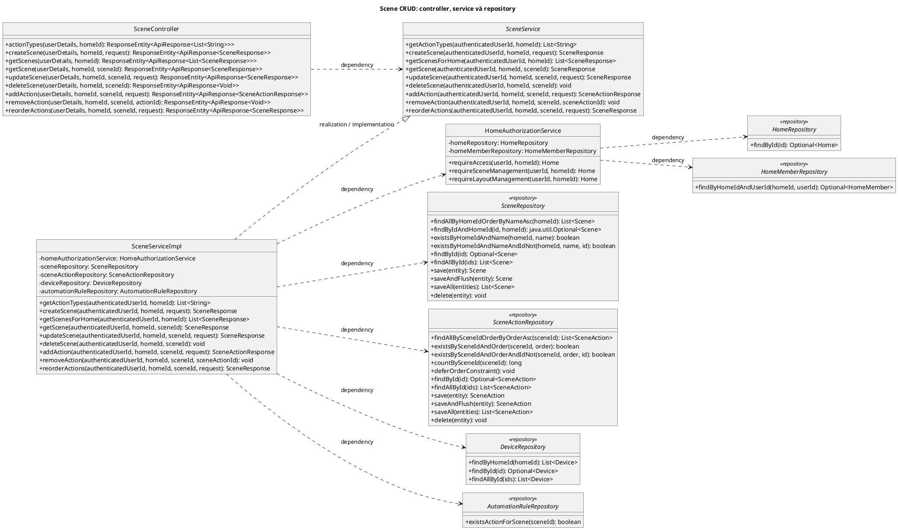

`SceneServiceImpl` gọi `AutomationRuleRepository.existsActionForScene` trước khi xóa; Scene đang được RuleAction sử dụng bị từ chối với `SCENE_IN_USE`. `HomeAuthorizationService` đọc Home và HomeMember qua hai repository, kiểm tra `ACTIVE` và thêm `OWNER` cho thao tác quản lý.

### 2.2. Scene entity và DTO

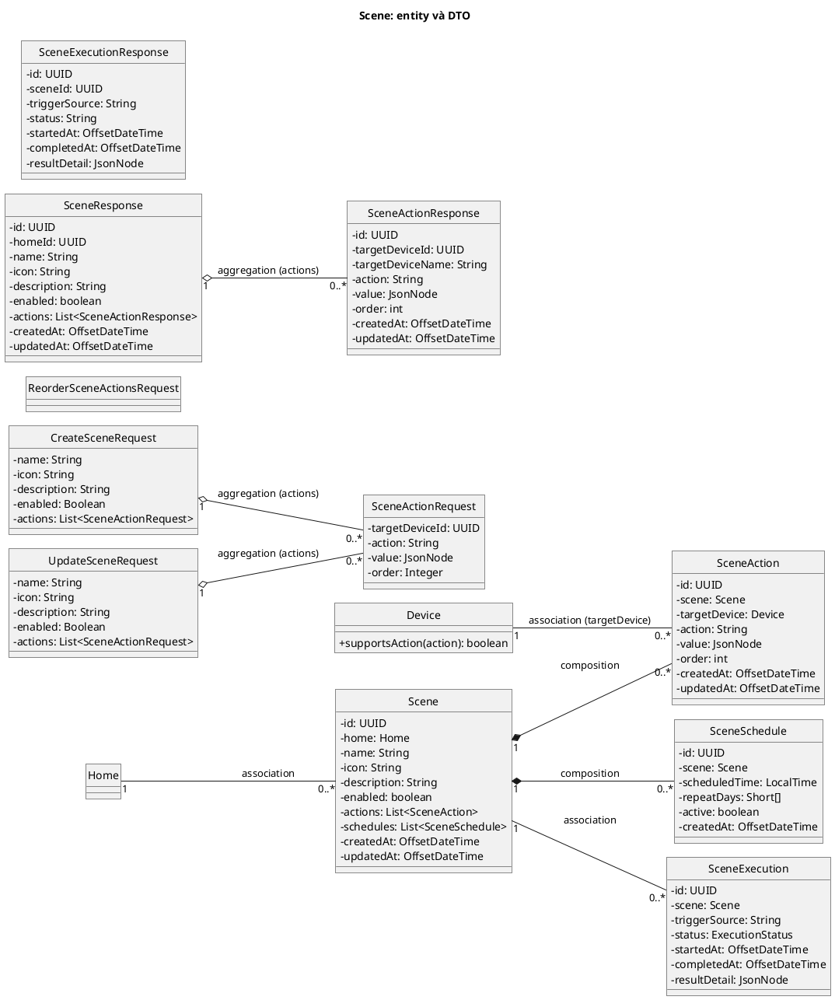

Scene sở hữu actions/schedules bằng `cascade=ALL`, `orphanRemoval=true`. `SceneExecution` tham chiếu Scene qua khóa ngoại; entity Scene không có collection executions. DTO Scene có `icon` và timestamps; lịch sử dùng `SceneExecutionResponse` riêng.

### 2.3. Thực thi Scene

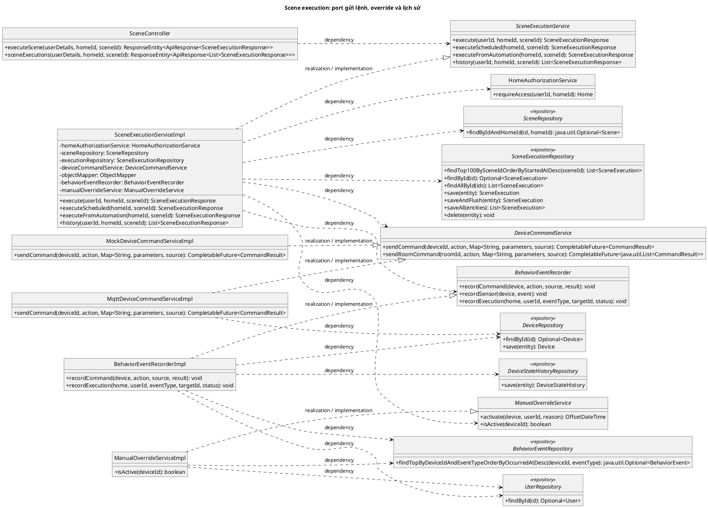

`MqttDeviceCommandServiceImpl` là bean `@Primary` hiện tại của `DeviceCommandService`; Mock là implementation phục vụ kiểm thử/phát triển. Controller gọi port service; runtime chỉ gọi implementation được inject, không có lời gọi trung gian qua một đối tượng interface riêng.

### 2.4. Lập lịch dùng chung với Automation

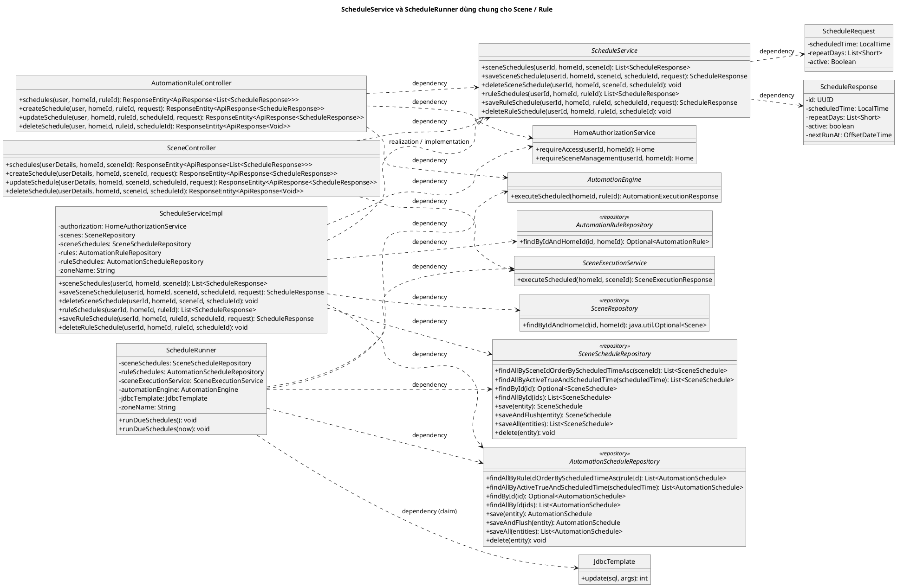

## 3. Sequence diagrams

Các đường dẫn rút gọn trong sequence đều nằm dưới `/api/v1/homes/{homeId}`.

### 3.1. Tạo Scene

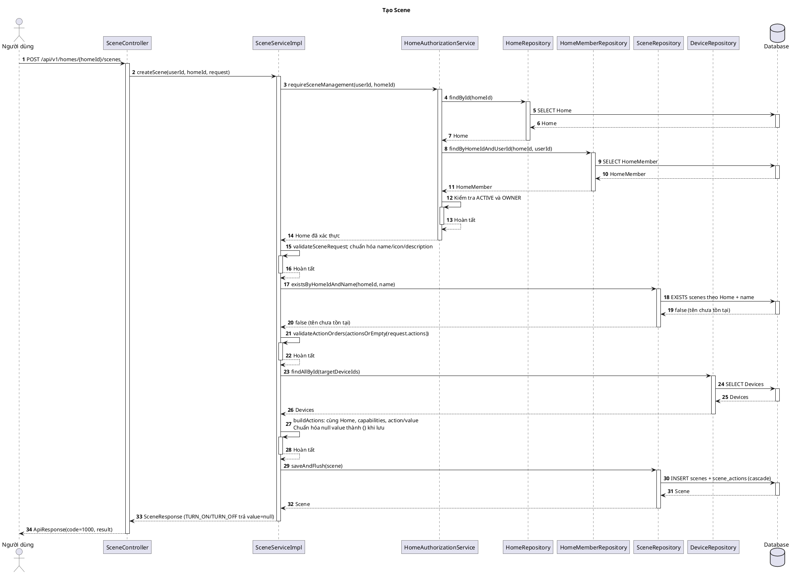

### 3.2. Xem Scene và các action type

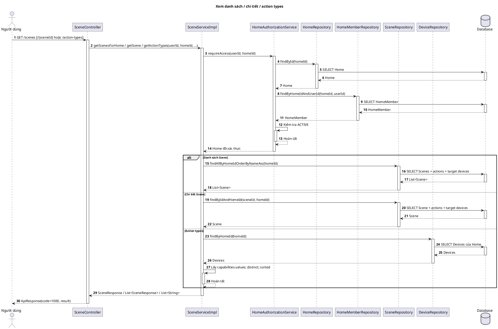

### 3.3. Sửa Scene và bật/tắt bằng PUT

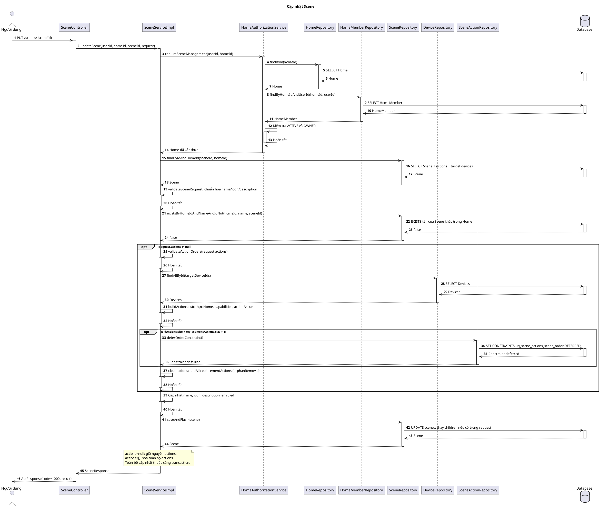

### 3.4. Xóa Scene và kiểm tra Scene đang được sử dụng

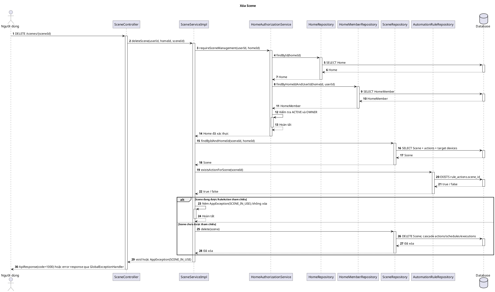

### 3.5. Quản lý thứ tự SceneAction

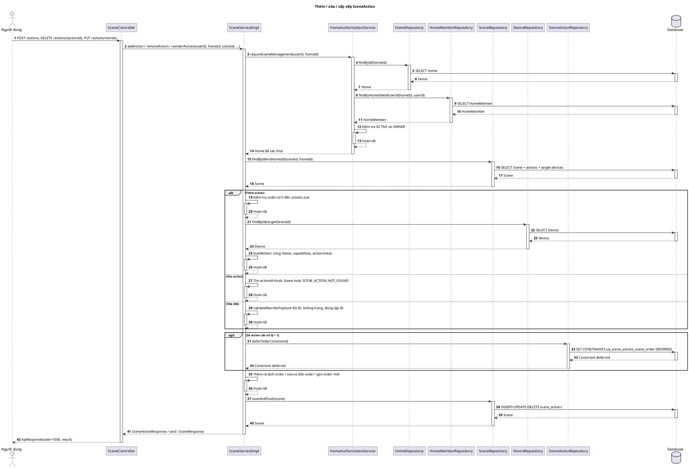

### 3.6. Chạy Scene (API đã triển khai)

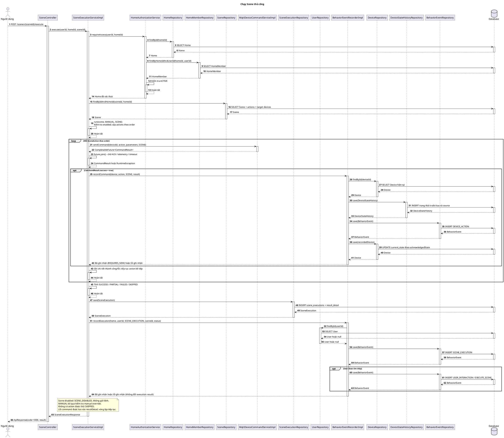

### 3.7. Xem lịch sử thực thi Scene

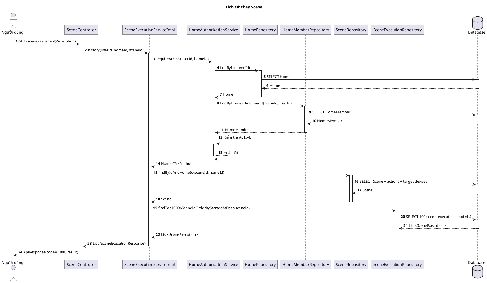

### 3.8. Quản lý lịch Scene

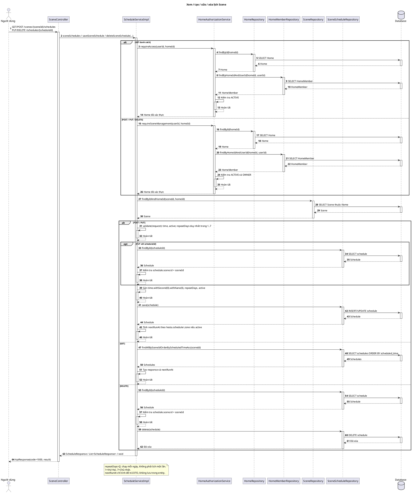

### 3.9. Scheduler dùng chung cho Scene và Automation

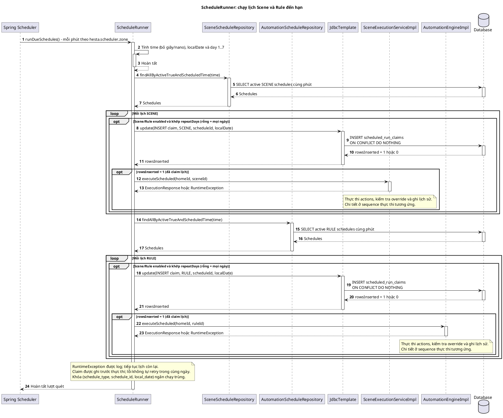

## 4. Quy tắc nghiệp vụ và persistence

- `name` bắt buộc, tối đa 150 ký tự, trim và duy nhất trong Home; `description` tối đa 2000 ký tự; `icon` tối đa 50 ký tự; `enabled` bắt buộc.
- Tạo Scene cho phép actions rỗng. Sửa với `actions=null` giữ nguyên actions; gửi danh sách sẽ thay toàn bộ trong cùng transaction.
- Orders duy nhất và liên tục `0..n-1`; thêm/xóa tự dịch order. Reorder phải gửi đúng toàn bộ tập action ID, không thiếu và không trùng.
- Device phải tồn tại, có Room/Home và cùng Home với Scene. Action được trim/uppercase và kiểm tra `Device.supportsAction` theo capabilities hiện tại.
- `TURN_ON`/`TURN_OFF` nhận value null; `SET_BRIGHTNESS`/`SET_SPEED` nhận số nguyên 0–100; `SET_TEMPERATURE` nhận số; `SET_STATE` nhận object không rỗng. Các action khác có thể được chấp nhận nếu Device hỗ trợ theo source validation hiện tại.
- Service lưu null value thành `{}` để tương thích schema legacy; DTO của `TURN_ON`/`TURN_OFF` vẫn trả null. Thực thi ánh xạ brightness → `level`, speed → `speed`, temperature → `temperature`, SET_STATE → map; action còn lại dùng map rỗng theo `parameters()` hiện tại.
- `execute` dùng trigger `MANUAL`, source `SCENE`; `executeScheduled` dùng `SCHEDULE`/`SCHEDULE`; `executeFromAutomation` dùng `AUTOMATION`/`AUTOMATION`.
- Scene disabled bị từ chối. Scene thủ công không kiểm tra override; Scene do lịch/Automation gọi bỏ action có override 30 phút với `SKIPPED_OVERRIDE`.
- Status: không có action được thử → `SKIPPED`; tất cả actions thành công → `SUCCESS`; có thử nhưng không thành công → `FAILED`; còn lại → `PARTIAL`. Lỗi command không dừng các action sau.
- `BehaviorEventRecorderImpl` ghi command/state history và execution event bằng transaction `REQUIRES_NEW`. Lỗi ghi command/execution được service log và không đổi kết quả execution.
- `repeatDays` là danh sách duy nhất trong 1–7; rỗng nghĩa là mỗi ngày. `scheduledTime` được bỏ giây/nano. `nextRunAt` chỉ tính trong DTO.
- `ScheduleRunner` quét mỗi phút, mặc định zone `Asia/Ho_Chi_Minh`, có thể tắt bằng `hesta.scheduler.enabled=false`. Runner kiểm tra active/time/day/enabled, claim lịch trước thực thi, và tiếp tục nếu một lịch lỗi.
- Claim dùng khóa `(schedule_type, schedule_id, local_date)` trong `scheduled_run_claims`; đã claim thì không tự chạy lại cùng ngày dù lần chạy lỗi.

Migration liên quan: `20260911160000_scene_management_foundation.sql`, `20260911170000_scene_crud_management.sql`, `20260920120000_repair_scene_action_target_state_nullability.sql`, `20260922160000_scene_execution_history.sql`, `20260922161000_scheduled_run_claims.sql`. Trạng thái migration trên database đích được kiểm tra theo [DATABASE_MIGRATION_GUIDE.md](../DATABASE_MIGRATION_GUIDE.md); tài liệu mô tả source code, không xác nhận deployment.

## 5. Đồng bộ frontend và kiểm chứng

`frontend_hesta/src/services/sceneApi.ts` gọi `/execute` và `/executions`; Scene UI có tạo/sửa/xóa/bật tắt, chạy Scene, xem lịch sử và quản lý lịch. API lịch được dùng qua SchedulePanel. Route danh sách: `/homes/:homeId/scenes`; route sửa: `/homes/:homeId/scenes/:sceneId`.

Nguồn đối chiếu: `SceneController`, `SceneServiceImpl`, `SceneExecutionServiceImpl`, `ScheduleServiceImpl`, `ScheduleRunner`, entities/DTO/repositories và các migration nêu trên. Các test hiện có nằm trong `SceneControllerTest`, `SceneServiceTest`, `SceneExecutionServiceTest`, `ScheduleServiceTest`, `ScheduleRunnerTest` và các test frontend Scene. Lần cập nhật tài liệu này chỉ kiểm tra sơ đồ và đối chiếu source, không công bố lại kết quả chạy test ứng dụng.
